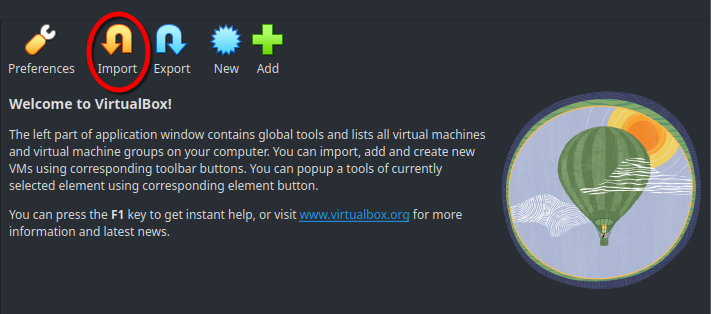
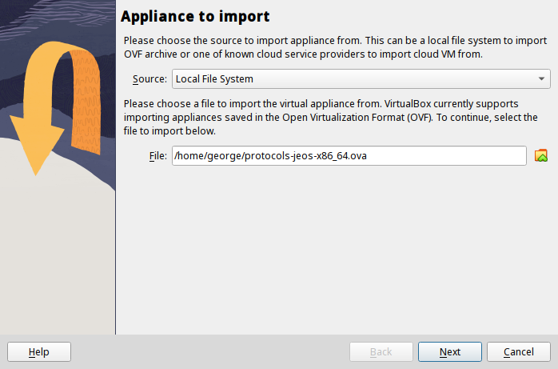
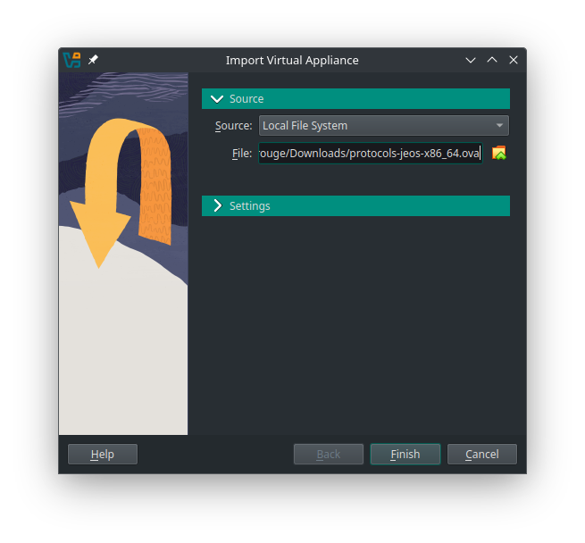
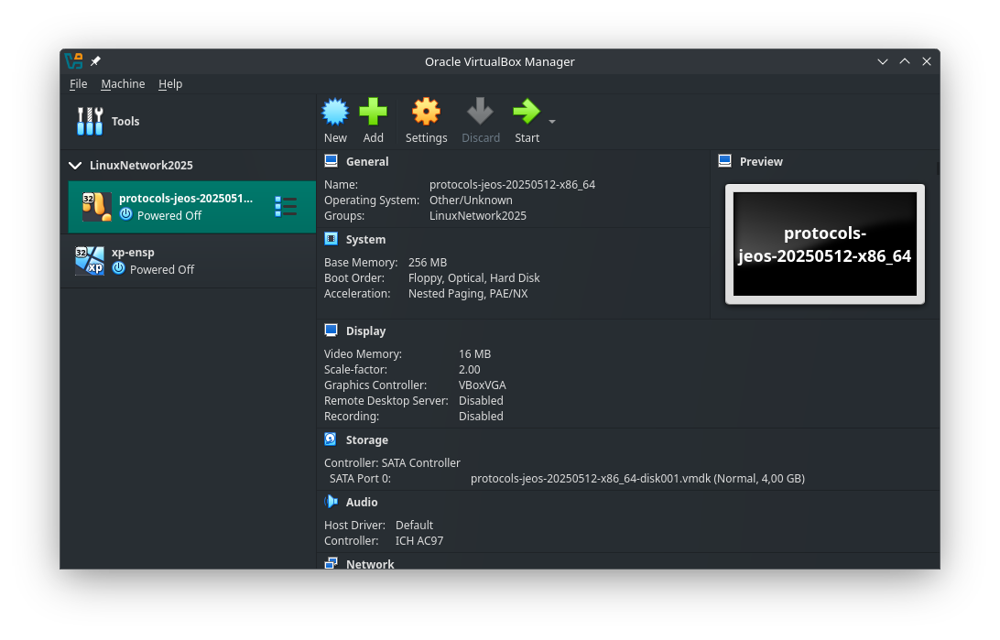
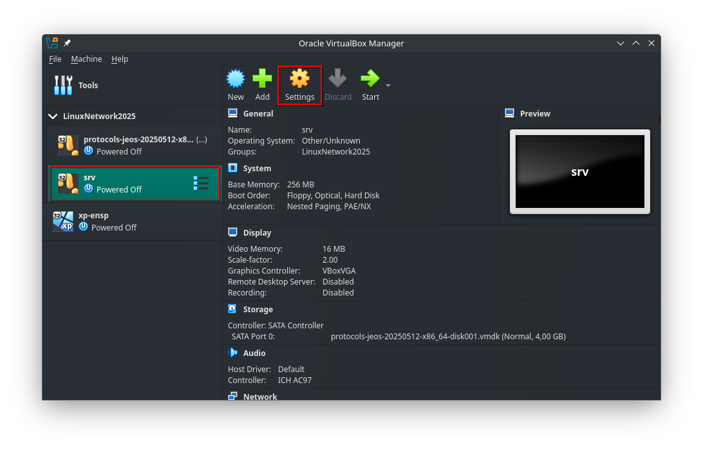
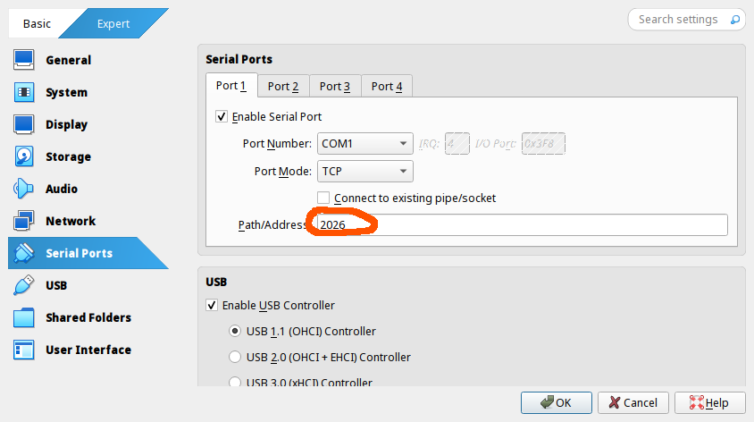

Лабораторная работа представляет из себя практико-ориентированную пошаговую инструкцию, выполняемую на одной или нескольких виртуальных машинах. В домашнее задание входит настройка некоторой топологии сети, её конфигурация и сбор этих данных в отчёт специального вида с помощью встроенных в виртуальные машины утилит. 

В качестве менеджера виртуальных машин используется [VirtualBox](https://www.virtualbox.org/), система для выполнения лабораторных предоставляется в виде архива с виртуальной машиной (Open Virtual Appliance, `.ova`-файл), на основе которого будет создана основная система, на её основе будут создаваться копии для работы.

# Настройка виртуальных машин

В данной главе описаны основные действия и / или команды, необходимые для работы с `VirtualBox`.

`VirtualBox` поддерживает собственный набор команд для работы из терминала с помощью встроенной утилиты `VBoxManage`, полный список команд представлен по команде

```console
VBoxManage --help
```

***Важное примечание:*** `VirtualBox` поддерживает локализацию внутренних настроек, из-за чего переведённые файлы настроек **не работают**. ***Никогда не запускайте*** `VBoxManage` и / или `VirtualBox` ***в русской локали***. \
При обнаружении локализованных данных:
 + Удалите все виртуальные машины и каталоги `~/VirtualBox VMs` и `~/.config/VirtualBox`
 + Сразу после того, как откроете терминал, делайте `export LC_ALL=en_US.UTF-8`


## Импорт образа и создание виртуальных машин

Для выполнения лабораторных необходимо единожды импортировать образ диска и после создавать клоны для работы. для настройки можно воспользоваться интерфейсом VirtualBox или выполнить ряд команд VBoxManage.  

#### `GUI`-вариант:

1. Откройте VirtualBox, выберите пункт «Импортировать образ»: 


1.1. Выберите источником образа локальное хранилище данных и укажите путь к установленному `.ova`-файлом. 
1.2. Перейдите к настройкам установки образа (в зависимости от версии VirtualBox настройки будут находиться на следующей странице установщика или в отдельной вкладке `Settings`): Установите галочку в поле «Import hard drives as VDI» и выберите политику MAC-адресов «Generate new MAC addresses for all network adapters». Завершите импортирование.

|  |  |
| ----------------------------------------- | -------------------------------------------------- |
|  |  |

В итоге в VirtualBox должна появиться виртуальная машина с названием вида `protocols-jeos-<дата_не_раньше_20250512>-x86_64`

2. Установленная виртуальная машина напрямую не используется для выполнения лабораторных — все действия выполняются на её _связных копиях_ (клон представляет из себя не отдельную машину, а связанный блок изменений основной ВМ и клонированной). 
    
   Для клонирования машины нажмите ПКМ по основной машине и выберите во всплывающем окне поле «Clone». Окно настроек клонирования также открывается нажатием комбинации клавиш `Ctrl+O`.
	
   В настройках клонирования укажите имя создаваемого клона, выберите тип «Связное клонирование» и укажите политику MAC-адресов «Generate new MAC addresses for all network adapters». Завершите клонирование.


2. Каждая копия наследует данные от основной машины. Для корректной работы клонов требуется перенастраивать значение COM-портов на уникальные для каждого клона. Выберите склонированную машину, перейдите в настройки.   
В настройках выберите раздел `Serial Ports` и для порта `Port 1` укажите уникальное значение в поле `Path/Address`



Поздравляем с созданием вашей первой рабочей машины!

#### Настройка из командной строки

1. Импорт образа диска выполняется командой `VBoxManage import path/to/appliance.ova 
```console
[papillon_rouge@localhost ~]$ VBoxManage import Downloads/protocols-jeos-x86_64.ova
0%...10%...20%...30%...40%...50%...60%...70%...80%...90%...100%  
Interpreting /home/papillon_rouge/Downloads/protocols-jeos-x86_64.ova...  
OK.  
<...>
0%...10%...20%...30%...40%...50%...60%...70%...80%...90%...100%  
Successfully imported the appliance.  
~/papillon_rouge:
```

2. Для клонирования необходимо сохранить снапшот (состояние) основной машины и затем произвести клонирование на его основе. 
   + Для создания снапшота используется команда `VBoxManage snapshot protocols-jeos-<date>-x86_64 take SNAPSHOT_NAME`.
   + Для клонирования виртуальной машины используется команда `VBoxManage clonevm protocols-jeos-<date>-x86_64 --groups=/LinuxNetwork2025 --name=CLONE_NAME --options=Link --snapshot=SNAPSHOT_NAME --register`

```console
[papillon_rouge@localhost ~]$ VBoxManage snapshot protocols-jeos-20250216-x86_64 take srv_snapshot
0%...10%...20%...30%...40%...50%...60%...70%...80%...90%...100%  
Snapshot taken. UUID: 3e6c0a9a-b9a8-44e6-92de-e96cd9db3790

[papillon_rouge@localhost ~]$ VBoxManage clonevm protocols-jeos-20250216-x86_64 --groups=/LinuxNetwork2025 --name=srv --options=Link --snapshot=srv_snapshot --register
0%...10%...20%...30%...40%...50%...60%...70%...80%...90%...100%  
Machine has been successfully cloned as "srv"
```

3. Для настройки `COM`-порта клона используется команда `VBoxManage modifyvm CLONE_NAME --uartmode1 tcpserver 2026`
```console
[papillon_rouge@localhost ~]$ VBoxManage modifyvm srv --uartmode1 tcpserver 2026
```

Итогом настройки с помощью командной строки будет аналогичное интерфейсному способу состояние.