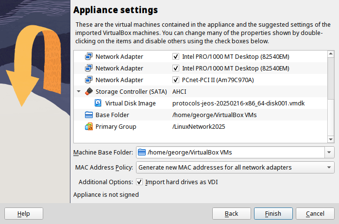

Лабораторная работа представляет из себя практико-ориентированную пошаговую инструкцию, выполняемую на одной или нескольких виртуальных машинах. В домашнее задание входит настройка некоторой топологии сети, её конфигурация и сбор этих данных в отчёт специального вида с помощью встроенных в виртуальные машины утилит.

В качестве менеджера виртуальных машин используется [VirtualBox](https://www.virtualbox.org/), система для выполнения лабораторных предоставляется в виде [архива с виртуальной машиной](https://drive.usercontent.google.com/download?id=1NGCXB53m4syTGiH_FMkQStTha6CD_Q0A&authuser=0) (Open Virtual Appliance, `.ova`-файл), на основе которого будет создана основная система, на её основе будут создаваться копии для работы.

***ВАЖНО:*** Некоторые команды для Windows или для разных процессоров могут отличаться. Данные команды будут помечены в лабораторных специальных значком 
# Настройка виртуальных машин

В данной главе описаны основные действия и / или команды, необходимые для работы с `VirtualBox`.

`VirtualBox` поддерживает собственный набор команд для работы из терминала с помощью встроенной утилиты `VBoxManage`, полный список команд представлен по команде

```console
VBoxManage --help
```

***Важное примечание:*** `VirtualBox` поддерживает локализацию внутренних настроек, из-за чего переведённые файлы настроек **не работают**. ***Никогда не запускайте*** `VBoxManage` и / или `VirtualBox` ***в русской локали***. \
При обнаружении локализованных данных:
 + Удалите все виртуальные машины и каталоги `~/VirtualBox VMs` и `~/.config/VirtualBox`
 + Сразу после того, как откроете терминал, делайте `export LC_ALL=en_US.UTF-8`


## Импорт образа и создание виртуальных машин

Для выполнения лабораторных необходимо единожды импортировать образ диска и после создавать клоны для работы. для настройки можно воспользоваться интерфейсом VirtualBox или выполнить ряд команд VBoxManage.

#### Вариант 1: `GUI`-вариант:

1. Откройте VirtualBox, выберите пункт «Импортировать образ»:


1.1. Выберите источником образа локальное хранилище данных и укажите путь к установленному `.ova`-файлом.
1.2. Перейдите к настройкам установки образа (в зависимости от версии VirtualBox настройки будут находиться на следующей странице установщика или в отдельной вкладке `Settings`): Установите галочку в поле «Import hard drives as VDI» и выберите политику MAC-адресов «Generate new MAC addresses for all network adapters». Завершите импортирование.

|  |  |
| ----------------------------------------- | -------------------------------------------------- |
|  |  |

В итоге в VirtualBox должна появиться виртуальная машина с названием вида `protocols-jeos-<дата_не_раньше_20250512>-x86_64`

2. Установленная виртуальная машина напрямую не используется для выполнения лабораторных — все действия выполняются на её _связных копиях_ (клон представляет из себя не отдельную машину, а связанный блок изменений основной ВМ и клонированной).

   Для клонирования машины нажмите ПКМ по основной машине и выберите во всплывающем окне поле «Clone». Окно настроек клонирования также открывается нажатием комбинации клавиш `Ctrl+O`.

   В настройках клонирования укажите имя создаваемого клона, выберите тип «Связное клонирование» и укажите политику MAC-адресов «Generate new MAC addresses for all network adapters». Завершите клонирование.


2. Каждая копия наследует данные от основной машины. Для корректной работы клонов требуется перенастраивать значение COM-портов на уникальные для каждого клона. Выберите склонированную машину, перейдите в настройки.
В настройках выберите раздел `Serial Ports` и для порта `Port 1` укажите уникальное значение в поле `Path/Address`


Поздравляем с созданием вашей первой рабочей машины!

#### Вариант 2: Настройка из командной строки

1. Импорт образа диска выполняется командой `VBoxManage import path/to/appliance.ova
```console
[papillon_rouge@localhost ~]$ VBoxManage import Downloads/protocols-jeos-x86_64.ova
0%...10%...20%...30%...40%...50%...60%...70%...80%...90%...100%
Interpreting /home/papillon_rouge/Downloads/protocols-jeos-x86_64.ova...
OK.
<...>
0%...10%...20%...30%...40%...50%...60%...70%...80%...90%...100%
Successfully imported the appliance.
~/papillon_rouge:
```

2. Для клонирования необходимо сохранить снапшот (состояние) основной машины и затем произвести клонирование на его основе.
   + Для создания снапшота используется команда `VBoxManage snapshot protocols-jeos-<date>-x86_64 take SNAPSHOT_NAME`.
   + Для клонирования виртуальной машины используется команда `VBoxManage clonevm protocols-jeos-<date>-x86_64 --groups=/LinuxNetwork2025 --name=CLONE_NAME --options=Link --snapshot=SNAPSHOT_NAME --register`

```console
[papillon_rouge@localhost ~]$ VBoxManage snapshot protocols-jeos-20250216-x86_64 take srv_snapshot
0%...10%...20%...30%...40%...50%...60%...70%...80%...90%...100%
Snapshot taken. UUID: 3e6c0a9a-b9a8-44e6-92de-e96cd9db3790

[papillon_rouge@localhost ~]$ VBoxManage clonevm protocols-jeos-20250216-x86_64 --groups=/LinuxNetwork2025 --name=srv --options=Link --snapshot=srv_snapshot --register
0%...10%...20%...30%...40%...50%...60%...70%...80%...90%...100%
Machine has been successfully cloned as "srv"
```

 В Windows при ошибке `Invalid machine group` дописать дополнительный backslash к группе: `--groups=//LinuxNetwork2025`

3. Для настройки `COM`-порта клона используется команда `VBoxManage modifyvm CLONE_NAME --uartmode1 tcpserver 2026`
```console
[papillon_rouge@localhost ~]$ VBoxManage modifyvm srv --uartmode1 tcpserver 2026
```

Итогом настройки с помощью командной строки будет аналогичное интерфейсному способу состояние.

## Работа с командной строкой

В процессе выполнения лабораторных работ необходимо проводить настройку виртуальных машин через терминальный интерфейс. Рассмотрим команды и работу с терминалом на примере тестовой машины.

Запустим виртуальную машину. Для входа в систему каждой машины необходимо вводить логин (`root`) и пароль (`root`).

***ДИСКРЕЙМЕР:*** Никогда не устанавливайте такие легко угадываемые пароли на свои персональные устройства!

 В некоторых случаях виртуальная машина может сразу не запуститься. Для работы необходимо отключить встроенную в ядро специальную поддержку виртуализации. В случае Linux необходимо в командной строке выполнить команду `sudo rmmod kvm_amd`, в случае Windows — запустите командную строку _от имени администратора_, выполните команду `bcdedit /set hypervisorlaunchtype off` (убедитесь, что ответное сообщение терминала `<Smth> completed successfully`; Иначе выполните действия из [данной статьи](https://learn.microsoft.com/ru-ru/troubleshoot/windows-client/application-management/virtualization-apps-not-work-with-hyper-v)) и перезапустите устройство.

 Виртуальная машина в случае проблем с виртуализацией может загружаться вплоть до 5 минут, при этом демонстрировать как будто постоянную перезагрузку.

После запуска имя каждой виртуальной машины — `localhost`. Для переименования виртуальной машины используется специальная команда `sethostname` (при смене имени виртуальной машины требуется повторный вход в систему):

`@srv`
```console
localhost login: root
Password:
[root@localhost ~]# sethostname srv


srv login: root
Password:
Last login: Fri Sep  5 13:09:38 UTC 2025 on ttyS0
[root@srv ~]#
```

При работе с терминалом при наборе команд воспользуйтесь клавишей `Tab` для автодополнения команд. При неоднозначной возможности дополнения после нескольких нажатий `Tab` будет выведены варианты дополнения команд:

`@srv`
```console
[root@srv ~]# c
c_rehash	catman	chcon			choom	chrt	clockdiff
colrm		compopt	control-dump	cpio	ctstat		cal
cd			chcpu	chown			chvt	clrunimap	column
conntrack 	control-restore			crlutil	curl 		caller
cd.. 		chgrp 					chpasswd			cksum
cmp			comm					conntrackd			convertdev.sh
crond		cut		capsh			certutil			chkconfig
chronyc		clear	cmsutil	command	consoletype			convertquota
crontab		cvtsudoers		case	chacl	chmem		chronyd
clock		col		compgen	continue		coproc		csplit
cat			chattr	chmod	chroot	clock_unsynced		colcrt
complete	control	cp		ctrlaltdel
[root@srv ~]# ca
cal			caller	capsh	case	cat		catman
[root@srv ~]# cal
  September 2025
Su Mo Tu We Th Fr Sa
   1  2  3  4  5  6
7  8  9 10 11 12 13
14 15 16 17 18 19 20
21 22 23 24 25 26 27
28 29 30
```

Нажатие `Tab` в процессе набора команд без введённых символов приводит к выводу возможных аргументов команды. Сочетание клавиш `Ctrl+C` позволяет сбросить введённую команду без её выполнения.
`@srv`
```console
[root@srv ~]# ip l
l2tp  link
[root@srv ~]# ip link
add       afstats   change    delete    help      property  set       show
[root@srv ~]# ip link ^C
[root@srv ~]#
```

Для просмотра истории команд можно использовать специальную команду `history` (заметим, что не исполненные команды, отмененные по `Ctrl+C`, не указываются в истории):

`@srv`
```console
[root@srv ~]# date
Sat Sep 20 03:06:32 UTC 2025
[root@srv ~]# ip a
1: lo: <LOOPBACK,UP,LOWER_UP> mtu 65536 qdisc noqueue state UNKNOWN group default qlen 1000
   link/loopback 00:00:00:00:00:00 brd 00:00:00:00:00:00
   inet 127.0.0.1/8 scope host lo
      valid_lft forever preferred_lft forever
2: eth0: <BROADCAST,MULTICAST> mtu 1500 qdisc noop state DOWN group default qlen 1000
   link/ether 08:00:27:d2:1c:a7 brd ff:ff:ff:ff:ff:ff
   altname enp0s3
   altname enx080027d21ca7
3: eth1: <BROADCAST,MULTICAST> mtu 1500 qdisc noop state DOWN group default qlen 1000
   link/ether 08:00:27:34:f7:3f brd ff:ff:ff:ff:ff:ff
   altname enp0s8
   altname enx08002734f73f
4: eth2: <BROADCAST,MULTICAST> mtu 1500 qdisc noop state DOWN group default qlen 1000
   link/ether 08:00:27:09:eb:1f brd ff:ff:ff:ff:ff:ff
   altname enp0s9
   altname enx08002709eb1f
5: eth3: <BROADCAST,MULTICAST> mtu 1500 qdisc noop state DOWN group default qlen 1000
   link/ether 08:00:27:6e:55:de brd ff:ff:ff:ff:ff:ff
   altname enp0s10
   altname enx0800276e55de
[root@srv ~]# ip link set eth1 up
[root@srv ~]# history
   1  cal
   2  date
   3  ip a
   4  ip link set eth1 up
   5  history
[root@srv ~]#
```

Для редактирования введенных команд можно с помощью клавиш ↑ и ↓ просматривать историю команд и модифицировать их.

`@srv`
```console
[root@srv ~]# ip link set ethi up
Cannot find device "ethi"
[root@srv ~]# ip link set eth1 up
[root@srv ~]#
```

Для поиска по истории команд можно воспользоваться сочетанием клавиш `Ctrl+R`. Необходимо ввести подстроку интересуемой команды, терминал предложит последнюю команду, содержащую подстроку. Повторное нажатие `Ctrl+R` будет продолжать поиск по истории.

`@srv`
```console
(reverse-i-search)`c<a>l
[root@srv ~]# ca
  September 2025
Su Mo Tu We Th Fr Sa
   1  2  3  4  5  6
7  8  9 10 11 12 13
14 15 16 17 18 19 20
21 22 23 24 25 26 27
28 29 30

[root@srv ~]#
```