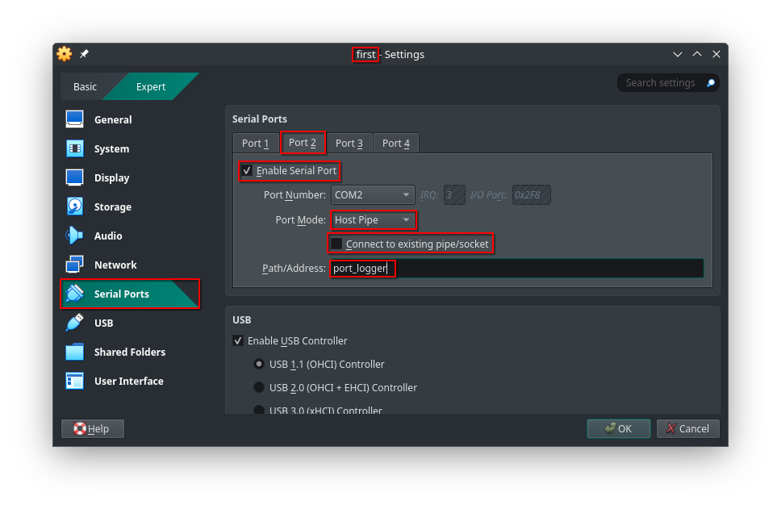
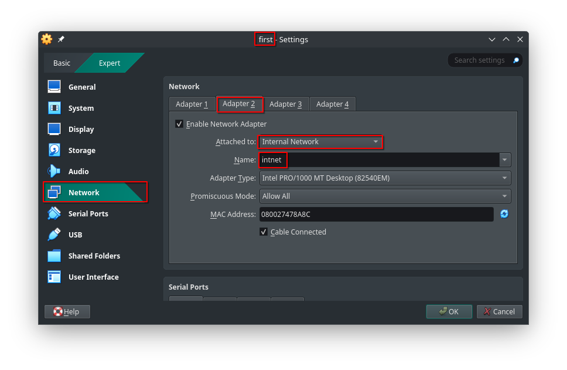
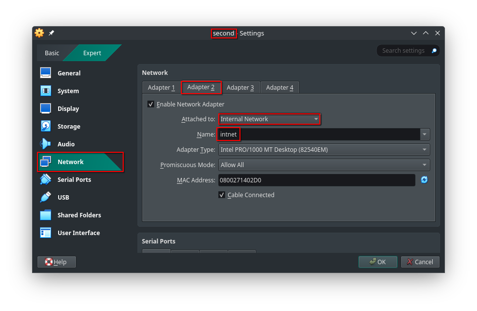

Каждая виртуальная машина по умолчанию имеет 4 COM-порта и 4 сетевых адаптера для организации подключения.

## Работа с последовательным портами

Последовательные порты (COM-порты) представляют из себя аппаратные интерфейсы, позволяющие напрямую передавать информацию между абонентами на физическом уровне стека протоколов TCP/IP. Для настройки канала связи между двумя устройствами через COM-порты используется сокетное соединение (в VirtualBox оно называется `Host Pipe`).

Создадим два клона с именами first и second согласно инструкции по клонированию.

В настройках виртуальных машин подключим соединение на COM-порт 2, для одного устройства укажем настройку создания канала (убрать галочку), для второго - только подключение к нему (оставить галочку).



Запустим виртуальные машины. Для входа в систему каждой машины необходимо ввести логин (`root`) и пароль (`root`).

***ДИСКРЕЙМЕР:*** Никогда не устанавливайте такие легко угадываемые пароли на свои персональные устройства!

После запуска имя каждой виртуальной машины — `localhost`. Для переименования виртуальной машины используется специальная команда `sethostname` (при смене имени виртуальной машины требуется повторный вход в систему):

`@first`
```console
localhost login: root
Password:
[root@localhost ~]# sethostname first


first login: root
Password:
Last login: Fri Sep  5 13:09:38 UTC 2025 on ttyS0
[root@first ~]#
```

`@second`
```console
localhost login: root
Password:
[root@localhost ~]# sethostname second


second login: root
Password:
Last login: Fri Sep  5 13:12:46 UTC 2025 on ttyS0
[root@second ~]#
```

Внутри виртуальной машины  посмотреть параметры порта можно с помощью команды `stty`. Для просмотра конкретного порта можно использовать перенаправление на нужный порт (COM-порты обозначаются в файловой системе в виде файлов специального типа, находящихся в директории `/dev`. Имена COM-портов обозначаются ttyS0-ttyS3 для портов 1-4 соответственно):

`@first`
```console
[root@first ~]# stty -a < /dev/ttyS1
speed 9600 baud; rows 0; columns 0; line = 0;
intr = ^C; quit = ^\; erase = ^?; kill = ^U; eof = ^D; eol = <undef>; eol2 = <undef>;
swtch = <undef>; start = ^Q; stop = ^S; susp = ^Z; rprnt = ^R; werase = ^W; lnext = ^V;
discard = ^O; min = 1; time = 0;
-parenb -parodd -cmspar cs8 hupcl -cstopb cread clocal -crtscts
-ignbrk -brkint -ignpar -parmrk -inpck -istrip -inlcr -igncr icrnl ixon -ixoff -iuclc -ixany
-imaxbel -iutf8
opost -olcuc -ocrnl onlcr -onocr -onlret -ofill -ofdel nl0 cr0 tab0 bs0 vt0 ff0
isig icanon iexten echo echoe echok -echonl -noflsh -xcase -tostop -echoprt echoctl echoke -flusho
-extproc
[root@first ~]#
```

Для соединения устройств необходимо подготовить порты к передаче данных: включить режим `raw` для передачи просто последовательности байт, а также отключить дублирование данных на экран:

`@first`
```console
[root@first ~]# stty raw -echo < /dev/ttyS1
[root@first ~]#
```

`@second`
```console
[root@second ~]# stty raw -echo < /dev/ttyS1
[root@second ~]#
```

Для `first` используем команду `cat` для получения данных с порта:

`@first`
```console
[root@first ~]# cat /dev/ttyS1

```

Через порт с `second` передадим календарь:

`@second`
```console
[root@second ~]# cal > /dev/ttyS1
[root@second ~]#
```

При этом календарь будет прочитан в `first`:

`@first`
```console
[root@first ~]# cat /dev/ttyS1
  September 2025
Su Mo Tu We Th Fr Sa
   1  2  3  4  5  6
7  8  9 10 11 12 13
14 15 16 17 18 19 20
21 22 23 24 25 26 27
28 29 30

```

## Работа с сетевыми интерфейсами

Сетевые интерфейсы представлены в виде виртуальных Ethernet-портов, позволяющих организовывать соединение виртуальных машин на интерфейсном и сетевом уровнях стека протоколов. Первый порт (`eth0`) используется для соединения виртуальной машины с внешней сетью для, например, выхода в интернет. Оставшиеся три порта могут быть использованы для соединения абонентов.

Настроим соединение между абонентами через сетевой интерфейс. Для этого в настройках виртуальных машин в разделе «Network» выберем пункт «Internal Network» и укажем имя для новой сети (для изменения параметров виртуальных машин их необходимо предварительно отключить (например, командой `poweroff` в командной строке, или из графического интерфейса самого VirtualBox )).

При указании у разных виртуальных машин одной и той же сети они автоматически соединяются  и могут взаимодействовать в рамках этой сети (данное соединение аналогично прямому соединению двух машин кабелем).



Заметим, что автоматически для разных виртуальных машин сгенерировались разные MAC-адреса.

Запустим виртуальные машины и проведём исследование интерфейсов.

Для работы с разного рода сетевыми настройками необходимо использовать утилиту [`iproute2`](https://ru.wikipedia.org/wiki/Iproute2)(утилита предустановлена в образе виртуальной машины). C помощью утилитной команды `ip link` посмотрим на первой машине все сетевые соединения:

`@first`
```console
[root@first ~]# ip link
1: lo: <LOOPBACK,UP,LOWER_UP> mtu 65536 qdisc noqueue state UNKNOWN mode DEFAULT group default qlen 1000
   link/loopback 00:00:00:00:00:00 brd 00:00:00:00:00:00
2: eth0: <BROADCAST,MULTICAST> mtu 1500 qdisc noop state DOWN mode DEFAULT group default qlen 1000
   link/ether 08:00:27:77:45:6f brd ff:ff:ff:ff:ff:ff
   altname enp0s3
   altname enx08002777456f
3: eth1: <BROADCAST,MULTICAST> mtu 1500 qdisc noop state DOWN mode DEFAULT group default qlen 1000
   link/ether 08:00:27:47:8a:8c brd ff:ff:ff:ff:ff:ff
   altname enp0s8
   altname enx080027478a8c
4: eth2: <BROADCAST,MULTICAST> mtu 1500 qdisc noop state DOWN mode DEFAULT group default qlen 1000
   link/ether 08:00:27:45:3d:0d brd ff:ff:ff:ff:ff:ff
   altname enp0s9
   altname enx080027453d0d
5: eth3: <BROADCAST,MULTICAST> mtu 1500 qdisc noop state DOWN mode DEFAULT group default qlen 1000
   link/ether 08:00:27:7a:79:33 brd ff:ff:ff:ff:ff:ff
   altname enp0s10
   altname enx0800277a7933
[root@first ~]#
```

Система показывает 5 интерфейсов (4 "реальных" и один логический `loopback`, для которого отправка в него вызывает приём данных из него же). Все интерфейсы на данный момент отключены. С помощью команды `ip link set eth1 up` включим интерфейс с сетью `intnet`, и вновь посмотрим на интерфейс через `ip link show eth1`:

`@first`
```console
[root@first ~]# ip link set eth1 up
[root@first ~]# ip link show eth1
3: eth1: <BROADCAST,MULTICAST,UP,LOWER_UP> mtu 1500 qdisc fq_codel state UP mode DEFAULT group default q
len 1000
   link/ether 08:00:27:47:8a:8c brd ff:ff:ff:ff:ff:ff
   altname enp0s8
   altname enx080027478a8c
[root@first ~]#
```

Статус интерфейса стал UP, соединение включено. Добавим на интерфейс IP-адрес сети. Для этого используется команда `ip addr add dev ETH_NUM IP_ADDR/MASK`

`@first`
```console
[root@first ~]# ip addr add dev eth1 10.9.0.1/24

[root@first ~]# ip addr show eth1
3: eth1: <BROADCAST,MULTICAST,UP,LOWER_UP> mtu 1500 qdisc fq_codel state UP group default qlen 1000
   link/ether 08:00:27:47:8a:8c brd ff:ff:ff:ff:ff:ff
   altname enp0s8
   altname enx080027478a8c
   inet 10.9.0.1/24 scope global eth1
      valid_lft forever preferred_lft forever
[root@first ~]#
```

Проведём аналогичные действия для второй виртуальной машины (При выборе IP-адреса номер сети для всех абонентов одной сети должен быть одинаковым):

`@second`
```console
[root@second ~]# ip link set eth1 up
[root@second ~]# ip addr add dev eth1 10.9.0.2/24
[root@second ~]# ip addr show eth1
3: eth1: <BROADCAST,MULTICAST,UP,LOWER_UP> mtu 1500 qdisc fq_codel state UP group default qlen 1000
   link/ether 08:00:27:14:02:d0 brd ff:ff:ff:ff:ff:ff
   altname enp0s8
   altname enx0800271402d0
   inet 10.9.0.2/24 scope global eth1
      valid_lft forever preferred_lft forever
[root@second ~]#
```

Сгенерируем трафик для проверки соединения. Самый простой способ генерации трафика — команда `ping <ip address>`.

`@first`
```console
[root@first ~]# ping 10.9.0.2
PING 10.9.0.2 (10.9.0.2) 56(84) bytes of data.
64 bytes from 10.9.0.2: icmp_seq=1 ttl=64 time=0.948 ms
64 bytes from 10.9.0.2: icmp_seq=2 ttl=64 time=0.577 ms
64 bytes from 10.9.0.2: icmp_seq=3 ttl=64 time=0.784 ms
64 bytes from 10.9.0.2: icmp_seq=4 ttl=64 time=0.711 ms
64 bytes from 10.9.0.2: icmp_seq=5 ttl=64 time=0.751 ms
64 bytes from 10.9.0.2: icmp_seq=6 ttl=64 time=0.725 ms

--- 10.9.0.2 ping statistics ---
6 packets transmitted, 6 received, 0% packet loss, time 5105ms
rtt min/avg/max/mdev = 0.577/0.749/0.948/0.109 ms
[root@first ~]#
```

Для отслеживания трафика запустим на второй машине `tcpdump -i eth1 -с2`. На первой машине выполним одиночный `ping`-запрос с помощью команды `ping -c1 <ip address>`

`@second`
```console
[root@second ~]# tcpdump -i eth1 -c2
tcpdump: verbose output suppressed, use -v[v]... for full protocol decode
listening on eth1, link-type EN10MB (Ethernet), snapshot length 262144 bytes

```

`@first`
```console
[root@first ~]# ping -c1 10.9.0.2
PING 10.9.0.2 (10.9.0.2) 56(84) bytes of data.
64 bytes from 10.9.0.2: icmp_seq=1 ttl=64 time=0.570 ms

--- 10.9.0.2 ping statistics ---
1 packets transmitted, 1 received, 0% packet loss, time 0ms
rtt min/avg/max/mdev = 0.570/0.570/0.570/0.000 ms
[root@first ~]#
```

`@second`
```console
[root@second ~]# tcpdump -i eth1 -c2
tcpdump: verbose output suppressed, use -v[v]... for full protocol decode
listening on eth1, link-type EN10MB (Ethernet), snapshot length 262144 bytes
15:27:43.398843 IP 10.9.0.1 > second: ICMP echo request, id 3, seq 1, length 64
15:27:43.398872 IP second > 10.9.0.1: ICMP echo reply, id 3, seq 1, length 64
2 packets captured
2 packets received by filter
0 packets dropped by kernel
[root@second ~]#
```

