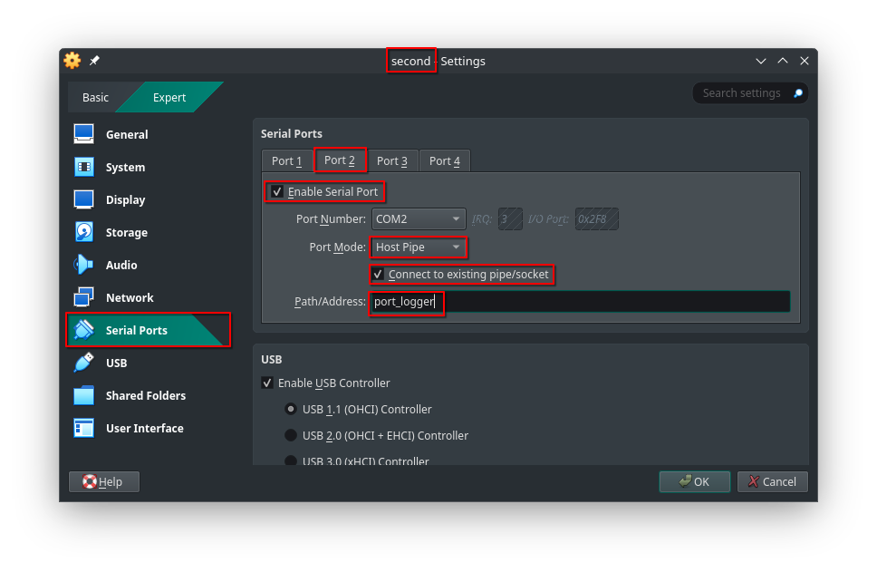
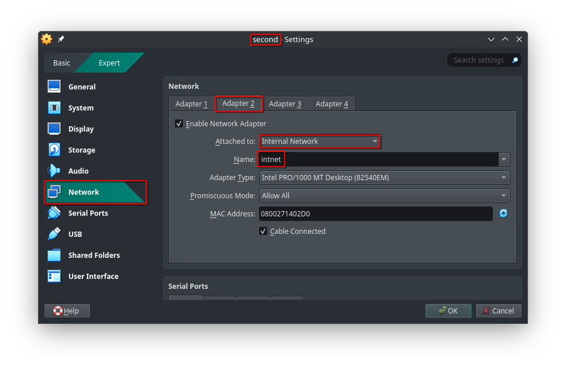
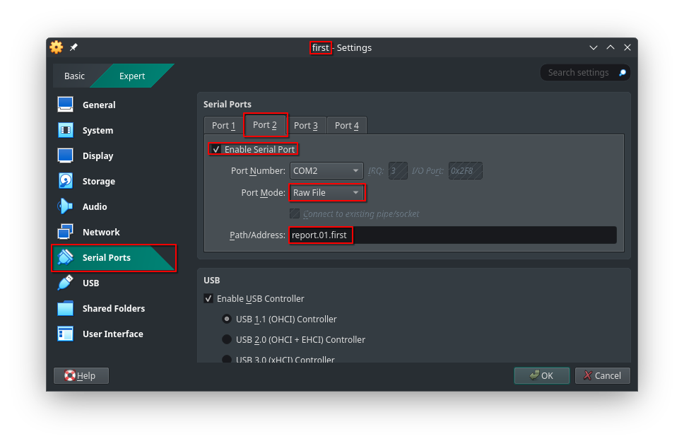

# Лабораторная работа №2  - Знакомство с системой

+ [Все лабораторные работы по сетевым протоколам в Linux](../Intro.md)
+ [Предыдущая лабораторная работа — Настройка системы для выполнения лабораторных](../01_FirstStart/Настройка%20системы%20для%20выполнения%20лабораторных.md))
+ [Следующая лабораторная работа — Основные утилиты и команды просмотра настроек и мониторинга сети](../03_BasicUtils/Основные%20утилиты%20и%20команды%20просмотра%20настроек%20и%20мониторинга%20сети.md)

---

## Быстрый поиск по лабораторной:
 + [Виртуальные машины VirtualBox](./Знакомство%20с%20системой.md#Виртуальные-машины-VirtualBox)
 + [Работа с последовательным портами](./Знакомство%20с%20системой.md#Работа-с-последовательным-портами)
	 + [Создание COM-соединения](./Знакомство%20с%20системой.md#Создание-COM-соединения)
	 + [Настройка имени пользователя](./Знакомство%20с%20системой.md#Настройка-имени-пользователя)
	 + [Передача данных через COM-порты](./Знакомство%20с%20системой.md#Передача-данных-через-COM-порты)
 + [Работа с сетевыми интерфейсами](./Знакомство%20с%20системой.md#Работа-с-сетевыми-интерфейсами)
	 + [Настройка eth-соединения](./Знакомство%20с%20системой.md#Настройка-eth-соединения)
	 + [Настройка сетевых интерфейсов](./Знакомство%20с%20системой.md#Настройка-сетевых-интерфейсов)
	 + [Передача данных через сетевые интерфейсы](./Знакомство%20с%20системой.md#Передача-данных-через-сетевые-интерфейсы)
 + [Сдача самостоятельных работ](./Знакомство%20с%20системой.md#Сдача-самостоятельных-работ)
 + [Самостоятельная работа](./Знакомство%20с%20системой.md#Самостоятельная-работа)

**Цель лабораторной** — познакомить изучающего с системой

**Задачи лабораторной:**
 + Изучить логику работы последовательных портов;
 + Изучить логику работы сетевых интерфейсов;
 + Изучить алгоритм генерации отчёта по лабораторным;

---

## Виртуальные машины VirtualBox

Каждая виртуальная машина по умолчанию имеет 4 _COM-порта_ и 4 _сетевых адаптера_ для организации подключения. При этом поддерживается до 36 псевдофизических (поскольку все интерфейсы ВМ на самом деле являются, очевидно, виртуальными; далее мы будем называть эти интерфейсы просто физическими, а виртуальными будем именовать программно реализованные внутри ВМ интерфейсы) и любое количество виртуальных интерфейсов.

Последовательные порты (COM-порты) представляют из себя аппаратные интерфейсы, позволяющие напрямую передавать информацию между абонентами на физическом уровне стека протоколов TCP/IP. COM-порты обозначаются в файловой системе в виде файлов специального типа, находящихся в директории `/dev`. Имена COM-портов обозначаются `ttyS0-ttyS3` для портов 1-4 соответственно

Сетевые интерфейсы представлены в виде физических Ethernet-портов, позволяющих организовывать соединение устройств на интерфейсном и сетевом уровнях стека протоколов. Для работы с разного рода сетевыми настройками используется утилита [`iproute2`](https://ru.wikipedia.org/wiki/Iproute2)(утилита предустановлена в образе виртуальной машины)

---

## Работа с последовательным портами

 :information_source: Для настройки канала связи между двумя устройствами через COM-порты используется сокетное соединение (в VirtualBox оно называется `Host Pipe`).

---

### Создание COM-соединения

:round_pushpin: 1. Создайте два клона с именами first и second согласно [инструкции по клонированию](../01_FirstStart/Настройка%20системы%20для%20выполнения%20лабораторных.md).

:round_pushpin: 2. В настройках виртуальных машин подключите соединение на COM-порт 2:
 + Для одного устройства укажите настройку создания канала (убрать галочку);
 + Для второго устройства укажите только подключение к нему (оставить галочку).

:warning:  В случае Windows название порта (поле `Port/Address`) имеет более сложную структуру: `\\.\pipe\<pipe_name>`




:round_pushpin: 3. Запустите виртуальные машины. Для входа в систему каждой машины необходимо ввести логин (`root`) и пароль (`root`).

:warning: ***ДИСКРЕЙМЕР:*** Никогда не устанавливайте такие легко угадываемые пароли на свои персональные устройства!

---

### Настройка имени пользователя

:information_source: После запуска имя каждой виртуальной машины — `localhost`. Для переименования виртуальной машины используется специальная команда `sethostname` (при смене имени виртуальной машины требуется повторный вход в систему):

:round_pushpin: 1. С помощью команды `sethostname` измените имена пользователей на `first` и `second` соответственно

`@first`
```console
localhost login: root
Password:
[root@localhost ~]# sethostname first


first login: root
Password:
Last login: Fri Sep  5 13:09:38 UTC 2025 on ttyS0
[root@first ~]#
```

`@second`
```console
localhost login: root
Password:
[root@localhost ~]# sethostname second


second login: root
Password:
Last login: Fri Sep  5 13:12:46 UTC 2025 on ttyS0
[root@second ~]#
```

---

### Передача данных через COM-порты

:information_source: Внутри виртуальной машины  управление портами осуществляется с помощью команды `stty`. Без управляющих параметров она позволяет посмотреть текущие параметры портов. Для просмотра конкретного порта можно использовать перенаправление на нужный порт.

:round_pushpin: 1. С помощью команды `stty -a < <dev-name>` получите информацию о параметрах COM-порта №2 (`ttyS1`)

`@first`
```console
[root@first ~]# stty -a < /dev/ttyS1
speed 9600 baud; rows 0; columns 0; line = 0;
intr = ^C; quit = ^\; erase = ^?; kill = ^U; eof = ^D; eol = <undef>; eol2 = <undef>;
swtch = <undef>; start = ^Q; stop = ^S; susp = ^Z; rprnt = ^R; werase = ^W; lnext = ^V;
discard = ^O; min = 1; time = 0;
-parenb -parodd -cmspar cs8 hupcl -cstopb cread clocal -crtscts
-ignbrk -brkint -ignpar -parmrk -inpck -istrip -inlcr -igncr icrnl ixon -ixoff -iuclc -ixany
-imaxbel -iutf8
opost -olcuc -ocrnl onlcr -onocr -onlret -ofill -ofdel nl0 cr0 tab0 bs0 vt0 ff0
isig icanon iexten echo echoe echok -echonl -noflsh -xcase -tostop -echoprt echoctl echoke -flusho
-extproc
[root@first ~]#
```

:information_source: Для соединения устройств необходимо подготовить порты к передаче данных: включить режим `raw` для передачи просто последовательности байт, а также отключить дублирование данных на экран:

:round_pushpin: 2. С помощью команды `stty raw -echo < <dev-name>` подготовьте COM-порты для передачи

`@first`
```console
[root@first ~]# stty raw -echo < /dev/ttyS1
[root@first ~]#
```

`@second`
```console
[root@second ~]# stty raw -echo < /dev/ttyS1
[root@second ~]#
```

:round_pushpin: 3. Запустите команду `cat <dev-name>` на `first` для получения данных с порта

`@first`
```console
[root@first ~]# cat /dev/ttyS1

```

:round_pushpin: 4. С `second` передайте через порт календарь

`@second`
```console
[root@second ~]# cal > /dev/ttyS1
[root@second ~]#
```

:information_source: Заметьте, что календарь будет прочитан в `first`:

`@first`
```console
[root@first ~]# cat /dev/ttyS1
  September 2025
Su Mo Tu We Th Fr Sa
   1  2  3  4  5  6
7  8  9 10 11 12 13
14 15 16 17 18 19 20
21 22 23 24 25 26 27
28 29 30

```

---

## Работа с сетевыми интерфейсами

---

### Настройка eth-соединения

:warning: Для изменения параметров виртуальных машин их необходимо предварительно отключить (например, командой `poweroff` в командной строке или из графического интерфейса самого VirtualBox)

:round_pushpin: 1. В настройках виртуальных машин в разделе «Network» выберите пункт «Internal Network» и укажите имя для новой сети.

:information_source: При указании у разных виртуальных машин одной и той же сети они автоматически соединяются  и могут взаимодействовать в рамках этой сети (данное соединение аналогично прямому соединению двух машин кабелем).




:information_source: Заметьте, что автоматически для разных виртуальных машин сгенерировались разные MAC-адреса.

:round_pushpin: 2. Запустите виртуальные машины

---

### Настройка сетевых интерфейсов

:round_pushpin: 1. C помощью команды `ip link` покажите все сетевые интерфейсы на `first`:

`@first`
```console
[root@first ~]# ip link
1: lo: <LOOPBACK,UP,LOWER_UP> mtu 65536 qdisc noqueue state UNKNOWN mode DEFAULT group default qlen 1000
   link/loopback 00:00:00:00:00:00 brd 00:00:00:00:00:00
2: eth0: <BROADCAST,MULTICAST> mtu 1500 qdisc noop state DOWN mode DEFAULT group default qlen 1000
   link/ether 08:00:27:77:45:6f brd ff:ff:ff:ff:ff:ff
   altname enp0s3
   altname enx08002777456f
3: eth1: <BROADCAST,MULTICAST> mtu 1500 qdisc noop state DOWN mode DEFAULT group default qlen 1000
   link/ether 08:00:27:47:8a:8c brd ff:ff:ff:ff:ff:ff
   altname enp0s8
   altname enx080027478a8c
4: eth2: <BROADCAST,MULTICAST> mtu 1500 qdisc noop state DOWN mode DEFAULT group default qlen 1000
   link/ether 08:00:27:45:3d:0d brd ff:ff:ff:ff:ff:ff
   altname enp0s9
   altname enx080027453d0d
5: eth3: <BROADCAST,MULTICAST> mtu 1500 qdisc noop state DOWN mode DEFAULT group default qlen 1000
   link/ether 08:00:27:7a:79:33 brd ff:ff:ff:ff:ff:ff
   altname enp0s10
   altname enx0800277a7933
[root@first ~]#
```

:information_source: Система показывает 5 интерфейсов (4 физических и один логический `loopback`, для которого отправка в него вызывает приём данных из него же). Все интерфейсы на данный момент отключены.

:round_pushpin: 2. С помощью _команды управления интерфейсом_ :new: `ip link set eth1 up` включите интерфейс с сетью `intnet`

:warning: Здесь и далее в лабораторных знаком :new: будет обозначаться вводимая в рамках лабораторных терминология. В будущем для команд, описываемых данной терминологией, не будет писаться сама команда, а будет использоваться упоминание термина. Список терминов и связанные с ним команды представлены на заглавной странице лабораторных

:round_pushpin: 3. Покажите параметры интерфейса с помощью команды `ip link show eth1`:

`@first`
```console
[root@first ~]# ip link set eth1 up
[root@first ~]# ip link show eth1
3: eth1: <BROADCAST,MULTICAST,UP,LOWER_UP> mtu 1500 qdisc fq_codel state UP mode DEFAULT group default q
len 1000
   link/ether 08:00:27:47:8a:8c brd ff:ff:ff:ff:ff:ff
   altname enp0s8
   altname enx080027478a8c
[root@first ~]#
```

Статус интерфейса стал UP, соединение включено.

:round_pushpin: 4. С помощью _команды настройки IP-адресов_ :new: `ip addr add dev <interface> <IPv4>/<mask>` добавьте на интерфейс IP-адрес

:round_pushpin: 5. Покажите параметры интерфейса _с сетью_ с помощью команды `ip addr show eth1`:

`@first`
```console
[root@first ~]# ip addr add dev eth1 10.9.0.1/24

[root@first ~]# ip addr show eth1
3: eth1: <BROADCAST,MULTICAST,UP,LOWER_UP> mtu 1500 qdisc fq_codel state UP group default qlen 1000
   link/ether 08:00:27:47:8a:8c brd ff:ff:ff:ff:ff:ff
   altname enp0s8
   altname enx080027478a8c
   inet 10.9.0.1/24 scope global eth1
      valid_lft forever preferred_lft forever
[root@first ~]#
```

:round_pushpin: 6. С помощью команд управления интерфейсом и команд настройки IP-адресов аналогично настройте `second` (При выборе IP-адреса номер сети для всех абонентов одной сети должен быть одинаковым)

`@second`
```console
[root@second ~]# ip link set eth1 up
[root@second ~]# ip addr add dev eth1 10.9.0.2/24
[root@second ~]# ip addr show eth1
3: eth1: <BROADCAST,MULTICAST,UP,LOWER_UP> mtu 1500 qdisc fq_codel state UP group default qlen 1000
   link/ether 08:00:27:14:02:d0 brd ff:ff:ff:ff:ff:ff
   altname enp0s8
   altname enx0800271402d0
   inet 10.9.0.2/24 scope global eth1
      valid_lft forever preferred_lft forever
[root@second ~]#
```

---

### Передача данных через сетевые интерфейсы

Сгенерируем трафик для проверки соединения. Самый простой способ генерации трафика — команда `ping -с<количество отправляемых пакетов> <dstIP>`.

:round_pushpin: 1. С помощью команды `ping -c5 <dstIP>` сгенерируйте ICMP-трафик между абонентами

`@first`
```console
[root@first ~]# ping -с5 10.9.0.2
PING 10.9.0.2 (10.9.0.2) 56(84) bytes of data.
64 bytes from 10.9.0.2: icmp_seq=1 ttl=64 time=0.948 ms
64 bytes from 10.9.0.2: icmp_seq=2 ttl=64 time=0.577 ms
64 bytes from 10.9.0.2: icmp_seq=3 ttl=64 time=0.784 ms
64 bytes from 10.9.0.2: icmp_seq=4 ttl=64 time=0.711 ms
64 bytes from 10.9.0.2: icmp_seq=5 ttl=64 time=0.751 ms

--- 10.9.0.2 ping statistics ---
5 packets transmitted, 5 received, 0% packet loss, time 5105ms
rtt min/avg/max/mdev = 0.577/0.749/0.948/0.109 ms
[root@first ~]#
```

Для отслеживания трафика могут использоваться специальные утилиты, сканирующие сетевые интерфейсы и считывающие проходящий через них трафик.

:round_pushpin: 2. С помощью команды `tcpdump -i eth1 -с2` запустите на `second` сканирование интерфейса

`@second`
```console
[root@second ~]# tcpdump -i eth1 -c2
tcpdump: verbose output suppressed, use -v[v]... for full protocol decode
listening on eth1, link-type EN10MB (Ethernet), snapshot length 262144 bytes

```

:round_pushpin: 3. С помощью команды `ping -c1 <ip address>` выполните одиночный `ping`-запрос на 'first'

`@first`
```console
[root@first ~]# ping -c1 10.9.0.2
PING 10.9.0.2 (10.9.0.2) 56(84) bytes of data.
64 bytes from 10.9.0.2: icmp_seq=1 ttl=64 time=0.570 ms

--- 10.9.0.2 ping statistics ---
1 packets transmitted, 1 received, 0% packet loss, time 0ms
rtt min/avg/max/mdev = 0.570/0.570/0.570/0.000 ms
[root@first ~]#
```

:information_source: Убедитесь, что данные о ping-сообщении были считаны:

`@second`
```console
[root@second ~]# tcpdump -i eth1 -c2
tcpdump: verbose output suppressed, use -v[v]... for full protocol decode
listening on eth1, link-type EN10MB (Ethernet), snapshot length 262144 bytes
15:27:43.398843 IP 10.9.0.1 > second: ICMP echo request, id 3, seq 1, length 64
15:27:43.398872 IP second > 10.9.0.1: ICMP echo reply, id 3, seq 1, length 64
2 packets captured
2 packets received by filter
0 packets dropped by kernel
[root@second ~]#
```

---

## Сдача самостоятельных работ

:information_source: Для сдачи самостоятельных работ используется специальная утилита `report`, создающая tar-архив с записью команд в системе.

:round_pushpin: 1. С помощью команды `report <#Lab> <hostname>` запустите запись отчёта на обеих машинах:

`@first`
```console
[root@first ~]# report 1 first
```
```console
Report is started. Task: 01; host: first.
Use exit or ^D to finish.
[root@01-first ~]#
```

`@second`
```console
[root@second ~]# report 1 second
```
```console
Report is started. Task: 01; host: second.
Use exit or ^D to finish.
[root@01-second ~]#
```

:information_source: Затем необходимо будет выполнять указанные в самостоятельной работе команды. Сейчас выполним на каждой виртуальной машине следующие команды:
 + `ip a show eth1`
 + `ping -c5 <адрес другого абонента>`

:round_pushpin: 2. На каждой машине выполните описанные команды в режиме report. Затем завершите запись с помощью команды `exit` или сочетания клавиш `Ctrl+D`

`@first`
```console
[root@01-first ~]# ip a show eth1
3: eth1: <BROADCAST,MULTICAST,UP,LOWER_UP> mtu 1500 qdisc fq_codel state UP group default qlen 1000
   link/ether 08:00:27:da:00:dd brd ff:ff:ff:ff:ff:ff
   altname enp0s8
   altname enx080027da00dd
   inet 10.9.0.1/24 scope global eth1
      valid_lft forever preferred_lft forever
[root@01-first ~]# ping -c5 10.9.0.2
PING 10.9.0.2 (10.9.0.2) 56(84) bytes of data.
64 bytes from 10.9.0.2: icmp_seq=1 ttl=64 time=0.531 ms
64 bytes from 10.9.0.2: icmp_seq=2 ttl=64 time=0.635 ms
64 bytes from 10.9.0.2: icmp_seq=3 ttl=64 time=0.712 ms
64 bytes from 10.9.0.2: icmp_seq=4 ttl=64 time=0.558 ms
64 bytes from 10.9.0.2: icmp_seq=5 ttl=64 time=0.927 ms

--- 10.9.0.2 ping statistics ---
5 packets transmitted, 5 received, 0% packet loss, time 4132ms
rtt min/avg/max/mdev = 0.531/0.672/0.927/0.142 ms
[root@01-first ~]#
<^D>exit
Report is stopped.
[root@first ~]#
```

`@second`
```console
[root@01-second ~]# ip a show eth1
3: eth1: <BROADCAST,MULTICAST,UP,LOWER_UP> mtu 1500 qdisc fq_codel state UP group default qlen 1000
   link/ether 08:00:27:e1:50:ee brd ff:ff:ff:ff:ff:ff
   altname enp0s8
   altname enx080027e150ee
   inet 10.9.0.2/24 scope global eth1
      valid_lft forever preferred_lft forever
[root@01-second ~]# ping -c5 10.9.0.1
PING 10.9.0.1 (10.9.0.1) 56(84) bytes of data.
64 bytes from 10.9.0.1: icmp_seq=1 ttl=64 time=0.648 ms
64 bytes from 10.9.0.1: icmp_seq=2 ttl=64 time=0.780 ms
64 bytes from 10.9.0.1: icmp_seq=3 ttl=64 time=0.832 ms
64 bytes from 10.9.0.1: icmp_seq=4 ttl=64 time=0.569 ms
64 bytes from 10.9.0.1: icmp_seq=5 ttl=64 time=0.758 ms

--- 10.9.0.1 ping statistics ---
5 packets transmitted, 5 received, 0% packet loss, time 4004ms
rtt min/avg/max/mdev = 0.569/0.717/0.832/0.095 ms
[root@01-second ~]# exit
exit
Report is stopped.
[root@second ~]#
```

:information_source: После записи в домашнем каталоге появится файл `report.<#Lab>.<hostname>`. С помощью `ls -l` можно убедиться в предварительной корректности записи (число после слова `root` показывает размер файла, он должен быть ненулевой), а с помощью команды `report <report-name>` можно "проиграть" запись команд.

:round_pushpin: 3. С помощью команды `report <report-name>` запустите получившиеся отчёты

`@first`
```console
[root@first ~]# ls -l
total 12
drwxr-xr-x 2 root root 4096 May 12 17:18 bin
-rw-r--r-- 1 root root 2621 Oct 13 12:28 report.01.first
drwx------ 2 root root 4096 May 12 17:19 tmp

[root@first ~]# report report.01.first
Replay report.01.first
[root@01-first ~]# ip a show eth1
3: eth1: <BROADCAST,MULTICAST,UP,LOWER_UP> mtu 1500 qdisc fq_codel state UP group default qlen 1000
   link/ether 08:00:27:da:00:dd brd ff:ff:ff:ff:ff:ff
   altname enp0s8
   altname enx080027da00dd
   inet 10.9.0.1/24 scope global eth1
      valid_lft forever preferred_lft forever
[root@01-first ~]# ping -c5 10.9.0.2
PING 10.9.0.2 (10.9.0.2) 56(84) bytes of data.
64 bytes from 10.9.0.2: icmp_seq=1 ttl=64 time=0.531 ms
64 bytes from 10.9.0.2: icmp_seq=2 ttl=64 time=0.635 ms
64 bytes from 10.9.0.2: icmp_seq=3 ttl=64 time=0.712 ms
64 bytes from 10.9.0.2: icmp_seq=4 ttl=64 time=0.558 ms
64 bytes from 10.9.0.2: icmp_seq=5 ttl=64 time=0.927 ms

--- 10.9.0.2 ping statistics ---
5 packets transmitted, 5 received, 0% packet loss, time 4132ms
rtt min/avg/max/mdev = 0.531/0.672/0.927/0.142 ms
[root@01-first ~]#
exit

Replay report.01.first finished
[root@first ~]#
```

`@second`
```console
[root@second ~]# ls -l
total 12
drwxr-xr-x 2 root root 4096 May 12 17:18 bin
-rw-r--r-- 1 root root 2498 Oct 13 12:29 report.01.second
drwx------ 2 root root 4096 May 12 17:19 tmp

[root@second ~]# report report.01.second
Replay report.01.second
[root@01-second ~]# ip a show eth1
3: eth1: <BROADCAST,MULTICAST,UP,LOWER_UP> mtu 1500 qdisc fq_codel state UP group default qlen 1000
   link/ether 08:00:27:e1:50:ee brd ff:ff:ff:ff:ff:ff
   altname enp0s8
   altname enx080027e150ee
   inet 10.9.0.2/24 scope global eth1
      valid_lft forever preferred_lft forever
[root@01-second ~]# ping -c5 10.9.0.1
PING 10.9.0.1 (10.9.0.1) 56(84) bytes of data.
64 bytes from 10.9.0.1: icmp_seq=1 ttl=64 time=0.648 ms
64 bytes from 10.9.0.1: icmp_seq=2 ttl=64 time=0.780 ms
64 bytes from 10.9.0.1: icmp_seq=3 ttl=64 time=0.832 ms
64 bytes from 10.9.0.1: icmp_seq=4 ttl=64 time=0.569 ms
64 bytes from 10.9.0.1: icmp_seq=5 ttl=64 time=0.758 ms

--- 10.9.0.1 ping statistics ---
5 packets transmitted, 5 received, 0% packet loss, time 4004ms
rtt min/avg/max/mdev = 0.569/0.717/0.832/0.095 ms
[root@01-second ~]# exit
exit

Replay report.01.second finished
[root@second ~]#
```

Следующим шагом необходимо перенести полученные отчёты из виртуальных машин в основную систему.

:warning: ***ВАЖНО:*** настройка порта для передачи данных может быть проведена ещё _при стартовой настройке виртуальных машин_, но в таком случае выводы некоторых команд могут сильнее отличаться от показанных в лабораторных.

Поскольку настройка проводится над виртуальными машинами, для её проведения необходимо выключить машины, используя команду `poweroff`

:round_pushpin: 4. Выключите машины с помощью команды `poweroff` или передачей сигнала о завершении работы из VirtualBox

:warning: ***ВАЖНО:*** Не выключайте машины «отключением питания» (пункт «power off the machine» при выключении через VirtualBox) во избежание ошибок в сохранении данных.

```console
[root@first ~]# poweroff
------------------------------------------
[root@second ~]# poweroff
```

:information_source: Для передачи используется последовательный порт (COM-порт), настраиваемый на запись в файл (Port Mode: Raw File), в качестве названия выводимого файла необходимо указать соответствующее имя файла `report.<#Lab>.<hostname>`

\*Имена файлов внутри ВМ и в основной системе, вообще говоря, не обязаны быть одинаковыми. Но для удобства проверки мы просим использовать те же имена.

:round_pushpin: 5. Настройте на устройствах COM-порты для передачи данных из виртуальных машин




:round_pushpin: 6. Вновь запустите виртуальные машины.

:information_source: Для передачи данных аналогично работе с виртуальными каналами необходимо настроить порты для передачи, после чего передать на них файлы-отчёты. По итогу, команды для передачи всегда будут одинаковыми (не забывайте пользоваться автодополнением через `Tab` для записи длинных команд):
 + `stty raw -echo < /dev/ttyS1`
 + `cat > report.<#Lab>.<hostname> > /dev/ttyS1`

:round_pushpin: 7. С помощью описанных выше команд перешлите файлы отчётов с виртуальных машин в вашу систему

`@first`
```console
[root@first ~]# ls
bin  report.01.first  tmp
[root@first ~]# stty raw -echo < /dev/ttyS1
[root@first ~]# cat report.01.first > /dev/ttyS1
[root@first ~]# poweroff
```

`@second`
```console
[root@second ~]# ls
bin  report.01.second  tmp
[root@second ~]# stty raw -echo < /dev/ttyS1
[root@second ~]# cat report.01.second > /dev/ttyS1
[root@second ~]# poweroff
```

После этого в вашей системе появятся соответствующие файлы. Для проверки корректности убедитесь, что полученные файлы _ненулевого_ объёма (в среднем, несколько килобайт). В случае использования собственной системы `Linux`, можно установить утилиту report из [репозитория](https://github.com/FrBrGeorge/vbsnap) и проверять корректность записанного файла также прогоном в утилите:

`@user`
```console
[USER@USERsPC] ls | grep report
report.01.first
report.01.second

[USER@USERsPC] report report.01.first
tar: ./CPU.txt: time stamp 2025-10-13 15:25:57 is 8649.335340872 s in the future
tar: ./IN.txt: time stamp 2025-10-13 15:28:02 is 8774.335237496 s in the future
tar: ./BOTH.txt: time stamp 2025-10-13 15:28:02 is 8774.335184105 s in the future
tar: ./TIME.txt: time stamp 2025-10-13 15:28:02 is 8774.335138278 s in the future
tar: ./OUT.txt: time stamp 2025-10-13 15:28:02 is 8774.335085218 s in the future
tar: .: time stamp 2025-10-13 15:25:57 is 8649.334813324 s in the future
Replay report.01.first
[root@01-first ~]# ip a show eth1
3: eth1: <BROADCAST,MULTICAST,UP,LOWER_UP> mtu 1500 qdisc fq_codel state UP group default qlen 1000
   link/ether 08:00:27:da:00:dd brd ff:ff:ff:ff:ff:ff
   altname enp0s8
   altname enx080027da00dd
   inet 10.9.0.1/24 scope global eth1
      valid_lft forever preferred_lft forever
[root@01-first ~]# ping -c5 10.9.0.2
PING 10.9.0.2 (10.9.0.2) 56(84) bytes of data.
64 bytes from 10.9.0.2: icmp_seq=1 ttl=64 time=0.531 ms
64 bytes from 10.9.0.2: icmp_seq=2 ttl=64 time=0.635 ms
64 bytes from 10.9.0.2: icmp_seq=3 ttl=64 time=0.712 ms
64 bytes from 10.9.0.2: icmp_seq=4 ttl=64 time=0.558 ms
64 bytes from 10.9.0.2: icmp_seq=5 ttl=64 time=0.927 ms

--- 10.9.0.2 ping statistics ---
5 packets transmitted, 5 received, 0% packet loss, time 4132ms
rtt min/avg/max/mdev = 0.531/0.672/0.927/0.142 ms
[root@01-first ~]#
exit

Replay report.01.first finished

[USER@USERsPC]
```

---

## Самостоятельная работа

В качестве отчёта о проделанной лабораторной пришлите преподавателю два отчёта `report.01.first` и `report.01.second` с описанными в последнем разделе командами.
