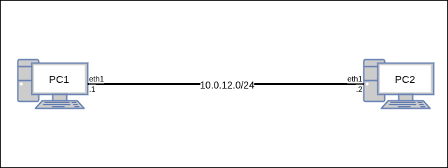

# Лабораторная работа №3 — Основные утилиты и команды просмотра настроек и мониторинга сети

 + [Все лабораторные работы по сетевым протоколам в Linux](../Intro.md)
 + [Предыдущая лабораторная работа — Знакомство с системой](../02_SystemGreetings/Знакомство%20с%20системой.md)
 + [Следующая лабораторная работа — Настройка VLAN](../04_VLAN/Настройка%20VLAN.md)

---

## Быстрый поиск по лабораторной:
 + [Настройка топологии](./Основные%20утилиты%20и%20команды%20просмотра%20настроек%20и%20мониторинга%20сети.md#Настройка-топологии)
 + [Работа с сетевыми интерфейсами](./Основные%20утилиты%20и%20команды%20просмотра%20настроек%20и%20мониторинга%20сети.md#Работа-с-сетевыми-интерфейсами)
	 + [Просмотр сетевых интерфейсов](./Основные%20утилиты%20и%20команды%20просмотра%20настроек%20и%20мониторинга%20сети.md#Просмотр-сетевых-интерфейсов)
	 + [Управление сетевыми интерфейсами](./Основные%20утилиты%20и%20команды%20просмотра%20настроек%20и%20мониторинга%20сети.md#Управление-сетевыми-интерфейсами)
 + [Работа с IP-адресами](./Основные%20утилиты%20и%20команды%20просмотра%20настроек%20и%20мониторинга%20сети.md#Работа-с-IP-адресами)
	 + [Просмотр IP-адресов](./Основные%20утилиты%20и%20команды%20просмотра%20настроек%20и%20мониторинга%20сети.md#Просмотр-IP-адресов)
	 + [Управление IP-адресами](./Основные%20утилиты%20и%20команды%20просмотра%20настроек%20и%20мониторинга%20сети.md#Управление-IP-адресами)
	 + [Проверка настройки сети](./Основные%20утилиты%20и%20команды%20просмотра%20настроек%20и%20мониторинга%20сети.md#Проверка-настройки-сети)
 + [Работа с Таблицами маршрутизации](./Основные%20утилиты%20и%20команды%20просмотра%20настроек%20и%20мониторинга%20сети.md#Работа-с-Таблицами-маршрутизации)
	 + [Просмотр таблиц маршрутизации](./Основные%20утилиты%20и%20команды%20просмотра%20настроек%20и%20мониторинга%20сети.md#Просмотр-таблиц-маршрутизации)
 + [Мониторинг сети](./Основные%20утилиты%20и%20команды%20просмотра%20настроек%20и%20мониторинга%20сети.md#Мониторинг-сети)
 + [Самостоятельная работа](./Основные%20утилиты%20и%20команды%20просмотра%20настроек%20и%20мониторинга%20сети.md#Самостоятельная-работа)

**Цель лабораторной** — познакомить изучающего с основными утилитами и командами просмотра настроек и мониторинга сети

**Задачи лабораторной:**
 + Изучить логику работы последовательных портов;
 + Изучить логику работы сетевых интерфейсов;
 + Изучить алгоритм генерации отчёта по лабораторным;

---

## Настройка топологии

Для изучения настроек рассмотрим базовую топологию из двух устройств:



Для работы создайте 2 [клона](../01_FirstStart/Настройка%20системы%20для%20выполнения%20лабораторных.md) согласно топологии сети. Для создания соединений между машинами необходимо в VirtualBox настроить сетевые интерфейсы (описание настройки подключения находится в разделе [настройки сетевых подключений](../02_SystemGreetings/Знакомство%20с%20системой.md#работа-с-сетевыми-интерфейсами)):

 + `PC1`:
	 + Adapter2 — intnet
 + `PC2`:
	 + Adapter2 — intnet

---

## Работа с сетевыми интерфейсами

---

### Просмотр сетевых интерфейсов

:information_source: Все сетевые интерфейсы, представленные в системе, можно посмотреть с помощью _команды просмотра интерфейса_ :new: `ip link`  или `ip link show`. Здесь показывается основная информация о состоянии интерфейса и его базовых параметрах. Для отслеживание конкретного интерфейса необходимо явно указывать его в команде `ip link show <interface>`. Для получения расширенной информации необходимо использовать ключ `-d` в команде (ВАЖНО: _после_ слова `ip`, _до_ всех остальных слов в команде) :

:round_pushpin: 1. С помощью команды `ip link` на PC1 выведите информацию о доступных сетевых интерфейсах

`@PC1`
```console
[root@PC1 ~]# ip link
1: lo: <LOOPBACK,UP,LOWER_UP> mtu 65536 qdisc noqueue state UNKNOWN mode DEFAULT group default qlen 100
0
   link/loopback 00:00:00:00:00:00 brd 00:00:00:00:00:00
2: eth0: <BROADCAST,MULTICAST> mtu 1500 qdisc noop state DOWN mode DEFAULT group default qlen 1000
   link/ether 08:00:27:f5:b6:8c brd ff:ff:ff:ff:ff:ff
   altname enp0s3
   altname enx080027f5b68c
3: eth1: <BROADCAST,MULTICAST> mtu 1500 qdisc noop state DOWN mode DEFAULT group default qlen 1000
   link/ether 08:00:27:04:e4:05 brd ff:ff:ff:ff:ff:ff
   altname enp0s8
   altname enx08002704e405
4: eth2: <BROADCAST,MULTICAST> mtu 1500 qdisc noop state DOWN mode DEFAULT group default qlen 1000
   link/ether 08:00:27:16:43:2e brd ff:ff:ff:ff:ff:ff
   altname enp0s9
   altname enx08002716432e
5: eth3: <BROADCAST,MULTICAST> mtu 1500 qdisc noop state DOWN mode DEFAULT group default qlen 1000
   link/ether 08:00:27:8b:a9:e1 brd ff:ff:ff:ff:ff:ff
   altname enp0s10
   altname enx0800278ba9e1
```

:round_pushpin: 2. С помощью команды `ip link show <interface>` на PC1 выведите информацию об интерфейсе eth1

`@PC1`
```console
[root@PC1 ~]# ip link show eth1
3: eth1: <BROADCAST,MULTICAST> mtu 1500 qdisc noop state DOWN mode DEFAULT group default qlen 1000
   link/ether 08:00:27:04:e4:05 brd ff:ff:ff:ff:ff:ff
   altname enp0s8
   altname enx08002704e405
```

:round_pushpin: 3. С помощью команды `ip -d link show <interface>` на PC1 выведите подробную информацию об интерфейсе lo

`@PC1`
```console
[root@PC1 ~]# ip -d link show lo
1: lo: <LOOPBACK,UP,LOWER_UP> mtu 65536 qdisc noqueue state UNKNOWN mode DEFAULT group default qlen 100
0
   link/loopback 00:00:00:00:00:00 brd 00:00:00:00:00:00 promiscuity 0 allmulti 0 minmtu 0 maxmtu 0 nu
mtxqueues 1 numrxqueues 1 gso_max_size 65536 gso_max_segs 65535 tso_max_size 524280 tso_max_segs 65535
gro_max_size 65536 gso_ipv4_max_size 65536 gro_ipv4_max_size 65536
[root@PC1 ~]#
```

---

### Управление сетевыми интерфейсами

:information_source: Изначально все доступные интерфейсы находятся в выключенном состоянии. Для включения интерфейса используется команда `ip link set <interface> UP`. В панели интерфейсов при этом меняется состояние (поле state) интерфейса

:round_pushpin: 1. С помощью команды управления и просмотра интерфейсов посмотрите на PC1 состояние интерфейса eth1,   затем включите интерфейс и вновь посмотрите его состояние

`@PC1`
```console
[root@PC1 ~]# ip link show eth1
3: eth1: <BROADCAST,MULTICAST> mtu 1500 qdisc noop state DOWN mode DEFAULT group default qlen 1000
   link/ether 08:00:27:04:e4:05 brd ff:ff:ff:ff:ff:ff
   altname enp0s8
   altname enx08002704e405

[root@PC1 ~]# ip link set eth1 up

[root@PC1 ~]# ip link show eth1
3: eth1: <BROADCAST,MULTICAST,UP,LOWER_UP> mtu 1500 qdisc fq_codel state UP mode DEFAULT group default
qlen 1000
   link/ether 08:00:27:04:e4:05 brd ff:ff:ff:ff:ff:ff
   altname enp0s8
   altname enx08002704e405
[root@PC1 ~]#
```

---

## Работа с IP-адресами

---

### Просмотр IP-адресов

:information_source: Для просмотра IP-адресов, связанных с интерфейсами устройства, используется команда _просмотра интерфейсов с описанием установленных IP-адресов_ :new: `ip addr` (`ip a`, `ip addr show`, `ip a show`). Вывод представляет собой вывод информации о интерфейсах (`ip link`), дополненный информацией об IP-адресах. Команда также поддерживает обращение к конкретному интерфейсу и флаг `-d` для просмотра расширенных настроек.

:round_pushpin: 1. С помощью команды `ip addr` на PC2 выведите информацию о всех интерфейсах с описанием установленных IP-адресов

`@PC2`
```console
[root@PC2 ~]# ip addr
1: lo: <LOOPBACK,UP,LOWER_UP> mtu 65536 qdisc noqueue state UNKNOWN group default qlen 1000
   link/loopback 00:00:00:00:00:00 brd 00:00:00:00:00:00
   inet 127.0.0.1/8 scope host lo
      valid_lft forever preferred_lft forever
2: eth0: <BROADCAST,MULTICAST> mtu 1500 qdisc noop state DOWN group default qlen 1000
   link/ether 08:00:27:37:4f:eb brd ff:ff:ff:ff:ff:ff
   altname enp0s3
   altname enx080027374feb
3: eth1: <BROADCAST,MULTICAST> mtu 1500 qdisc noop state DOWN group default qlen 1000
   link/ether 08:00:27:ee:00:c5 brd ff:ff:ff:ff:ff:ff
   altname enp0s8
   altname enx080027ee00c5
4: eth2: <BROADCAST,MULTICAST> mtu 1500 qdisc noop state DOWN group default qlen 1000
   link/ether 08:00:27:f4:dc:7b brd ff:ff:ff:ff:ff:ff
   altname enp0s9
   altname enx080027f4dc7b
5: eth3: <BROADCAST,MULTICAST> mtu 1500 qdisc noop state DOWN group default qlen 1000
   link/ether 08:00:27:f7:0d:ae brd ff:ff:ff:ff:ff:ff
   altname enp0s10
   altname enx080027f70dae
```

:round_pushpin: 2. С помощью команды `ip addr show <interface>` на PC2 выведите информацию об интерфейсе eth1 с описанием установленных IP-адресов

`@PC1`
```console
[root@PC2 ~]# ip addr show eth1
3: eth1: <BROADCAST,MULTICAST> mtu 1500 qdisc noop state DOWN group default qlen 1000
   link/ether 08:00:27:ee:00:c5 brd ff:ff:ff:ff:ff:ff
   altname enp0s8
   altname enx080027ee00c5
```

:round_pushpin: 3. С помощью команды `ip -d addr show <interface>` на PC2 выведите подробную информацию об интерфейсе eth1 с описанием установленных IP-адресов

`@PC1`
```console
[root@PC2 ~]# ip -d a show eth1
3: eth1: <BROADCAST,MULTICAST> mtu 1500 qdisc noop state DOWN group default qlen 1000
   link/ether 08:00:27:ee:00:c5 brd ff:ff:ff:ff:ff:ff promiscuity 0 allmulti 0 minmtu 46 maxmtu 16110
numtxqueues 1 numrxqueues 1 gso_max_size 65536 gso_max_segs 65535 tso_max_size 65536 tso_max_segs 65535
gro_max_size 65536 gso_ipv4_max_size 65536 gro_ipv4_max_size 65536 parentbus pci parentdev 0000:00:08.
0
   altname enp0s8
   altname enx080027ee00c5
[root@PC2 ~]#
```

:information_source: Заметьте, что по умолчанию только LoopBack-интерфейс содержит предустановленный IP-адрес 127.0.0.1 для использования исключительно в качестве локального сетевого адреса.

---

### Управление IP-адресами

:information_source: Добавление нового адреса на заданный интерфейс производится командой настройки IP-адресов `ip addr add dev <interface> <IPv4>/<mask>`. Заметьте, что в выводе команды `ip a show eth1` после добавления IP-адреса поле scope имеет значение global (в отличие от scope host на LoopBack-е); это показатель возможности использования данного адреса для сетевого взаимодействия через него с другими абонентами сети.

:round_pushpin: 1. С помощью команды настройки IP-адресов установите на PC1 IP-адрес на интерфейсе eth1

`@PC1`
```console
[root@PC1 ~]# ip addr add dev eth1 10.0.12.1/24
[root@PC1 ~]# ip a show eth1
3: eth1: <BROADCAST,MULTICAST,UP,LOWER_UP> mtu 1500 qdisc fq_codel state UP group default qlen 1000
   link/ether 08:00:27:04:e4:05 brd ff:ff:ff:ff:ff:ff
   altname enp0s8
   altname enx08002704e405
   inet 10.0.12.1/24 scope global eth1
      valid_lft forever preferred_lft forever
[root@PC1 ~]#
```

:round_pushpin: 2. С помощью команд настройки IP-адресов установите на PC2 на интерфейсе eth1 IP-адрес из той же сети и выведите информацию о настроенных IP-адресах

`@PC2`
```console
[root@PC2 ~]# ip addr add dev eth1 10.0.12.2/24
[root@PC2 ~]# ip a
1: lo: <LOOPBACK,UP,LOWER_UP> mtu 65536 qdisc noqueue state UNKNOWN group default qlen 1000
   link/loopback 00:00:00:00:00:00 brd 00:00:00:00:00:00
   inet 127.0.0.1/8 scope host lo
      valid_lft forever preferred_lft forever
2: eth0: <BROADCAST,MULTICAST> mtu 1500 qdisc noop state DOWN group default qlen 1000
   link/ether 08:00:27:37:4f:eb brd ff:ff:ff:ff:ff:ff
   altname enp0s3
   altname enx080027374feb
3: eth1: <BROADCAST,MULTICAST> mtu 1500 qdisc noop state DOWN group default qlen 1000
   link/ether 08:00:27:ee:00:c5 brd ff:ff:ff:ff:ff:ff
   altname enp0s8
   altname enx080027ee00c5
   inet 10.0.12.2/24 scope global eth1
      valid_lft forever preferred_lft forever
4: eth2: <BROADCAST,MULTICAST> mtu 1500 qdisc noop state DOWN group default qlen 1000
   link/ether 08:00:27:f4:dc:7b brd ff:ff:ff:ff:ff:ff
   altname enp0s9
   altname enx080027f4dc7b
5: eth3: <BROADCAST,MULTICAST> mtu 1500 qdisc noop state DOWN group default qlen 1000
   link/ether 08:00:27:f7:0d:ae brd ff:ff:ff:ff:ff:ff
   altname enp0s10
   altname enx080027f70dae
[root@PC2 ~]#
```

---

### Проверка настройки сети

:information_source: Для создания трафика в сети самым простым способом является команда `ping <dstIP>`, отправляющая ICMP-пакеты и получающая на них ответы, что и является подтверждением корректного двунаправленного соединения. Для работы удобно использовать флаги: `-с<N>` для регулировки количества отправляемых сообщений (∞ по умолчанию), `-f` для мгновенной отправки сразу пачки пакетов (удобно комбинировать с `-c`: например, `ping -fc3 <dstIP>` мгновенно отправит три ICMP-пакета)

:round_pushpin: 1. С помощью команды `ping -c3 <dstIP>` отправьте три ICMP-пакета с PC1 на PC2

`@PC1`
```console
[root@PC1 ~]# ping -c3 10.0.12.2
PING 10.0.12.2 (10.0.12.2) 56(84) bytes of data.
From 10.0.12.1 icmp_seq=1 Destination Host Unreachable
From 10.0.12.1 icmp_seq=2 Destination Host Unreachable
From 10.0.12.1 icmp_seq=3 Destination Host Unreachable

--- 10.0.12.2 ping statistics ---
3 packets transmitted, 0 received, +3 errors, 100% packet loss, time 2077ms
pipe 3
[root@PC1 ~]#
```

:information_source: Поскольку интерфейс `eth1` на `PC2` отключён, при попытке передачи данных между абонентами будет появляться ошибка`From <srcIP> icmp_seq=<N> Destination Host Unreachable`. Ошибка показывает, что пакеты успешно отправляются с устройства, однако достигнуть получателя не могут.

:round_pushpin: 2. С помощью команд управления интерфейсами включите на PC2 интерфейс eth1

`@PC2`
```console
[root@PC2 ~]# ip link set eth1 up
[root@PC2 ~]#
```

:round_pushpin: 3. С помощью команды `ping -c3 <dstIP>` повторно отправьте три ICMP-пакета с PC1 на PC2

`@PC1`
```console
[root@PC1 ~]# ping -c3 10.0.12.2
PING 10.0.12.2 (10.0.12.2) 56(84) bytes of data.
64 bytes from 10.0.12.2: icmp_seq=1 ttl=64 time=0.898 ms
64 bytes from 10.0.12.2: icmp_seq=2 ttl=64 time=0.435 ms
64 bytes from 10.0.12.2: icmp_seq=3 ttl=64 time=0.365 ms

--- 10.0.12.2 ping statistics ---
3 packets transmitted, 3 received, 0% packet loss, time 2044ms
rtt min/avg/max/mdev = 0.365/0.566/0.898/0.236 ms
[root@PC1 ~]#
```

---

## Работа с Таблицами маршрутизации

Для определения выходного интерфейса при отправке или промежуточной маршрутизации пакета используются _таблицы маршрутизации_. На одном устройстве может быть несколько таблиц. Встроенных по умолчанию таблиц две: main — используется для описания внешних маршрутов — и local — для описания локальных маршрутов (в том числе broadcast-маршрутов). С помощью специальных команд возможно создать любое количество дополнительных таблиц.

---

### Просмотр таблиц маршрутизации

Посмотреть таблицу маршрутизации можно с помощью команды _просмотра таблиц маршрутизации_ :new: `ip route` (`ip route list`). Для просмотра конкретной таблицы используется команда `ip route list table <table-name>`. Для просмотра всех таблиц используется `table-name=all`.

:round_pushpin: 1. С помощью команд просмотра таблиц маршрутизации на PC2 выведите базовую информацию таблиц маршрутизации, две основные таблицы маршрутизации (main и local) и все таблицы маршрутизации.

`@PC2`
```console
[root@PC2 ~]# ip route
10.0.12.0/24 dev eth1 proto kernel scope link src 10.0.12.2

[root@PC2 ~]# ip route list table main
10.0.12.0/24 dev eth1 proto kernel scope link src 10.0.12.2

[root@PC2 ~]# ip route list table local
local 10.0.12.2 dev eth1 proto kernel scope host src 10.0.12.2
broadcast 10.0.12.255 dev eth1 proto kernel scope link src 10.0.12.2
local 127.0.0.0/8 dev lo proto kernel scope host src 127.0.0.1
local 127.0.0.1 dev lo proto kernel scope host src 127.0.0.1
broadcast 127.255.255.255 dev lo proto kernel scope link src 127.0.0.1

[root@PC2 ~]# ip route list table all
10.0.12.0/24 dev eth1 proto kernel scope link src 10.0.12.2
local 10.0.12.2 dev eth1 table local proto kernel scope host src 10.0.12.2
broadcast 10.0.12.255 dev eth1 table local proto kernel scope link src 10.0.12.2
local 127.0.0.0/8 dev lo table local proto kernel scope host src 127.0.0.1
local 127.0.0.1 dev lo table local proto kernel scope host src 127.0.0.1
broadcast 127.255.255.255 dev lo table local proto kernel scope link src 127.0.0.1

[root@PC2 ~]#
```

:information_source: Без данных в таблице маршрутизации пакеты не будут передаваться

:round_pushpin: 2. С помощью команды управления таблицами маршрутизации на PC1 посмотрите на базовые данные таблиц,   затем удалите информацию о маршруте в установленную сеть и вновь посмотрите данные

`@PC1`
```console
[root@PC1 ~]# ip route
10.0.12.0/24 dev eth1 proto kernel scope link src 10.0.12.1

[root@PC1 ~]# ip route del dev eth1 10.0.12.0/24
[root@PC1 ~]# ip route
```

:round_pushpin: 3. С помощью команды `ping -c3 <dstIP>` отправьте три ICMP-пакета с PC1 на PC2

`@PC1`
```console
[root@PC1 ~]# ping -c3 10.0.12.2
ping: connect: Network is unreachable
[root@PC1 ~]#
```

:information_source: Ошибка формата `ping: connect: Network is unreachable` обозначает невозможность маршрутизировать пакет на источнике. Добавление адреса обратно возвращает работоспособность сети.

:round_pushpin: 4. С помощью команды управления таблицами маршрутизации  на PC1 добавьте информацию о маршруте в установленную сеть, а затем посмотрите базовые данные таблиц маршрутизации

`@PC1`
```console
[root@PC1 ~]# ip route add dev eth1 10.0.12.0/24
[root@PC1 ~]# ip route
10.0.12.0/24 dev eth1 scope link
[root@PC1 ~]#
```

:round_pushpin: 5. С помощью команды `ping -c3 <dstIP>` повторно отправьте три ICMP-пакета с PC1 на PC2

`@PC1`
```console
[root@PC1 ~]# ping -c3 10.0.12.2
PING 10.0.12.2 (10.0.12.2) 56(84) bytes of data.
64 bytes from 10.0.12.2: icmp_seq=1 ttl=64 time=0.582 ms
64 bytes from 10.0.12.2: icmp_seq=2 ttl=64 time=0.549 ms
64 bytes from 10.0.12.2: icmp_seq=3 ttl=64 time=0.488 ms

--- 10.0.12.2 ping statistics ---
3 packets transmitted, 3 received, 0% packet loss, time 2067ms
rtt min/avg/max/mdev = 0.488/0.539/0.582/0.038 ms
[root@PC1 ~]#
```

---

## Мониторинг сети

Для отслеживания трафика используется утилита `tcpdump`, сканирующая сетевые интерфейсы и возвращающая информацию о проходящих через интерфейс пакетах. Вызов утилиты неразрывно связан с параметром `-i <interface>` для указания интерфейса, на котором будет проходить сканирование.

:round_pushpin: 1. С помощью _команды мониторинга сети_ :new: `tcpdump -i <interface>` запустите на PC2 сканирование интерфейса eth1

`@PC2`
```console
[root@PC2 ~]# tcpdump -i eth1
tcpdump: verbose output suppressed, use -v[v]... for full protocol decode
listening on eth1, link-type EN10MB (Ethernet), snapshot length 262144 bytes

```

:round_pushpin: 2. С помощью команды `ping -c1 <dstIP>` отправьте один ICMP-пакет с PC1 на PC2

`@PC1`
```console
[root@PC1 ~]# ping -c1 10.0.12.2
PING 10.0.12.2 (10.0.12.2) 56(84) bytes of data.
64 bytes from 10.0.12.2: icmp_seq=1 ttl=64 time=0.662 ms

--- 10.0.12.2 ping statistics ---
1 packets transmitted, 1 received, 0% packet loss, time 0ms
rtt min/avg/max/mdev = 0.662/0.662/0.662/0.000 ms
[root@PC1 ~]#
```

:round_pushpin: 3. Отключите мониторинг трафика с помощью  `Ctrl+C`

`@PC2`
```console
[root@PC2 ~]# tcpdump -i eth1
tcpdump: verbose output suppressed, use -v[v]... for full protocol decode
listening on eth1, link-type EN10MB (Ethernet), snapshot length 262144 bytes
19:34:59.183275 IP 10.0.12.1 > PC2: ICMP echo request, id 5, seq 1, length 64
19:34:59.183301 IP PC2 > 10.0.12.1: ICMP echo reply, id 5, seq 1, length 64
19:35:04.320317 ARP, Request who-has PC2 tell 10.0.12.1, length 46
19:35:04.320330 ARP, Reply PC2 is-at 08:00:27:ee:00:c5 (oui Unknown), length 28
19:35:04.610697 ARP, Request who-has 10.0.12.1 tell PC2, length 28
19:35:04.611626 ARP, Reply 10.0.12.1 is-at 08:00:27:04:e4:05 (oui Unknown), length 46
^C
6 packets captured
6 packets received by filter
0 packets dropped by kernel
[root@PC2 ~]#
```

:information_source: `tcpdump` перехватил 6 пакетов: пару запрос-ответ ICMP от ping, а также две пары запрос-ответов ARP для определения связи MAC-адресов устройств и IP-адресов.

:information_source: Полезным ключом `tcpdump` является `-X`, показывающий шестнадцатиричный код пакета, а также (по возможности) его ASCII-расшифровку. Ключ полезен для отслеживания передаваемых в пакете данных

:round_pushpin: 4. С помощью команды мониторинга сети запустите на PC2 сканирование интерфейса eth1 c выводом кода пакета

`@PC2`
```console
[root@PC2 ~]# tcpdump -X -i eth1
tcpdump: verbose output suppressed, use -v[v]... for full protocol decode
listening on eth1, link-type EN10MB (Ethernet), snapshot length 262144 bytes

```

:round_pushpin: 5. С помощью команды `ping -c1 <dstIP>` отправьте один ICMP-пакет с PC1 на PC2

`@PC1`
```console
[root@PC1 ~]# ping -c1 10.0.12.2
PING 10.0.12.2 (10.0.12.2) 56(84) bytes of data.
64 bytes from 10.0.12.2: icmp_seq=1 ttl=64 time=0.662 ms

--- 10.0.12.2 ping statistics ---
1 packets transmitted, 1 received, 0% packet loss, time 0ms
rtt min/avg/max/mdev = 0.662/0.662/0.662/0.000 ms
[root@PC1 ~]#
```

:round_pushpin: 6. Отключите мониторинг трафика с помощью  `Ctrl+C`

`@PC2`
```console
[root@PC2 ~]# tcpdump -X -i eth1
tcpdump: verbose output suppressed, use -v[v]... for full protocol decode
listening on eth1, link-type EN10MB (Ethernet), snapshot length 262144 bytes
19:39:18.001500 IP 10.0.12.1 > PC2: ICMP echo request, id 6, seq 1, length 64
       0x0000:  4500 0054 ce95 4000 4001 4011 0a00 0c01  E..T..@.@.@.....
       0x0010:  0a00 0c02 0800 8203 0006 0001 e577 e168  .............w.h
       0x0020:  0000 0000 ea41 0600 0000 0000 1011 1213  .....A..........
       0x0030:  1415 1617 1819 1a1b 1c1d 1e1f 2021 2223  .............!"#
       0x0040:  2425 2627 2829 2a2b 2c2d 2e2f 3031 3233  $%&'()*+,-./0123
       0x0050:  3435 3637                                4567
19:39:18.001545 IP PC2 > 10.0.12.1: ICMP echo reply, id 6, seq 1, length 64
       0x0000:  4500 0054 553d 0000 4001 f969 0a00 0c02  E..TU=..@..i....
       0x0010:  0a00 0c01 0000 8a03 0006 0001 e577 e168  .............w.h
       0x0020:  0000 0000 ea41 0600 0000 0000 1011 1213  .....A..........
       0x0030:  1415 1617 1819 1a1b 1c1d 1e1f 2021 2223  .............!"#
       0x0040:  2425 2627 2829 2a2b 2c2d 2e2f 3031 3233  $%&'()*+,-./0123
       0x0050:  3435 3637                                4567

2 packets captured
2 packets received by filter
0 packets dropped by kernel
[root@PC2 ~]#
```

:information_source: Заметьте, что ICMP-пакеты несут одинаковое содержание — последовательные байты, стандарт ICMP-сообщения ping.

:information_source: Ещё одним полезным ключом является `-n`, который убирает из описания перехваченных пакетов известные имена устройств, заменяя из на IP-адреса:

:round_pushpin: 7. С помощью команды мониторинга сети запустите на PC2 сканирование интерфейса eth1 c выводом IP-адресов

`@PC2`
```console
[root@PC2 ~]# tcpdump -n -i eth1
tcpdump: verbose output suppressed, use -v[v]... for full protocol decode
listening on eth1, link-type EN10MB (Ethernet), snapshot length 262144 bytes

```

:round_pushpin: 8. С помощью команды `ping -c1 <dstIP>` отправьте один ICMP-пакет с PC1 на PC2

`@PC1`
```console
[root@PC1 ~]# ping -c1 10.0.12.2
PING 10.0.12.2 (10.0.12.2) 56(84) bytes of data.
64 bytes from 10.0.12.2: icmp_seq=1 ttl=64 time=0.662 ms

--- 10.0.12.2 ping statistics ---
1 packets transmitted, 1 received, 0% packet loss, time 0ms
rtt min/avg/max/mdev = 0.662/0.662/0.662/0.000 ms
[root@PC1 ~]#
```

:round_pushpin: 9. Отключите мониторинг трафика с помощью  `Ctrl+C`

`@PC2`
```console
[root@PC2 ~]# tcpdump -n -i eth1
tcpdump: verbose output suppressed, use -v[v]... for full protocol decode
listening on eth1, link-type EN10MB (Ethernet), snapshot length 262144 bytes
19:40:30.751100 IP 10.0.12.1 > 10.0.12.2: ICMP echo request, id 8, seq 1, length 64
19:40:30.751127 IP 10.0.12.2 > 10.0.12.1: ICMP echo reply, id 8, seq 1, length 64

2 packets captured
2 packets received by filter
0 packets dropped by kernel
[root@PC2 ~]#
```

:information_source: Заметьте, что в предыдущих примерах получателем и источником выступал IP `PC2`, тогда как сейчас описывается явный IP-адрес.

---

## Самостоятельная работа

:round_pushpin: Запустить [отчёты](../02_SystemGreetings/Знакомство%20с%20системой.md#Сдача-самостоятельных-работ) на каждой машине и выполнить соответствующие команды:

+ `report 3 pc1`
	 + ip a show eth1
	 + ip route
	 + ip route del dev eth1 10.0.12.0/24
	 + ping -fc3 10.0.12.2
	 + ip route add dev eth1 10.0.12.0/24
	 + ip route
	 + tcpdump -c6 -nX -i eth1
	 + <Дождитесь автозавершения tcpdump>
 + `report 3 pc2`
	 + ip a
	 + ip route
	 + ip link set eth1 down
	 + ping -fc3 10.0.12.1
	 + ip link set eth1 up
	  + ping -c3 10.0.12.1

:round_pushpin: Полученные отчёты `report.03.pc1`, `report.03.pc2` через последовательный порт перенести из виртуальной машины и прислать их преподавателю.

