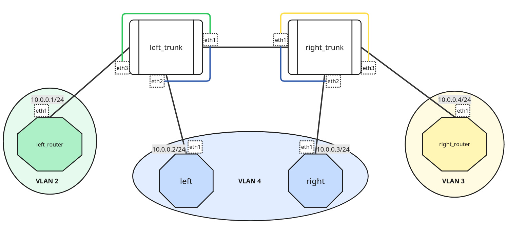

VLAN — Virtual Local Area Network — представляет из себя сеть, которая поддерживает работу с семейством протоколов [IEEE_802.1Q](https://en.wikipedia.org/wiki/IEEE_802.1Q), согласно которым фреймы снабжаются дополнительным идентификатором виртуальной сети (тегом `VID`), с помощью которого производится дополнительная фильтрация и сортировка фреймов на интерфейсном уровне.


Реализуем некоторую сетевую структуру с использованием VLAN:




Для работы создадим 6 [клонов](../00_FirstStart/%D0%9D%D0%B0%D1%81%D1%82%D1%80%D0%BE%D0%B9%D0%BA%D0%B0%20%D1%81%D0%B8%D1%81%D1%82%D0%B5%D0%BC%D1%8B%20%D0%B4%D0%BB%D1%8F%20%D0%B2%D1%8B%D0%BF%D0%BE%D0%BB%D0%BD%D0%B5%D0%BD%D0%B8%D1%8F%20%D0%BB%D0%B0%D0%B1%D0%BE%D1%80%D0%B0%D1%82%D0%BE%D1%80%D0%BD%D1%8B%D1%85.md) согласно топологии сети. Для создания соединений между машинами необходимо в VirtualBox настроить сетевые интерфейсы (описание настройки подключения находится в разделе [настройки сетевых подключений](../01_SystemGreetings/%D0%97%D0%BD%D0%B0%D0%BA%D0%BE%D0%BC%D1%81%D1%82%D0%B2%D0%BE%20%D1%81%20%D1%81%D0%B8%D1%81%D1%82%D0%B5%D0%BC%D0%BE%D0%B9.md#%D1%80%D0%B0%D0%B1%D0%BE%D1%82%D0%B0-%D1%81-%D1%81%D0%B5%D1%82%D0%B5%D0%B2%D1%8B%D0%BC%D0%B8-%D0%B8%D0%BD%D1%82%D0%B5%D1%80%D1%84%D0%B5%D0%B9%D1%81%D0%B0%D0%BC%D0%B8)):

 + left_trunk:
	 + Adapter2 — trunk
	 + Adapter3 — left_vlan
	 + Adapter4 — left_other_vlan
 + right_trunk:
	 + Adapter2 — trunk
	 + Adapter3 — right_vlan
	 + Adapter4 — right_other_vlan
 + left:
	 + Adapter2 — left_vlan
 + right:
	 + Adapter2 — right_vlan
 + left_router:
	 + Adapter2 — left_other_vlan
 + right_router:
	 + Adapter2 — right_other_vlan


Для связи абонентов им необходимо выдать IP-адреса. Для этого каждый из сетевых интерфейсов необходимо активировать (напоминаем, что в самих ВМ сетевые интерфейсы именуются eth0-eth3 для Adapter1-Adapter4 соответственно) , после чего каждому интерфейсу присвоить свой IP-адреса (поскольку все абоненты находятся в разных сетях, никакой связи сейчас, естественно, между ними не будет).

`@leftrouter`
```console
[root@leftrouter ~]# ip link set eth1 up  
[root@leftrouter ~]# ip addr add dev eth1 10.0.0.1/24  
[root@leftrouter ~]#
```

`@left`
```console
[root@left ~]# ip link set eth1 up  
[root@left ~]# ip addr add dev eth1 10.0.0.2/24  
[root@left ~]#
```

`@right`
```console
[root@right ~]# ip link set eth1 up  
[root@right ~]# ip addr add dev eth1 10.0.0.3/24  
[root@right ~]#
```

`@rightrouter`
```console
[root@rightrouter ~]# ip link set eth1 up  
[root@rightrouter ~]# ip addr add dev eth1 10.0.0.4/24  
[root@rightrouter ~]#
```

Далее для вытягивания фреймов с различными VLAN-тегами необходимо настроить на центральным маршрутизаторах соответствующие виртуальные сетевые интерфейсы:

`@lefttrunk`
```console
[root@lefttrunk ~]# ip link add link eth1 name vlan2 type vlan id 2  
[root@lefttrunk ~]# ip link add link eth1 name vlan4 type vlan id 4  
[root@lefttrunk ~]#
```

`@righttrunk`
```console
[root@righttrunk ~]# ip link add link eth1 name vlan3 type vlan id 3  
[root@righttrunk ~]# ip link add link eth1 name vlan4 type vlan id 4  
[root@righttrunk ~]#
```

В настройках интерфейсов можно отдельно обратиться с информационным запросом к `VLAN`-интерфейсам:

`@lefttrunk`
```console
[root@lefttrunk ~]# ip -d link show vlan4  
7: vlan4@eth1: <BROADCAST,MULTICAST,M-DOWN> mtu 1500 qdisc noop state DOWN mode DEFAULT group default qlen 1000  
   link/ether 08:00:27:ab:ae:51 brd ff:ff:ff:ff:ff:ff promiscuity 0 allmulti 0 minmtu 0 maxmtu 65535    
   vlan protocol 802.1Q id 4 <REORDER_HDR> numtxqueues 1 numrxqueues 1 gso_max_size 65536 gso_max_segs 65535 tso_max_size 65536 tso_max_segs 65535 gro_max_size 65536 gso_ipv4_max_size 65536 gro_ipv4_max_size 65536    
[root@lefttrunk ~]#
```

Следующим шагом необходимо организовать соединение разных сетевых интерфейсов. `lefttrunk` и `righttrunk` выступают здесь в роли _сетевых мостов_ — сетевых устройств, позволяющих обеспечивать целевую маршрутизацию данных _не выше интерфейсного уровня_. Для реализации поведения сетевого моста на машинах нужно задать специальные виртуальные интерфейсы типа bridge, через которые будут объединяться интерфейсы разных каналов.

`@lefttrunk`
```console
[root@lefttrunk ~]# ip link add dev br2 type bridge  
[root@lefttrunk ~]# ip link set vlan2 master br2  
[root@lefttrunk ~]# ip link set eth3 master br2  
[root@lefttrunk ~]# ip link add dev br4 type bridge  
[root@lefttrunk ~]# ip link set vlan4 master br4  
[root@lefttrunk ~]# ip link set eth2 master br4  
[root@lefttrunk ~]#
```

`@righttrunk`
```console
[root@righttrunk ~]# ip link add dev br3 type bridge  
[root@righttrunk ~]# ip link set vlan3 master br3  
[root@righttrunk ~]# ip link set eth3 master br3  
[root@righttrunk ~]# ip link add dev br4 type bridge  
[root@righttrunk ~]# ip link set vlan4 master br4  
[root@righttrunk ~]# ip link set eth2 master br4  
[root@righttrunk ~]#
```

Теперь необходимо поднять все интерфейсы. Можно перебрать их руками, а можно воспользоваться циклом языка склейки, встроенном в интерпретатор `shell`:

`@lefttrunk`
```console
[root@lefttrunk ~]# for I in `ls /sys/class/net`; do ip link set $I up; done  
[root@lefttrunk ~]#
```

`@righttrunk`
```console
[root@righttrunk ~]# for I in `ls /sys/class/net`; do ip link set $I up; done  
[root@righttrunk ~]#
```

Командой `ip a` проверим работу всех интерфейсов и зависимости между ними:

`@righttrunk`
```console
[root@righttrunk ~]# ip a  
1: lo: <LOOPBACK,UP,LOWER_UP> mtu 65536 qdisc noqueue state UNKNOWN group default qlen 1000  
   link/loopback 00:00:00:00:00:00 brd 00:00:00:00:00:00  
   inet 127.0.0.1/8 scope host lo  
      valid_lft forever preferred_lft forever  
2: eth0: <BROADCAST,MULTICAST,UP,LOWER_UP> mtu 1500 qdisc fq_codel state UNKNOWN group default qlen 1000  
   link/ether 08:00:27:b5:0b:fa brd ff:ff:ff:ff:ff:ff  
   altname enp0s3  
   altname enx080027b50bfa  
3: eth1: <BROADCAST,MULTICAST,UP,LOWER_UP> mtu 1500 qdisc fq_codel state UP group default qlen 1000  
   link/ether 08:00:27:53:3d:b0 brd ff:ff:ff:ff:ff:ff  
   altname enp0s8  
   altname enx080027533db0  
4: eth2: <BROADCAST,MULTICAST,UP,LOWER_UP> mtu 1500 qdisc fq_codel master br4 state UP group default qlen 1000  
   link/ether 08:00:27:9b:9e:f9 brd ff:ff:ff:ff:ff:ff  
   altname enp0s9  
   altname enx0800279b9ef9  
5: eth3: <BROADCAST,MULTICAST,UP,LOWER_UP> mtu 1500 qdisc fq_codel master br3 state UP group default qlen 1000  
   link/ether 08:00:27:4f:4a:a1 brd ff:ff:ff:ff:ff:ff  
   altname enp0s10  
   altname enx0800274f4aa1  
6: vlan3@eth1: <BROADCAST,MULTICAST,UP,LOWER_UP> mtu 1500 qdisc noqueue master br3 state UP group default qlen 1000  
   link/ether 08:00:27:53:3d:b0 brd ff:ff:ff:ff:ff:ff  
7: vlan4@eth1: <BROADCAST,MULTICAST,UP,LOWER_UP> mtu 1500 qdisc noqueue master br4 state UP group default qlen 1000  
   link/ether 08:00:27:53:3d:b0 brd ff:ff:ff:ff:ff:ff  
8: br3: <BROADCAST,MULTICAST,UP,LOWER_UP> mtu 1500 qdisc noqueue state UP group default qlen 1000  
   link/ether 08:00:27:4f:4a:a1 brd ff:ff:ff:ff:ff:ff  
9: br4: <BROADCAST,MULTICAST,UP,LOWER_UP> mtu 1500 qdisc noqueue state UP group default qlen 1000  
   link/ether 08:00:27:53:3d:b0 brd ff:ff:ff:ff:ff:ff  
[root@righttrunk ~]#
```

Теперь попробуем пропустить между абонентами трафик: между `left` и `right` будет проходить соединение, между любой другой парой абонентов — нет.

`@leftrouter`
```console
[root@leftrouter ~]# ping -c5 10.0.0.2  
PING 10.0.0.2 (10.0.0.2) 56(84) bytes of data.  
From 10.0.0.1 icmp_seq=1 Destination Host Unreachable  
From 10.0.0.1 icmp_seq=2 Destination Host Unreachable  
From 10.0.0.1 icmp_seq=3 Destination Host Unreachable  
From 10.0.0.1 icmp_seq=4 Destination Host Unreachable  
From 10.0.0.1 icmp_seq=5 Destination Host Unreachable  
  
--- 10.0.0.2 ping statistics ---  
5 packets transmitted, 0 received, +5 errors, 100% packet loss, time 4079ms  
pipe 3  
[root@leftrouter ~]# ping -c5 10.0.0.4  
PING 10.0.0.4 (10.0.0.4) 56(84) bytes of data.  
From 10.0.0.1 icmp_seq=1 Destination Host Unreachable  
From 10.0.0.1 icmp_seq=2 Destination Host Unreachable  
From 10.0.0.1 icmp_seq=3 Destination Host Unreachable  
From 10.0.0.1 icmp_seq=4 Destination Host Unreachable  
From 10.0.0.1 icmp_seq=5 Destination Host Unreachable  
  
--- 10.0.0.4 ping statistics ---  
5 packets transmitted, 0 received, +5 errors, 100% packet loss, time 4137ms  
pipe 3  
[root@leftrouter ~]#
```

`@left`
```console
[root@left ~]# ping -c5 10.0.0.3      
PING 10.0.0.3 (10.0.0.3) 56(84) bytes of data.  
64 bytes from 10.0.0.3: icmp_seq=1 ttl=64 time=2.48 ms  
64 bytes from 10.0.0.3: icmp_seq=2 ttl=64 time=1.01 ms  
64 bytes from 10.0.0.3: icmp_seq=3 ttl=64 time=0.994 ms  
64 bytes from 10.0.0.3: icmp_seq=4 ttl=64 time=0.922 ms  
64 bytes from 10.0.0.3: icmp_seq=5 ttl=64 time=1.02 ms  
  
--- 10.0.0.3 ping statistics ---  
5 packets transmitted, 5 received, 0% packet loss, time 4005ms  
rtt min/avg/max/mdev = 0.922/1.286/2.484/0.599 ms  
[root@left ~]#
```