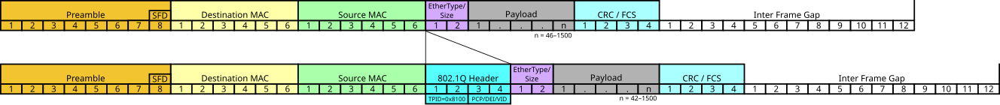
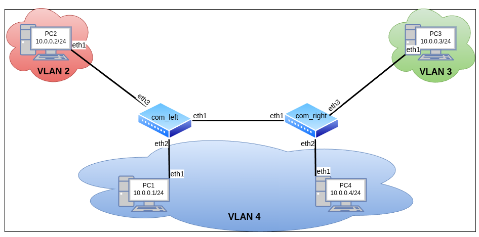

# Лабораторная работа №4 — Настройка VLAN

 + [Все лабораторные работы по сетевым протоколам в Linux](../Intro.md)
 + [Предыдущая лабораторная работа — Основные утилиты и команды просмотра настроек и мониторинга сети](../03_BasicUtils/Основные%20утилиты%20и%20команды%20просмотра%20настроек%20и%20мониторинга%20сети.md)
 + [Следующая лабораторная работа — Маршрутизация сетей c VLAN](../05_VLAN_Routing/Маршрутизация%20сетей%20c%20VLAN.md)

---

## Быстрый поиск по лабораторной:
 + [Технология VLAN](./Настройка%20VLAN.md#Технология-VLAN)
 + [Построение сети с VLAN](./Настройка%20VLAN.md#Построение-сети-с-VLAN)
	 + [Настройка абонентов сети](./Настройка%20VLAN.md#Настройка-абонентов-сети)
	 + [Настройка VLAN](./Настройка%20VLAN.md#Настройка-VLAN)
 + [Самостоятельная работа](./Настройка%20VLAN.md#Самостоятельная-работа)

**Цель лабораторной** — познакомить изучающего с основами технологии VLAN

**Задачи лабораторной:**
 + Изучить базовую логику работы протоколов VLAN;
 + Реализовать тестовую топологию с применением технологии VLAN.

---

## Технология VLAN

[VLAN](https://ru.wikipedia.org/wiki/VLAN) — Virtual Local Area Network — технология, которая позволяет разделить одну физическую сеть на несколько логических подсетей независимо от их физического расположения. В данной лабораторной для огранизации VLAN-ов используется протокол [IEEE_802.1Q](https://en.wikipedia.org/wiki/IEEE_802.1Q), в котором Ethernet-фреймы снабжаются дополнительным идентификатором виртуальной сети (тегом `VID`).



---

## Построение сети с VLAN

Для изучения технологии VLAN разберём топологию с из шеcти устройств:



:information_source: В предлагаемой топологии между любыми двумя соседними узлами `PC` и `com` циркулируют обычные Ethernet-фреймы, а между узлами `comleft` и `comright` — любые модифицированные 802.1Q (т. н. `trunk`). При этом фреймы, получаемые от `PC1` и `PC4` помечаются одним `VID`, а от `PC2` и `PC3` — двумя другими. Таким образом `PC1` и `PC4` образуют единый VLAN и доступны друг для друга, а `PC2` и `PC3` находятся в изолированных VLAN-ах с единственным абонентом в каждом.

Для работы создайте 6 [клонов](../01_FirstStart/Настройка%20системы%20для%20выполнения%20лабораторных.md) согласно топологии сети. Для создания соединений между машинами необходимо в VirtualBox настроить сетевые интерфейсы (описание настройки подключения находится в разделе [настройки сетевых подключений](../02_SystemGreetings/Знакомство%20с%20системой.md#работа-с-сетевыми-интерфейсами)):

 + com_left:
	 + Adapter2 — trunk
	 + Adapter3 — left4
	 + Adapter4 — left2
 + com_right:
	 + Adapter2 — trunk
	 + Adapter3 — right4
	 + Adapter4 — right3
 + pc1:
	 + Adapter2 — left4
 + pc2:
	 + Adapter2 — left2
 + pc3:
	 + Adapter2 — right3
 + pc4:
	 + Adapter2 — right4

---

### Настройка абонентов сети

:round_pushpin: 1. С помощью команд управления интерфейсами и настройки IP-адресов настройте интерфейсы и установите на них IP-адреса согласно топологии

`@pc1`
```console
[root@pc1 ~]# ip link set eth1 up
[root@pc1 ~]# ip addr add dev eth1 10.0.0.1/24
```

`@pc2`
```console
[root@pc2 ~]# ip link set eth1 up
[root@pc2 ~]# ip addr add dev eth1 10.0.0.2/24
```

`@pc3`
```console
[root@pc3 ~]# ip link set eth1 up
[root@pc3 ~]# ip addr add dev eth1 10.0.0.3/24
```

`@pc4`
```console
[root@pc4 ~]# ip link set eth1 up
[root@pc4 ~]# ip addr add dev eth1 10.0.0.4/24
```

---

### Настройка VLAN

:information_source: Настройка VLAN производится на маршрутизирующих устройствах сети — коммутаторах или маршрутизаторах. Коммутаторы `comleft` и `comright` выступают в топологии в роли _сетевых мостов_ — сетевых устройств, позволяющих обеспечивать целевую маршрутизацию данных _не выше интерфейсного уровня_.

Для реализации поведения сетевого моста на коммутаторах необходимо задать специальные виртуальные интерфейсы типа bridge, через которые с помощью _команды связывания интерфейсов_ :new: `ip link set <interface> master <master-interface>` будут объединяться интерфейсы разных каналов. Данные сетевые интерфейсы также будут обеспечивать фильтрацию фреймов по тегам VLAN, для этого при их создании необходимо указать параметр `vlan_filtering`:

:round_pushpin: 1. С помощью команд управления интерфейсами создайте на коммутаторах интерфейсы типа bridge с указанием параметра vlan_filtering и свяжите с ними все используемые физические интерфейсы

`@comleft`
```console
[root@comleft ~]# ip link add dev br0 type bridge vlan_filtering 1
[root@comleft ~]# ip link set eth1 master br0
[root@comleft ~]# ip link set eth2 master br0
[root@comleft ~]# ip link set eth3 master br0
```

`@comright`
```console
[root@comright ~]# ip link add dev br0 type bridge vlan_filtering 1
[root@comright ~]# ip link set eth1 master br0
[root@comright ~]# ip link set eth2 master br0
[root@comright ~]# ip link set eth3 master br0
```

:information_source: Далее необходимо настроить фильтрацию VLAN. Для этого с помощью _команды настройки VLAN_ :new: `bridge vlan add vid <vlan-id> dev <interface>`  необходимо указать, какой интерфейс будет обрабатывать фреймы с указаным тегом:
 + Для интерфейсов, ведущих к компьютерам непосредственно отправка фреймов должна быть без тега (при обработке на интерфейсе пропускаться в канал будут лишь помеченные фреймы, но перед самой передачей тег будет сниматься);
 + Интерфейс, объединяющий коммутаторы должен пересылать только помеченные фреймы.

:round_pushpin: 2. С помощью команд настройки VLAN установите на коммутаторах VLAN на интерфейсы согласно топологии

`@comleft`
```console
[root@comleft ~]# bridge vlan add vid 2 dev eth3 pvid untagged
[root@comleft ~]# bridge vlan add vid 4 dev eth2 pvid untagged
[root@comleft ~]# bridge vlan add vid 2 dev eth1
[root@comleft ~]# bridge vlan add vid 3 dev eth1
[root@comleft ~]# bridge vlan add vid 4 dev eth1
```

`@comright`
```console
[root@comright ~]# bridge vlan add vid 3 dev eth3 pvid untagged
[root@comright ~]# bridge vlan add vid 4 dev eth2 pvid untagged
[root@comright ~]# bridge vlan add vid 2 dev eth1
[root@comright ~]# bridge vlan add vid 3 dev eth1
[root@comright ~]# bridge vlan add vid 4 dev eth1
```

:round_pushpin: 3. C помощью команд управления интерфейсами включите на коммутаторах все используемые интерфейсы

:information_source: Для упрощения можно воспользоваться коротким shell-сценарием, автоматически включающим все интерфейсы (ВАЖНО: в том числе неиспользуемые)

`@comleft`
```console
[root@comleft ~]# for I in `ls /sys/class/net`; do ip link set $I up; done
```

`@comright`
```console
[root@comright ~]# for I in `ls /sys/class/net`; do ip link set $I up; done
```

:information_source: Все настройки, связанные с VLAN, можно посмотреть специальной командой _просмотра настроек VLAN_ :new: `bridge vlan show`

:round_pushpin: 4. С помощью команд настройки VLAN выведите все данные о настройке VLAN на коммутаторе comleft:

`@comleft`
```console
[root@comleft ~]# bridge vlan show
port              vlan-id
eth1              1 PVID Egress Untagged
                  2
                  3
                  4
eth2              1 Egress Untagged
                  4 PVID Egress Untagged
eth3              1 Egress Untagged
                  2 PVID Egress Untagged
br0               1 PVID Egress Untagged
[root@comleft ~]#
```

:information_source: Теперь попробуйте пропустить между абонентами трафик: между `pc1` и `pc4` будет проходить соединение, между любой другой парой абонентов — нет.

:round_pushpin: 5. С помощью команды `ping -c5 <dstIP>` отправьте пять ICMP-пакетов с PC3 на PC2 и пять ICMP-пакетов с PC3 на PC1

`@pc3`
```console
[root@pc3 ~]# ping -c5 10.0.0.2
PING 10.0.0.2 (10.0.0.2) 56(84) bytes of data.
From 10.0.0.3 icmp_seq=1 Destination Host Unreachable
ping: sendmsg: No route to host
From 10.0.0.3 icmp_seq=2 Destination Host Unreachable
From 10.0.0.3 icmp_seq=3 Destination Host Unreachable
From 10.0.0.3 icmp_seq=5 Destination Host Unreachable

--- 10.0.0.2 ping statistics ---
5 packets transmitted, 0 received, +4 errors, 100% packet loss, time 4105ms
pipe 3
[root@pc3 ~]# ping -c5 10.0.0.1
PING 10.0.0.1 (10.0.0.1) 56(84) bytes of data.
From 10.0.0.3 icmp_seq=1 Destination Host Unreachable
From 10.0.0.3 icmp_seq=2 Destination Host Unreachable
From 10.0.0.3 icmp_seq=3 Destination Host Unreachable
From 10.0.0.3 icmp_seq=4 Destination Host Unreachable
From 10.0.0.3 icmp_seq=5 Destination Host Unreachable

--- 10.0.0.1 ping statistics ---
5 packets transmitted, 0 received, +5 errors, 100% packet loss, time 4114ms
pipe 3
[root@pc3 ~]#
```

:round_pushpin: 6. С помощью команды `ping -c5 <dstIP>` отправьте пять ICMP-пакетов с PC4 на PC1

`@pc4`
```console
[root@pc4 ~]# ping -c5 10.0.0.1
PING 10.0.0.1 (10.0.0.1) 56(84) bytes of data.
64 bytes from 10.0.0.1: icmp_seq=1 ttl=64 time=0.948 ms
64 bytes from 10.0.0.1: icmp_seq=2 ttl=64 time=0.792 ms
64 bytes from 10.0.0.1: icmp_seq=3 ttl=64 time=0.663 ms
64 bytes from 10.0.0.1: icmp_seq=4 ttl=64 time=1.08 ms
64 bytes from 10.0.0.1: icmp_seq=5 ttl=64 time=1.28 ms

--- 10.0.0.1 ping statistics ---
5 packets transmitted, 5 received, 0% packet loss, time 4064ms
rtt min/avg/max/mdev = 0.663/0.953/1.282/0.217 ms
[root@pc4 ~]#
```

Убедимся, что данные от абонентов из других VLAN доходят до коммутаторов, но далее не проходят

Запустим на `comleft` команду `tcpdump -xx -i eth1`, которая будет отслеживать трафик на интерфейсе `eth1`:

:round_pushpin: 7. С помощью команды мониторинга сети запустите на comleft сканирование интерфейса eth1 c выводом кода пакета


`@comleft`
```console
[root@comleft ~]# tcpdump -xx -i eth1
tcpdump: verbose output suppressed, use -v[v]... for full protocol decode
listening on eth1, link-type EN10MB (Ethernet), snapshot length 262144 bytes

```

:round_pushpin: 8. С помощью команды `ping -c3 <dstIP>` отправьте три ICMP-пакета с PC3 на PC1

`@pc3`
```console
[root@pc3 ~]# ping -c3 10.0.0.1
PING 10.0.0.1 (10.0.0.1) 56(84) bytes of data.
From 10.0.0.3 icmp_seq=1 Destination Host Unreachable
From 10.0.0.3 icmp_seq=2 Destination Host Unreachable
From 10.0.0.3 icmp_seq=3 Destination Host Unreachable

--- 10.0.0.1 ping statistics ---
3 packets transmitted, 0 received, +3 errors, 100% packet loss, time 2077ms
pipe 3
[root@pc3 ~]#
```

`@comleft`
```console
[root@comleft ~]# tcpdump -xx -i eth1
tcpdump: verbose output suppressed, use -v[v]... for full protocol decode
listening on eth1, link-type EN10MB (Ethernet), snapshot length 262144 bytes
22:18:47.881650 ARP, Request who-has 10.0.0.1 tell 10.0.0.3, length 46
       0x0000:  ffff ffff ffff 0800 27cc 8f19 8100 0003
       0x0010:  0806 0001 0800 0604 0001 0800 27cc 8f19
       0x0020:  0a00 0003 0000 0000 0000 0a00 0001 0000
       0x0030:  0000 0000 0000 0000 0000 0000 0000 0000
22:18:48.933866 ARP, Request who-has 10.0.0.1 tell 10.0.0.3, length 46
       0x0000:  ffff ffff ffff 0800 27cc 8f19 8100 0003
       0x0010:  0806 0001 0800 0604 0001 0800 27cc 8f19
       0x0020:  0a00 0003 0000 0000 0000 0a00 0001 0000
       0x0030:  0000 0000 0000 0000 0000 0000 0000 0000
22:18:49.957684 ARP, Request who-has 10.0.0.1 tell 10.0.0.3, length 46
       0x0000:  ffff ffff ffff 0800 27cc 8f19 8100 0003
       0x0010:  0806 0001 0800 0604 0001 0800 27cc 8f19
       0x0020:  0a00 0003 0000 0000 0000 0a00 0001 0000
       0x0030:  0000 0000 0000 0000 0000 0000 0000 0000
```

---

## Самостоятельная работа

:round_pushpin: Запустить [отчёты](../02_SystemGreetings/Знакомство%20с%20системой.md#Сдача-самостоятельных-работ) на каждой машине и выполнить соответствующие команды:

+ `report 4 comright`
	 + ip a show
	 + bridge vlan show
	 + tcpdump -n -i eth1
	 + <Выполните все остальные отчёты, после чего завершите tcpdump через `Ctrl+C`>
+ `report 4 comleft`
	 + ip a show
	 + bridge vlan show
	 + tcpdump -n -i eth1
	 + <Выполните все остальные отчёты, после чего завершите tcpdump через `Ctrl+C`>
 + `report 4 pc1`
	 + ip a show eth1
	 + ping -fc3 10.0.0.3
	 + ping -fc3 10.0.0.4
 + `report 4 pc2`
	 + ip a show eth1
	 + ping -fc3 10.0.0.3
	 + ping -fc3 10.0.0.4
 + `report 4 pc3`
	 + ip a show eth1
	 + ping -fc3 10.0.0.1
	 + ping -fc3 10.0.0.2
 + `report 4 pc4`
	 + ip a show eth1
	 + ping -fc3 10.0.0.1
	 + ping -fc3 10.0.0.2

:round_pushpin: Полученные отчёты `report.04.comright`, `report.04.comleft`, `report.04.pc1`, `report.04.pc2`, `report.04.pc3`, `report.04.pc4` через последовательный порт перенести из виртуальной машины и прислать их преподавателю.

