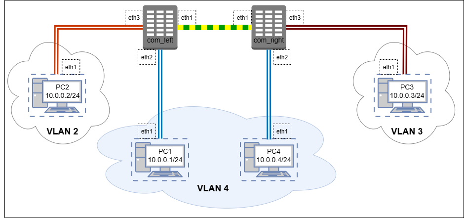

VLAN — Virtual Local Area Network — технология, которая позволяет разделить одну физическую сеть на несколько логических подсетей, независимо от их физического расположения. В данной лабораторной для огранизации VLAN-ов используется протокол [IEEE_802.1Q](https://en.wikipedia.org/wiki/IEEE_802.1Q), в котором Ethernet-фреймы снабжаются дополнительным идентификатором виртуальной сети (тегом `VID`).


В предлагаемой топологии между любыми двумя узлами `PC` и `com` циркулируют обычные Ethernet-фреймы, а между узлами `comleft` и `comright` — любые модифицированные 802.1Q (т. н. `trunk`). При этом фреймы, получаемые от `PC1` и `PC4` помечаются одним `VID`, а от `PC2` и `PC3` — двумя другими. Таким образом `PC1` и `PC4` образуют единый VLAN и доступны друг для друга, а `PC2` и `PC3` находятся в изолированных VLAN-ах с единственным абонентом в каждом.




Для работы создадим 6 [клонов](../01_FirstStart/Настройка%20системы%20для%20выполнения%20лабораторных.md) согласно топологии сети. Для создания соединений между машинами необходимо в VirtualBox настроить сетевые интерфейсы (описание настройки подключения находится в разделе [настройки сетевых подключений](../02_SystemGreetings/Знакомство%20с%20системой.md#работа-с-сетевыми-интерфейсами)):

 + com_left:
	 + Adapter2 — trunk
	 + Adapter3 — left4
	 + Adapter4 — left2
 + com_right:
	 + Adapter2 — trunk
	 + Adapter3 — right4
	 + Adapter4 — right3
 + pc1:
	 + Adapter2 — left4
 + pc2:
	 + Adapter2 — left2
 + pc3:
	 + Adapter2 — right3
 + pc4:
	 + Adapter2 — right4


Для связи абонентов им необходимо выдать IP-адреса. Для этого каждый из сетевых интерфейсов необходимо активировать (напоминаем, что в самих ВМ сетевые интерфейсы именуются eth0-eth3 для Adapter1-Adapter4 соответственно) , после чего каждому интерфейсу присвоить свой IP-адрес (поскольку все абоненты находятся в разных сетях, никакой связи сейчас, естественно, между ними не будет).

`@pc1`
```console
[root@pc1 ~]# ip link set eth1 up
[root@pc1 ~]# ip addr add dev eth1 10.0.0.1/24
```

`@pc2`
```console
[root@pc2 ~]# ip link set eth1 up
[root@pc2 ~]# ip addr add dev eth1 10.0.0.2/24
```

`@pc3`
```console
[root@pc3 ~]# ip link set eth1 up
[root@pc3 ~]# ip addr add dev eth1 10.0.0.3/24
```

`@pc4`
```console
[root@pc4 ~]# ip link set eth1 up
[root@pc4 ~]# ip addr add dev eth1 10.0.0.4/24
```

Следующим шагом необходимо организовать соединение разных сетевых интерфейсов. `comleft` и `comright` выступают здесь в роли _сетевых мостов_ — сетевых устройств, позволяющих обеспечивать целевую маршрутизацию данных _не выше интерфейсного уровня_. Для реализации поведения сетевого моста на машинах нужно задать специальные виртуальные интерфейсы типа bridge, через которые будут объединяться интерфейсы разных каналов. Данные сетевые интерфейсы также будут обеспечивать фильтрацию фреймов по тегам VLAN, для этого при их создании необходимо указать параметр `vlan_filtering`:

`@comleft`
```console
[root@comleft ~]# ip link add dev br0 type bridge vlan_filtering 1
[root@comleft ~]# ip link set eth1 master br0
[root@comleft ~]# ip link set eth2 master br0
[root@comleft ~]# ip link set eth3 master br0
```

`@comright`
```console
[root@comright ~]# ip link add dev br0 type bridge vlan_filtering 1
[root@comright ~]# ip link set eth1 master br0
[root@comright ~]# ip link set eth2 master br0
[root@comright ~]# ip link set eth3 master br0
```

Настроим фильтрацию VLAN. Для этого с помощью команды `bridge vlan` укажем, какой интерфейс фреймы с каким тегом будет обрабатывать. При этом для интерфейсов, ведущих к компьютерам непосредственно сделаем отправку фреймов без тега (при обработке на интерфейсе пропускаться в канал будут лишь помеченные фреймы, но перед самой передачей тег будет сниматься). Интерфейс, объединяющий коммутаторы, напротив, должен пересылать только помеченные фреймы.

`@comleft`
```console
[root@comleft ~]# bridge vlan add vid 2 dev eth3 pvid untagged
[root@comleft ~]# bridge vlan add vid 4 dev eth2 pvid untagged
[root@comleft ~]# bridge vlan add vid 2 dev eth1
[root@comleft ~]# bridge vlan add vid 3 dev eth1
[root@comleft ~]# bridge vlan add vid 4 dev eth1
```

`@comright`
```console
[root@comright ~]# bridge vlan add vid 3 dev eth3 pvid untagged
[root@comright ~]# bridge vlan add vid 4 dev eth2 pvid untagged
[root@comright ~]# bridge vlan add vid 2 dev eth1
[root@comright ~]# bridge vlan add vid 3 dev eth1
[root@comright ~]# bridge vlan add vid 4 dev eth1
```

Теперь необходимо поднять все интерфейсы. Можно перебрать их руками, а можно воспользоваться циклом языка склейки, встроенным в интерпретатор `shell`:

`@comleft`
```console
[root@comleft ~]# for I in `ls /sys/class/net`; do ip link set $I up; done
```

`@comright`
```console
[root@comright ~]# for I in `ls /sys/class/net`; do ip link set $I up; done
```

Все настройки, связанные с VLAN, можно посмотреть специальной командой `bridge vlan show`

`@comleft`
```console
[root@comleft ~]# bridge vlan show
port              vlan-id
eth1              1 PVID Egress Untagged
                  2
                  3
                  4
eth2              1 Egress Untagged
                  4 PVID Egress Untagged
eth3              1 Egress Untagged
                  2 PVID Egress Untagged
br0               1 PVID Egress Untagged
[root@comleft ~]#
```

Теперь попробуем пропустить между абонентами трафик: между `pc1` и `pc4` будет проходить соединение, между любой другой парой абонентов — нет.

`@pc3`
```console
[root@pc3 ~]# ping -c5 10.0.0.2
PING 10.0.0.2 (10.0.0.2) 56(84) bytes of data.
From 10.0.0.3 icmp_seq=1 Destination Host Unreachable
ping: sendmsg: No route to host
From 10.0.0.3 icmp_seq=2 Destination Host Unreachable
From 10.0.0.3 icmp_seq=3 Destination Host Unreachable
From 10.0.0.3 icmp_seq=5 Destination Host Unreachable

--- 10.0.0.2 ping statistics ---
5 packets transmitted, 0 received, +4 errors, 100% packet loss, time 4105ms
pipe 3
[root@pc3 ~]# ping -c5 10.0.0.1
PING 10.0.0.1 (10.0.0.1) 56(84) bytes of data.
From 10.0.0.3 icmp_seq=1 Destination Host Unreachable
From 10.0.0.3 icmp_seq=2 Destination Host Unreachable
From 10.0.0.3 icmp_seq=3 Destination Host Unreachable
From 10.0.0.3 icmp_seq=4 Destination Host Unreachable
From 10.0.0.3 icmp_seq=5 Destination Host Unreachable

--- 10.0.0.1 ping statistics ---
5 packets transmitted, 0 received, +5 errors, 100% packet loss, time 4114ms
pipe 3
[root@pc3 ~]#
```

`@pc4`
```console
[root@pc4 ~]# ping -c5 10.0.0.1
PING 10.0.0.1 (10.0.0.1) 56(84) bytes of data.
64 bytes from 10.0.0.1: icmp_seq=1 ttl=64 time=0.948 ms
64 bytes from 10.0.0.1: icmp_seq=2 ttl=64 time=0.792 ms
64 bytes from 10.0.0.1: icmp_seq=3 ttl=64 time=0.663 ms
64 bytes from 10.0.0.1: icmp_seq=4 ttl=64 time=1.08 ms
64 bytes from 10.0.0.1: icmp_seq=5 ttl=64 time=1.28 ms

--- 10.0.0.1 ping statistics ---
5 packets transmitted, 5 received, 0% packet loss, time 4064ms
rtt min/avg/max/mdev = 0.663/0.953/1.282/0.217 ms
[root@pc4 ~]#
```

Запустим на `comleft` команду `tcpdump -xx -i eth1`, которая будет отслеживать трафик на интерфейсе `eth1`:

`@comleft`
```console
[root@comleft ~]# tcpdump -xx -i eth1
tcpdump: verbose output suppressed, use -v[v]... for full protocol decode
listening on eth1, link-type EN10MB (Ethernet), snapshot length 262144 bytes

```

Создадим трафик с `PC3` на `PC1`:

`@pc3`
```console
[root@pc3 ~]# ping -c3 10.0.0.1
PING 10.0.0.1 (10.0.0.1) 56(84) bytes of data.
From 10.0.0.3 icmp_seq=1 Destination Host Unreachable
From 10.0.0.3 icmp_seq=2 Destination Host Unreachable
From 10.0.0.3 icmp_seq=3 Destination Host Unreachable

--- 10.0.0.1 ping statistics ---
3 packets transmitted, 0 received, +3 errors, 100% packet loss, time 2077ms
pipe 3
[root@pc3 ~]#
```

По полученному трафику убеждаемся, что пакеты доходят по trunk-каналу до `comleft`, но дальше

`@comleft`
```console
[root@comleft ~]# tcpdump -xx -i eth1
tcpdump: verbose output suppressed, use -v[v]... for full protocol decode
listening on eth1, link-type EN10MB (Ethernet), snapshot length 262144 bytes
22:18:47.881650 ARP, Request who-has 10.0.0.1 tell 10.0.0.3, length 46
       0x0000:  ffff ffff ffff 0800 27cc 8f19 8100 0003
       0x0010:  0806 0001 0800 0604 0001 0800 27cc 8f19
       0x0020:  0a00 0003 0000 0000 0000 0a00 0001 0000
       0x0030:  0000 0000 0000 0000 0000 0000 0000 0000
22:18:48.933866 ARP, Request who-has 10.0.0.1 tell 10.0.0.3, length 46
       0x0000:  ffff ffff ffff 0800 27cc 8f19 8100 0003
       0x0010:  0806 0001 0800 0604 0001 0800 27cc 8f19
       0x0020:  0a00 0003 0000 0000 0000 0a00 0001 0000
       0x0030:  0000 0000 0000 0000 0000 0000 0000 0000
22:18:49.957684 ARP, Request who-has 10.0.0.1 tell 10.0.0.3, length 46
       0x0000:  ffff ffff ffff 0800 27cc 8f19 8100 0003
       0x0010:  0806 0001 0800 0604 0001 0800 27cc 8f19
       0x0020:  0a00 0003 0000 0000 0000 0a00 0001 0000
       0x0030:  0000 0000 0000 0000 0000 0000 0000 0000
```