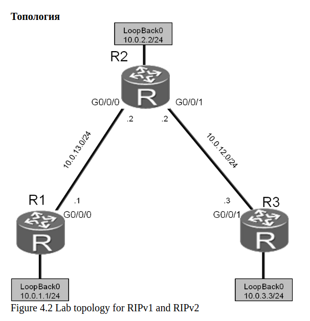

## TODO: RIP R.I.P. — настройка конфигов bird не настраивает ничего. Нужна помощь с правильным описанием конфигов

Предварительная картинка:


`@R1`
```console
[root@R1 ~]# ip link set eth1 up
[root@R1 ~]# ip addr add dev eth1 10.0.12.1/24
[root@R1 ~]# ip link set lo up
[root@R1 ~]# ip addr add dev lo 10.0.1.1/24
[root@R1 ~]#
```

`@R2`
```console
[root@R2 ~]# ip link set eth1 up
[root@R2 ~]# ip addr add dev eth1 10.0.12.2/24
[root@R2 ~]# ip link set eth2 up
[root@R2 ~]# ip addr add dev eth2 10.0.23.2/24
[root@R2 ~]# ip link set lo up
[root@R2 ~]# ip addr add dev lo 10.0.2.2/24
[root@R2 ~]#
[root@R2 ~]# sysctl net.ipv4.conf.all.forwarding=1
[root@R2 ~]#
```

`@R3`
```console
[root@R3 ~]# ip link set eth1 up
[root@R3 ~]# ip addr add dev eth1 10.0.23.3/24
[root@R3 ~]# ip link set lo up
[root@R3 ~]# ip addr add dev lo 10.0.3.3/24
[root@R3 ~]#
```

`@R1`
```
[root@R1 ~]# ip route
10.0.12.0/24 dev eth1 proto kernel scope link src 10.0.12.1
[root@R1 ~]#
```

`@R2`
```
[root@R1 ~]# ip route
10.0.12.0/24 dev eth1 proto kernel scope link src 10.0.12.1
[root@R1 ~]#
```

`@R3`
```
[root@R1 ~]# ip route
10.0.12.0/24 dev eth1 proto kernel scope link src 10.0.12.1
[root@R1 ~]#
```


---
---
#### Аналогично такому были написаны первые версии конфигов; не заработало

```
router id 10.0.12.3;

protocol kernel {
    scan time 20;
    export all;
}

protocol device {
    scan time 10;
}

protocol rip {
    import all;
    export all;

    interface "eth1" {
        update time 5;
        timeout time 15;
        authentication none;
    };
}
```

---
---

#### Вторые версии конфигов, они аналогичны OSPF, но не работают ☹


`@R1:/etc/bird/bird.conf`
```bird
router id 10.0.1.1;

protocol kernel {
	scan time 20;
	ipv4 { export all; };
}

protocol device {
	scan time 10;
}

protocol rip {
	ipv4 { export all; };
	area 0.0.0.0 {
		interface "eth1" {
		};
	};
}
```

`@R2:/etc/bird/bird.conf`
```bird
router id 10.0.2.2;

protocol kernel {
	scan time 20;
	ipv4 { export all; };
}

protocol device {
	scan time 10;
}

protocol rip {
	ipv4 { export all; };
	area 0.0.0.0 {
		interface "eth1" {
		};
		interface "eth2" {
		};
	};
}
```

`@R3:/etc/bird/bird.conf`
```bird
router id 10.0.3.3;

protocol kernel {
	scan time 20;
	ipv4 { export all; };
}

protocol device {
	scan time 10;
}

protocol rip {
	ipv4 { export all; };
	area 0.0.0.0 {
		interface "eth1" {
		};
	};
}
```