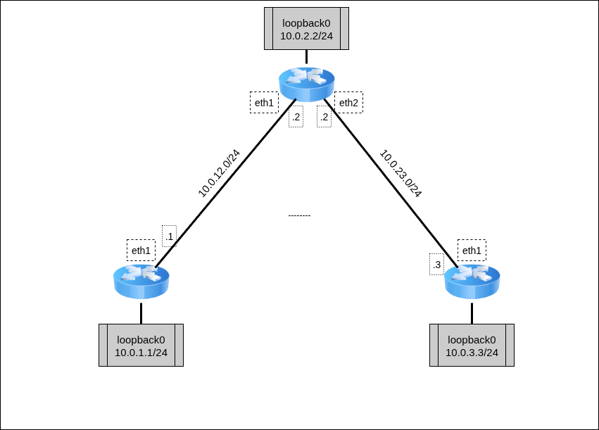
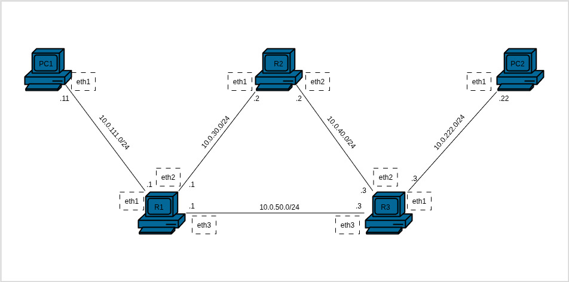

Для изучения маршрутизации с помощью RIP разберём топологию между тремя маршрутизаторами.



Для работы создадим 3 [клона](../00_FirstStart/%D0%9D%D0%B0%D1%81%D1%82%D1%80%D0%BE%D0%B9%D0%BA%D0%B0%20%D1%81%D0%B8%D1%81%D1%82%D0%B5%D0%BC%D1%8B%20%D0%B4%D0%BB%D1%8F%20%D0%B2%D1%8B%D0%BF%D0%BE%D0%BB%D0%BD%D0%B5%D0%BD%D0%B8%D1%8F%20%D0%BB%D0%B0%D0%B1%D0%BE%D1%80%D0%B0%D1%82%D0%BE%D1%80%D0%BD%D1%8B%D1%85.md) согласно топологии сети. Для создания соединений между машинами необходимо в VirtualBox настроить сетевые интерфейсы (описание настройки подключения находится в разделе [настройки сетевых подключений](../01_SystemGreetings/%D0%97%D0%BD%D0%B0%D0%BA%D0%BE%D0%BC%D1%81%D1%82%D0%B2%D0%BE%20%D1%81%20%D1%81%D0%B8%D1%81%D1%82%D0%B5%D0%BC%D0%BE%D0%B9.md#%D1%80%D0%B0%D0%B1%D0%BE%D1%82%D0%B0-%D1%81-%D1%81%D0%B5%D1%82%D0%B5%D0%B2%D1%8B%D0%BC%D0%B8-%D0%B8%D0%BD%D1%82%D0%B5%D1%80%D1%84%D0%B5%D0%B9%D1%81%D0%B0%D0%BC%D0%B8)):

 + `R1`:
	 + Adapter2 — intnet
 + `R2`:
	 + Adapter2 — intnet
	 + Adapter3 — deepnet
 + `R3`:
	 + Adapter2 — deepnet

Для начала настроим IP-адреса на интерфейсах маршрутизаторов согласно топологии. На каждом маршрутизаторе добавим виртуальный loopback-интерфейс. Дополнительно на маршрутизаторе R2 настроим IP-forwarding пакетов.

`@R1`
```console
[root@R1 ~]# ip link set eth1 up
[root@R1 ~]# ip addr add dev eth1 10.0.12.1/24
[root@R1 ~]# ip link add dev lo0 type veth
[root@R1 ~]# ip link set lo0 up
[root@R1 ~]# ip addr add dev lo0 10.0.1.1/24
[root@R1 ~]#
```

`@R2`
```console
[root@R2 ~]# ip link set eth1 up
[root@R2 ~]# ip addr add dev eth1 10.0.12.2/24
[root@R2 ~]# ip link set eth2 up
[root@R2 ~]# ip addr add dev eth2 10.0.23.2/24
[root@R2 ~]# ip link add dev lo0 type veth
[root@R2 ~]# ip link set lo0 up
[root@R2 ~]# ip addr add dev lo0 10.0.2.2/24
[root@R2 ~]#
[root@R2 ~]# sysctl net.ipv4.conf.all.forwarding=1
[root@R2 ~]#
```

`@R3`
```console
[root@R3 ~]# ip link set eth1 up
[root@R3 ~]# ip addr add dev eth1 10.0.23.3/24
[root@R3 ~]# ip link add dev lo0 type veth
[root@R3 ~]# ip link set lo up
[root@R3 ~]# ip addr add dev lo 10.0.3.3/24
[root@R3 ~]#
```

Вместе с описанием IP-адресов в таблице маршрутизации автоматически появятся записи о маршрутах в сетях описанных адресов. Посмотреть эти записи можно с помощью команды `ip route`:

`@R1`
```
[root@R1 ~]# ip route
10.0.1.0/24 dev lo0 proto kernel scope link src 10.0.1.1 linkdown
10.0.12.0/24 dev eth1 proto kernel scope link src 10.0.12.1
[root@R1 ~]#
```

`@R2`
```
[root@R2 ~]# ip route
10.0.2.0/24 dev lo0 proto kernel scope link src 10.0.2.2 linkdown
10.0.12.0/24 dev eth1 proto kernel scope link src 10.0.12.2
10.0.23.0/24 dev eth2 proto kernel scope link src 10.0.23.2
[root@R2 ~]#
```

`@R3`
```
[root@R3 ~]# ip route
10.0.3.0/24 dev lo0 proto kernel scope link src 10.0.3.3 linkdown
10.0.23.0/24 dev eth1 proto kernel scope link src 10.0.23.3
[root@R3 ~]#
```

Для работы RIP необходимо использовать специальные программы маршрутизации — Routing Daemons. Для выполнения лабораторной используется демон BIRD. Для настройки демона используется конфигурационный файл `/etc/bird/bird.conf` специального вида. Рассмотрим конфигурационный файл настройки для R1:

`@R1:/etc/bird/bird.conf`
```bird
router id 10.0.1.1;

protocol kernel {
        learn all;
        persist;
        scan time 20;
        ipv4 { export all; };
}

protocol device {
        scan time 10;
}

protocol rip {
        interface "*";
        ipv4 {
                export all;
                import all;
        };
}
```

Конфигурационный файл включает в себя:
 + описание уникального идентификатора маршрутизатора в сети, «от имени» которого будут рассылаться данные о маршрутах;
 + структуру `protocol kernel` — она описывает действия, связанные с таблицами маршрутизации ядра системы;
 + структуру `protocol device` — она описывает действия самого сетевого устройства;
 + структуру `protocol rip` — она описывает действия, связанные с маршрутизацией с помощью протокола:
	 + Экспорт и импорт всех доступных маршрутов по IPv4;
	 + Экспорт данных всем устройствам за всеми интерфейсами.

Аналогично опишем конфигурационные файлы для R2 и R3:

`@R2:/etc/bird/bird.conf`
```bird
router id 10.0.2.2;

protocol kernel {
        learn all;
        persist;
        scan time 20;
        ipv4 { export all; };
}

protocol device {
        scan time 10;
}

protocol rip {
        interface "*";
        ipv4 {
                export all;
                import all;
        };
}
```

`@R3:/etc/bird/bird.conf`
```bird
router id 10.0.3.3;

protocol kernel {
        learn all;
        persist;
        scan time 20;
        ipv4 { export all; };
}

protocol device {
        scan time 10;
}

protocol rip {
        interface "*";
        ipv4 {
                export all;
                import all;
        };
}
```

Для работы демона необходимо запустить его, вызвав команду `bird`. После с помощью `birdc` можно посмотреть параметры работы демона. С помощью `birdc show route` посмотрите сформированные с помощью RIP данные о маршрутах по указанным интерфейсам.

В таблице маршрутизации при этом должны появиться новые записи о доступных маршрутах с указанием `proto bird` , означающим, что маршрут получен с помощью BIRD-демона (поскольку маршруты не приходят мгновенно, может потребоваться время на получение всех данных). Выведите таблицу маршрутизации с помощью `ip route`:

`@R1`
```console
[root@R1 ~]# bird
[root@R1 ~]# birdc show route
BIRD +detached. ready.
Table master4:
10.0.12.0/24         unicast [kernel1 21:01:42.764] * (10)
       dev eth1
10.0.23.0/24         unicast [rip1 21:01:48.903] * (120/2)
       via 10.0.12.2 on eth1
10.0.1.0/24          unicast [kernel1 21:08:24.007] * (10)
       dev lo0
10.0.3.0/24          unicast [rip1 21:08:30.280] * (120/3)
       via 10.0.12.2 on eth1
10.0.2.0/24          unicast [rip1 21:08:38.363] * (120/2)
       via 10.0.12.2 on eth1
[root@R1 ~]# ip route
10.0.1.0/24 dev lo0 proto kernel scope link src 10.0.1.1 linkdown
10.0.2.0/24 via 10.0.12.2 dev eth1 proto bird metric 32
10.0.3.0/24 via 10.0.12.2 dev eth1 proto bird metric 32
10.0.12.0/24 dev eth1 proto kernel scope link src 10.0.12.1
10.0.23.0/24 via 10.0.12.2 dev eth1 proto bird metric 32
[root@R1 ~]#
```

`@R2`
```console
[root@R2 ~]# ip route
10.0.1.0/24 via 10.0.12.1 dev eth1 proto bird metric 32
10.0.2.0/24 dev lo0 proto kernel scope link src 10.0.2.2 linkdown
10.0.3.0/24 via 10.0.23.3 dev eth2 proto bird metric 32
10.0.12.0/24 dev eth1 proto kernel scope link src 10.0.12.2
10.0.12.0/24 via 10.0.12.1 dev eth1 proto bird metric 32
10.0.23.0/24 dev eth2 proto kernel scope link src 10.0.23.2
[root@R2 ~]#
```

`@R3`
```console
[root@R3 ~]# ip route
10.0.1.0/24 via 10.0.23.2 dev eth1 proto bird metric 32
10.0.2.0/24 via 10.0.23.2 dev eth1 proto bird metric 32
10.0.3.0/24 dev lo0 proto kernel scope link src 10.0.3.3 linkdown
10.0.12.0/24 via 10.0.23.2 dev eth1 proto bird metric 32
10.0.23.0/24 dev eth1 proto kernel scope link src 10.0.23.3
10.0.23.0/24 via 10.0.23.2 dev eth1 proto bird metric 32
[root@R3 ~]#
```

Проверьте с помощью `ping` доступность всех маршрутизаторов:

`@R1`
```console
[root@R1 ~]# ping -c3 10.0.23.3
PING 10.0.23.3 (10.0.23.3) 56(84) bytes of data.
64 bytes from 10.0.23.3: icmp_seq=1 ttl=63 time=1.00 ms
64 bytes from 10.0.23.3: icmp_seq=2 ttl=63 time=0.872 ms
64 bytes from 10.0.23.3: icmp_seq=3 ttl=63 time=0.854 ms

--- 10.0.23.3 ping statistics ---
3 packets transmitted, 3 received, 0% packet loss, time 2001ms
rtt min/avg/max/mdev = 0.854/0.908/1.000/0.065 ms
[root@R1 ~]# ping -c3 10.0.3.3
PING 10.0.3.3 (10.0.3.3) 56(84) bytes of data.
64 bytes from 10.0.3.3: icmp_seq=1 ttl=63 time=0.903 ms
64 bytes from 10.0.3.3: icmp_seq=2 ttl=63 time=0.838 ms
64 bytes from 10.0.3.3: icmp_seq=3 ttl=63 time=0.990 ms

--- 10.0.3.3 ping statistics ---
3 packets transmitted, 3 received, 0% packet loss, time 2055ms
rtt min/avg/max/mdev = 0.838/0.910/0.990/0.062 ms
[root@R1 ~]#
```

`@R3`
```console
[root@R3 ~]# ping -c3 10.0.1.1
PING 10.0.1.1 (10.0.1.1) 56(84) bytes of data.
64 bytes from 10.0.1.1: icmp_seq=1 ttl=63 time=1.04 ms
64 bytes from 10.0.1.1: icmp_seq=2 ttl=63 time=1.24 ms
64 bytes from 10.0.1.1: icmp_seq=3 ttl=63 time=0.989 ms

--- 10.0.1.1 ping statistics ---
3 packets transmitted, 3 received, 0% packet loss, time 2001ms
rtt min/avg/max/mdev = 0.989/1.088/1.237/0.107 ms
[root@R3 ~]#
```

# Самостоятельная работа



Для работы необходимо 5 [клонов](../00_FirstStart/%D0%9D%D0%B0%D1%81%D1%82%D1%80%D0%BE%D0%B9%D0%BA%D0%B0%20%D1%81%D0%B8%D1%81%D1%82%D0%B5%D0%BC%D1%8B%20%D0%B4%D0%BB%D1%8F%20%D0%B2%D1%8B%D0%BF%D0%BE%D0%BB%D0%BD%D0%B5%D0%BD%D0%B8%D1%8F%20%D0%BB%D0%B0%D0%B1%D0%BE%D1%80%D0%B0%D1%82%D0%BE%D1%80%D0%BD%D1%8B%D1%85.md) согласно топологии сети. Для создания соединений между машинами необходимо в VirtualBox настроить сетевые интерфейсы (описание настройки подключения находится в разделе [настройки сетевых подключений](../01_SystemGreetings/%D0%97%D0%BD%D0%B0%D0%BA%D0%BE%D0%BC%D1%81%D1%82%D0%B2%D0%BE%20%D1%81%20%D1%81%D0%B8%D1%81%D1%82%D0%B5%D0%BC%D0%BE%D0%B9.md#%D1%80%D0%B0%D0%B1%D0%BE%D1%82%D0%B0-%D1%81-%D1%81%D0%B5%D1%82%D0%B5%D0%B2%D1%8B%D0%BC%D0%B8-%D0%B8%D0%BD%D1%82%D0%B5%D1%80%D1%84%D0%B5%D0%B9%D1%81%D0%B0%D0%BC%D0%B8)):

 + `R1`:
	 + Adapter2 — net111
	 + Adapter3 — net30
	 + Adapter4 — net50
 + `R2`:
	 + Adapter2 — net30
	 + Adapter3 — net40
 + `R3`:
	 + Adapter2— net222
	 + Adapter3— net40
	 + Adapter4 — net50
 + PC1:
	 + Adapter2— net111
 + PC2:
	 + Adapter2— net222

### Варианты заданий


| Группа | Задание                                                                                                                                                                                                                                     |
| ------ | ------------------------------------------------------------------------------------------------------------------------------------------------------------------------------------------------------------------------------------------- |
| 1      | 1. Создать топологию, указанную на рисунке<br>2. Убедиться, что `PC2` не пингуется с `PC1`<br>3. Настроить RIP между `R1` и `R3`<br>4. Убедиться, что `PC2` пингуется с `PC1` и наоборот<br>5. Выполнить `traceroute` с `PC1` на `PC2`<br> |
| 2      | 1. Создать топологию, указанную на<br>рисунке<br>2. Убедиться, что `PC2` не пингуется с `PC1`<br>3. Настроить RIP так, чтобы `PC2` не мог бы пинговать `R2`, а `PC1` мог бы<br>4. Выполнить `traceroute` с `PC1` и `PC2` на `R2`<br>       |
| 3      | 1. Создать топологию, указанную на рисунке<br>2. Убедиться, что `PC2` не пингуется с `PC1`<br>3. Настроить RIP так, чтобы `PC1` не мог бы пинговать `R2`, а `PC2` мог бы<br>4. Выполнить `traceroute` с `PC1` и `PC2` на<br>`R2`           |
| 4      | 1. Создать топологию, указанную на рисунке<br>2. Убедиться, что `PC2` не пингуется с `PC1`<br>3. Настроить RIP так, чтобы `PC1` не мог бы пинговать `R2`, но мог бы пинговать `R3`<br>4. Выполнить `traceroute` с `PC1` на `R2` и `R3`<br> |
| 5      | 1. Создать топологию, указанную на рисунке<br>2. Убедиться, что `PC2` не пингуется с `PC1`<br>3. Настроить RIP так, чтобы `PC2` не мог бы пинговать `R2` , но мог бы пинговать `R1`<br>4. Выполнить `traceroute` с `PC2` на `R2` и `R1`    |
| 6      | 1. Создать топологию, указанную на рисунке<br>2. Убедиться, что `PC2` не пингуется с `PC1`<br>3. Настроить RIP так, чтобы `PC1` не мог бы пинговать `R2` , но мог бы пинговать `PC2`<br>4. Выполнить `traceroute` с `PC1` на `PC2` и `R2`  |
| 7      | 1. Создать топологию, указанную на рисунке<br>2. Убедиться, что `PC2` не пингуется с `PC1`<br>3. Настроить RIP так, чтобы `PC2` не мог бы пинговать `R2` , но мог бы пинговать `PC1`<br>4. Выполнить `traceroute` с `PC2` на `PC1` и `R2`  |
| 8      | 1. Создать топологию, указанную на рисунке<br>2. Убедиться, что `PC2` не пингуется с `PC1`<br>3. Настроить RIP так, чтобы `R2` мог бы пинговать `PC2` и `PC1`<br>4. Выполнить `traceroute` с `R2` на `PC2` и `PC1`<br>                     |
| 9      | 1. Создать топологию, указанную на рисунке<br>2. Убедиться, что `PC2` не пингуется с `PC1`<br>3. Настроить RIP так, чтобы `R2` мог бы пинговать `PC2` , но не мог бы пинговать `PC1`<br>4. Выполнить `traceroute` с `R2` на `PC2` и `PC1`  |
| 10     | 1. Создать топологию, указанную на рисунке<br>2. Убедиться, что `PC2` не пингуется с `PC1`<br>3. Настроить RIP так, чтобы `R2` мог бы пинговать `PC1`, но не мог бы пинговать `PC2`<br>4. Выполнить `traceroute` с `R2` на `PC2` и `PC1`   |
