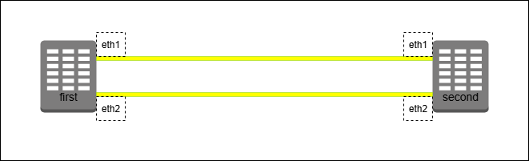
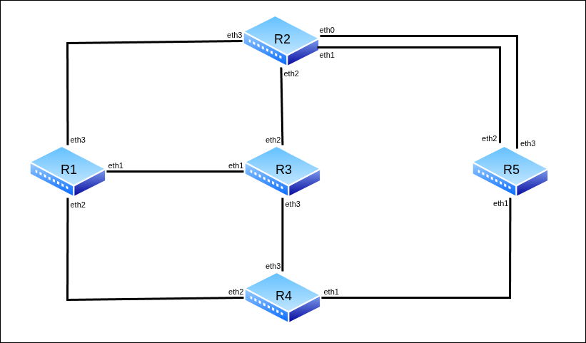

# Лабораторная работа №6 — Работа с протоколом STP

 + [Все лабораторные работы по сетевым протоколам в Linux](../Intro.md)
 + [Предыдущая лабораторная работа — Маршрутизация сетей c VLAN](../05_VLAN_Routing/Маршрутизация%20сетей%20c%20VLAN.md)
 + [Следующая лабораторная работа — Статические маршруты и маршруты по умолчанию](../07_StaticRouting/Статические%20маршруты%20и%20маршруты%20по%20умолчанию.md)

---

## Быстрый поиск по лабораторной:
 + [Протокол STP](./Работа%20с%20протоколом%20STP.md#Протокол-STP)
 + [Пример настройки STP](./Работа%20с%20протоколом%20STP.md#Пример-настройки-STP)
	 + [Настройка коммутаторов](./Работа%20с%20протоколом%20STP.md#Настройка-коммутаторов)
	 + [Параметры сетевого моста](./Работа%20с%20протоколом%20STP.md#Параметры-сетевого-моста)
	 + [Работа с STP](./Работа%20с%20протоколом%20STP.md#Работа-с-STP)
 + [Самостоятельная работа](./Работа%20с%20протоколом%20STP.md#Самостоятельная-работа)
	 + [Варианты заданий](./Работа%20с%20протоколом%20STP.md#Варианты-заданий)

**Цель лабораторной** — познакомить изучающего с основами протокола STP

**Задачи лабораторной:**

- Изучить логику работы протокола;
- Изучить возможности управления параметрами каналов;
- Реализовать тестовую топологию с применением протокола STP.

---

## Протокол STP

Протокол [STP](https://ru.wikipedia.org/wiki/STP) (Spanning Tree Protocol) предназначен для устранения петель в топологиях с избыточными соединениями на интерфейсном (канальном, L2) уровне путём построения полного связного дерева. Из подзадач протокола можно выделить _определение корневого коммутатора_ сети и приоритетное _отключение избыточных каналов связи_.

Метрикой выбора канала между узлами в STP является _стоимость пути (path cost)_, которая рассчитывается на основе пропускной способности канала

Кратко работу протокола можно описать следующей последовательностью действий:
 - Все устройства отправляют _BPDU (Bridge Protocol Data Unit)_ с собственным идентификатором (Bridge ID).
 - Выбирается _корневое устройство (Root Bridge)_ — устройство с наименьшим Bridge ID.
 - Каждое некорневое устройство определяет _корневой порт_ — порт с наименьшей стоимостью пути к корневому устройству.
 - На каждом сегменте сети выбирается _назначенный порт (Designated Port)_ — порт с наименьшей стоимостью пути к корневому устройству на этом сегменте.
 - Все остальные порты переходят в _блокированное состояние (Blocking)_ для предотвращения петель.
 - Корневой и назначенные порты переходят в _состояние передачи (Forwarding)_, обеспечивая связность без петель.

---

## Пример настройки STP

Рассмотрим систему из двух коммутаторов, объединённых двумя каналами связи, и изучим на ней возможности работы с протоколом:



Для работы создайте 2 [клона](../01_FirstStart/Настройка%20системы%20для%20выполнения%20лабораторных.md) согласно топологии сети. Для создания соединений между машинами необходимо в VirtualBox настроить сетевые интерфейсы (описание настройки подключения находится в разделе [настройки сетевых подключений](../02_SystemGreetings/Знакомство%20с%20системой.md#работа-с-сетевыми-интерфейсами)):

 + first:
	 + Adapter2 — intnet
	 + Adapter3 — deepnet
 + second:
	 + Adapter2 — intnet
	 + Adapter3 — deepnet

---

### Настройка коммутаторов

:round_pushpin: 1. С помощью команд управления интерфейсами создайте на коммутаторах first и second интерфейсы типа bridge  и свяжите с ними все используемые физические интерфейсы

`@first`
```console
[root@first ~]# ip link add br0 type bridge
[root@first ~]# ip link set eth1 master br0
[root@first ~]# ip link set eth2 master br0
[root@first ~]#
```

`@second`
```console
[root@second ~]# ip link add br0 type bridge
[root@second ~]# ip link set eth1 master br0
[root@second ~]# ip link set eth2 master br0
[root@second ~]#
```

:round_pushpin: 2. C помощью команд управления интерфейсами включите на коммутаторах все используемые интерфейсы

`@first`
```console
[root@first ~]# ip link set br0 up
[root@first ~]# ip link set eth1 up
[root@first ~]# ip link set eth2 up
[root@first ~]#
```

`@second`
```console
[root@second ~]# ip link set br0 up
[root@second ~]# ip link set eth1 up
[root@second ~]# ip link set eth2 up
[root@second ~]#
```

---

### Параметры сетевого моста

:round_pushpin: 1. С помощью команды управления интерфейсами на first выведите подробную информацию об интерфейсе br0

`@first`
```console
[root@first ~]# ip -d link show br0
6: br0: <BROADCAST,MULTICAST,UP,LOWER_UP> mtu 1500 qdisc noqueue state UP mode DEFAULT group default ql
en 1000
   link/ether 08:00:27:26:29:ce brd ff:ff:ff:ff:ff:ff promiscuity 0 allmulti 0 minmtu 68 maxmtu 65535
   bridge forward_delay 1500 hello_time 200 max_age 2000 ageing_time 30000 stp_state 0 priority 32768
   vlan_filtering 0 vlan_protocol 802.1Q bridge_id 8000.8:0:27:26:29:ce designated_root 8000.8:0:27:26:29:ce
   root_port 0 root_path_cost 5 topology_change 0 topology_change_detected 0 hello_timer 0.00 tcn_timer 0.00
   topology_change_timer 0.00 gc_timer 31.90 fdb_n_learned 2 fdb_max_learned 0 vlan_default_pvid 1
   vlan_stats_enabled 0 vlan_stats_per_port 0 group_fwd_mask 0 group_address 01:80:c2:00:00:00 mcast_snooping 1
   no_linklocal_learn 0 mcast_vlan_snooping 0 mst_enabled 0 mcast_router 1 mcast_query_use_ifaddr 0
   mcast_querier 0 mcast_hash_elasticity 16 mcast_hash_max 4096 mcast_last_member_count 2 mcast_startup_query_count 2
   mcast_last_member_interval 100 mcast_membership_interval 26000 mcast_querier_interval 25500
   mcast_query_interval 12500 mcast_query_response_interval 1000 mcast_startup_query_interval 3125
   mcast_stats_enabled 0 mcast_igmp_version 2 mcast_mld_version 1 nf_call_iptables 0 nf_call_ip6tables 0
   nf_call_arptables 0 numtxqueues 1 numrxqueues 1 gso_max_size 65536 gso_max_segs 65535 tso_max_size 65536
   tso_max_segs 65535 gro_max_size 65536 gso_ipv4_max_size 65536 gro_ipv4_max_size 65536
[root@first ~]#
```

:information_source: В работе протокола STP учитываются несколько параметров данного сетевого моста:
 + stp_state —  состояние протокола STP на коммутаторе (подключён ли он на данном устройстве или нет);
 + priority — приоритет данного коммутатора, используется для определения корневого коммутатора;
 + bridge_id — идентификатор данного коммутатора, совпадает со значением MAC-адреса устройства (при передаче BPDU поле BID состоит из полей priority и bridge_id, однако в описании Linux-интерфейсов они хранятся отдельно);
 + designated_port — Это порт, через который в сегмент сети (который к нему подключен) будут передаваться BPDU. По значению совпадает со значением MAC-адреса на корневом коммутаторе;
 + root_port — номер корневого порта зависимого (некорневого) коммутатора (0 в случае корневого коммутатора).

:information_source: Работа протокола подразумевает постоянную передачу служебных сообщений между коммутаторами ([BPDU](https://ru.wikipedia.org/wiki/BPDU)) для синхронизации состояний. За скорость синхронизации отвечают параметры:
 + hello_time — интервал отправки BPDU между соседними коммутаторами;
 + max_age — максимальное время актуальности полученного BPDU (Определяет размер (диаметр) сети: Если значение срока действия сообщения (Message Age; передается в BPDU, увеличивается на 1 при прохождении каждого коммутатора) меньше или равно значению максимального срока действия (Max Age), некорневой мост перенаправляет конфигурационный BPDU. Если значение срока действия сообщения превышает значение максимального срока действия, некорневой мост отменяет конфигурационный BPDU. В этом случае сеть считается слишком большой, и некорневой мост отключается от корневого моста);
 + forward_delay — задержка отправки BPDU после изменения топологии системы (время нахождения портов коммутатора в состоянии `listening` и `learning`).

---

### Работа с STP

:information_source: На данный момент в настраиваемых нами системах протокол STP отключён. Оба коммутатора считают себя единственными (и потому корневыми) коммутаторами в системе.

:round_pushpin: 1. С помощью команды `bridge link` на коммутаторах выведите параметры всех связанных с сетевым мостом интерфейсов

`@first`
```console
[root@first ~]# bridge link
3: eth1: <BROADCAST,MULTICAST,UP,LOWER_UP> mtu 1500 master br0 state forwarding priority 32 cost 5
4: eth2: <BROADCAST,MULTICAST,UP,LOWER_UP> mtu 1500 master br0 state forwarding priority 32 cost 5
[root@first ~]#
```

`@second`
```console
[root@second ~]# bridge link
3: eth1: <BROADCAST,MULTICAST,UP,LOWER_UP> mtu 1500 master br0 state forwarding priority 32 cost 5
4: eth2: <BROADCAST,MULTICAST,UP,LOWER_UP> mtu 1500 master br0 state forwarding priority 32 cost 5
[root@second ~]#
```

:round_pushpin: 2. С помощью команды управления интерфейсами выведите информацию о параметрах сетевого моста. Обратите внимание на параметры stp_state, priority, bridge_id, designated_port, root_port

`@first`
```console
[root@first ~]# ip -d link show br0 | grep root
   bridge <...> stp_state 0 priority 32768 <...>
   bridge_id 8000.8:0:27:26:29:ce designated_root 8000.8:0:27:26:29:ce root_port 0 <...>
[root@first ~]#
```

`@second`
```console
[root@second ~]# ip -d link show br0 | grep root
   bridge <...> stp_state 0 priority 32768 <...>
   bridge_id 8000.8:0:27:5a:86:5c designated_root 8000.8:0:27:5a:86:5c root_port 0 <...>
[root@second ~]#
```

:round_pushpin: 3. С помощью _команды изменения параметров интерфейса_ :new: `ip link set dev br0 type bridge stp_state 1` на коммутаторах включите протокол STP. С помощью команд управления интерфейсами и сетевым мостом выведите параметры интерфейсов и моста:

`@first`
```console
[root@first ~]# ip link set dev br0 type bridge stp_state 1
<Some time later>

[root@first ~]# ip -d link show br0 | grep root
   bridge <...> stp_state 1 priority 32768 <...>
   bridge_id 8000.8:0:27:26:29:ce designated_root 8000.8:0:27:26:29:ce root_port 0 <...>

[root@first ~]# bridge link
3: eth1: <BROADCAST,MULTICAST,UP,LOWER_UP> mtu 1500 master br0 state forwarding priority 32 cost 5
4: eth2: <BROADCAST,MULTICAST,UP,LOWER_UP> mtu 1500 master br0 state forwarding priority 32 cost 5
[root@first ~]#
```

`@second`
```console
[root@second ~]# ip link set dev br0 type bridge stp_state 1
<Some time later>

[root@second ~]# ip -d link show br0 | grep root
   bridge <...> stp_state 1 priority 32768 <...>
   bridge_id 8000.8:0:27:5a:86:5c designated_root 8000.8:0:27:26:29:ce root_port 1 <...>

[root@second ~]# bridge link
3: eth1: <BROADCAST,MULTICAST,UP,LOWER_UP> mtu 1500 master br0 state forwarding priority 32 cost 5
4: eth2: <BROADCAST,MULTICAST,UP,LOWER_UP> mtu 1500 master br0 state blocking priority 32 cost 5
[root@second ~]#
```

:information_source: Поскольку приоритеты коммутаторов одинаковы, корневым автоматически становится коммутатор с меньшим `bridge_id`. У зависимого коммутатора при этом меняются значения `designated_root` и `root_port`.

:warining: ***ВАЖНО:*** поскольку MAC-адреса созданных клонов могут отличаться от представленных в лабораторной, внимательно следите за обозначениями виртуальных машин, для которых выполняются команды. Для удобства в тексте далее будут использоваться обозначения «корневой коммутатор» и «зависимый коммутатор».

:information_source: Для смены корневого коммутатора можно изменить приоритет.

:round_pushpin: 4. С помощью команды изменения параметров интерфейса на _зависимом_ коммутаторе установите новое значение приоритета моста.

`@second`
```console
[root@second ~]# ip link set dev br0 type bridge priority 4096
[root@second ~]# ip -d link show br0 | grep priority
   bridge <...> priority 4096 <...>
   bridge_id 1000.8:0:27:5a:86:5c designated_root 1000.8:0:27:5a:86:5c root_port 0 <...>
[root@second ~]# bridge link
3: eth1: <BROADCAST,MULTICAST,UP,LOWER_UP> mtu 1500 master br0 state forwarding priority 32 cost 5
4: eth2: <BROADCAST,MULTICAST,UP,LOWER_UP> mtu 1500 master br0 state listening priority 32 cost 5
<Some time later>
[root@second ~]# bridge link
3: eth1: <BROADCAST,MULTICAST,UP,LOWER_UP> mtu 1500 master br0 state forwarding priority 32 cost 5
4: eth2: <BROADCAST,MULTICAST,UP,LOWER_UP> mtu 1500 master br0 state forwarding priority 32 cost 5
```

`@first`
```console
<Some time later>
[root@first ~]# ip -d link show br0 | grep priority
   bridge <...> priority 32768 <...>
   bridge_id 8000.8:0:27:26:29:ce designated_root 1000.8:0:27:5a:86:5c root_port 1 <...>
[root@first ~]# bridge link
3: eth1: <BROADCAST,MULTICAST,UP,LOWER_UP> mtu 1500 master br0 state forwarding priority 32 cost 5
4: eth2: <BROADCAST,MULTICAST,UP,LOWER_UP> mtu 1500 master br0 state blocking priority 32 cost 5
[root@first ~]#
```

:information_source: После синхронизации первый коммутатор стал корневым, а второй — зависимым.

:information_source: Для управления каналами передачи данных используются настройки приоритета портов и «стоимости» каналов.

:round_pushpin: 5. С помощью команды изменения параметров интерфейса на _корневом_ коммутаторе установите новое значение приоритета связанного порта eth1.

`@second`
```console
[root@second ~]# bridge link set dev eth1 priority 63
[root@second ~]# bridge link
3: eth1: <BROADCAST,MULTICAST,UP,LOWER_UP> mtu 1500 master br0 state forwarding priority 63 cost 5
4: eth2: <BROADCAST,MULTICAST,UP,LOWER_UP> mtu 1500 master br0 state forwarding priority 32 cost 5
[root@second ~]#
```

:information_source: На _зависимом_ коммутаторе поменяются статусы каналов, активным станет канал с меньшим значением `priority` у соседа.

`@first`
```console
<Some time later>
[root@first ~]# ip -d link show br0 | grep priority
   bridge <...> priority 32768 <...>
   bridge_id 8000.8:0:27:26:29:ce designated_root 1000.8:0:27:5a:86:5c root_port 2 <...>
[root@first ~]# bridge link
3: eth1: <BROADCAST,MULTICAST,UP,LOWER_UP> mtu 1500 master br0 state blocking priority 32 cost 5
4: eth2: <BROADCAST,MULTICAST,UP,LOWER_UP> mtu 1500 master br0 state listening priority 32 cost 5
[root@first ~]#
```


:round_pushpin: 6. С помощью команды изменения параметров интерфейса на _зависимом_ коммутаторе установите новое значение стоимости канала связанного порта eth2.

:information_source: Статусы каналов вновь поменяются, использоваться будет канал с меньшей стоимостью

`@first`
```console
[root@first ~]# bridge link set dev eth2 cost 20000
[root@first ~]# bridge link
3: eth1: <BROADCAST,MULTICAST,UP,LOWER_UP> mtu 1500 master br0 state listening priority 32 cost 5
4: eth2: <BROADCAST,MULTICAST,UP,LOWER_UP> mtu 1500 master br0 state blocking priority 32 cost 20000
<Some time later>
[root@first ~]# bridge link
3: eth1: <BROADCAST,MULTICAST,UP,LOWER_UP> mtu 1500 master br0 state forwarding priority 32 cost 5
4: eth2: <BROADCAST,MULTICAST,UP,LOWER_UP> mtu 1500 master br0 state blocking priority 32 cost 20000
[root@first ~]#
```

---

## Самостоятельная работа



:round_pushpin: Для работы необходимо 5 [клонов](../01_FirstStart/Настройка%20системы%20для%20выполнения%20лабораторных.md) согласно топологии сети. Для создания соединений между машинами необходимо в VirtualBox настроить сетевые интерфейсы (описание настройки подключения находится в разделе [настройки сетевых подключений](../02_SystemGreetings/Знакомство%20с%20системой.md#работа-с-сетевыми-интерфейсами)):

 + R1:
	 + Adapter2 — net13
	 + Adapter3 — net14
	 + Adapter4 — net12
 + R2:
	 + Adapter1 — intnet25
	 + Adapter2 — deepnet25
	 + Adapter3 — net23
	 + Adapter4 — net12
 + R3:
	 + Adapter2 — net13
	 + Adapter3 — net23
	 + Adapter4 — net34
 + R4:
	 + Adapter2 — net45
	 + Adapter3 — net14
	 + Adapter4 — net34
 + R5:
	 + Adapter2 — net45
	 + Adapter3 — deepnet25
	 + Adapter4 — intnet25

---

### Варианты заданий


| Группа | Задание                                                                                                                    |
| ------ | -------------------------------------------------------------------------------------------------------------------------- |
| 1      | Настроить устройства (см. топологию) так, чтобы корневым коммутатором было устройство R1, а корневым портом на R5 был eth1 |
| 2      | Настроить устройства (см. топологию) так, чтобы корневым коммутатором было устройство R2, а корневым портом на R4 был eth3 |
| 3      | Настроить устройства (см. топологию) так, чтобы корневым коммутатором было устройство R3, а корневым портом на R5 был eth2 |
| 4      | Настроить устройства (см. топологию) так, чтобы корневым коммутатором было устройство R4, а корневым портом на R1 был eth3 |
| 5      | Настроить устройства (см. топологию) так, чтобы корневым коммутатором было устройство R5, а корневым портом на R3 был eth1 |

:round_pushpin: Запустить [отчёты](../02_SystemGreetings/Знакомство%20с%20системой.md#Сдача-самостоятельных-работ) на каждой машине и выполнить соответствующие команды:

 + `report 6 r1`
	 + ip link show
	 + ip -d link show <название bridge-интерфейса>
	 + bridge link
 + `report 6 r2`
	 + ip link show
	 + ip -d link show <название bridge-интерфейса>
	 + bridge link
 + `report 6 r3`
	 + ip link show
	 + ip -d link show <название bridge-интерфейса>
	 + bridge link
 + `report 6 r4`
	 + ip link show
	 + ip -d link show <название bridge-интерфейса>
	 + bridge link
 + `report 6 r5`
	 + ip link show
	 + ip -d link show <название bridge-интерфейса>
	 + bridge link

:round_pushpin: Полученные отчёты `report.06.r1`, `report.06.r2`, `report.06.r3`, `report.06.r4`, `report.06.r5` через последовательный порт перенести из виртуальной машины и прислать их преподавателю с подписью выполненного варианта.
