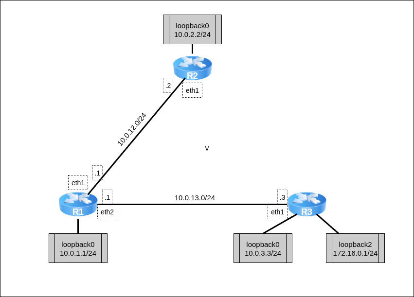

Для изучения маршрутизации с помощью OSPF разберём топологию между тремя маршрутизаторами.



Для работы создадим 3 [клона](../01_FirstStart/Настройка%20системы%20для%20выполнения%20лабораторных.md) согласно топологии сети. Для создания соединений между машинами необходимо в VirtualBox настроить сетевые интерфейсы (описание настройки подключения находится в разделе [настройки сетевых подключений](../02_SystemGreetings/Знакомство%20с%20системой.md#работа-с-сетевыми-интерфейсами)):

 + `R1`:
	 + Adapter2 — intnet
	 + Adapter3 — deepnet
 + `R2`:
	 + Adapter2 — intnet
 + `R3`:
	 + Adapter2 — deepnet

Для начала настроим IP-адреса на интерфейсах маршрутизаторов согласно топологии. На каждом маршрутизаторе добавим виртуальный loopback-интерфейс, на маршрутизаторе R2 — два таких интерфейса. Дополнительно на маршрутизаторе R1 настроим IP-forwarding пакетов.

`@R1`
```console
[root@R1 ~]# ip link set eth1 up
[root@R1 ~]# ip link set eth2 up
[root@R1 ~]# ip link add dev lo0 type veth
[root@R1 ~]# ip link set lo0 up
[root@R1 ~]#
[root@R1 ~]# ip addr add dev eth1 10.0.12.1/24
[root@R1 ~]# ip addr add dev eth2 10.0.13.1/24
[root@R1 ~]# ip addr add dev lo0 10.0.1.1/24
[root@R1 ~]#
[root@R1 ~]# sysctl net.ipv4.conf.all.forwarding=1
[root@R1 ~]#
```

`@R2`
```console
[root@R2 ~]# ip link set eth1 up
[root@R2 ~]# ip link add dev lo0 type veth
[root@R2 ~]# ip link set lo0 up
[root@R2 ~]#
[root@R2 ~]# ip addr add dev eth1 10.0.12.2/24
[root@R2 ~]# ip addr add dev lo0 10.0.2.2/24
[root@R2 ~]#
```

`@R3`
```console
[root@R3 ~]# ip link set eth1 up
[root@R3 ~]# ip link add dev lo0 type veth
[root@R3 ~]# ip link add dev lo2 type veth
[root@R3 ~]# ip link set lo0 up
[root@R3 ~]# ip link set lo2 up
[root@R3 ~]#
[root@R3 ~]# ip addr add dev eth1 10.0.13.3/24
[root@R3 ~]# ip addr add dev lo0 10.0.3.3/24
[root@R3 ~]# ip addr add dev lo2 172.16.0.1/24
[root@R3 ~]#
```

С помощью `ip a` проверим, что интерфейсы включены, и IP-адреса указаны корректно.
Вместе с описанием IP-адресов в таблице маршрутизации автоматически появятся записи о маршрутах в сетях описанных адресов. Посмотреть эти записи можно с помощью команды `ip route`:

`@R1`
```console
[root@R1 ~]# ip a
1: lo: <LOOPBACK,UP,LOWER_UP> mtu 65536 qdisc noqueue state UNKNOWN group default qlen 1000
   link/loopback 00:00:00:00:00:00 brd 00:00:00:00:00:00
   inet 127.0.0.1/8 scope host lo
      valid_lft forever preferred_lft forever
2: eth0: <BROADCAST,MULTICAST> mtu 1500 qdisc noop state DOWN group default qlen 1000
   link/ether 08:00:27:63:48:68 brd ff:ff:ff:ff:ff:ff
   altname enp0s3
   altname enx080027634868
3: eth1: <BROADCAST,MULTICAST,UP,LOWER_UP> mtu 1500 qdisc fq_codel state UP group default qlen 1000
   link/ether 08:00:27:8c:9d:7c brd ff:ff:ff:ff:ff:ff
   altname enp0s8
   altname enx0800278c9d7c
   inet 10.0.12.1/24 scope global eth1
      valid_lft forever preferred_lft forever
4: eth2: <BROADCAST,MULTICAST,UP,LOWER_UP> mtu 1500 qdisc fq_codel state UP group default qlen 1000
   link/ether 08:00:27:58:e0:1a brd ff:ff:ff:ff:ff:ff
   altname enp0s9
   altname enx08002758e01a
   inet 10.0.13.1/24 scope global eth2
      valid_lft forever preferred_lft forever
5: eth3: <BROADCAST,MULTICAST> mtu 1500 qdisc noop state DOWN group default qlen 1000
   link/ether 08:00:27:73:75:33 brd ff:ff:ff:ff:ff:ff
   altname enp0s10
   altname enx080027737533
6: veth0@lo0: <BROADCAST,MULTICAST> mtu 1500 qdisc noop state DOWN group default qlen 1000
   link/ether be:0f:68:1f:d0:00 brd ff:ff:ff:ff:ff:ff
7: lo0@veth0: <NO-CARRIER,BROADCAST,MULTICAST,UP,M-DOWN> mtu 1500 qdisc noqueue state LOWERLAYERDOWN gr
oup default qlen 1000
   link/ether 16:bc:62:e0:0f:f6 brd ff:ff:ff:ff:ff:ff
   inet 10.0.1.1/24 scope global lo0
      valid_lft forever preferred_lft forever
[root@R1 ~]# ip route
10.0.1.0/24 dev lo0 proto kernel scope link src 10.0.1.1 linkdown
10.0.12.0/24 dev eth1 proto kernel scope link src 10.0.12.1
10.0.13.0/24 dev eth2 proto kernel scope link src 10.0.13.1
```

`@R2`
```console
[root@R2 ~]# ip a
1: lo: <LOOPBACK,UP,LOWER_UP> mtu 65536 qdisc noqueue state UNKNOWN group default qlen 1000
   link/loopback 00:00:00:00:00:00 brd 00:00:00:00:00:00
   inet 127.0.0.1/8 scope host lo
      valid_lft forever preferred_lft forever
2: eth0: <BROADCAST,MULTICAST> mtu 1500 qdisc noop state DOWN group default qlen 1000
   link/ether 08:00:27:26:a1:b0 brd ff:ff:ff:ff:ff:ff
   altname enp0s3
   altname enx08002726a1b0
3: eth1: <BROADCAST,MULTICAST,UP,LOWER_UP> mtu 1500 qdisc fq_codel state UP group default qlen 1000
   link/ether 08:00:27:f4:55:60 brd ff:ff:ff:ff:ff:ff
   altname enp0s8
   altname enx080027f45560
   inet 10.0.12.2/24 scope global eth1
      valid_lft forever preferred_lft forever
4: eth2: <BROADCAST,MULTICAST> mtu 1500 qdisc noop state DOWN group default qlen 1000
   link/ether 08:00:27:36:f1:f8 brd ff:ff:ff:ff:ff:ff
   altname enp0s9
   altname enx08002736f1f8
5: eth3: <BROADCAST,MULTICAST> mtu 1500 qdisc noop state DOWN group default qlen 1000
   link/ether 08:00:27:ab:e4:a5 brd ff:ff:ff:ff:ff:ff
   altname enp0s10
   altname enx080027abe4a5
6: veth0@lo0: <BROADCAST,MULTICAST> mtu 1500 qdisc noop state DOWN group default qlen 1000
   link/ether be:0f:68:1f:d0:00 brd ff:ff:ff:ff:ff:ff
7: lo0@veth0: <NO-CARRIER,BROADCAST,MULTICAST,UP,M-DOWN> mtu 1500 qdisc noqueue state LOWERLAYERDOWN gr
oup default qlen 1000
   link/ether 16:bc:62:e0:0f:f6 brd ff:ff:ff:ff:ff:ff
   inet 10.0.2.2/24 scope global lo0
      valid_lft forever preferred_lft forever
[root@R2 ~]# ip route
10.0.2.0/24 dev lo0 proto kernel scope link src 10.0.2.2 linkdown
10.0.12.0/24 dev eth1 proto kernel scope link src 10.0.12.2
```

`@R3`
```console
[root@R3 ~]# ip a
1: lo: <LOOPBACK,UP,LOWER_UP> mtu 65536 qdisc noqueue state UNKNOWN group default qlen 1000
   link/loopback 00:00:00:00:00:00 brd 00:00:00:00:00:00
   inet 127.0.0.1/8 scope host lo
      valid_lft forever preferred_lft forever
2: eth0: <BROADCAST,MULTICAST> mtu 1500 qdisc noop state DOWN group default qlen 1000
   link/ether 08:00:27:79:0c:8b brd ff:ff:ff:ff:ff:ff
   altname enp0s3
   altname enx080027790c8b
3: eth1: <BROADCAST,MULTICAST,UP,LOWER_UP> mtu 1500 qdisc fq_codel state UP group default qlen 1000
   link/ether 08:00:27:a3:5b:72 brd ff:ff:ff:ff:ff:ff
   altname enp0s8
   altname enx080027a35b72
   inet 10.0.13.3/24 scope global eth1
      valid_lft forever preferred_lft forever
4: eth2: <BROADCAST,MULTICAST> mtu 1500 qdisc noop state DOWN group default qlen 1000
   link/ether 08:00:27:57:5c:5d brd ff:ff:ff:ff:ff:ff
   altname enp0s9
   altname enx080027575c5d
5: eth3: <BROADCAST,MULTICAST> mtu 1500 qdisc noop state DOWN group default qlen 1000
   link/ether 08:00:27:55:80:ce brd ff:ff:ff:ff:ff:ff
   altname enp0s10
   altname enx0800275580ce
6: veth0@lo0: <BROADCAST,MULTICAST> mtu 1500 qdisc noop state DOWN group default qlen 1000
   link/ether be:0f:68:1f:d0:00 brd ff:ff:ff:ff:ff:ff
7: lo0@veth0: <NO-CARRIER,BROADCAST,MULTICAST,UP,M-DOWN> mtu 1500 qdisc noqueue state LOWERLAYERDOWN gr
oup default qlen 1000
   link/ether 16:bc:62:e0:0f:f6 brd ff:ff:ff:ff:ff:ff
   inet 10.0.3.3/24 scope global lo0
      valid_lft forever preferred_lft forever
8: veth1@lo2: <BROADCAST,MULTICAST> mtu 1500 qdisc noop state DOWN group default qlen 1000
   link/ether da:35:41:4c:52:c5 brd ff:ff:ff:ff:ff:ff
9: lo2@veth1: <NO-CARRIER,BROADCAST,MULTICAST,UP,M-DOWN> mtu 1500 qdisc noqueue state LOWERLAYERDOWN gr
oup default qlen 1000
   link/ether 8a:14:8d:e2:61:7b brd ff:ff:ff:ff:ff:ff
   inet 172.16.0.1/24 scope global lo2
      valid_lft forever preferred_lft forever
[root@R3 ~]# ip route
10.0.3.0/24 dev lo0 proto kernel scope link src 10.0.3.3 linkdown
10.0.13.0/24 dev eth1 proto kernel scope link src 10.0.13.3
172.16.0.0/24 dev lo2 proto kernel scope link src 172.16.0.1 linkdown
```

Для работы OSPF необходимо использовать специальные программы маршрутизации — Routing Daemons. Для выполнения лабораторной используется демон BIRD. Для настройки демона используется конфигурационный файл `/etc/bird/bird.conf` специального вида. Рассмотрим конфигурационный файл настройки для R1:

`@R1:/etc/bird/bird.conf`
```console
router id 10.0.1.1;

protocol kernel {
       scan time 20;
       ipv4 { export all; };
}

protocol device {
       scan time 10;
}

protocol ospf SIMPLE {
       ipv4 { export all; };
       area 0.0.0.0 {
               interface "eth1" {
               };
               interface "eth2" {
               };
               interface "lo0" {
               };
       };
}
```

Конфигурационный файл включает в себя:
 + описание уникального идентификатора маршрутизатора в сети, «от имени» которого будут рассылаться данные о маршрутах;
 + структуру `protocol kernel` — она описывает действия, связанные с таблицами маршрутизации ядра системы;
 + структуру `protocol device` — она описывает действия самого сетевого устройства;
 + структуру `protocol ospf` — она описывает действия, связанные с маршрутизацией с помощью протокола:
	 + Экспорт всей OSPF-информации о доступных маршрутах по IPv4;
	 + Экспорт данных всем устройствам за указанными интерфейсами.

Аналогично опишем конфигурационные файлы для R2 и R3:

`@R2:/etc/bird/bird.conf`
```console
router id 10.0.2.2;

protocol kernel {
       scan time 20;
       ipv4 { export all; };
}

protocol device {
       scan time 10;
}

protocol ospf SIMPLE {
       ipv4 { export all; };
       area 0.0.0.0 {
               interface "eth1" {
               };
               interface "lo0" {
               };
       };
}
```

`@R3:/etc/bird/bird.conf`
```console
router id 10.0.3.3;

protocol kernel {
       scan time 20;
       ipv4 { export all; };
}

protocol device {
       scan time 10;
}

protocol ospf SIMPLE {
       ipv4 { export all; };
       area 0.0.0.0 {
               interface "eth1" {
               };
               interface "eth2" {
               };
               interface "lo0" {
               };
               interface "lo2" {
               };
       };
}
```

Для работы демона необходимо запустить его, вызвав команду `bird` (на каждом абоненте). После с помощью `birdc` можно посмотреть параметры работы демона. С помощью `show route` посмотрите сформированные и отправленные данные OSPF-маршрутизации по указанным интерфейсам:

`@R1`
```console
[root@R1 ~]# bird
[root@R1 ~]# birdc
BIRD +detached. ready.
bird> show route
Table master4:
10.0.12.0/24         unicast [SIMPLE 01:41:40.630] * I (150/10) [10.0.1.1]
       dev eth1
10.0.13.0/24         unicast [SIMPLE 01:41:40.631] * I (150/10) [10.0.1.1]
       dev eth2
10.0.1.1/32          unicast [SIMPLE 01:41:40.631] * I (150/0) [10.0.1.1]
       dev lo0
bird>
```

Выйдите в основной терминал и вызовите `ip route`: в таблице маршрутизации должны появиться новые записи о доступных маршрутах с указанием `proto bird` , означающим, что маршрут получен с помощью BIRD-демона (поскольку маршруты не приходят мгновенно, может потребоваться время на получение всех данных):

`@R1`
```console
[root@R1 ~]# ip route
10.0.1.0/24 dev lo0 proto kernel scope link src 10.0.1.1 linkdown
10.0.1.1 dev lo0 proto bird scope link metric 32 linkdown
10.0.2.2 via 10.0.12.2 dev eth1 proto bird metric 32
10.0.3.3 via 10.0.13.3 dev eth2 proto bird metric 32
10.0.12.0/24 dev eth1 proto kernel scope link src 10.0.12.1
10.0.12.0/24 dev eth1 proto bird scope link metric 32
10.0.13.0/24 dev eth2 proto kernel scope link src 10.0.13.1
10.0.13.0/24 dev eth2 proto bird scope link metric 32
172.16.0.1 via 10.0.13.3 dev eth2 proto bird metric 32
```

`@R2`
```console
[root@R2 ~]# ip route
10.0.2.0/24 dev lo0 proto kernel scope link src 10.0.2.2 linkdown
10.0.12.0/24 dev eth1 proto kernel scope link src 10.0.12.2
[root@R2 ~]# bird

[root@R2 ~]# ip route
10.0.2.0/24 dev lo0 proto kernel scope link src 10.0.2.2 linkdown
10.0.2.2 dev lo0 proto bird scope link metric 32 linkdown
10.0.12.0/24 dev eth1 proto kernel scope link src 10.0.12.2
10.0.12.0/24 dev eth1 proto bird scope link metric 32
[root@R2 ~]#
<Some time later>
[root@R2 ~]# ip route
10.0.1.1 via 10.0.12.1 dev eth1 proto bird metric 32
10.0.2.0/24 dev lo0 proto kernel scope link src 10.0.2.2 linkdown
10.0.2.2 dev lo0 proto bird scope link metric 32 linkdown
10.0.3.3 via 10.0.12.1 dev eth1 proto bird metric 32
10.0.12.0/24 dev eth1 proto kernel scope link src 10.0.12.2
10.0.12.0/24 dev eth1 proto bird scope link metric 32
10.0.13.0/24 via 10.0.12.1 dev eth1 proto bird metric 32
172.16.0.1 via 10.0.12.1 dev eth1 proto bird metric 32
```

`@R3`
```console
[root@R3 ~]# bird
[root@R3 ~]# ip route
10.0.1.1 via 10.0.13.1 dev eth1 proto bird metric 32
10.0.2.2 via 10.0.13.1 dev eth1 proto bird metric 32
10.0.3.0/24 dev lo0 proto kernel scope link src 10.0.3.3 linkdown
10.0.3.3 dev lo0 proto bird scope link metric 32 linkdown
10.0.12.0/24 via 10.0.13.1 dev eth1 proto bird metric 32
10.0.13.0/24 dev eth1 proto kernel scope link src 10.0.13.3
10.0.13.0/24 dev eth1 proto bird scope link metric 32
172.16.0.0/24 dev lo2 proto kernel scope link src 172.16.0.1 linkdown
172.16.0.1 dev lo2 proto bird scope link metric 32 linkdown
```

Проверьте с помощью `ping` доступность всех маршрутизаторов:

`@R1`
```console
[root@R1 ~]# ping -c3 10.0.2.2
PING 10.0.2.2 (10.0.2.2) 56(84) bytes of data.
64 bytes from 10.0.2.2: icmp_seq=1 ttl=64 time=0.348 ms
64 bytes from 10.0.2.2: icmp_seq=2 ttl=64 time=0.409 ms
64 bytes from 10.0.2.2: icmp_seq=3 ttl=64 time=0.392 ms

--- 10.0.2.2 ping statistics ---
3 packets transmitted, 3 received, 0% packet loss, time 2024ms
rtt min/avg/max/mdev = 0.348/0.383/0.409/0.025 ms
[root@R1 ~]#
```

`@R2`
```console
[root@R2 ~]# ping -c3 172.16.0.1
PING 172.16.0.1 (172.16.0.1) 56(84) bytes of data.
64 bytes from 172.16.0.1: icmp_seq=1 ttl=63 time=0.665 ms
64 bytes from 172.16.0.1: icmp_seq=2 ttl=63 time=0.489 ms
64 bytes from 172.16.0.1: icmp_seq=3 ttl=63 time=0.711 ms

--- 172.16.0.1 ping statistics ---
3 packets transmitted, 3 received, 0% packet loss, time 2067ms
rtt min/avg/max/mdev = 0.489/0.621/0.711/0.095 ms
[root@R2 ~]#
```


# Самостоятельная работа


Для работы необходимо 5 [клонов](../01_FirstStart/Настройка%20системы%20для%20выполнения%20лабораторных.md) согласно топологии сети. Для создания соединений между машинами необходимо в VirtualBox настроить сетевые интерфейсы (описание настройки подключения находится в разделе [настройки сетевых подключений](../02_SystemGreetings/Знакомство%20с%20системой.md#работа-с-сетевыми-интерфейсами)):

 + `R1`:
	 + Adapter2 — net111
	 + Adapter3 — net30
	 + Adapter4 — net50
 + `R2`:
	 + Adapter2 — net30
	 + Adapter3 — net40
 + `R3`:
	 + Adapter2— net222
	 + Adapter3— net40
	 + Adapter4 — net50
 + PC1:
	 + Adapter2— net111
 + PC2:
	 + Adapter2— net222

### Варианты заданий


| Группа | Задание                                                                                                                                                                                                                                                     |
| ------ | ----------------------------------------------------------------------------------------------------------------------------------------------------------------------------------------------------------------------------------------------------------- |
| 1      | 1. Создать топологию, указанную на рисунке<br>2. Убедиться, что `PC2` не пингуется с `PC1`<br>3. Настроить OSPF между `R1` и `R3`<br>4. Убедиться, что `PC2` пингуется с `PC1` и наоборот<br>5. Выполнить `traceroute` с `PC1` на `PC2`<br>                 |
| 2      | 1. Создать топологию, указанную на<br>рисунке<br>2. Убедиться, что `PC2` не пингуется с `PC1`<br>3. Настроить OSPF так, чтобы `PC2` не мог бы пинговать `R2`, а `PC1` мог бы<br>4. Выполнить `traceroute` с `PC1` и `PC2` на `R2`<br>       |
| 3      | 1. Создать топологию, указанную на рисунке<br>2. Убедиться, что `PC2` не пингуется с `PC1`<br>3. Настроить OSPF так, чтобы `PC1` не мог бы пинговать `R2`, а `PC2` мог бы<br>4. Выполнить `traceroute` с `PC1` и `PC2` на<br>`R2`           |
| 4      | 1. Создать топологию, указанную на рисунке<br>2. Убедиться, что `PC2` не пингуется с `PC1`<br>3. Настроить OSPF так, чтобы `PC1` не мог бы пинговать `R2`, но мог бы пинговать `R3`<br>4. Выполнить `traceroute` с `PC1` на `R2` и `R3`<br> |
| 5      | 1. Создать топологию, указанную на рисунке<br>2. Убедиться, что `PC2` не пингуется с `PC1`<br>3. Настроить OSPF так, чтобы `PC2` не мог бы пинговать `R2` , но мог бы пинговать `R1`<br>4. Выполнить `traceroute` с `PC2` на `R2` и `R1`    |
| 6      | 1. Создать топологию, указанную на рисунке<br>2. Убедиться, что `PC2` не пингуется с `PC1`<br>3. Настроить OSPF так, чтобы `PC1` не мог бы пинговать `R2` , но мог бы пинговать `PC2`<br>4. Выполнить `traceroute` с `PC1` на `PC2` и `R2`  |
| 7      | 1. Создать топологию, указанную на рисунке<br>2. Убедиться, что `PC2` не пингуется с `PC1`<br>3. Настроить OSPF так, чтобы `PC2` не мог бы пинговать `R2` , но мог бы пинговать `PC1`<br>4. Выполнить `traceroute` с `PC2` на `PC1` и `R2`  |
| 8      | 1. Создать топологию, указанную на рисунке<br>2. Убедиться, что `PC2` не пингуется с `PC1`<br>3. Настроить OSPF так, чтобы `R2` мог бы пинговать `PC2` и `PC1`<br>4. Выполнить `traceroute` с `R2` на `PC2` и `PC1`<br>                     |
| 9      | 1. Создать топологию, указанную на рисунке<br>2. Убедиться, что `PC2` не пингуется с `PC1`<br>3. Настроить OSPF так, чтобы `R2` мог бы пинговать `PC2` , но не мог бы пинговать `PC1`<br>4. Выполнить `traceroute` с `R2` на `PC2` и `PC1`  |
| 10     | 1. Создать топологию, указанную на рисунке<br>2. Убедиться, что `PC2` не пингуется с `PC1`<br>3. Настроить OSPF так, чтобы `R2` мог бы пинговать `PC1`, но не мог бы пинговать `PC2`<br>4. Выполнить `traceroute` с `R2` на `PC2` и `PC1`   |

Запустить [отчёты](../02_SystemGreetings/Знакомство%20с%20системой.md#Сдача-самостоятельных-работ) на каждой машине и выполнить соответствующие команды:

 + `report 7 pc1`
	 + ip a show eth1
	 + ip route
	 + cat /etc/bird/bird.conf
	 + ping -fc3 10.0.50.1
	 + ping -fc3 10.0.30.2
	 + ping -fc3 10.0.40.3
	 + ping -fc3 10.0.222.22
	 + traceroute 10.0.222.22
	 + traceroute 10.0.40.2
 + `report 7 pc2`
	 + ip a show eth1
	 + ip route
	 + cat /etc/bird/bird.conf
	 + ping -fc3 10.0.50.1
	 + ping -fc3 10.0.30.2
	 + ping -fc3 10.0.40.3
	 + ping -fc3 10.0.111.11
	 + traceroute 10.0.111.11
	 + traceroute 10.0.40.2
 + `report 7 r1`
	 + ip a show
	 + ip route
	 + cat /etc/bird/bird.conf
	 + ping -fc3 10.0.30.2
	 + ping -fc3 10.0.40.3
	 + ping -fc3 10.0.111.11
	 + ping -fc3 10.0.222.22
	 + traceroute 10.0.222.22
	 + traceroute 10.0.111.11
 + `report 7 r2`
	 + ip a show
	 + ip route
	 + cat /etc/bird/bird.conf
	 + ping -fc3 10.0.50.1
	 + ping -fc3 10.0.40.3
	 + ping -fc3 10.0.111.11
	 + ping -fc3 10.0.222.22
	 + traceroute 10.0.222.22
	 + traceroute 10.0.111.11
 + `report 7 r3`
	 + ip a show
	 + ip route
	 + cat /etc/bird/bird.conf
	 + ping -fc3 10.0.30.2
	 + ping -fc3 10.0.50.1
	 + ping -fc3 10.0.111.11
	 + ping -fc3 10.0.222.22
	 + traceroute 10.0.222.22
	 + traceroute 10.0.111.11

Полученные отчёты `report.07.pc1`, `report.07.pc2`, `report.07.r1`, `report.07.r2`, `report.07.r3` через последовательный порт перенести из виртуальной машины и прислать их преподавателю с подписью выполненного варианта.
