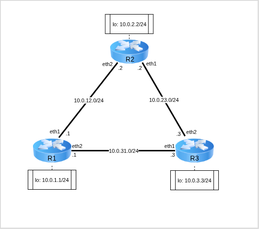
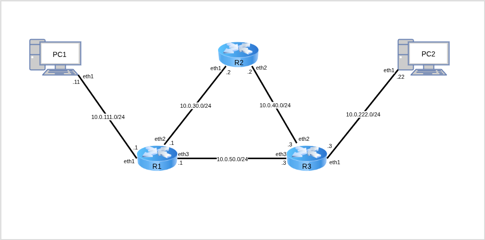

# Лабораторная работа №7 — Статические маршруты и маршруты по умолчанию

 + [Все лабораторные работы по сетевым протоколам в Linux](../Intro.md)
 + [Предыдущая лабораторная работа — Работа с протоколом STP](../06_STP/Работа%20с%20протоколом%20STP.md)
 + [Следующая лабораторная работа — Маршрутизация сетей с использованием RIP](../08_RIP_Routing/Маршрутизация%20сетей%20с%20использованием%20RIP.md)

---

## Быстрый поиск по лабораторной:
 + [Статическая маршрутизация](./Статические%20маршруты%20и%20маршруты%20по%20умолчанию.md#Статическая-маршрутизация)
 + [Пример настройки статической маршрутизация на сетевом уровне](./Статические%20маршруты%20и%20маршруты%20по%20умолчанию.md#Пример-настройки-статической-маршрутизация-на-сетевом-уровне)
	 + [Базовая настройка виртуальных машин](./Статические%20маршруты%20и%20маршруты%20по%20умолчанию.md#Базовая-настройка-виртуальных-машин)
	 + [Настройка статических маршрутов](./Статические%20маршруты%20и%20маршруты%20по%20умолчанию.md#Настройка-статических-маршрутов)
	 + [Анализ статических маршрутов трафика в сети](./Статические%20маршруты%20и%20маршруты%20по%20умолчанию.md#Анализ-статических-маршрутов-трафика-в-сети)
	 + [Настройка маршрутов по умолчанию](./Статические%20маршруты%20и%20маршруты%20по%20умолчанию.md#Настройка-маршрутов-по-умолчанию)
	 + [Анализ путей трафика в сети](./Статические%20маршруты%20и%20маршруты%20по%20умолчанию.md#Анализ-путей-трафика-в-сети)
 + [Самостоятельная работа](./Статические%20маршруты%20и%20маршруты%20по%20умолчанию.md#Самостоятельная-работа)
	 + [Варианты заданий](./Статические%20маршруты%20и%20маршруты%20по%20умолчанию.md#Варианты-заданий)

**Цель лабораторной** — познакомить изучающего с возможностями статической маршрутизации

**Задачи лабораторной:**

- Изучить работу статической маршрутизации;
- Реализовать тестовую топологию с применением статическом маршрутизации на сетевом уровне.

---

## Статическая маршрутизация

Задание маршрутов на канальном и сетевом уровнях может осуществляться посредством динамического обновления таблиц (_коммутации_ на канальном уровне, _маршрутизации_ — на сетевом) или задания статических правил в таблицы.

Основным параметром выбора выступает идентификатор получателя, дополнительно с помощью задания правил можно управлять маршрутизацией, ориентируясь на другие параметры.

---

## Пример настройки статической маршрутизация на сетевом уровне



Для работы создадим 3 [клона](../01_FirstStart/Настройка%20системы%20для%20выполнения%20лабораторных.md) согласно топологии сети. Для создания соединений между машинами необходимо в VirtualBox настроить сетевые интерфейсы (описание настройки подключения находится в разделе [настройки сетевых подключений](../02_SystemGreetings/Знакомство%20с%20системой.md#работа-с-сетевыми-интерфейсами)):

 + `R1`:
	 + Adapter2 — net12
	 + Adapter3 — net31
 + `R2`:
	 + Adapter2 — net23
	 + Adapter3 — net12
 + `R3`:
	 + Adapter2 — net31
	 + Adapter3 — net23


---

### Базовая настройка виртуальных машин

:round_pushpin: 1. С помощью команд управления интерфейсами создайте и включите интерфейсы согласно топологии

`@R1`
```console
[root@`R1` ~]# ip link set eth1 up
[root@`R1` ~]# ip link set eth2 up
[root@`R1` ~]# ip link set lo up
[root@`R1` ~]#
```

`@R2`
```console
[root@`R2` ~]# ip link set eth1 up
[root@`R2` ~]# ip link set eth2 up
[root@`R2` ~]# ip link set lo up
[root@`R2` ~]#
```

`@R3`
```console
[root@`R3` ~]# ip link set eth1 up
[root@`R3` ~]# ip link set eth2 up
[root@`R3` ~]# ip link set lo up
[root@`R3` ~]#
```

:round_pushpin: 2. На соответствующих интерфейсах с помощью команд настройки IP-адресов установите адреса согласно топологии.

`@R1`
```console
[root@`R1` ~]# ip addr add dev eth1 10.0.12.1/24
[root@`R1` ~]# ip addr add dev eth2 10.0.31.1/24
[root@`R1` ~]# ip addr add dev lo 10.0.1.1/24
[root@`R1` ~]#
```

`@R2`
```console
[root@`R2` ~]# ip addr add dev eth1 10.0.23.2/24
[root@`R2` ~]# ip addr add dev eth2 10.0.12.2/24
[root@`R2` ~]# ip addr add dev lo 10.0.2.2/24
[root@`R2` ~]#
```

`@R3`
```console
[root@`R3` ~]# ip addr add dev eth1 10.0.31.3/24
[root@`R3` ~]# ip addr add dev eth2 10.0.23.3/24
[root@`R3` ~]# ip addr add dev lo 10.0.3.3/24
[root@`R3` ~]#
```

:round_pushpin: 3. С помощью команды настройки IP-адресов выведите доступные интерфейсы с указанием IP-адресов на них

`@R1`
```console
[root@`R1` ~]# ip a
1: lo: <LOOPBACK,UP,LOWER_UP> mtu 65536 qdisc noqueue state UNKNOWN group default qlen 1000
   link/loopback 00:00:00:00:00:00 brd 00:00:00:00:00:00
   inet 127.0.0.1/8 scope host lo
      valid_lft forever preferred_lft forever
   inet 10.0.1.1/24 scope global lo
      valid_lft forever preferred_lft forever
2: eth0: <BROADCAST,MULTICAST> mtu 1500 qdisc noop state DOWN group default qlen 1000
   link/ether 08:00:27:a1:1d:0b brd ff:ff:ff:ff:ff:ff
   altname enp0s3
   altname enx080027a11d0b
3: eth1: <BROADCAST,MULTICAST,UP,LOWER_UP> mtu 1500 qdisc fq_codel state UP group default qlen 1000
   link/ether 08:00:27:15:a8:2d brd ff:ff:ff:ff:ff:ff
   altname enp0s8
   altname enx08002715a82d
   inet 10.0.12.1/24 scope global eth1
      valid_lft forever preferred_lft forever
4: eth2: <BROADCAST,MULTICAST,UP,LOWER_UP> mtu 1500 qdisc fq_codel state UP group default qlen 1000
   link/ether 08:00:27:18:1f:bc brd ff:ff:ff:ff:ff:ff
   altname enp0s9
   altname enx080027181fbc
   inet 10.0.31.1/24 scope global eth2
      valid_lft forever preferred_lft forever
5: eth3: <BROADCAST,MULTICAST> mtu 1500 qdisc noop state DOWN group default qlen 1000
   link/ether 08:00:27:3c:0a:dd brd ff:ff:ff:ff:ff:ff
   altname enp0s10
   altname enx0800273c0add
[root@`R1` ~]#
```

`@R2`
```console
[root@`R2` ~]# ip a
1: lo: <LOOPBACK,UP,LOWER_UP> mtu 65536 qdisc noqueue state UNKNOWN group default qlen 1000
   link/loopback 00:00:00:00:00:00 brd 00:00:00:00:00:00
   inet 127.0.0.1/8 scope host lo
      valid_lft forever preferred_lft forever
   inet 10.0.2.2/24 scope global lo
      valid_lft forever preferred_lft forever
2: eth0: <BROADCAST,MULTICAST> mtu 1500 qdisc noop state DOWN group default qlen 1000
   link/ether 08:00:27:a8:1c:34 brd ff:ff:ff:ff:ff:ff
   altname enp0s3
   altname enx080027a81c34
3: eth1: <BROADCAST,MULTICAST,UP,LOWER_UP> mtu 1500 qdisc fq_codel state UP group default qlen 1000
   link/ether 08:00:27:49:d4:10 brd ff:ff:ff:ff:ff:ff
   altname enp0s8
   altname enx08002749d410
   inet 10.0.23.2/24 scope global eth1
      valid_lft forever preferred_lft forever
4: eth2: <BROADCAST,MULTICAST,UP,LOWER_UP> mtu 1500 qdisc fq_codel state UP group default qlen 1000
   link/ether 08:00:27:45:07:41 brd ff:ff:ff:ff:ff:ff
   altname enp0s9
   altname enx080027450741
   inet 10.0.12.2/24 scope global eth2
      valid_lft forever preferred_lft forever
5: eth3: <BROADCAST,MULTICAST> mtu 1500 qdisc noop state DOWN group default qlen 1000
   link/ether 08:00:27:49:02:f3 brd ff:ff:ff:ff:ff:ff
   altname enp0s10
   altname enx0800274902f3
[root@`R2` ~]#
```

`@R3`
```console
[root@`R3` ~]# ip a
1: lo: <LOOPBACK,UP,LOWER_UP> mtu 65536 qdisc noqueue state UNKNOWN group default qlen 1000
   link/loopback 00:00:00:00:00:00 brd 00:00:00:00:00:00
   inet 127.0.0.1/8 scope host lo
      valid_lft forever preferred_lft forever
   inet 10.0.3.3/24 scope global lo
      valid_lft forever preferred_lft forever
2: eth0: <BROADCAST,MULTICAST> mtu 1500 qdisc noop state DOWN group default qlen 1000
   link/ether 08:00:27:71:25:a4 brd ff:ff:ff:ff:ff:ff
   altname enp0s3
   altname enx0800277125a4
3: eth1: <BROADCAST,MULTICAST,UP,LOWER_UP> mtu 1500 qdisc fq_codel state UP group default qlen 1000
   link/ether 08:00:27:21:3d:8f brd ff:ff:ff:ff:ff:ff
   altname enp0s8
   altname enx080027213d8f
   inet 10.0.31.3/24 scope global eth1
      valid_lft forever preferred_lft forever
4: eth2: <BROADCAST,MULTICAST,UP,LOWER_UP> mtu 1500 qdisc fq_codel state UP group default qlen 1000
   link/ether 08:00:27:cc:73:52 brd ff:ff:ff:ff:ff:ff
   altname enp0s9
   altname enx080027cc7352
   inet 10.0.23.3/24 scope global eth2
      valid_lft forever preferred_lft forever
5: eth3: <BROADCAST,MULTICAST> mtu 1500 qdisc noop state DOWN group default qlen 1000
   link/ether 08:00:27:90:28:d9 brd ff:ff:ff:ff:ff:ff
   altname enp0s10
   altname enx0800279028d9
[root@`R3` ~]#
```

:information_source: Объединение нескольких абонентов через одну сеть (одно и то же название сети в описании сетевого интерфейса в VirtualBox) позволяет сразу передавать между ними трафик в рамках этой локальной сети. Информация о том, как маршрутизировать пакеты в другие сети, отсутствует.

:round_pushpin: 4. С помощью команды `ping -c3 <dstIP>` продемонстрируйте возможность передачи пакетов между абонентами одной сети и _недостижимость_ (`Network is unreachable`) других сетей

`@R1`
```console
[root@`R1` ~]# ping -c3 10.0.12.2
PING 10.0.12.2 (10.0.12.2) 56(84) bytes of data.
64 bytes from 10.0.12.2: icmp_seq=1 ttl=64 time=0.347 ms
64 bytes from 10.0.12.2: icmp_seq=2 ttl=64 time=0.307 ms
64 bytes from 10.0.12.2: icmp_seq=3 ttl=64 time=0.410 ms

--- 10.0.12.2 ping statistics ---
3 packets transmitted, 3 received, 0% packet loss, time 2081ms
rtt min/avg/max/mdev = 0.307/0.354/0.410/0.042 ms

[root@`R1` ~]# ping -c3 10.0.31.3
PING 10.0.31.3 (10.0.31.3) 56(84) bytes of data.
64 bytes from 10.0.31.3: icmp_seq=1 ttl=64 time=0.377 ms
64 bytes from 10.0.31.3: icmp_seq=2 ttl=64 time=0.461 ms
64 bytes from 10.0.31.3: icmp_seq=3 ttl=64 time=0.376 ms

--- 10.0.31.3 ping statistics ---
3 packets transmitted, 3 received, 0% packet loss, time 2088ms
rtt min/avg/max/mdev = 0.376/0.404/0.461/0.039 ms

[root@`R1` ~]# ping -c3 10.0.3.3
ping: connect: Network is unreachable
[root@`R1` ~]# ping -c3 10.0.23.3
ping: connect: Network is unreachable
[root@`R1` ~]#
```

---

### Настройка статических маршрутов

:information_source: Для настройки маршрута необходимо добавить правило в таблицу маршрутизации, явно указав, через какого _известного_ абонента необходимо отправлять пакет для достижения сети.

:round_pushpin: 1. С помощью команды управления таблицами маршрутизации установите на R1 статический маршрут в сеть 10.0.23.0/24 через маршрутизатор R3

`@R1`
```console
[root@`R1` ~]# ip route add 10.0.23.0/24 via 10.0.31.3
[root@`R1` ~]#
```

:round_pushpin: 2. С помощью команды `ping -c3 <dstIP>` с R1 проверьте доступность обоих абонентов сети 10.0.23.0/24

`@R1`
```console
[root@`R1` ~]# ping -c3 10.0.23.3
PING 10.0.23.3 (10.0.23.3) 56(84) bytes of data.
64 bytes from 10.0.23.3: icmp_seq=1 ttl=64 time=0.399 ms
64 bytes from 10.0.23.3: icmp_seq=2 ttl=64 time=0.425 ms
64 bytes from 10.0.23.3: icmp_seq=3 ttl=64 time=0.271 ms

--- 10.0.23.3 ping statistics ---
3 packets transmitted, 3 received, 0% packet loss, time 2073ms
rtt min/avg/max/mdev = 0.271/0.365/0.425/0.067 ms

[root@`R1` ~]# ping -c3 10.0.23.2
PING 10.0.23.2 (10.0.23.2) 56(84) bytes of data.

--- 10.0.23.2 ping statistics ---
3 packets transmitted, 0 received, 100% packet loss, time 2065ms

[root@`R1` ~]#
```

 :i: Доступ к сети со стороны маршрутизатора R3 появился, однако при попытке отправить пакет в описанную сеть на R2 пакеты теряются.

:information_source: Причина этому ­— запрет маршрутизации по умолчанию между сетевыми интерфейсами. Для передачи необходимо либо настраивать на интерфейсном уровне сетевой мост, явно объединяющий интерфейсы, либо разрешить _пробрасывание пакетов на сетевом уровне_ (IP-forwarding). Для этого необходимо настроить параметр `net.ipv4.conf.all.forwarding`.

:round_pushpin: 3. С помощью команды `sysctl <*parameters>` выведите текущее значение IP-Forwarding флага, после чего установите его.

`@R3`
```console
[root@`R3` ~]# sysctl net.ipv4.conf.all.forwarding
net.ipv4.conf.all.forwarding = 0
[root@`R3` ~]# sysctl net.ipv4.conf.all.forwarding=1
[root@`R3` ~]#
```

:information_source: После данной настройки пакет будет доставлен с `R1:10.0.31.1` на `R2:10.0.23.2`, и, поскольку исходящий IP для `R2` лежит в неизвестной сети, ответ передаться не сможет.

`@R1`
```console
[root@R1 ~]# ping -c3 10.0.23.2
PING 10.0.23.2 (10.0.23.2) 56(84) bytes of data.

--- 10.0.23.2 ping statistics ---
3 packets transmitted, 0 received, 100% packet loss, time 2059ms

[root@R1 ~]#
```

:round_pushpin: 4. С помощью команды управления таблицами маршрутизации установите на R2 статический маршрут в сеть 10.0.31.0/24 через маршрутизатор R1

`@R2`
```console
[root@`R2` ~]# ip route add 10.0.31.0/24 via 10.0.12.1
[root@`R2` ~]#
```

:round_pushpin: 5. С помощью команды `ping -c3 <dstIP>` на R1 проверьте доступность R2 из сети 10.0.23.0/24

`@R1`
```console
[root@`R1` ~]# ping -c3 10.0.23.2
PING 10.0.23.2 (10.0.23.2) 56(84) bytes of data.
64 bytes from 10.0.23.2: icmp_seq=1 ttl=64 time=0.509 ms
64 bytes from 10.0.23.2: icmp_seq=2 ttl=64 time=0.563 ms
64 bytes from 10.0.23.2: icmp_seq=3 ttl=64 time=0.515 ms

--- 10.0.23.2 ping statistics ---
3 packets transmitted, 3 received, 0% packet loss, time 2063ms
rtt min/avg/max/mdev = 0.509/0.529/0.563/0.024 ms
[root@`R1` ~]#
```

---

### Анализ статических маршрутов трафика в сети

:information_source: Заметьте, что пакеты при текущей настройке делают «круг» по топологии: ICMP-Request от `R1` идёт по сетям `10.0.31.0` и `10.0.23.0`, а ICMP-Reply от `R2` идёт через `10.0.12.0`.

:round_pushpin: 1. С помощью команды мониторинга сети запустите на R3 сканирование интерфейса eth1 c выводом кода пакета

`@R3`
```console
[root@`R3` ~]# tcpdump -xx -i eth1
tcpdump: verbose output suppressed, use -v[v]... for full protocol decode
listening on eth1, link-type EN10MB (Ethernet), snapshot length 262144 bytes

```

:round_pushpin: 2. С помощью команды мониторинга сети запустите на R2 сканирование интерфейса eth2 c выводом кода пакета

`@R2`
```console
[root@`R2` ~]# tcpdump -xx -i eth2
tcpdump: verbose output suppressed, use -v[v]... for full protocol decode
listening on eth2, link-type EN10MB (Ethernet), snapshot length 262144 bytes

```

:round_pushpin: 3. С помощью команды `ping -c3 <dstIP>` отправьте три ICMP-пакета с R1 на R2 в сеть 10.0.23.0/24

`@R1`
```console
[root@`R1` ~]# ping -c3 10.0.23.2
PING 10.0.23.2 (10.0.23.2) 56(84) bytes of data.
64 bytes from 10.0.23.2: icmp_seq=1 ttl=64 time=0.647 ms
64 bytes from 10.0.23.2: icmp_seq=2 ttl=64 time=0.600 ms
64 bytes from 10.0.23.2: icmp_seq=3 ttl=64 time=0.593 ms

--- 10.0.23.2 ping statistics ---
3 packets transmitted, 3 received, 0% packet loss, time 2033ms
rtt min/avg/max/mdev = 0.593/0.613/0.647/0.023 ms
[root@`R1` ~]#
```

:information_source: На R3 будут видны только ICMP-запросы, на R2 — только ICMP-ответы:

`@R3`
```console
[root@`R3` ~]# tcpdump -xx -i eth1
tcpdump: verbose output suppressed, use -v[v]... for full protocol decode
listening on eth1, link-type EN10MB (Ethernet), snapshot length 262144 bytes
15:03:11.208377 IP 10.0.31.1 > 10.0.23.2: ICMP echo request, id 20, seq 1, length 64
       0x0000:  0800 2721 3d8f 0800 2718 1fbc 0800 4500
       0x0010:  0054 98d3 4000 4001 57d3 0a00 1f01 0a00
       0x0020:  1702 0800 4263 0014 0001 ae13 d068 0000
       0x0030:  0000 6b38 0d00 0000 0000 1011 1213 1415
       0x0040:  1617 1819 1a1b 1c1d 1e1f 2021 2223 2425
       0x0050:  2627 2829 2a2b 2c2d 2e2f 3031 3233 3435
       0x0060:  3637
15:03:12.216848 IP 10.0.31.1 > 10.0.23.2: ICMP echo request, id 20, seq 2, length 64
       0x0000:  0800 2721 3d8f 0800 2718 1fbc 0800 4500
       0x0010:  0054 9c52 4000 4001 5454 0a00 1f01 0a00
       0x0020:  1702 0800 743f 0014 0002 af13 d068 0000
       0x0030:  0000 385b 0d00 0000 0000 1011 1213 1415
       0x0040:  1617 1819 1a1b 1c1d 1e1f 2021 2223 2425
       0x0050:  2627 2829 2a2b 2c2d 2e2f 3031 3233 3435
       0x0060:  3637
15:03:13.240997 IP 10.0.31.1 > 10.0.23.2: ICMP echo request, id 20, seq 3, length 64
       0x0000:  0800 2721 3d8f 0800 2718 1fbc 0800 4500
       0x0010:  0054 9f28 4000 4001 517e 0a00 1f01 0a00
       0x0020:  1702 0800 d0e0 0014 0003 b013 d068 0000
       0x0030:  0000 dab8 0d00 0000 0000 1011 1213 1415
       0x0040:  1617 1819 1a1b 1c1d 1e1f 2021 2223 2425
       0x0050:  2627 2829 2a2b 2c2d 2e2f 3031 3233 3435
       0x0060:  3637


```

`@R2`
```console
[root@`R2` ~]# tcpdump -xx -i eth2
tcpdump: verbose output suppressed, use -v[v]... for full protocol decode
listening on eth2, link-type EN10MB (Ethernet), snapshot length 262144 bytes
15:03:11.713981 IP `R2` > 10.0.31.1: ICMP echo reply, id 20, seq 1, length 64
       0x0000:  0800 2715 a82d 0800 2745 0741 0800 4500
       0x0010:  0054 0c14 0000 4001 2493 0a00 1702 0a00
       0x0020:  1f01 0000 4a63 0014 0001 ae13 d068 0000
       0x0030:  0000 6b38 0d00 0000 0000 1011 1213 1415
       0x0040:  1617 1819 1a1b 1c1d 1e1f 2021 2223 2425
       0x0050:  2627 2829 2a2b 2c2d 2e2f 3031 3233 3435
       0x0060:  3637
15:03:12.722582 IP `R2` > 10.0.31.1: ICMP echo reply, id 20, seq 2, length 64
       0x0000:  0800 2715 a82d 0800 2745 0741 0800 4500
       0x0010:  0054 0eff 0000 4001 21a8 0a00 1702 0a00
       0x0020:  1f01 0000 7c3f 0014 0002 af13 d068 0000
       0x0030:  0000 385b 0d00 0000 0000 1011 1213 1415
       0x0040:  1617 1819 1a1b 1c1d 1e1f 2021 2223 2425
       0x0050:  2627 2829 2a2b 2c2d 2e2f 3031 3233 3435
       0x0060:  3637
15:03:13.746411 IP `R2` > 10.0.31.1: ICMP echo reply, id 20, seq 3, length 64
       0x0000:  0800 2715 a82d 0800 2745 0741 0800 4500
       0x0010:  0054 0fb4 0000 4001 20f3 0a00 1702 0a00
       0x0020:  1f01 0000 d8e0 0014 0003 b013 d068 0000
       0x0030:  0000 dab8 0d00 0000 0000 1011 1213 1415
       0x0040:  1617 1819 1a1b 1c1d 1e1f 2021 2223 2425
       0x0050:  2627 2829 2a2b 2c2d 2e2f 3031 3233 3435
       0x0060:  3637

```

:round_pushpin: 4. С помощью команды управления таблицами маршрутизации установите статические маршруты и настройки IP-Forwarding на маршрутизаторах для организации полной связности IP-адресов _не LoopBack-интерфейсов_

`@R1`
```console
[root@`R1` ~]# sysctl net.ipv4.conf.all.forwarding=1
[root@`R1` ~]#
```

`@R2`
```console
[root@`R2` ~]# sysctl net.ipv4.conf.all.forwarding=1
[root@`R1` ~]#
```

`@R3`
```console
[root@`R3` ~]# ip route add 10.0.12.0/24 via 10.0.23.2
[root@`R3` ~]#
```

:round_pushpin: 5. С помощью команды `ping -c3 <dstIP>` отправьте три ICMP-пакета с R3 на R1 в сеть 10.0.12.0/24

`@R3`
```console
[root@`R3` ~]# ping -c3 10.0.12.1
PING 10.0.12.1 (10.0.12.1) 56(84) bytes of data.
64 bytes from 10.0.12.1: icmp_seq=1 ttl=64 time=0.618 ms
64 bytes from 10.0.12.1: icmp_seq=2 ttl=64 time=1.01 ms
64 bytes from 10.0.12.1: icmp_seq=3 ttl=64 time=0.753 ms

--- 10.0.12.1 ping statistics ---
3 packets transmitted, 3 received, 0% packet loss, time 2039ms
rtt min/avg/max/mdev = 0.618/0.795/1.014/0.164 ms
[root@`R3` ~]#

```

---

### Настройка маршрутов по умолчанию

:information_source: Настройка явных статических маршрутов обеспечивает связность IP-сетей только для указанных маршрутов, в то же время доступ к LoopBack-сетям всё также отсутствует

:round_pushpin: 1. С помощью команды `ping -c3 <dstIP>` попробуйте отправить три ICMP-пакета с R1 на R3 в сеть 10.0.3.0/24

`@R1`
```console
[root@`R1` ~]# ping -c3 10.0.3.3
ping: connect: Network is unreachable
[root@`R1` ~]#
```

:information_source: Для описания маршрутов во все явно не описанные сети используется статическая маршрутизация по умолчанию.

:information_source: Поскольку в таблице маршрутизации приоритет маршрутизации определяется маской сети (чем меньше маска, тем меньше приоритет у выбора маршрута), а маршрут по умолчанию описывает сеть вида `0.0.0.0/0` с нулевой маской, по этому маршруту будут оправляться пакеты только при отсутствии любых других доступных по таблице маршрутов.

:round_pushpin: 2. С помощью команды управления таблицами маршрутизации установите статический маршрут по умолчанию на R1 через маршрутизатор R2 сети 10.0.12.0/24

`@R1`
```console
[root@`R1` ~]# ip route add default via 10.0.12.2
[root@`R1` ~]#
```

:round_pushpin: 3. С помощью команды управления таблицами маршрутизации установите статический маршрут по умолчанию на R2 через маршрутизатор R3 сети 10.0.23.0/24

`@R2`
```console
[root@`R2` ~]# ip route add default via 10.0.23.3
[root@`R2` ~]#
```

:information_source: ICMP-тветы в данном случае будут передаваться по тому же маршруту, по которому передаются ICMP-запросы

:round_pushpin: 4. С помощью команды мониторинга сети запустите на R2 сканирование интерфейса eth2 c выводом кода пакета

`@R2`
```console
[root@`R2` ~]# tcpdump -xx -i eth2
tcpdump: verbose output suppressed, use -v[v]... for full protocol decode
listening on eth2, link-type EN10MB (Ethernet), snapshot length 262144 bytes

```

:round_pushpin: 5. С помощью команды `ping -c3 <dstIP>` попробуйте отправить три ICMP-пакета с R1 на R3 в сеть 10.0.3.0/24

`@R1`
```console
[root@`R1` ~]# ping -c3 10.0.3.3
PING 10.0.3.3 (10.0.3.3) 56(84) bytes of data.
64 bytes from 10.0.3.3: icmp_seq=1 ttl=63 time=1.07 ms
64 bytes from 10.0.3.3: icmp_seq=2 ttl=63 time=1.07 ms
64 bytes from 10.0.3.3: icmp_seq=3 ttl=63 time=0.637 ms

--- 10.0.3.3 ping statistics ---
3 packets transmitted, 3 received, 0% packet loss, time 2002ms
rtt min/avg/max/mdev = 0.637/0.925/1.069/0.203 ms
[root@`R1` ~]#
```

`@R2`
```console
[root@`R2` ~]# tcpdump -xx -i eth2
tcpdump: verbose output suppressed, use -v[v]... for full protocol decode
listening on eth2, link-type EN10MB (Ethernet), snapshot length 262144 bytes
15:14:40.511636 IP 10.0.12.1 > 10.0.3.3: ICMP echo request, id 22, seq 1, length 64
       0x0000:  0800 2745 0741 0800 2715 a82d 0800 4500
       0x0010:  0054 ef1e 4000 4001 2887 0a00 0c01 0a00
       0x0020:  0303 0800 5774 0016 0001 5f16 d068 0000
       0x0030:  0000 a822 0a00 0000 0000 1011 1213 1415
       0x0040:  1617 1819 1a1b 1c1d 1e1f 2021 2223 2425
       0x0050:  2627 2829 2a2b 2c2d 2e2f 3031 3233 3435
       0x0060:  3637
15:14:40.512008 IP 10.0.3.3 > 10.0.12.1: ICMP echo reply, id 22, seq 1, length 64
       0x0000:  0800 2715 a82d 0800 2745 0741 0800 4500
       0x0010:  0054 c6ce 0000 3f01 91d7 0a00 0303 0a00
       0x0020:  0c01 0000 5f74 0016 0001 5f16 d068 0000
       0x0030:  0000 a822 0a00 0000 0000 1011 1213 1415
       0x0040:  1617 1819 1a1b 1c1d 1e1f 2021 2223 2425
       0x0050:  2627 2829 2a2b 2c2d 2e2f 3031 3233 3435
       0x0060:  3637
15:14:41.511935 IP 10.0.12.1 > 10.0.3.3: ICMP echo request, id 22, seq 2, length 64
       0x0000:  0800 2745 0741 0800 2715 a82d 0800 4500
       0x0010:  0054 f081 4000 4001 2724 0a00 0c01 0a00
       0x0020:  0303 0800 346f 0016 0002 6016 d068 0000
       0x0030:  0000 ca26 0a00 0000 0000 1011 1213 1415
       0x0040:  1617 1819 1a1b 1c1d 1e1f 2021 2223 2425
       0x0050:  2627 2829 2a2b 2c2d 2e2f 3031 3233 3435
       0x0060:  3637
15:14:41.512459 IP 10.0.3.3 > 10.0.12.1: ICMP echo reply, id 22, seq 2, length 64
       0x0000:  0800 2715 a82d 0800 2745 0741 0800 4500
       0x0010:  0054 c7d3 0000 3f01 90d2 0a00 0303 0a00
       0x0020:  0c01 0000 3c6f 0016 0002 6016 d068 0000
       0x0030:  0000 ca26 0a00 0000 0000 1011 1213 1415
       0x0040:  1617 1819 1a1b 1c1d 1e1f 2021 2223 2425
       0x0050:  2627 2829 2a2b 2c2d 2e2f 3031 3233 3435
       0x0060:  3637
15:14:42.513129 IP 10.0.12.1 > 10.0.3.3: ICMP echo request, id 22, seq 3, length 64
       0x0000:  0800 2745 0741 0800 2715 a82d 0800 4500
       0x0010:  0054 f22e 4000 4001 2577 0a00 0c01 0a00
       0x0020:  0303 0800 476a 0016 0003 6116 d068 0000
       0x0030:  0000 b62a 0a00 0000 0000 1011 1213 1415
       0x0040:  1617 1819 1a1b 1c1d 1e1f 2021 2223 2425
       0x0050:  2627 2829 2a2b 2c2d 2e2f 3031 3233 3435
       0x0060:  3637
15:14:42.513792 IP 10.0.3.3 > 10.0.12.1: ICMP echo reply, id 22, seq 3, length 64
       0x0000:  0800 2715 a82d 0800 2745 0741 0800 4500
       0x0010:  0054 cacf 0000 3f01 8dd6 0a00 0303 0a00
       0x0020:  0c01 0000 4f6a 0016 0003 6116 d068 0000
       0x0030:  0000 b62a 0a00 0000 0000 1011 1213 1415
       0x0040:  1617 1819 1a1b 1c1d 1e1f 2021 2223 2425
       0x0050:  2627 2829 2a2b 2c2d 2e2f 3031 3233 3435
       0x0060:  3637

```

:round_pushpin: 6. С помощью команды управления таблицами маршрутизации установите статический маршрут по умолчанию на R3 через маршрутизатор R1 сети 10.0.31.0/24

`@R3`
```console
[root@`R3` ~]# ip route add default via 10.0.31.1
[root@`R3` ~]#
```

:round_pushpin: 7. С помощью команды `ping -c3 <dstIP>` попробуйте отправить три ICMP-пакета с R3 на R2 в сеть 10.0.2.0/24

`@R3`
```console
[root@`R3` ~]# ping -c3 10.0.2.2
PING 10.0.2.2 (10.0.2.2) 56(84) bytes of data.
64 bytes from 10.0.2.2: icmp_seq=1 ttl=63 time=0.716 ms
64 bytes from 10.0.2.2: icmp_seq=2 ttl=63 time=1.60 ms
64 bytes from 10.0.2.2: icmp_seq=3 ttl=63 time=0.588 ms

--- 10.0.2.2 ping statistics ---
3 packets transmitted, 3 received, 0% packet loss, time 2065ms
rtt min/avg/max/mdev = 0.588/0.969/1.604/0.451 ms
[root@`R3` ~]#
```

---

### Анализ путей трафика в сети

:information_source: Для анализа путей трафика удобно воспользоваться  утилитой `traceroute`, которая последовательно отправляет пакеты с увеличивающимся `TTL` и по сигналам о сбрасывании пакета на участках сети строит маршрут пакета в сети.

:warning: Строго говоря, поскольку путь каждого отдельного пакета независим, при изменении сети полученный маршрут не будет отвечать действительному, и будет лишь охватывать какие-то маршрутизаторы, отстоящие от нашего абонента на указанное число «прыжков». Однако поскольку наша тестовая сеть неизменяема, «маршрут» в traceroute будет отвечать реальному маршруту пакета в сети.

:round_pushpin: 1. С помощью _команды проверки доступности абонентов в сети_ :new: и команды _отслеживания «маршрута» пакета в сети_ :new: продемонстрируйте связь между R1 и R2 сети 10.0.23.0/24

`@R1`
```console
[root@R1 ~]# ping -c3 10.0.23.2
PING 10.0.23.2 (10.0.23.2) 56(84) bytes of data.
64 bytes from 10.0.23.2: icmp_seq=1 ttl=64 time=1.47 ms
64 bytes from 10.0.23.2: icmp_seq=2 ttl=64 time=0.830 ms
64 bytes from 10.0.23.2: icmp_seq=3 ttl=64 time=0.643 ms

--- 10.0.23.2 ping statistics ---
3 packets transmitted, 3 received, 0% packet loss, time 2002ms
rtt min/avg/max/mdev = 0.643/0.980/1.468/0.353 ms

[root@R1 ~]# traceroute 10.0.23.2
traceroute to 10.0.23.2 (10.0.23.2), 30 hops max, 60 byte packets
1  10.0.31.3 (10.0.31.3)  0.471 ms  0.697 ms  0.671 ms
2  10.0.23.2 (10.0.23.2)  0.746 ms  0.730 ms  0.742 ms
[root@R1 ~]#
```

:round_pushpin: 2. С помощью команд мониторинга сети продемонстрируйте связь между R1 сети 10.0.1.0/24 и R3 сети 10.0.3.0/24

`@R1`
```console
[root@R1 ~]# ping -c3 -I 10.0.1.1 10.0.3.3
PING 10.0.3.3 (10.0.3.3) from 10.0.1.1 : 56(84) bytes of data.
64 bytes from 10.0.3.3: icmp_seq=1 ttl=64 time=1.10 ms
64 bytes from 10.0.3.3: icmp_seq=2 ttl=64 time=0.620 ms
64 bytes from 10.0.3.3: icmp_seq=3 ttl=64 time=0.768 ms

--- 10.0.3.3 ping statistics ---
3 packets transmitted, 3 received, 0% packet loss, time 2020ms
rtt min/avg/max/mdev = 0.620/0.828/1.098/0.199 ms

[root@R1 ~]# traceroute -s 10.0.1.1 10.0.3.3
traceroute to 10.0.3.3 (10.0.3.3), 30 hops max, 60 byte packets
1  10.0.23.2 (10.0.23.2)  1.340 ms  1.283 ms  1.344 ms
2  10.0.3.3 (10.0.3.3)  1.226 ms  1.296 ms  1.274 ms
[root@R1 ~]#
```

:round_pushpin: 3. С помощью команд управления таблицами маршрутизации продемонстрируйте таблицы маршрутизации на всех абонентах

`@R1`
```console
[root@`R1` ~]# ip route list
default via 10.0.12.2 dev eth1
10.0.12.0/24 dev eth1 proto kernel scope link src 10.0.12.1
10.0.23.0/24 via 10.0.31.3 dev eth2
10.0.31.0/24 dev eth2 proto kernel scope link src 10.0.31.1
[root@`R1` ~]#
```

`@R2`
```console
[root@`R2` ~]# ip route list
default via 10.0.23.3 dev eth1
10.0.12.0/24 dev eth2 proto kernel scope link src 10.0.12.2
10.0.23.0/24 dev eth1 proto kernel scope link src 10.0.23.2
10.0.31.0/24 via 10.0.12.1 dev eth2
[root@`R2` ~]#
```

`@R3`
```console
[root@`R3` ~]# ip route list
default via 10.0.31.1 dev eth1
10.0.12.0/24 via 10.0.23.2 dev eth2
10.0.23.0/24 dev eth2 proto kernel scope link src 10.0.23.3
10.0.31.0/24 dev eth1 proto kernel scope link src 10.0.31.3
[root@`R3` ~]#
```

---

## Самостоятельная работа



Для работы необходимо 5 [клонов](../01_FirstStart/Настройка%20системы%20для%20выполнения%20лабораторных.md) согласно топологии сети. Для создания соединений между машинами необходимо в VirtualBox настроить сетевые интерфейсы (описание настройки подключения находится в разделе [настройки сетевых подключений](../02_SystemGreetings/Знакомство%20с%20системой.md#работа-с-сетевыми-интерфейсами)):

 + `R1`:
	 + Adapter2 — net111
	 + Adapter3 — net30
	 + Adapter4 — net50
 + `R2`:
	 + Adapter2 — net30
	 + Adapter3 — net40
 + `R3`:
	 + Adapter2— net222
	 + Adapter3— net40
	 + Adapter4 — net50
 + PC1:
	 + Adapter2— net111
 + PC2:
	 + Adapter2— net222

---

### Варианты заданий


| Группа | Задание                                                                                                                                                                                                                                                     |
| ------ | ----------------------------------------------------------------------------------------------------------------------------------------------------------------------------------------------------------------------------------------------------------- |
| 1      | 1. Создать топологию, указанную на рисунке<br>2. Убедиться, что `PC2` не пингуется с `PC1`<br>3. Настроить статический маршрут между `R1` и `R3`<br>4. Убедиться, что `PC2` пингуется с `PC1` и наоборот<br>5. Выполнить `traceroute` с `PC1` на `PC2`<br>  |
| 2      | 1. Создать топологию, указанную на<br>рисунке<br>2. Убедиться, что `PC2` не пингуется с `PC1`<br>3. Настроить статические маршруты так, чтобы `PC2` не мог бы пинговать `R2`, а `PC1` мог бы<br>4. Выполнить `traceroute` с `PC1` и `PC2` на `R2`<br>       |
| 3      | 1. Создать топологию, указанную на рисунке<br>2. Убедиться, что `PC2` не пингуется с `PC1`<br>3. Настроить статические маршруты так, чтобы `PC1` не мог бы пинговать `R2`, а `PC2` мог бы<br>4. Выполнить `traceroute` с `PC1` и `PC2` на<br>`R2`           |
| 4      | 1. Создать топологию, указанную на рисунке<br>2. Убедиться, что `PC2` не пингуется с `PC1`<br>3. Настроить статические маршруты так, чтобы `PC1` не мог бы пинговать `R2`, но мог бы пинговать `R3`<br>4. Выполнить `traceroute` с `PC1` на `R2` и `R3`<br> |
| 5      | 1. Создать топологию, указанную на рисунке<br>2. Убедиться, что `PC2` не пингуется с `PC1`<br>3. Настроить статические маршруты так, чтобы `PC2` не мог бы пинговать `R2` , но мог бы пинговать `R1`<br>4. Выполнить `traceroute` с `PC2` на `R2` и `R1`    |
| 6      | 1. Создать топологию, указанную на рисунке<br>2. Убедиться, что `PC2` не пингуется с `PC1`<br>3. Настроить статические маршруты так, чтобы `PC1` не мог бы пинговать `R2` , но мог бы пинговать `PC2`<br>4. Выполнить `traceroute` с `PC1` на `PC2` и `R2`  |
| 7      | 1. Создать топологию, указанную на рисунке<br>2. Убедиться, что `PC2` не пингуется с `PC1`<br>3. Настроить статические маршруты так, чтобы `PC2` не мог бы пинговать `R2` , но мог бы пинговать `PC1`<br>4. Выполнить `traceroute` с `PC2` на `PC1` и `R2`  |
| 8      | 1. Создать топологию, указанную на рисунке<br>2. Убедиться, что `PC2` не пингуется с `PC1`<br>3. Настроить статические маршруты так, чтобы `R2` мог бы пинговать `PC2` и `PC1`<br>4. Выполнить `traceroute` с `R2` на `PC2` и `PC1`<br>                     |
| 9      | 1. Создать топологию, указанную на рисунке<br>2. Убедиться, что `PC2` не пингуется с `PC1`<br>3. Настроить статические маршруты так, чтобы `R2` мог бы пинговать `PC2` , но не мог бы пинговать `PC1`<br>4. Выполнить `traceroute` с `R2` на `PC2` и `PC1`  |
| 10     | 1. Создать топологию, указанную на рисунке<br>2. Убедиться, что `PC2` не пингуется с `PC1`<br>3. Настроить статические маршруты так, чтобы `R2` мог бы пинговать `PC1`, но не мог бы пинговать `PC2`<br>4. Выполнить `traceroute` с `R2` на `PC2` и `PC1`   |

:round_pushpin: Запустить [отчёты](../02_SystemGreetings/Знакомство%20с%20системой.md#Сдача-самостоятельных-работ) на каждой машине и выполнить соответствующие команды:

 + `report 7 pc1`
	 + ip a show eth1
	 + ip route
	 + ping -fc3 10.0.50.1
	 + ping -fc3 10.0.30.2
	 + ping -fc3 10.0.40.3
	 + ping -fc3 10.0.222.22
	 + traceroute 10.0.222.22
	 + traceroute 10.0.40.2
 + `report 7 pc2`
	 + ip a show eth1
	 + ip route
	 + ping -fc3 10.0.50.1
	 + ping -fc3 10.0.30.2
	 + ping -fc3 10.0.40.3
	 + ping -fc3 10.0.111.11
	 + traceroute 10.0.111.11
	 + traceroute 10.0.40.2
 + `report 7 r1`
	 + ip a show
	 + ip route
	 + ping -fc3 10.0.30.2
	 + ping -fc3 10.0.40.3
	 + ping -fc3 10.0.111.11
	 + ping -fc3 10.0.222.22
	 + traceroute 10.0.222.22
	 + traceroute 10.0.111.11
 + `report 7 r2`
	 + ip a show
	 + ip route
	 + ping -fc3 10.0.50.1
	 + ping -fc3 10.0.40.3
	 + ping -fc3 10.0.111.11
	 + ping -fc3 10.0.222.22
	 + traceroute 10.0.222.22
	 + traceroute 10.0.111.11
 + `report 7 r3`
	 + ip a show
	 + ip route
	 + ping -fc3 10.0.30.2
	 + ping -fc3 10.0.50.1
	 + ping -fc3 10.0.111.11
	 + ping -fc3 10.0.222.22
	 + traceroute 10.0.222.22
	 + traceroute 10.0.111.11

:round_pushpin:  Полученные отчёты `report.07.pc1`, `report.07.pc2`, `report.07.r1`, `report.07.r2`, `report.07.r3` через последовательный порт перенести из виртуальной машины и прислать их преподавателю с подписью выполненного варианта.


