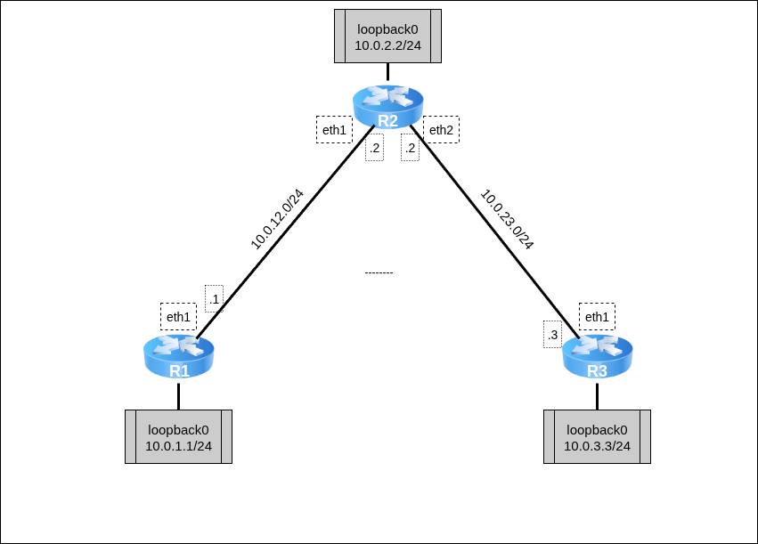

# Лабораторная работа №8  - Маршрутизация сетей с использованием RIP

+ [Все лабораторные работы по сетевым протоколам в Linux](../Intro.md)
+ [Предыдущая лабораторная работа — Статические маршруты и маршруты по умолчанию](../07_StaticRouting/Статические%20маршруты%20и%20маршруты%20по%20умолчанию.md)
+ [Следующая лабораторная работа — Маршрутизация сетей с использованием OSPF](../09_OSPF_Routing/Маршрутизация%20сетей%20с%20использованием%20OSPF.md)

---

## Быстрый поиск по лабораторной:
 + [Протокол RIP](./Маршрутизация%20сетей%20с%20использованием%20RIP.md#Протокол-RIP)
 + [Пример настройки RIP](./Маршрутизация%20сетей%20с%20использованием%20RIP.md#Пример-настройки-RIP)
	 + [Базовая настройка виртуальных машин](./Маршрутизация%20сетей%20с%20использованием%20RIP.md#Базовая-настройка-виртуальных-машин)
	 + [BIRD Routing Daemon](./Маршрутизация%20сетей%20с%20использованием%20RIP.md#BIRD-Routing-Daemon)
	 + [Настройка RIP](./Маршрутизация%20сетей%20с%20использованием%20RIP.md#Настройка-RIP)
 + [Самостоятельная работа](./Маршрутизация%20сетей%20с%20использованием%20RIP.md#Самостоятельная-работа)

---

## Протокол RIP

Протокол [RIP](https://datatracker.ietf.org/doc/html/rfc1058) (Routing Information Protocol) — Протокол маршрутизации по вектору расстояния. В рамках протокола каждый узел передаёт вектор\* расстояний (в качестве метрики расстояния по умолчанию используется количество hop-ов до соответствующего абонента) своим соседям, на основании полученных от них векторов обновляет свой согласно формуле\*\*, и в результате получает вектор расстояний до всех абонентов в сети.

\* Начальный вектор: $\{A:\ 1;\ B:\ 1;\ other:\ None\}$, где:
 - $A,\ B$ — Известные узлу абоненты-соседи;
 - 1 — Метрика расстояния (в терминах количества hop-ов);
 - $other$ — поле, описывающее все остальные сети,
 - $None$ — Указание недостижимости сетей (по умолчанию значением недостижимости принято 16)

\*\* Формула обновления координат:
$D_{new}(self,\ j)\ =\ min(D(self,\ j),\ D(self,\ k)\ +\ D(k,\ j))$, где:
 - $D_{new}(self,\ j)$ — Новое значение расстояния от данного абонента до абонента $j$ (координата RIP-вектора $self$);
 - $D(self,\ j)$ — Текущее значение расстояния от данного абонента до абонента $j$ (координата RIP-вектора $self$);
 - $D(self,\ k)$ — Текущее значение расстояния от данного абонента до абонента $k$ (координата RIP-вектора $self$);
 - $D(k,\ j)$ — Значение расстояния от абонента $k$ до абонента $j$ (координата RIP-вектора $k$);

---

## Пример настройки RIP

Для изучения маршрутизации с помощью RIP разберём топологию между тремя маршрутизаторами.



Для работы создадим 3 [клона](../01_FirstStart/Настройка%20системы%20для%20выполнения%20лабораторных.md) согласно топологии сети. Для создания соединений между машинами необходимо в VirtualBox настроить сетевые интерфейсы (описание настройки подключения находится в разделе [настройки сетевых подключений](../02_SystemGreetings/Знакомство%20с%20системой.md#работа-с-сетевыми-интерфейсами)):

 + `R1`:
	 + Adapter2 — intnet
 + `R2`:
	 + Adapter2 — intnet
	 + Adapter3 — deepnet
 + `R3`:
	 + Adapter2 — deepnet

---

### Базовая настройка виртуальных машин

Для начала настроим IP-адреса на интерфейсах маршрутизаторов согласно топологии. На каждом маршрутизаторе добавим виртуальный loopback-интерфейс. Дополнительно на маршрутизаторе R2 настроим IP-forwarding пакетов.

`@R1`
```console
[root@R1 ~]# ip link set eth1 up
[root@R1 ~]# ip addr add dev eth1 10.0.12.1/24
[root@R1 ~]# ip link add dev lo0 type veth
[root@R1 ~]# ip link set lo0 up
[root@R1 ~]# ip addr add dev lo0 10.0.1.1/24
[root@R1 ~]#
```

`@R2`
```console
[root@R2 ~]# ip link set eth1 up
[root@R2 ~]# ip addr add dev eth1 10.0.12.2/24
[root@R2 ~]# ip link set eth2 up
[root@R2 ~]# ip addr add dev eth2 10.0.23.2/24
[root@R2 ~]# ip link add dev lo0 type veth
[root@R2 ~]# ip link set lo0 up
[root@R2 ~]# ip addr add dev lo0 10.0.2.2/24
[root@R2 ~]#
[root@R2 ~]# sysctl net.ipv4.conf.all.forwarding=1
[root@R2 ~]#
```

`@R3`
```console
[root@R3 ~]# ip link set eth1 up
[root@R3 ~]# ip addr add dev eth1 10.0.23.3/24
[root@R3 ~]# ip link add dev lo0 type veth
[root@R3 ~]# ip link set lo up
[root@R3 ~]# ip addr add dev lo 10.0.3.3/24
[root@R3 ~]#
```

Вместе с описанием IP-адресов в таблице маршрутизации автоматически появятся записи о маршрутах в сетях описанных адресов. Посмотреть эти записи можно с помощью команды `ip route`:

`@R1`
```
[root@R1 ~]# ip route
10.0.1.0/24 dev lo0 proto kernel scope link src 10.0.1.1 linkdown
10.0.12.0/24 dev eth1 proto kernel scope link src 10.0.12.1
[root@R1 ~]#
```

`@R2`
```
[root@R2 ~]# ip route
10.0.2.0/24 dev lo0 proto kernel scope link src 10.0.2.2 linkdown
10.0.12.0/24 dev eth1 proto kernel scope link src 10.0.12.2
10.0.23.0/24 dev eth2 proto kernel scope link src 10.0.23.2
[root@R2 ~]#
```

`@R3`
```
[root@R3 ~]# ip route
10.0.3.0/24 dev lo0 proto kernel scope link src 10.0.3.3 linkdown
10.0.23.0/24 dev eth1 proto kernel scope link src 10.0.23.3
[root@R3 ~]#
```

---

### BIRD Routing Daemon

Для работы протоколов (в частности, протоколов маршрутизации) необходимо использовать специальные программы-менеджеры, которые управляют настройками и параметрами протоколов — Routing Daemons. Для выполнения лабораторной используется демон [BIRD](https://bird.network.cz/doc/bird-3.html). Для настройки демона используется конфигурационный файл `/etc/bird/bird.conf` специального вида.

---

### Настройка RIP

Рассмотрим конфигурационный файл настройки для R1:

`@R1:/etc/bird/bird.conf`
```bird
router id 10.0.1.1;

protocol kernel {
   learn all;
   ipv4 { export all; };
}

protocol device {
   scan time 10;
}

protocol rip {
   interface "eth1", "lo0";
   ipv4 {
       import all;
       export where (net = 10.0.1.0/24) || (net = 10.0.12.0/24);
   };
}
```

Для работы демона необходимо указывать ключевые параметры конфигурации:
 + Описание уникального идентификатора маршрутизатора в сети, «от имени» которого будут рассылаться данные о маршрутах;
 + Структуру `protocol kernel` — она описывает действия, связанные с таблицами маршрутизации ядра системы. Необходимо указать сохранение получаемых данных в таблицах маршрутизации устройства (а не просто передачу этих данных), а также частоту обновления таблиц получаемыми данными;
 + Структуру `protocol device` — она описывает действия самого сетевого устройства. Необходимо указать периодичность сканирования портов на наличие BIRD-данных от других устройств;
 + Структуру `protocol rip` — она описывает действия, связанные с маршрутизацией с помощью протокола:
	 + Указание интерфейсов для приёма-передачи данных RIP;
	 + Экспорт и импорт маршрутов по IPv4 согласно описанным правилам;

Аналогично опишем конфигурационные файлы для R2 и R3:

`@R2:/etc/bird/bird.conf`
```bird
router id 10.0.2.2;

protocol kernel {
   learn all;
   ipv4 { export all; };
}

protocol device {
   scan time 10;
}

protocol rip {
   interface "eth*";
   ipv4 {
       import where net != 10.0.1.0/24;
       export all;
   };
}
```

Заметим, что `R2` не будет принимать данные, связанные с сетью 10.0.1.0/24, и, соответственно, не будет отправлять их далее по топологии.

`@R3:/etc/bird/bird.conf`
```bird
router id 10.0.3.3;

protocol kernel {
       learn all;
       ipv4 { export all; };
}

protocol device {
   scan time 10;
}

protocol rip {
   interface "*";
   ipv4 {
       import all;
       export all;
   };
}
```

Для работы демона необходимо запустить его, вызвав команду `bird`. После с помощью `birdc` можно посмотреть параметры работы демона. С помощью `birdc show route` посмотрите сформированные с помощью RIP данные о маршрутах по указанным интерфейсам (включить демон необходимо на всех абонентах сети, на каждом выполнив команду `bird`).

В таблице маршрутизации при этом должны появиться новые записи о доступных маршрутах с указанием `proto bird` , означающим, что маршрут получен с помощью BIRD-демона (поскольку маршруты не приходят мгновенно, может потребоваться время на получение всех данных). Выведите таблицу маршрутизации с помощью `ip route`:

`@R1`
```console
[root@R1 ~]# bird
[root@R1 ~]# birdc show route
BIRD +detached. ready.
Table master4:
10.0.1.0/24          unicast [kernel1 12:25:54.420] * (10)
       dev lo0
10.0.12.0/24         unicast [kernel1 12:25:54.420] * (10)
       dev eth1
10.0.23.0/24         unicast [rip1 12:26:00.124] * (120/2)
       via 10.0.12.2 on eth1
10.0.2.0/24          unicast [rip1 12:26:00.124] * (120/2)
       via 10.0.12.2 on eth1
10.0.3.0/24          unicast [rip1 12:26:02.896] * (120/3)
       via 10.0.12.2 on eth1
[root@R1 ~]# ip route
10.0.1.0/24 dev lo0 proto kernel scope link src 10.0.1.1 linkdown
10.0.2.0/24 via 10.0.12.2 dev eth1 proto bird metric 32
10.0.3.0/24 via 10.0.12.2 dev eth1 proto bird metric 32
10.0.12.0/24 dev eth1 proto kernel scope link src 10.0.12.1
10.0.23.0/24 via 10.0.12.2 dev eth1 proto bird metric 32
[root@R1 ~]#
```

Убедимся, что информация о маршруте в сеть 10.0.1.0/24 не передалась на `R2` и `R3`

`@R2`
```console
[root@R2 ~]# ip route
10.0.2.0/24 dev lo0 proto kernel scope link src 10.0.2.2 linkdown
10.0.3.0/24 via 10.0.23.3 dev eth2 proto bird metric 32
10.0.12.0/24 dev eth1 proto kernel scope link src 10.0.12.2
10.0.12.0/24 via 10.0.12.1 dev eth1 proto bird metric 32
10.0.23.0/24 dev eth2 proto kernel scope link src 10.0.23.2
[root@R2 ~]#
```

`@R3`
```console
[root@R3 ~]# ip route
10.0.2.0/24 via 10.0.23.2 dev eth1 proto bird metric 32
10.0.3.0/24 dev lo0 proto kernel scope link src 10.0.3.3 linkdown
10.0.12.0/24 via 10.0.23.2 dev eth1 proto bird metric 32
10.0.23.0/24 dev eth1 proto kernel scope link src 10.0.23.3
10.0.23.0/24 via 10.0.23.2 dev eth1 proto bird metric 32
[root@R3 ~]#
```

Проверьте с помощью `ping` доступность всех маршрутизаторов:

`@R1`
```console
[root@R1 ~]# ping -c3 10.0.23.3
PING 10.0.23.3 (10.0.23.3) 56(84) bytes of data.
64 bytes from 10.0.23.3: icmp_seq=1 ttl=63 time=1.00 ms
64 bytes from 10.0.23.3: icmp_seq=2 ttl=63 time=0.872 ms
64 bytes from 10.0.23.3: icmp_seq=3 ttl=63 time=0.854 ms

--- 10.0.23.3 ping statistics ---
3 packets transmitted, 3 received, 0% packet loss, time 2001ms
rtt min/avg/max/mdev = 0.854/0.908/1.000/0.065 ms
[root@R1 ~]# ping -c3 10.0.3.3
PING 10.0.3.3 (10.0.3.3) 56(84) bytes of data.
64 bytes from 10.0.3.3: icmp_seq=1 ttl=63 time=0.903 ms
64 bytes from 10.0.3.3: icmp_seq=2 ttl=63 time=0.838 ms
64 bytes from 10.0.3.3: icmp_seq=3 ttl=63 time=0.990 ms

--- 10.0.3.3 ping statistics ---
3 packets transmitted, 3 received, 0% packet loss, time 2055ms
rtt min/avg/max/mdev = 0.838/0.910/0.990/0.062 ms
[root@R1 ~]#
```

`@R3`
```console
[root@R3 ~]# ping -c3 10.0.1.1
ping: connect: Network is unreachable
[root@R3 ~]# ping -c3 10.0.2.2
PING 10.0.2.2 (10.0.2.2) 56(84) bytes of data.
64 bytes from 10.0.2.2: icmp_seq=1 ttl=64 time=0.591 ms
64 bytes from 10.0.2.2: icmp_seq=2 ttl=64 time=0.448 ms
64 bytes from 10.0.2.2: icmp_seq=3 ttl=64 time=0.567 ms

--- 10.0.2.2 ping statistics ---
3 packets transmitted, 3 received, 0% packet loss, time 2060ms
rtt min/avg/max/mdev = 0.448/0.535/0.591/0.062 ms
[root@R3 ~]#
```

---

## Самостоятельная работа


Для работы необходимо 5 [клонов](../01_FirstStart/Настройка%20системы%20для%20выполнения%20лабораторных.md) согласно топологии сети. Для создания соединений между машинами необходимо в VirtualBox настроить сетевые интерфейсы (описание настройки подключения находится в разделе [настройки сетевых подключений](../02_SystemGreetings/Знакомство%20с%20системой.md#работа-с-сетевыми-интерфейсами)):

 + `R1`:
	 + Adapter2 — net111
	 + Adapter3 — net30
	 + Adapter4 — net50
 + `R2`:
	 + Adapter2 — net30
	 + Adapter3 — net40
 + `R3`:
	 + Adapter2— net222
	 + Adapter3— net40
	 + Adapter4 — net50
 + PC1:
	 + Adapter2— net111
 + PC2:
	 + Adapter2— net222

### Варианты заданий

| Группа | Задание                                                                                                                                                                                                                                     |
| ------ | ------------------------------------------------------------------------------------------------------------------------------------------------------------------------------------------------------------------------------------------- |
| 1      | 1. Создать топологию, указанную на рисунке<br>2. Убедиться, что `PC2` не пингуется с `PC1`<br>3. Настроить RIP между `R1` и `R3`<br>4. Убедиться, что `PC2` пингуется с `PC1` и наоборот<br>5. Выполнить `traceroute` с `PC1` на `PC2`<br> |
| 2      | 1. Создать топологию, указанную на<br>рисунке<br>2. Убедиться, что `PC2` не пингуется с `PC1`<br>3. Настроить RIP так, чтобы `PC2` не мог бы пинговать `R2`, а `PC1` мог бы<br>4. Выполнить `traceroute` с `PC1` и `PC2` на `R2`<br>       |
| 3      | 1. Создать топологию, указанную на рисунке<br>2. Убедиться, что `PC2` не пингуется с `PC1`<br>3. Настроить RIP так, чтобы `PC1` не мог бы пинговать `R2`, а `PC2` мог бы<br>4. Выполнить `traceroute` с `PC1` и `PC2` на<br>`R2`           |
| 4      | 1. Создать топологию, указанную на рисунке<br>2. Убедиться, что `PC2` не пингуется с `PC1`<br>3. Настроить RIP так, чтобы `PC1` не мог бы пинговать `R2`, но мог бы пинговать `R3`<br>4. Выполнить `traceroute` с `PC1` на `R2` и `R3`<br> |
| 5      | 1. Создать топологию, указанную на рисунке<br>2. Убедиться, что `PC2` не пингуется с `PC1`<br>3. Настроить RIP так, чтобы `PC2` не мог бы пинговать `R2` , но мог бы пинговать `R1`<br>4. Выполнить `traceroute` с `PC2` на `R2` и `R1`    |
| 6      | 1. Создать топологию, указанную на рисунке<br>2. Убедиться, что `PC2` не пингуется с `PC1`<br>3. Настроить RIP так, чтобы `PC1` не мог бы пинговать `R2` , но мог бы пинговать `PC2`<br>4. Выполнить `traceroute` с `PC1` на `PC2` и `R2`  |
| 7      | 1. Создать топологию, указанную на рисунке<br>2. Убедиться, что `PC2` не пингуется с `PC1`<br>3. Настроить RIP так, чтобы `PC2` не мог бы пинговать `R2` , но мог бы пинговать `PC1`<br>4. Выполнить `traceroute` с `PC2` на `PC1` и `R2`  |
| 8      | 1. Создать топологию, указанную на рисунке<br>2. Убедиться, что `PC2` не пингуется с `PC1`<br>3. Настроить RIP так, чтобы `R2` мог бы пинговать `PC2` и `PC1`<br>4. Выполнить `traceroute` с `R2` на `PC2` и `PC1`<br>                     |
| 9      | 1. Создать топологию, указанную на рисунке<br>2. Убедиться, что `PC2` не пингуется с `PC1`<br>3. Настроить RIP так, чтобы `R2` мог бы пинговать `PC2` , но не мог бы пинговать `PC1`<br>4. Выполнить `traceroute` с `R2` на `PC2` и `PC1`  |
| 10     | 1. Создать топологию, указанную на рисунке<br>2. Убедиться, что `PC2` не пингуется с `PC1`<br>3. Настроить RIP так, чтобы `R2` мог бы пинговать `PC1`, но не мог бы пинговать `PC2`<br>4. Выполнить `traceroute` с `R2` на `PC2` и `PC1`   |

Запустить [отчёты](../02_SystemGreetings/Знакомство%20с%20системой.md#Сдача-самостоятельных-работ) на каждой машине и выполнить соответствующие команды:

 + `report 6 pc1`
	 + ip a show eth1
	 + ip route
	 + cat /etc/bird/bird.conf
	 + ping -fc3 10.0.50.1
	 + ping -fc3 10.0.30.2
	 + ping -fc3 10.0.40.3
	 + ping -fc3 10.0.222.22
	 + traceroute 10.0.222.22
	 + traceroute 10.0.40.2
 + `report 6 pc2`
	 + ip a show eth1
	 + ip route
	 + cat /etc/bird/bird.conf
	 + ping -fc3 10.0.50.1
	 + ping -fc3 10.0.30.2
	 + ping -fc3 10.0.40.3
	 + ping -fc3 10.0.111.11
	 + traceroute 10.0.111.11
	 + traceroute 10.0.40.2
 + `report 6 r1`
	 + ip a show
	 + ip route
	 + cat /etc/bird/bird.conf
	 + ping -fc3 10.0.30.2
	 + ping -fc3 10.0.40.3
	 + ping -fc3 10.0.111.11
	 + ping -fc3 10.0.222.22
	 + traceroute 10.0.222.22
	 + traceroute 10.0.111.11
 + `report 6 r2`
	 + ip a show
	 + ip route
	 + cat /etc/bird/bird.conf
	 + ping -fc3 10.0.50.1
	 + ping -fc3 10.0.40.3
	 + ping -fc3 10.0.111.11
	 + ping -fc3 10.0.222.22
	 + traceroute 10.0.222.22
	 + traceroute 10.0.111.11
 + `report 6 r3`
	 + ip a show
	 + ip route
	 + cat /etc/bird/bird.conf
	 + ping -fc3 10.0.30.2
	 + ping -fc3 10.0.50.1
	 + ping -fc3 10.0.111.11
	 + ping -fc3 10.0.222.22
	 + traceroute 10.0.222.22
	 + traceroute 10.0.111.11

Полученные отчёты `report.06.pc1`, `report.06.pc2`, `report.06.r1`, `report.06.r2`, `report.06.r3` через последовательный порт перенести из виртуальной машины и прислать их преподавателю с подписью выполненного варианта.
