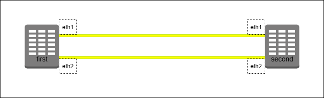

Протокол [STP](https://ru.wikipedia.org/wiki/STP) (Spanning Tree Protocol) предназначен для устранения петель в топологиях с избыточными соединениями путём выделения полного связного дерева. Подзадачами протокола можно выделить _определение корневого коммутатора_ сети и приоритетное _отключение избыточных каналов связи_.

Рассмотрим систему из двух коммутаторов, объединённых двумя каналами связи, и изучим на ней возможности работы с протоколом:


Для работы создадим 2 [клона](../00_FirstStart/%D0%9D%D0%B0%D1%81%D1%82%D1%80%D0%BE%D0%B9%D0%BA%D0%B0%20%D1%81%D0%B8%D1%81%D1%82%D0%B5%D0%BC%D1%8B%20%D0%B4%D0%BB%D1%8F%20%D0%B2%D1%8B%D0%BF%D0%BE%D0%BB%D0%BD%D0%B5%D0%BD%D0%B8%D1%8F%20%D0%BB%D0%B0%D0%B1%D0%BE%D1%80%D0%B0%D1%82%D0%BE%D1%80%D0%BD%D1%8B%D1%85.md) согласно топологии сети. Для создания соединений между машинами необходимо в VirtualBox настроить сетевые интерфейсы (описание настройки подключения находится в разделе [настройки сетевых подключений](../01_SystemGreetings/%D0%97%D0%BD%D0%B0%D0%BA%D0%BE%D0%BC%D1%81%D1%82%D0%B2%D0%BE%20%D1%81%20%D1%81%D0%B8%D1%81%D1%82%D0%B5%D0%BC%D0%BE%D0%B9.md#%D1%80%D0%B0%D0%B1%D0%BE%D1%82%D0%B0-%D1%81-%D1%81%D0%B5%D1%82%D0%B5%D0%B2%D1%8B%D0%BC%D0%B8-%D0%B8%D0%BD%D1%82%D0%B5%D1%80%D1%84%D0%B5%D0%B9%D1%81%D0%B0%D0%BC%D0%B8)):

 + first:
	 + Adapter2 — intnet
	 + Adapter3 — deepnet
 + second:
	 + Adapter2 — intnet
	 + Adapter3 — deepnet

На самих виртуальных машинах для реализации поведения коммутаторов необходимо объединить интерфейсы в сетевые мосты, а также включить все соединения

`@first`
```console
[root@first ~]# ip link add br0 type bridge
[root@first ~]# ip link set eth1 master br0
[root@first ~]# ip link set eth2 master br0
[root@first ~]# ip link set br0 up
[root@first ~]# ip link set eth1 up
[root@first ~]# ip link set eth2 up
[root@first ~]#
```

`@second`
```console
[root@second ~]# ip link add br0 type bridge
[root@second ~]# ip link set eth1 master br0
[root@second ~]# ip link set eth2 master br0
[root@second ~]# ip link set br0 up
[root@second ~]# ip link set eth1 up
[root@second ~]# ip link set eth2 up
[root@second ~]#
```

С помощью команды `ip -d link show br0` подробнее рассмотрим параметры сетевого моста:

`@first`
```console
[root@first ~]# ip -d link show br0
6: br0: <BROADCAST,MULTICAST,UP,LOWER_UP> mtu 1500 qdisc noqueue state UP mode DEFAULT group default ql
en 1000
   link/ether 08:00:27:26:29:ce brd ff:ff:ff:ff:ff:ff promiscuity 0 allmulti 0 minmtu 68 maxmtu 65535
   bridge forward_delay 1500 hello_time 200 max_age 2000 ageing_time 30000 stp_state 0 priority 32768
   vlan_filtering 0 vlan_protocol 802.1Q bridge_id 8000.8:0:27:26:29:ce designated_root 8000.8:0:27:26:29:ce
   root_port 0 root_path_cost 5 topology_change 0 topology_change_detected 0 hello_timer 0.00 tcn_timer 0.00
   topology_change_timer 0.00 gc_timer 31.90 fdb_n_learned 2 fdb_max_learned 0 vlan_default_pvid 1
   vlan_stats_enabled 0 vlan_stats_per_port 0 group_fwd_mask 0 group_address 01:80:c2:00:00:00 mcast_snooping 1
   no_linklocal_learn 0 mcast_vlan_snooping 0 mst_enabled 0 mcast_router 1 mcast_query_use_ifaddr 0
   mcast_querier 0 mcast_hash_elasticity 16 mcast_hash_max 4096 mcast_last_member_count 2 mcast_startup_query_count 2
   mcast_last_member_interval 100 mcast_membership_interval 26000 mcast_querier_interval 25500
   mcast_query_interval 12500 mcast_query_response_interval 1000 mcast_startup_query_interval 3125
   mcast_stats_enabled 0 mcast_igmp_version 2 mcast_mld_version 1 nf_call_iptables 0 nf_call_ip6tables 0
   nf_call_arptables 0 numtxqueues 1 numrxqueues 1 gso_max_size 65536 gso_max_segs 65535 tso_max_size 65536
   tso_max_segs 65535 gro_max_size 65536 gso_ipv4_max_size 65536 gro_ipv4_max_size 65536
[root@first ~]#
```

На работу протокола STP влияют несколько параметров данного сетевого моста:
 + stp_state —  состояние протокола STP на коммутаторе (подключён ли он на данном устройстве или нет);
 + priority — приоритет данного коммутатора, используется для определения корневого коммутатора итогового дерева;
 + bridge_id — идентификатор данного коммутатора, совпадает со значением MAC-адреса интерфейса;
 + designated_port — идентификатор корневого коммутатора, совпадает со значением MAC-адреса интерфейса моста на корневом коммутаторе;
 + root_port — номер корневого порта зависимого (некорневого) коммутатора (0 в случае корневого коммутатора).

Работа протокола подразумевает постоянную передачу служебных сообщений между коммутаторами ([BPDU](https://ru.wikipedia.org/wiki/BPDU)) для синхронизации состояний. За скорость синхронизации отвечают параметры:
 + hello_time — интервал отправки BPDU между соседними коммутаторами;
 + max_age — максимальное время актуальности полученного BPDU (необходимо для обнаружения сбоев и отказов коммутаторов);
 + forward_delay — задержка отправки BPDU после изменения топологии системы (время нахождения портов коммутатора в состоянии `listening`).

На данный момент в системе протокол STP отключён. Оба коммутатора считают себя единственными (и потому корневыми) коммутаторами в системе.

`@first`
```console
[root@first ~]# bridge link
3: eth1: <BROADCAST,MULTICAST,UP,LOWER_UP> mtu 1500 master br0 state forwarding priority 32 cost 5
4: eth2: <BROADCAST,MULTICAST,UP,LOWER_UP> mtu 1500 master br0 state forwarding priority 32 cost 5
[root@first ~]# ip -d link show br0 | grep root
   bridge <...> stp_state 0 priority 32768 <...>
   bridge_id 8000.8:0:27:26:29:ce designated_root 8000.8:0:27:26:29:ce root_port 0 <...>
[root@first ~]#
```

`@second`
```console
[root@second ~]# bridge link
3: eth1: <BROADCAST,MULTICAST,UP,LOWER_UP> mtu 1500 master br0 state forwarding priority 32 cost 5
4: eth2: <BROADCAST,MULTICAST,UP,LOWER_UP> mtu 1500 master br0 state forwarding priority 32 cost 5
[root@second ~]# ip -d link show br0 | grep root
   bridge <...> stp_state 0 priority 32768 <...>
   bridge_id 8000.8:0:27:5a:86:5c designated_root 8000.8:0:27:5a:86:5c root_port 0 <...>
[root@second ~]#
```

Подключим протокол STP, дождёмся синхронизации устройств:

`@first`
```console
[root@first ~]# ip link set dev br0 type bridge stp_state 1
<Some time later>
[root@first ~]# ip -d link show br0 | grep root
   bridge <...> stp_state 1 priority 32768 <...>
   bridge_id 8000.8:0:27:26:29:ce designated_root 8000.8:0:27:26:29:ce root_port 0 <...>
[root@first ~]# bridge link
3: eth1: <BROADCAST,MULTICAST,UP,LOWER_UP> mtu 1500 master br0 state forwarding priority 32 cost 5
4: eth2: <BROADCAST,MULTICAST,UP,LOWER_UP> mtu 1500 master br0 state forwarding priority 32 cost 5
[root@first ~]#
```

`@second`
```console
[root@second ~]# ip link set dev br0 type bridge stp_state 1
<Some time later>
[root@second ~]# ip -d link show br0 | grep root
   bridge <...> stp_state 1 priority 32768 <...>
   bridge_id 8000.8:0:27:5a:86:5c designated_root 8000.8:0:27:26:29:ce root_port 1 <...>
[root@second ~]# bridge link
3: eth1: <BROADCAST,MULTICAST,UP,LOWER_UP> mtu 1500 master br0 state forwarding priority 32 cost 5
4: eth2: <BROADCAST,MULTICAST,UP,LOWER_UP> mtu 1500 master br0 state blocking priority 32 cost 5
[root@second ~]#
```

Поскольку приоритеты коммутаторов одинаковы, корневым автоматически становится коммутатор с меньшим `bridge_id`. У зависимого коммутатора при этом меняются значения `designated_root` и `root_port`.
***ВАЖНО:*** поскольку MAC-адреса созданных клонов могут отличаться от представленных в лабораторной, внимательно следите за обозначениями виртуальных машин, для которых выполняются команды. Для удобства в тексте далее будут использоваться обозначения «корневой коммутатор» и «зависимый коммутатор».

Для смены корневого коммутатора можно изменить приоритет. Для этого на зависимом коммутаторе установим новое значение приоритета. После синхронизации он стал корневым, а второй коммутатор — зависимым.
`@second`
```console
[root@second ~]# ip link set dev br0 type bridge priority 4096
[root@second ~]# ip -d link show br0 | grep priority
   bridge <...> priority 4096 <...>
   bridge_id 1000.8:0:27:5a:86:5c designated_root 1000.8:0:27:5a:86:5c root_port 0 <...>
[root@second ~]# bridge link
3: eth1: <BROADCAST,MULTICAST,UP,LOWER_UP> mtu 1500 master br0 state forwarding priority 32 cost 5
4: eth2: <BROADCAST,MULTICAST,UP,LOWER_UP> mtu 1500 master br0 state listening priority 32 cost 5
<Some time later>
[root@second ~]# bridge link
3: eth1: <BROADCAST,MULTICAST,UP,LOWER_UP> mtu 1500 master br0 state forwarding priority 32 cost 5
4: eth2: <BROADCAST,MULTICAST,UP,LOWER_UP> mtu 1500 master br0 state forwarding priority 32 cost 5
```

`@first`
```console
<Some time later>
[root@first ~]# ip -d link show br0 | grep priority
   bridge <...> priority 32768 <...>
   bridge_id 8000.8:0:27:26:29:ce designated_root 1000.8:0:27:5a:86:5c root_port 1 <...>
[root@first ~]# bridge link
3: eth1: <BROADCAST,MULTICAST,UP,LOWER_UP> mtu 1500 master br0 state forwarding priority 32 cost 5
4: eth2: <BROADCAST,MULTICAST,UP,LOWER_UP> mtu 1500 master br0 state blocking priority 32 cost 5
[root@first ~]#
```

Для управления каналами передачи данных используются настройки приоритета портов и «стоимости» каналов.

Изменим приоритет интерфейса на _корневом_ коммутаторе — на _зависимом_ коммутаторе поменяются статусы каналов, активным станет канал с меньшим значением `priority`.

`@second`
```console
[root@second ~]# bridge link set dev eth1 priority 63
[root@second ~]# bridge link
3: eth1: <BROADCAST,MULTICAST,UP,LOWER_UP> mtu 1500 master br0 state forwarding priority 63 cost 5
4: eth2: <BROADCAST,MULTICAST,UP,LOWER_UP> mtu 1500 master br0 state forwarding priority 32 cost 5
[root@second ~]#
```

`@first`
```console
<Some time later>
[root@first ~]# ip -d link show br0 | grep priority
   bridge <...> priority 32768 <...>
   bridge_id 8000.8:0:27:26:29:ce designated_root 1000.8:0:27:5a:86:5c root_port 2 <...>
[root@first ~]# bridge link
3: eth1: <BROADCAST,MULTICAST,UP,LOWER_UP> mtu 1500 master br0 state blocking priority 32 cost 5
4: eth2: <BROADCAST,MULTICAST,UP,LOWER_UP> mtu 1500 master br0 state listening priority 32 cost 5
[root@first ~]#
```

Теперь изменим значение стоимости канала на _зависимом_ коммутаторе, таким образом вернув активное соединение на первый интерфейс:

`@first`
```console
[root@first ~]# bridge link set dev eth2 cost 20000
[root@first ~]# bridge link
3: eth1: <BROADCAST,MULTICAST,UP,LOWER_UP> mtu 1500 master br0 state listening priority 32 cost 5
4: eth2: <BROADCAST,MULTICAST,UP,LOWER_UP> mtu 1500 master br0 state blocking priority 32 cost 20000
<Some time later>
[root@first ~]# bridge link
3: eth1: <BROADCAST,MULTICAST,UP,LOWER_UP> mtu 1500 master br0 state forwarding priority 32 cost 5
4: eth2: <BROADCAST,MULTICAST,UP,LOWER_UP> mtu 1500 master br0 state blocking priority 32 cost 20000
[root@first ~]#
```