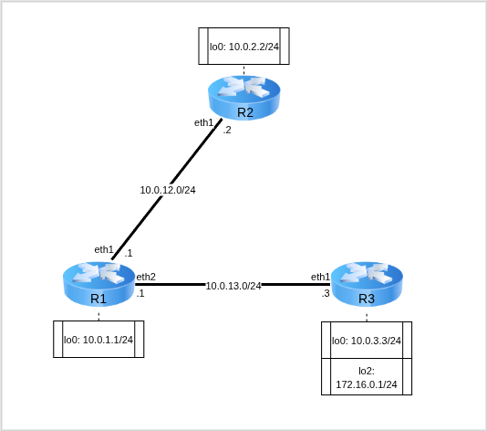

# Лабораторная работа №9 — Маршрутизация сетей с использованием OSPF

 + [Все лабораторные работы по сетевым протоколам в Linux](../Intro.md)
 + [Предыдущая лабораторная работа — Маршрутизация сетей с использованием RIP](../08_RIP_Routing/Маршрутизация%20сетей%20с%20использованием%20RIP.md)
 + [Следующая лабораторная работа — Фильтрация трафика при помощи списков контроля доступа](../10_ACL/Фильтрация%20трафика%20при%20помощи%20списков%20контроля%20доступа.md)

---

## Быстрый поиск по лабораторной:
 + [Протокол OSPF](./Маршрутизация%20сетей%20с%20использованием%20OSPF.md#Протокол-OSPF)
 + [Пример настройки OSPF](./Маршрутизация%20сетей%20с%20использованием%20OSPF.md#Пример-настройки-OSPF)
	 + [Базовая настройка виртуальных машин](./Маршрутизация%20сетей%20с%20использованием%20OSPF.md#Базовая-настройка-виртуальных-машин)
	 + [BIRD Routing Daemon](./Маршрутизация%20сетей%20с%20использованием%20OSPF.md#BIRD-Routing-Daemon)
	 + [Настройка OSPF](./Маршрутизация%20сетей%20с%20использованием%20OSPF.md#Настройка-OSPF)
 + [Самостоятельная работа](./Маршрутизация%20сетей%20с%20использованием%20OSPF.md#Самостоятельная-работа)
	 + [Варианты заданий](./Маршрутизация%20сетей%20с%20использованием%20OSPF.md#Варианты-заданий)

**Цель лабораторной** — познакомить изучающего с основами протокола маршрутизации OSPF

**Задачи лабораторной:**
 + Изучить логику работы протокола;
 + Изучить агента маршрутизации BIRD для настройки OSPF;
 + Реализовать тестовую топологию с применением протокола маршрутизации OSPF.

---

## Протокол OSPF

Протокол [OSPF](https://datatracker.ietf.org/doc/html/rfc2328) (Open Shortest Path First) — Протокол маршрутизации по состоянию канала.

Глобально протокол можно разделить на два этапа — _обмен данными_ и _построение маршрутов_. Данные этапы могут конвейерным образом сочетаться.

При обмене данными каждый узел передаёт своим соседям данные заголовков LSA (Link State Advertisement) интерфейсов из своей базы данных. При получении новых записей или обновления данных о каком-то канале узел запоминает эти данные и запрашивает полные данные LSA. На основании полных данных строится взвешенный ориентированный остовный граф всей сетевой топологии, веса рассчитываются согласно метрике _стоимости_ канала (некоторой величины на базе информации о состоянии канала)

После получения полных данных, на этапе построения маршрутов, используется алгоритм Дейкстры для построения связного ориентированного остовного дерева маршрутов с минимальной стоимостью.

---

## Пример настройки OSPF

Для изучения маршрутизации с помощью OSPF разберём топологию между тремя маршрутизаторами.



Для работы создадим 3 [клона](../01_FirstStart/Настройка%20системы%20для%20выполнения%20лабораторных.md) согласно топологии сети. Для создания соединений между машинами необходимо в VirtualBox настроить сетевые интерфейсы (описание настройки подключения находится в разделе [настройки сетевых подключений](../02_SystemGreetings/Знакомство%20с%20системой.md#работа-с-сетевыми-интерфейсами)):

 + `R1`:
	 + Adapter2 — intnet
	 + Adapter3 — deepnet
 + `R2`:
	 + Adapter2 — intnet
 + `R3`:
	 + Adapter2 — deepnet

---

### Базовая настройка виртуальных машин

:round_pushpin: 1. С помощью команд управления интерфейсами создайте и включите интерфейсы согласно топологии

`@R1`
```console
[root@R1 ~]# ip link set eth1 up
[root@R1 ~]# ip link set eth2 up
[root@R1 ~]# ip link add dev lo0 type veth
[root@R1 ~]# ip link set lo0 up
[root@R1 ~]#
```

`@R2`
```console
[root@R2 ~]# ip link set eth1 up
[root@R2 ~]# ip link add dev lo0 type veth
[root@R2 ~]# ip link set lo0 up
[root@R2 ~]#
```

`@R3`
```console
[root@R3 ~]# ip link set eth1 up
[root@R3 ~]# ip link add dev lo0 type veth
[root@R3 ~]# ip link add dev lo2 type veth
[root@R3 ~]# ip link set lo0 up
[root@R3 ~]# ip link set lo2 up
[root@R3 ~]#
```

С помощью команд настройки IP-адресов и настройки IP-Forwarding на маршрутизаторах установите адреса согласно топологии.

`@R1`
```console
[root@R1 ~]# ip addr add dev eth1 10.0.12.1/24
[root@R1 ~]# ip addr add dev eth2 10.0.13.1/24
[root@R1 ~]# ip addr add dev lo0 10.0.1.1/24
[root@R1 ~]#
[root@R1 ~]# sysctl net.ipv4.conf.all.forwarding=1
[root@R1 ~]#
```

`@R2`
```console
[root@R2 ~]# ip addr add dev eth1 10.0.12.2/24
[root@R2 ~]# ip addr add dev lo0 10.0.2.2/24
[root@R2 ~]#
```

`@R3`
```console
[root@R3 ~]# ip addr add dev eth1 10.0.13.3/24
[root@R3 ~]# ip addr add dev lo0 10.0.3.3/24
[root@R3 ~]# ip addr add dev lo2 172.16.0.1/24
[root@R3 ~]#
```

:round_pushpin: 2.  С помощью команд управления таблицами маршрутизации на маршрутизаторах выведите данные всех таблиц маршрутизации

`@R1`
```console
[root@R1 ~]# ip route
10.0.1.0/24 dev lo0 proto kernel scope link src 10.0.1.1 linkdown
10.0.12.0/24 dev eth1 proto kernel scope link src 10.0.12.1
10.0.13.0/24 dev eth2 proto kernel scope link src 10.0.13.1
```

`@R2`
```console
[root@R2 ~]# ip route
10.0.2.0/24 dev lo0 proto kernel scope link src 10.0.2.2 linkdown
10.0.12.0/24 dev eth1 proto kernel scope link src 10.0.12.2
```

`@R3`
```console
[root@R3 ~]# ip route
10.0.3.0/24 dev lo0 proto kernel scope link src 10.0.3.3 linkdown
10.0.13.0/24 dev eth1 proto kernel scope link src 10.0.13.3
172.16.0.0/24 dev lo2 proto kernel scope link src 172.16.0.1 linkdown
```

---

### BIRD Routing Daemon

:information_source: Для работы протоколов (в частности, протоколов маршрутизации) необходимо использовать специальные программы-менеджеры, которые управляют настройками и параметрами протоколов — Routing Daemons. Для выполнения лабораторной используется демон [BIRD](https://bird.network.cz/doc/bird-3.html). Для настройки демона используется конфигурационный файл `/etc/bird/bird.conf` специального вида.

---

### Настройка OSPF

:round_pushpin: 1. Опишите (или скопируйте) конфигурационный файл для R1 в соответствующем файле виртуальной машины

`@R1:/etc/bird/bird.conf`
```console
router id 10.0.1.1;

protocol kernel {
       scan time 20;
       ipv4 { export all; };
}

protocol device {
       scan time 10;
}

protocol ospf SIMPLE {
       ipv4 { export all; };
       area 0.0.0.0 {
               interface "eth1" {
               };
               interface "eth2" {
               };
               interface "lo0" {
               };
       };
}
```

:information_source: Конфигурационный файл включает в себя:
 + описание уникального идентификатора маршрутизатора в сети, «от имени» которого будут рассылаться данные о маршрутах;
 + структуру `protocol kernel` — она описывает действия, связанные с таблицами маршрутизации ядра системы;
 + структуру `protocol device` — она описывает действия самого сетевого устройства;
 + структуру `protocol ospf` — она описывает действия, связанные с маршрутизацией с помощью протокола:
	 + Экспорт всей OSPF-информации о доступных маршрутах по IPv4;
	 + Экспорт данных всем устройствам за указанными интерфейсами.

:round_pushpin: 2. Аналогично опишите (или скопируйте) конфигурационные файлы для R2 и R3

`@R2:/etc/bird/bird.conf`
```console
router id 10.0.2.2;

protocol kernel {
       scan time 20;
       ipv4 { export all; };
}

protocol device {
       scan time 10;
}

protocol ospf SIMPLE {
       ipv4 { export all; };
       area 0.0.0.0 {
               interface "eth1" {
               };
               interface "lo0" {
               };
       };
}
```

`@R3:/etc/bird/bird.conf`
```console
router id 10.0.3.3;

protocol kernel {
       scan time 20;
       ipv4 { export all; };
}

protocol device {
       scan time 10;
}

protocol ospf SIMPLE {
       ipv4 { export all; };
       area 0.0.0.0 {
               interface "eth1" {
               };
               interface "eth2" {
               };
               interface "lo0" {
               };
               interface "lo2" {
               };
       };
}
```

:round_pushpin: 3. С помощью команды `bird` запустите BIRD на _каждом_ из устройств

:information_source: C помощью команды `birdc` можно посмотреть параметры работы демона.

:round_pushpin: 4. С помощью команды `birdc show route` посмотрите список OSPF-данных, передаваемых BIRD

`@R1`
```console
[root@R1 ~]# bird
[root@R1 ~]# birdc
BIRD +detached. ready.
bird> show route
Table master4:
10.0.12.0/24         unicast [SIMPLE 01:41:40.630] * I (150/10) [10.0.1.1]
       dev eth1
10.0.13.0/24         unicast [SIMPLE 01:41:40.631] * I (150/10) [10.0.1.1]
       dev eth2
10.0.1.1/32          unicast [SIMPLE 01:41:40.631] * I (150/0) [10.0.1.1]
       dev lo0
bird>
```

:information_source: В таблице маршрутизации после запуска должны появиться новые записи о доступных маршрутах с указанием `proto bird` , означающим, что маршрут получен с помощью BIRD-демона (поскольку маршруты не приходят мгновенно, может потребоваться время на получение всех данных).

:round_pushpin: 5. С помощью команды управления таблицами маршрутизации убедитесь, что таблицы маршрутизации на устройствах изменились в соответствии с данными от BIRD

`@R1`
```console
[root@R1 ~]# ip route
10.0.1.0/24 dev lo0 proto kernel scope link src 10.0.1.1 linkdown
10.0.1.1 dev lo0 proto bird scope link metric 32 linkdown
10.0.2.2 via 10.0.12.2 dev eth1 proto bird metric 32
10.0.3.3 via 10.0.13.3 dev eth2 proto bird metric 32
10.0.12.0/24 dev eth1 proto kernel scope link src 10.0.12.1
10.0.12.0/24 dev eth1 proto bird scope link metric 32
10.0.13.0/24 dev eth2 proto kernel scope link src 10.0.13.1
10.0.13.0/24 dev eth2 proto bird scope link metric 32
172.16.0.1 via 10.0.13.3 dev eth2 proto bird metric 32
```

`@R2`
```console
[root@R2 ~]# ip route
10.0.2.0/24 dev lo0 proto kernel scope link src 10.0.2.2 linkdown
10.0.2.2 dev lo0 proto bird scope link metric 32 linkdown
10.0.12.0/24 dev eth1 proto kernel scope link src 10.0.12.2
10.0.12.0/24 dev eth1 proto bird scope link metric 32
[root@R2 ~]#

<Some time later>

[root@R2 ~]# ip route
10.0.1.1 via 10.0.12.1 dev eth1 proto bird metric 32
10.0.2.0/24 dev lo0 proto kernel scope link src 10.0.2.2 linkdown
10.0.2.2 dev lo0 proto bird scope link metric 32 linkdown
10.0.3.3 via 10.0.12.1 dev eth1 proto bird metric 32
10.0.12.0/24 dev eth1 proto kernel scope link src 10.0.12.2
10.0.12.0/24 dev eth1 proto bird scope link metric 32
10.0.13.0/24 via 10.0.12.1 dev eth1 proto bird metric 32
172.16.0.1 via 10.0.12.1 dev eth1 proto bird metric 32
```

`@R3`
```console
[root@R3 ~]# ip route
10.0.1.1 via 10.0.13.1 dev eth1 proto bird metric 32
10.0.2.2 via 10.0.13.1 dev eth1 proto bird metric 32
10.0.3.0/24 dev lo0 proto kernel scope link src 10.0.3.3 linkdown
10.0.3.3 dev lo0 proto bird scope link metric 32 linkdown
10.0.12.0/24 via 10.0.13.1 dev eth1 proto bird metric 32
10.0.13.0/24 dev eth1 proto kernel scope link src 10.0.13.3
10.0.13.0/24 dev eth1 proto bird scope link metric 32
172.16.0.0/24 dev lo2 proto kernel scope link src 172.16.0.1 linkdown
172.16.0.1 dev lo2 proto bird scope link metric 32 linkdown
```

:round_pushpin: 6. С помощью команды `ping -c3 <dstIP>` проверьте достижимость отдельных сетей с разных устройств

`@R1`
```console
[root@R1 ~]# ping -c3 10.0.2.2
PING 10.0.2.2 (10.0.2.2) 56(84) bytes of data.
64 bytes from 10.0.2.2: icmp_seq=1 ttl=64 time=0.348 ms
64 bytes from 10.0.2.2: icmp_seq=2 ttl=64 time=0.409 ms
64 bytes from 10.0.2.2: icmp_seq=3 ttl=64 time=0.392 ms

--- 10.0.2.2 ping statistics ---
3 packets transmitted, 3 received, 0% packet loss, time 2024ms
rtt min/avg/max/mdev = 0.348/0.383/0.409/0.025 ms
[root@R1 ~]#
```

`@R2`
```console
[root@R2 ~]# ping -c3 172.16.0.1
PING 172.16.0.1 (172.16.0.1) 56(84) bytes of data.
64 bytes from 172.16.0.1: icmp_seq=1 ttl=63 time=0.665 ms
64 bytes from 172.16.0.1: icmp_seq=2 ttl=63 time=0.489 ms
64 bytes from 172.16.0.1: icmp_seq=3 ttl=63 time=0.711 ms

--- 172.16.0.1 ping statistics ---
3 packets transmitted, 3 received, 0% packet loss, time 2067ms
rtt min/avg/max/mdev = 0.489/0.621/0.711/0.095 ms
[root@R2 ~]#
```


---

## Самостоятельная работа


Для работы необходимо 5 [клонов](../01_FirstStart/Настройка%20системы%20для%20выполнения%20лабораторных.md) согласно топологии сети. Для создания соединений между машинами необходимо в VirtualBox настроить сетевые интерфейсы (описание настройки подключения находится в разделе [настройки сетевых подключений](../02_SystemGreetings/Знакомство%20с%20системой.md#работа-с-сетевыми-интерфейсами)):

 + `R1`:
	 + Adapter2 — net111
	 + Adapter3 — net30
	 + Adapter4 — net50
 + `R2`:
	 + Adapter2 — net30
	 + Adapter3 — net40
 + `R3`:
	 + Adapter2— net222
	 + Adapter3— net40
	 + Adapter4 — net50
 + PC1:
	 + Adapter2— net111
 + PC2:
	 + Adapter2— net222

---

### Варианты заданий


| Группа | Задание                                                                                                                                                                                                                                                     |
| ------ | ----------------------------------------------------------------------------------------------------------------------------------------------------------------------------------------------------------------------------------------------------------- |
| 1      | 1. Создать топологию, указанную на рисунке<br>2. Убедиться, что `PC2` не пингуется с `PC1`<br>3. Настроить OSPF между `R1` и `R3`<br>4. Убедиться, что `PC2` пингуется с `PC1` и наоборот<br>5. Выполнить `traceroute` с `PC1` на `PC2`<br>                 |
| 2      | 1. Создать топологию, указанную на<br>рисунке<br>2. Убедиться, что `PC2` не пингуется с `PC1`<br>3. Настроить OSPF так, чтобы `PC2` не мог бы пинговать `R2`, а `PC1` мог бы<br>4. Выполнить `traceroute` с `PC1` и `PC2` на `R2`<br>       |
| 3      | 1. Создать топологию, указанную на рисунке<br>2. Убедиться, что `PC2` не пингуется с `PC1`<br>3. Настроить OSPF так, чтобы `PC1` не мог бы пинговать `R2`, а `PC2` мог бы<br>4. Выполнить `traceroute` с `PC1` и `PC2` на<br>`R2`           |
| 4      | 1. Создать топологию, указанную на рисунке<br>2. Убедиться, что `PC2` не пингуется с `PC1`<br>3. Настроить OSPF так, чтобы `PC1` не мог бы пинговать `R2`, но мог бы пинговать `R3`<br>4. Выполнить `traceroute` с `PC1` на `R2` и `R3`<br> |
| 5      | 1. Создать топологию, указанную на рисунке<br>2. Убедиться, что `PC2` не пингуется с `PC1`<br>3. Настроить OSPF так, чтобы `PC2` не мог бы пинговать `R2` , но мог бы пинговать `R1`<br>4. Выполнить `traceroute` с `PC2` на `R2` и `R1`    |
| 6      | 1. Создать топологию, указанную на рисунке<br>2. Убедиться, что `PC2` не пингуется с `PC1`<br>3. Настроить OSPF так, чтобы `PC1` не мог бы пинговать `R2` , но мог бы пинговать `PC2`<br>4. Выполнить `traceroute` с `PC1` на `PC2` и `R2`  |
| 7      | 1. Создать топологию, указанную на рисунке<br>2. Убедиться, что `PC2` не пингуется с `PC1`<br>3. Настроить OSPF так, чтобы `PC2` не мог бы пинговать `R2` , но мог бы пинговать `PC1`<br>4. Выполнить `traceroute` с `PC2` на `PC1` и `R2`  |
| 8      | 1. Создать топологию, указанную на рисунке<br>2. Убедиться, что `PC2` не пингуется с `PC1`<br>3. Настроить OSPF так, чтобы `R2` мог бы пинговать `PC2` и `PC1`<br>4. Выполнить `traceroute` с `R2` на `PC2` и `PC1`<br>                     |
| 9      | 1. Создать топологию, указанную на рисунке<br>2. Убедиться, что `PC2` не пингуется с `PC1`<br>3. Настроить OSPF так, чтобы `R2` мог бы пинговать `PC2` , но не мог бы пинговать `PC1`<br>4. Выполнить `traceroute` с `R2` на `PC2` и `PC1`  |
| 10     | 1. Создать топологию, указанную на рисунке<br>2. Убедиться, что `PC2` не пингуется с `PC1`<br>3. Настроить OSPF так, чтобы `R2` мог бы пинговать `PC1`, но не мог бы пинговать `PC2`<br>4. Выполнить `traceroute` с `R2` на `PC2` и `PC1`   |

:round_pushpin: Запустить [отчёты](../02_SystemGreetings/Знакомство%20с%20системой.md#Сдача-самостоятельных-работ) на каждой машине и выполнить соответствующие команды:

 + `report 9 pc1`
	 + ip a show eth1
	 + ip route
	 + cat /etc/bird/bird.conf
	 + ping -fc3 10.0.50.1
	 + ping -fc3 10.0.30.2
	 + ping -fc3 10.0.40.3
	 + ping -fc3 10.0.222.22
	 + traceroute 10.0.222.22
	 + traceroute 10.0.40.2
 + `report 9 pc2`
	 + ip a show eth1
	 + ip route
	 + cat /etc/bird/bird.conf
	 + ping -fc3 10.0.50.1
	 + ping -fc3 10.0.30.2
	 + ping -fc3 10.0.40.3
	 + ping -fc3 10.0.111.11
	 + traceroute 10.0.111.11
	 + traceroute 10.0.40.2
 + `report 9 r1`
	 + ip a show
	 + ip route
	 + cat /etc/bird/bird.conf
	 + ping -fc3 10.0.30.2
	 + ping -fc3 10.0.40.3
	 + ping -fc3 10.0.111.11
	 + ping -fc3 10.0.222.22
	 + traceroute 10.0.222.22
	 + traceroute 10.0.111.11
 + `report 9 r2`
	 + ip a show
	 + ip route
	 + cat /etc/bird/bird.conf
	 + ping -fc3 10.0.50.1
	 + ping -fc3 10.0.40.3
	 + ping -fc3 10.0.111.11
	 + ping -fc3 10.0.222.22
	 + traceroute 10.0.222.22
	 + traceroute 10.0.111.11
 + `report 9 r3`
	 + ip a show
	 + ip route
	 + cat /etc/bird/bird.conf
	 + ping -fc3 10.0.30.2
	 + ping -fc3 10.0.50.1
	 + ping -fc3 10.0.111.11
	 + ping -fc3 10.0.222.22
	 + traceroute 10.0.222.22
	 + traceroute 10.0.111.11

:round_pushpin: Полученные отчёты `report.09.pc1`, `report.09.pc2`, `report.09.r1`, `report.09.r2`, `report.09.r3` через последовательный порт перенести из виртуальной машины и прислать их преподавателю с подписью выполненного варианта.
