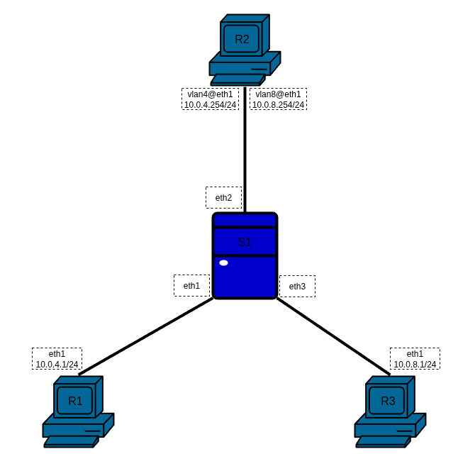
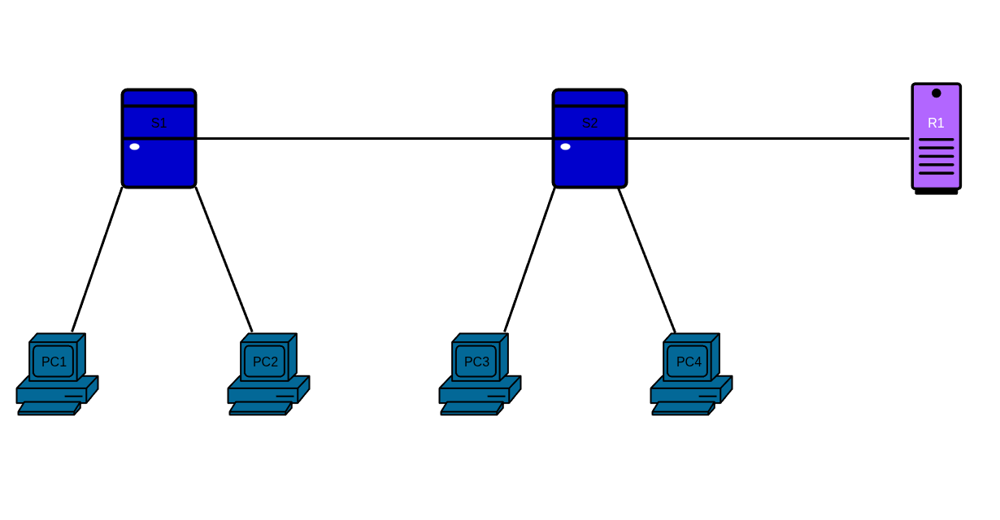

Для изучения маршрутизации в сетях с VLAN разберём топологию с двумя сетями и настроим трафик между ними через пограничный маршрутизатор, способный передавать пакеты в обеих сетях.



Для работы создадим 4 [клона](../00_FirstStart/%D0%9D%D0%B0%D1%81%D1%82%D1%80%D0%BE%D0%B9%D0%BA%D0%B0%20%D1%81%D0%B8%D1%81%D1%82%D0%B5%D0%BC%D1%8B%20%D0%B4%D0%BB%D1%8F%20%D0%B2%D1%8B%D0%BF%D0%BE%D0%BB%D0%BD%D0%B5%D0%BD%D0%B8%D1%8F%20%D0%BB%D0%B0%D0%B1%D0%BE%D1%80%D0%B0%D1%82%D0%BE%D1%80%D0%BD%D1%8B%D1%85.md) согласно топологии сети. Для создания соединений между машинами необходимо в VirtualBox настроить сетевые интерфейсы (описание настройки подключения находится в разделе [настройки сетевых подключений](../01_SystemGreetings/%D0%97%D0%BD%D0%B0%D0%BA%D0%BE%D0%BC%D1%81%D1%82%D0%B2%D0%BE%20%D1%81%20%D1%81%D0%B8%D1%81%D1%82%D0%B5%D0%BC%D0%BE%D0%B9.md#%D1%80%D0%B0%D0%B1%D0%BE%D1%82%D0%B0-%D1%81-%D1%81%D0%B5%D1%82%D0%B5%D0%B2%D1%8B%D0%BC%D0%B8-%D0%B8%D0%BD%D1%82%D0%B5%D1%80%D1%84%D0%B5%D0%B9%D1%81%D0%B0%D0%BC%D0%B8)):

 + `R1`:
	 + Adapter2 — left4
 + `R2`:
	 + Adapter2 — trunk
 + `R3`:
	 + Adapter2 — right8
 + `S1`:
	 + Adapter2 — left4
	 + Adapter3 — trunk
	 + Adapter4 — right8

Настроим IP-адреса абонентов `R1`и `R3`:

`@R1`
```console
[root@R1 ~]# ip link set eth1 up
[root@R1 ~]# ip addr add dev eth1 10.0.4.1/24
[root@R1 ~]#
```


`@R3`
```console
[root@R3 ~]# ip link set eth1 up
[root@R3 ~]# ip addr add dev eth1 10.0.8.1/24
[root@R3 ~]#
```

Поскольку трафик необходимо будет направлять через пограничный маршрутизатор, на нём должны быть явные интерфейсы локальных сетей с присвоенными IP-адресами. Так как физический канал связи по топологии один, необходимо создать виртуальные интерфейсы. На `R2` для каждой локальной сети создадим отдельный виртуальный VLAN-интерфейс.

`@R2`
```console
[root@R2 ~]# ip link add link eth1 name vlan4 type vlan id 4
[root@R2 ~]# ip link add link eth1 name vlan8 type vlan id 8
[root@R2 ~]# ip addr add dev vlan4 10.0.4.254/24
[root@R2 ~]# ip addr add dev vlan8 10.0.8.254/24
[root@R2 ~]# ip link set eth1 up
[root@R2 ~]# ip link set vlan4 up
[root@R2 ~]# ip link set vlan8 up
[root@R2 ~]#
```

Для проброса пакетов между сетевыми интерфейсами при передаче необходимо изменить настройку `net.ipv4.conf.all.forwarding`:

`@R2`
```console
[root@R2 ~]# sysctl net.ipv4.conf.all.forwarding
net.ipv4.conf.all.forwarding = 0
[root@R2 ~]# sysctl net.ipv4.conf.all.forwarding=1
[root@R2 ~]#
```

На `S1` создадим сетевой мост для L2-маршрутизации и фильтрации VLAN.
S1:
```console
[root@S1 ~]# ip link add dev br0 type bridge vlan_filtering 1
[root@S1 ~]# ip link set eth1 master br0
[root@S1 ~]# ip link set eth2 master br0
[root@S1 ~]# ip link set eth3 master br0
```

```console
[root@S1 ~]# bridge vlan add vid 4 dev eth1 pvid untagged
[root@S1 ~]# bridge vlan add vid 8 dev eth3 pvid untagged
[root@S1 ~]# bridge vlan add vid 4 dev eth2
[root@S1 ~]# bridge vlan add vid 8 dev eth2
```

```console
[root@S1 ~]# for I in `ls /sys/class/net`; do ip link set $I up; done
```

Для связи абонентов добавим статические маршруты на `R1` и `R3` через пограничный маршрутизатор `R2`:

`@R1`
```console
[root@R1 ~]# ip route add default via 10.0.4.254
```

`@R3`
```console
[root@R3 ~]# ip route add default via 10.0.8.254
```

На `R2` запустим `tcpdump -xx -i eth1` для изучения трафика:

`@R2`
```console
[root@R2 ~]# tcpdump -xx -i eth1
tcpdump: verbose output suppressed, use -v[v]... for full protocol decode
listening on eth1, link-type EN10MB (Ethernet), snapshot length 262144 bytes

```

`@R1`
```console
[root@R1 ~]# ping -c3 10.0.8.1
PING 10.0.8.1 (10.0.8.1) 56(84) bytes of data.
64 bytes from 10.0.8.1: icmp_seq=1 ttl=63 time=3.28 ms
64 bytes from 10.0.8.1: icmp_seq=2 ttl=63 time=1.87 ms
64 bytes from 10.0.8.1: icmp_seq=3 ttl=63 time=1.97 ms

--- 10.0.8.1 ping statistics ---
3 packets transmitted, 3 received, 0% packet loss, time 2002ms
rtt min/avg/max/mdev = 1.868/2.371/3.282/0.644 ms
[root@R1 ~]#
```

Каждый ping request-reply в `tcpdump` сопровождается четырьмя отметками: двумя для исходящего пакета и двумя для ответного. Отметки об одном и том же пакете отличаются только в 13-16 байтах (конец первой строки каждого пакета). Это тэг VID: 0x8100 это информационные байты, сообщающие о наличии тэга в заголовке, 0x0008 и 0x0004 — сами значения идентификаторов тэга.

`@R2`
```console
[root@R2 ~]# tcpdump -xx -i eth1
tcpdump: verbose output suppressed, use -v[v]... for full protocol decode
listening on eth1, link-type EN10MB (Ethernet), snapshot length 262144 bytes
20:25:49.360836 IP 10.0.4.1 > 10.0.8.1: ICMP echo request, id 2, seq 1, length 64
       0x0000:  0800 2719 4dcd 0800 27f5 ce47 8100 0004
       0x0010:  0800 4500 0054 0023 4000 4001 1a85 0a00
       0x0020:  0401 0a00 0801 0800 c6f6 0002 0001 4d5f
       0x0030:  d068 0000 0000 546b 0000 0000 0000 1011
       0x0040:  1213 1415 1617 1819 1a1b 1c1d 1e1f 2021
       0x0050:  2223 2425 2627 2829 2a2b 2c2d 2e2f 3031
       0x0060:  3233 3435 3637
20:25:49.360855 IP 10.0.4.1 > 10.0.8.1: ICMP echo request, id 2, seq 1, length 64
       0x0000:  0800 27b3 98a5 0800 2719 4dcd 8100 0008
       0x0010:  0800 4500 0054 0023 4000 3f01 1b85 0a00
       0x0020:  0401 0a00 0801 0800 c6f6 0002 0001 4d5f
       0x0030:  d068 0000 0000 546b 0000 0000 0000 1011
       0x0040:  1213 1415 1617 1819 1a1b 1c1d 1e1f 2021
       0x0050:  2223 2425 2627 2829 2a2b 2c2d 2e2f 3031
       0x0060:  3233 3435 3637
20:25:49.361696 IP 10.0.8.1 > 10.0.4.1: ICMP echo reply, id 2, seq 1, length 64
       0x0000:  0800 2719 4dcd 0800 27b3 98a5 8100 0008
       0x0010:  0800 4500 0054 2bb9 0000 4001 2eef 0a00
       0x0020:  0801 0a00 0401 0000 cef6 0002 0001 4d5f
       0x0030:  d068 0000 0000 546b 0000 0000 0000 1011
       0x0040:  1213 1415 1617 1819 1a1b 1c1d 1e1f 2021
       0x0050:  2223 2425 2627 2829 2a2b 2c2d 2e2f 3031
       0x0060:  3233 3435 3637
20:25:49.361705 IP 10.0.8.1 > 10.0.4.1: ICMP echo reply, id 2, seq 1, length 64
       0x0000:  0800 27f5 ce47 0800 2719 4dcd 8100 0004
       0x0010:  0800 4500 0054 2bb9 0000 3f01 2fef 0a00
       0x0020:  0801 0a00 0401 0000 cef6 0002 0001 4d5f
       0x0030:  d068 0000 0000 546b 0000 0000 0000 1011
       0x0040:  1213 1415 1617 1819 1a1b 1c1d 1e1f 2021
       0x0050:  2223 2425 2627 2829 2a2b 2c2d 2e2f 3031
       0x0060:  3233 3435 3637
<...>
```

# Самостоятельная работа




1. Определить свой вариант **X**, как свой номер по порядку в упорядоченном по алфавиту списке группы.
2. Создать топологию, изображенную выше.
3. `PC1` и `PC3` должны быть объединены в один VLAN с номером (**X** + 10). `PC2` и `PC4` должны быть объединены в другой VLAN с номером (**X** + 20).
4. Реализовать пересылку между VLAN через маршрутизатор `R1`
5. IP-адреса для сетевых устройств в VLAN (**X** + 10) брать из сети 10.0.{**X**+10}.0/24. IP-адреса для сетевых устройств в VLAN (**X** + 20) брать из сети 10.0.{**X**+20}.0/24.


