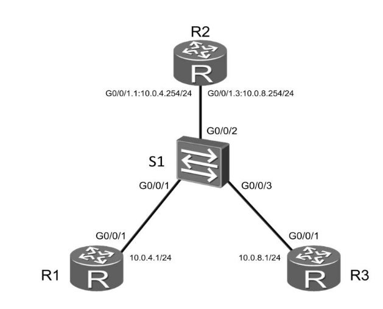

R1:
```
[root@R1 ~]# ip link set eth1 up
[root@R1 ~]# ip addr add dev eth1 10.0.4.1/24
[root@R1 ~]# ip route add default via 10.0.4.254
```

R2:
```
[root@R2 ~]# ip link add link eth1 name vlan4 type vlan id 4
[root@R2 ~]# ip link add link eth1 name vlan8 type vlan id 8
[root@R2 ~]# ip addr add dev vlan4 10.0.4.254/24
[root@R2 ~]# ip addr add dev vlan8 10.0.8.254/24
[root@R2 ~]# ip link set eth1 up
[root@R2 ~]# ip link set vlan4 up
[root@R2 ~]# ip link set vlan8 up
[root@R2 ~]# sysctl net.ipv4.conf.eth1.forwarding=1
[root@R2 ~]#
```

	# к слову, все ping кроме нужного и так без forwarding пинговались; vlan4 и vlan8 ведь сидят на одном интерфейсе, проброса не нужно, но я всё равно пробовал и так, и так


R3:
```
[root@R3 ~]# ip link set eth1 up
[root@R3 ~]# ip addr add dev eth1 10.0.8.1/24
[root@R3 ~]# ip route add default via 10.0.8.254
```


S1:
```
[root@S1 ~]# ip link add dev br0 type bridge vlan_filtering 1
[root@S1 ~]# ip link set eth1 master br0
[root@S1 ~]# ip link set eth2 master br0
[root@S1 ~]# ip link set eth3 master br0
[root@S1 ~]# bridge vlan add vid 4 dev eth1 pvid untagged
[root@S1 ~]# bridge vlan add vid 8 dev eth3 pvid untagged
[root@S1 ~]# bridge vlan add vid 4 dev eth2
[root@S1 ~]# bridge vlan add vid 8 dev eth2
[root@S1 ~]# for I in `ls /sys/class/net`; do ip link set $I up; done
```

Тесты с R1:
```
[root@R1 ~]# ping -c1 10.0.4.254
PING 10.0.4.254 (10.0.4.254) 56(84) bytes of data.
64 bytes from 10.0.4.254: icmp_seq=1 ttl=64 time=0.875 ms

--- 10.0.4.254 ping statistics ---
1 packets transmitted, 1 received, 0% packet loss, time 0ms
rtt min/avg/max/mdev = 0.875/0.875/0.875/0.000 ms
[root@R1 ~]# ping -c1 10.0.8.254
PING 10.0.8.254 (10.0.8.254) 56(84) bytes of data.
64 bytes from 10.0.8.254: icmp_seq=1 ttl=64 time=0.909 ms

--- 10.0.8.254 ping statistics ---
1 packets transmitted, 1 received, 0% packet loss, time 0ms
rtt min/avg/max/mdev = 0.909/0.909/0.909/0.000 ms
[root@R1 ~]# ping -c1 10.0.8.1
PING 10.0.8.1 (10.0.8.1) 56(84) bytes of data.

--- 10.0.8.1 ping statistics ---
1 packets transmitted, 0 received, 100% packet loss, time 0ms

[root@R1 ~]#
```

