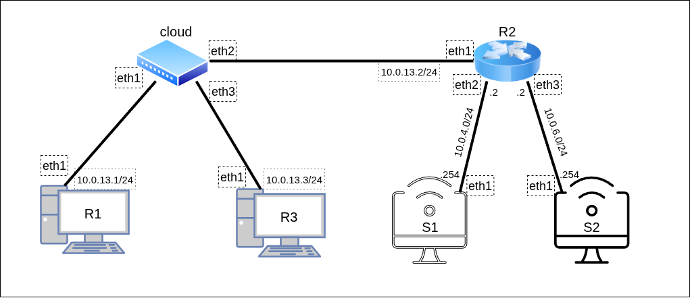

Для изучения списков контроля доступа рассмотрим следующую топологию:



Для работы создадим 6 [клонов](../00_FirstStart/%D0%9D%D0%B0%D1%81%D1%82%D1%80%D0%BE%D0%B9%D0%BA%D0%B0%20%D1%81%D0%B8%D1%81%D1%82%D0%B5%D0%BC%D1%8B%20%D0%B4%D0%BB%D1%8F%20%D0%B2%D1%8B%D0%BF%D0%BE%D0%BB%D0%BD%D0%B5%D0%BD%D0%B8%D1%8F%20%D0%BB%D0%B0%D0%B1%D0%BE%D1%80%D0%B0%D1%82%D0%BE%D1%80%D0%BD%D1%8B%D1%85.md) согласно топологии сети. Для создания соединений между машинами необходимо в VirtualBox настроить сетевые интерфейсы (описание настройки подключения находится в разделе [настройки сетевых подключений](../01_SystemGreetings/%D0%97%D0%BD%D0%B0%D0%BA%D0%BE%D0%BC%D1%81%D1%82%D0%B2%D0%BE%20%D1%81%20%D1%81%D0%B8%D1%81%D1%82%D0%B5%D0%BC%D0%BE%D0%B9.md#%D1%80%D0%B0%D0%B1%D0%BE%D1%82%D0%B0-%D1%81-%D1%81%D0%B5%D1%82%D0%B5%D0%B2%D1%8B%D0%BC%D0%B8-%D0%B8%D0%BD%D1%82%D0%B5%D1%80%D1%84%D0%B5%D0%B9%D1%81%D0%B0%D0%BC%D0%B8)):

 + `cloud`:
	 + Adapter2 — cloud1
	 + Adapter3 — cloud2
	 + Adapter4 — cloud3
+ `R1`:
	 + Adapter2 — cloud1
 + `R2`:
	 + Adapter2 — cloud2
	 + Adapter3 — wgetnet
	 + Adapter4 — sshnet
 + `S1`:
	 + Adapter2 — wgetnet
 + `S2`:
	 + Adapter2 — sshnet

В начале настроим коммутатор cloud, маршрутизатор R2 и абонентов R1, R3, S1 и S2 согласно топологии:

`@cloud`
```console
[root@cloud ~]# ip link add dev br0 type bridge
[root@cloud ~]# ip link set eth1 master br0
[root@cloud ~]# ip link set eth2 master br0
[root@cloud ~]# ip link set eth3 master br0
[root@cloud ~]# for I in `ls /sys/class/net`; do ip link set $I up; done

[root@cloud ~]# ip a
1: lo: <LOOPBACK,UP,LOWER_UP> mtu 65536 qdisc noqueue state UNKNOWN group default qlen 1000
   link/loopback 00:00:00:00:00:00 brd 00:00:00:00:00:00
   inet 127.0.0.1/8 scope host lo
      valid_lft forever preferred_lft forever
2: eth0: <BROADCAST,MULTICAST,UP,LOWER_UP> mtu 1500 qdisc fq_codel state UNKNOWN group default qlen 1000
   link/ether 08:00:27:9a:c3:88 brd ff:ff:ff:ff:ff:ff
   altname enp0s3
   altname enx0800279ac388
3: eth1: <BROADCAST,MULTICAST,UP,LOWER_UP> mtu 1500 qdisc fq_codel master br0 state UP group default qlen 1000
   link/ether 08:00:27:cc:36:bb brd ff:ff:ff:ff:ff:ff
   altname enp0s8
   altname enx080027cc36bb
4: eth2: <BROADCAST,MULTICAST,UP,LOWER_UP> mtu 1500 qdisc fq_codel master br0 state UP group default qlen 1000
   link/ether 08:00:27:03:69:49 brd ff:ff:ff:ff:ff:ff
   altname enp0s9
   altname enx080027036949
5: eth3: <BROADCAST,MULTICAST,UP,LOWER_UP> mtu 1500 qdisc fq_codel master br0 state UP group default qlen 1000
   link/ether 08:00:27:31:f1:49 brd ff:ff:ff:ff:ff:ff
   altname enp0s10
   altname enx08002731f149
6: br0: <BROADCAST,MULTICAST,UP,LOWER_UP> mtu 1500 qdisc noqueue state UP group default qlen 1000
   link/ether 08:00:27:03:69:49 brd ff:ff:ff:ff:ff:ff
[root@cloud ~]#
```

`@S1`
```console
[root@S1 ~]# ip link set eth1 up
[root@S1 ~]# ip addr add dev eth1 10.0.4.254/24
```

`@S2`
```console
[root@S2 ~]# ip link set eth1 up
[root@S2 ~]# ip addr add dev eth1 10.0.6.254/24
```

`@R1`
```console
[root@R1 ~]# ip link set eth1 up
[root@R1 ~]# ip addr add dev eth1 10.0.13.1/24
```

`@R3`
```console
[root@R3 ~]# ip link set eth1 up
[root@R3 ~]# ip addr add dev eth1 10.0.13.3/24
```

`@R2`
```console
[root@R2 ~]# ip link set eth1 up
[root@R2 ~]# ip link set eth2 up
[root@R2 ~]# ip link set eth3 up
[root@R2 ~]# ip addr add dev eth1 10.0.13.2/24
[root@R2 ~]# ip addr add dev eth2 10.0.4.2/24
[root@R2 ~]# ip addr add dev eth3 10.0.6.2/24
[root@R2 ~]# sysctl net.ipv4.conf.all.forwarding=1
```

Для маршрутизации абонентов настроим протокол OSPF с помощью демона bird, описав на устройствах данные конфигурационные файлы:

`@S1` : `/etc/bird/bird.conf`
```bird
router id 10.0.4.254;

protocol kernel {
      scan time 20;
      ipv4 { export all; };
}

protocol device {
      scan time 10;
}

protocol ospf SIMPLE {
      ipv4 { export all; };
      area 0.0.0.0 {
             interface "eth1" {
             };
      };
}
```

`@S2` : `/etc/bird/bird.conf`
```bird
router id 10.0.6.254;

protocol kernel {
      scan time 20;
      ipv4 { export all; };
}

protocol device {
      scan time 10;
}

protocol ospf SIMPLE {
      ipv4 { export all; };
      area 0.0.0.0 {
             interface "eth1" {
             };
      };
}
```

`@R1` : `/etc/bird/bird.conf`
```bird
router id 10.0.13.1;

protocol kernel {
      scan time 20;
      ipv4 { export all; };
}

protocol device {
      scan time 10;
}

protocol ospf SIMPLE {
      ipv4 { export all; };
      area 0.0.0.0 {
             interface "eth1" {
             };
      };
}
```

`@R3`: `/etc/bird/bird.conf`
```bird
router id 10.0.13.3;

protocol kernel {
      scan time 20;
      ipv4 { export all; };
}

protocol device {
      scan time 10;
}

protocol ospf SIMPLE {
      ipv4 { export all; };
      area 0.0.0.0 {
             interface "eth1" {
             };
      };
}
```

`@R2`: `/etc/bird/bird.conf`
```bird
router id 10.0.13.2;

protocol kernel {
      scan time 20;
      ipv4 { export all; };
}

protocol device {
      scan time 10;
}

protocol ospf SIMPLE {
      ipv4 { export all; };
      area 0.0.0.0 {
             interface "eth1" {
             };
             interface "eth2" {
             };
             interface "eth3" {
             };
      };
}
```

Запустим демон на всех устройствах. Убедимся, что данные передаются правильно, и что с R-узлов сети можно достичь S-узлы:

`@S1`
```console
[root@S1 ~]# bird
[root@S1 ~]#
```

`@S2`
```console
[root@S2 ~]# bird
[root@S2 ~]#
```

`@R2`
```console
[root@R2 ~]# bird
[root@R2 ~]# birdc show route
BIRD +detached. ready.
Table master4:
10.0.13.0/24         unicast [SIMPLE 13:16:32.302] * I (150/10) [10.0.13.2]
       dev eth1
10.0.4.0/24          unicast [SIMPLE 13:16:32.302] * I (150/10) [10.0.13.2]
       dev eth2
10.0.6.0/24          unicast [SIMPLE 13:16:32.302] * I (150/10) [10.0.13.2]
       dev eth3

[root@R2 ~]# ip route
10.0.4.0/24 dev eth2 proto kernel scope link src 10.0.4.2
10.0.4.0/24 dev eth2 proto bird scope link metric 32
10.0.6.0/24 dev eth3 proto kernel scope link src 10.0.6.2
10.0.6.0/24 dev eth3 proto bird scope link metric 32
10.0.13.0/24 dev eth1 proto kernel scope link src 10.0.13.2
10.0.13.0/24 dev eth1 proto bird scope link metric 32
[root@R2 ~]#
```

`@R1`
```console
[root@R1 ~]# bird
[root@R1 ~]# birdc show route
BIRD +detached. ready.
Table master4:
10.0.13.0/24         unicast [SIMPLE 13:17:39.181] * I (150/10) [10.0.13.3]
       dev eth1
10.0.4.0/24          unicast [SIMPLE 13:17:44.181] * I (150/20) [10.0.13.2]
       via 10.0.13.2 on eth1
10.0.6.0/24          unicast [SIMPLE 13:17:44.181] * I (150/20) [10.0.13.2]
       via 10.0.13.2 on eth1

[root@R1 ~]# ip route
10.0.4.0/24 via 10.0.13.2 dev eth1 proto bird metric 32
10.0.6.0/24 via 10.0.13.2 dev eth1 proto bird metric 32
10.0.13.0/24 dev eth1 proto kernel scope link src 10.0.13.1
10.0.13.0/24 dev eth1 proto bird scope link metric 32

[root@R1 ~]# ping -c3 10.0.4.254
PING 10.0.4.254 (10.0.4.254) 56(84) bytes of data.
64 bytes from 10.0.4.254: icmp_seq=1 ttl=63 time=1.26 ms
64 bytes from 10.0.4.254: icmp_seq=3 ttl=63 time=1.20 ms

--- 10.0.4.254 ping statistics ---
3 packets transmitted, 3 received, 0% packet loss, time 2002ms
rtt min/avg/max/mdev = 1.161/1.207/1.262/0.041 ms

[root@R1 ~]# ping -c3 10.0.6.254
PING 10.0.6.254 (10.0.6.254) 56(84) bytes of data.
64 bytes from 10.0.6.254: icmp_seq=1 ttl=63 time=1.29 ms
64 bytes from 10.0.6.254: icmp_seq=2 ttl=63 time=1.09 ms
64 bytes from 10.0.6.254: icmp_seq=3 ttl=63 time=2.05 ms

--- 10.0.6.254 ping statistics ---
3 packets transmitted, 3 received, 0% packet loss, time 2002ms
rtt min/avg/max/mdev = 1.087/1.475/2.052/0.416 ms
[root@R1 ~]#
```


`@R3`
```console
[root@R3 ~]# bird
<Some time later>
[root@R3 ~]# ping -c3 10.0.4.254
PING 10.0.4.254 (10.0.4.254) 56(84) bytes of data.
64 bytes from 10.0.4.254: icmp_seq=1 ttl=63 time=1.61 ms
64 bytes from 10.0.4.254: icmp_seq=2 ttl=63 time=1.76 ms
64 bytes from 10.0.4.254: icmp_seq=3 ttl=63 time=1.03 ms

--- 10.0.4.254 ping statistics ---
3 packets transmitted, 3 received, 0% packet loss, time 2003ms
rtt min/avg/max/mdev = 1.027/1.467/1.763/0.317 ms

[root@R3 ~]# ping -c3 10.0.6.254
PING 10.0.6.254 (10.0.6.254) 56(84) bytes of data.
64 bytes from 10.0.6.254: icmp_seq=1 ttl=63 time=1.90 ms
64 bytes from 10.0.6.254: icmp_seq=2 ttl=63 time=1.07 ms
64 bytes from 10.0.6.254: icmp_seq=3 ttl=63 time=1.05 ms

--- 10.0.6.254 ping statistics ---
3 packets transmitted, 3 received, 0% packet loss, time 2002ms
rtt min/avg/max/mdev = 1.046/1.340/1.903/0.398 ms
[root@R3 ~]#
```

Настроим правила доступа к S1 и S2. На данный момент никаких ограничений нет, доступ открыт всем абонентам сети для всех операций в сети. Мы будем рассматривать конкретно HTTP-запрос на загрузку данных, а также SSH-подключение к абонентам. Для теста запустим на обоих S-узлах HTTP-серверы с помощью встроенный модулей python:

`@S1`
```console
[root@S1 ~]# python3 -m http.server
Serving HTTP on 0.0.0.0 port 8000 (http://0.0.0.0:8000/) ...

Keyboard interrupt received, exiting.
[root@S1 ~]# python3 -m http.server
Serving HTTP on 0.0.0.0 port 8000 (http://0.0.0.0:8000/) ...

```

`@S2`
```console
[root@S2 ~]# python3 -m http.server
Serving HTTP on 0.0.0.0 port 8000 (http://0.0.0.0:8000/) ...

Keyboard interrupt received, exiting.
[root@S2 ~]# python3 -m http.server
Serving HTTP on 0.0.0.0 port 8000 (http://0.0.0.0:8000/) ...
```

Убедимся, что на данный момент имеется полный доступ к обоим абонентам:
 + С помощью wget будем выполнять HTTP-запрос; скачивание файла означает доступ к устройству, зависание — отсутствие доступа;
 + С помощью ssh будем подключаться к устройству; подключение означает доступ к устройству, зависание — отсутствие доступа.

\*При первом ssh-подключении может появиться запрос на разрешение подключения. Необходимо **явно** написать `yes` в ответ на вопрос в терминал

`@R1`
```console
[root@R1 ~]# wget 10.0.4.254:8000
Prepended http:// to '10.0.4.254:8000'
--2025-10-06 19:13:42--  http://10.0.4.254:8000/
Connecting to 10.0.4.254:8000... connected.
HTTP request sent, awaiting response... 200 OK
Length: 1142 (1.1K) [text/html]
Saving to: 'index.html.1'

index.html.1              100%[====================================>]   1.12K  --.-KB/s    in 0s

2025-10-06 19:13:42 (54.2 MB/s) - 'index.html.1' saved [1142/1142]

[root@R1 ~]# wget 10.0.6.254:8000
Prepended http:// to '10.0.6.254:8000'
--2025-10-06 19:13:57--  http://10.0.6.254:8000/
Connecting to 10.0.6.254:8000... connected.
HTTP request sent, awaiting response... 200 OK
Length: 1087 (1.1K) [text/html]
Saving to: 'index.html.2'

index.html.2              100%[====================================>]   1.06K  --.-KB/s    in 0s

2025-10-06 19:13:57 (33.8 MB/s) - 'index.html.2' saved [1087/1087]

[root@R1 ~]# ssh 10.0.4.254
Last login: Mon Oct  6 13:42:04 2025 from 10.0.13.1
[root@S1 ~]#
logout
Connection to 10.0.4.254 closed.

[root@R1 ~]# ssh 10.0.6.254
The authenticity of host '10.0.6.254 (10.0.6.254)' can't be established.
ED25519 key fingerprint is SHA256:BxaYoHAW5ddfM6EwmgSAZ2tKXCH0zoppLfEcQ8YiGdg.
This host key is known by the following other names/addresses:
   ~/.ssh/known_hosts:3: 10.0.4.254
Are you sure you want to continue connecting (yes/no/[fingerprint])? yes
Warning: Permanently added '10.0.6.254' (ED25519) to the list of known hosts.
Last login: Mon Oct  6 18:58:46 2025 from 10.0.13.3
[root@S2 ~]#
logout
Connection to 10.0.6.254 closed.
[root@R1 ~]#
```

`@R3`
```console
[root@R3 ~]# wget 10.0.4.254:8000
Prepended http:// to '10.0.4.254:8000'
--2025-10-06 19:13:45--  http://10.0.4.254:8000/
Connecting to 10.0.4.254:8000... connected.
HTTP request sent, awaiting response... 200 OK
Length: 1142 (1.1K) [text/html]
Saving to: 'index.html'

index.html                100%[====================================>]   1.12K  --.-KB/s    in 0s

2025-10-06 19:13:45 (66.8 MB/s) - 'index.html' saved [1142/1142]

[root@R3 ~]# wget 10.0.6.254:8000
Prepended http:// to '10.0.6.254:8000'
--2025-10-06 19:13:54--  http://10.0.6.254:8000/
Connecting to 10.0.6.254:8000... connected.
HTTP request sent, awaiting response... 200 OK
Length: 1087 (1.1K) [text/html]
Saving to: 'index.html.1'

index.html.1              100%[====================================>]   1.06K  --.-KB/s    in 0s

2025-10-06 19:13:54 (31.1 MB/s) - 'index.html.1' saved [1087/1087]

[root@R3 ~]# ssh 10.0.4.254
The authenticity of host '10.0.4.254 (10.0.4.254)' can't be established.
ED25519 key fingerprint is SHA256:BxaYoHAW5ddfM6EwmgSAZ2tKXCH0zoppLfEcQ8YiGdg.
This host key is known by the following other names/addresses:
   ~/.ssh/known_hosts:3: 10.0.6.254
Are you sure you want to continue connecting (yes/no/[fingerprint])? yes
Warning: Permanently added '10.0.4.254' (ED25519) to the list of known hosts.
Last login: Mon Oct  6 19:14:00 2025 from 10.0.13.1
[root@S1 ~]#
logout
Connection to 10.0.4.254 closed.

[root@R3 ~]# ssh 10.0.6.254
Last login: Mon Oct  6 19:14:08 2025 from 10.0.13.1
[root@S2 ~]#
logout
Connection to 10.0.6.254 closed.
[root@R3 ~]#
```

Как видно из показаний серверов, ода соединения к каждому из абонентов прошли успешно:

`@S1`
```console
[root@S1 ~]# python3 -m http.server
Serving HTTP on 0.0.0.0 port 8000 (http://0.0.0.0:8000/) ...

Keyboard interrupt received, exiting.
[root@S1 ~]# python3 -m http.server
Serving HTTP on 0.0.0.0 port 8000 (http://0.0.0.0:8000/) ...
10.0.13.1 - - [06/Oct/2025 19:13:35] "GET / HTTP/1.1" 200 -
10.0.13.3 - - [06/Oct/2025 19:13:45] "GET / HTTP/1.1" 200 -
```

`@S2`
```console
[root@S2 ~]# python3 -m http.server
Serving HTTP on 0.0.0.0 port 8000 (http://0.0.0.0:8000/) ...

Keyboard interrupt received, exiting.
[root@S2 ~]# python3 -m http.server
Serving HTTP on 0.0.0.0 port 8000 (http://0.0.0.0:8000/) ...
10.0.13.1 - - [06/Oct/2025 19:13:50] "GET / HTTP/1.1" 200 -
10.0.13.3 - - [06/Oct/2025 19:13:54] "GET / HTTP/1.1" 200 -
```

Теперь настроим следующие ограничения доступа:
 + R1 будет иметь доступ к 8000 порту абонента S1 (для wget)
 + R3 будет иметь доступ к 22 порту абонента S2 (для ssh)
 + _Любые другие_ соединения R1 и R3 с S1 и S2 запрещены

Настройку списков контроля доступа осуществим с помощью команд `ip rule`, позволяющих манипулировать таблицами маршрутизации. Опишем следующие правила (далее будут описаны 6 правил, которые буквально описаны командами ip rule на маршрутизаторе R2):
 + Пакеты от R1 к S1 на порт 8000 обработать согласно стандартной таблице маршрутизации;
 + Остальные пакеты от R1 к S1 сбрасывать без обработки;
 + Пакеты от R1 к S2 сбрасывать без обработки;
 + Пакеты от R3 к S2 на порт 22 обработать согласно стандартной таблице маршрутизации;
 + Остальные пакеты от R3 к S2 сбрасывать без обработки;
 + Пакеты от R3 к S1 сбрасывать без обработки;

Чтобы правила (1), (4) не поглощались правилами (2), (3), (5), (6), им выдан приоритет (чем ниже значение, тем приоритетнее правило). Начальная и итоговая таблица могут быть выведены командой ip rule без параметров:

`@R2`
```console
[root@R2 ~]# ip rule
0:      from all lookup local
32766:  from all lookup main
32767:  from all lookup default

[root@R2 ~]# ip rule add from 10.0.13.1 to 10.0.4.254 dport 8000 priority 1 table main
[root@R2 ~]# ip rule add blackhole from 10.0.13.1 to 10.0.4.254 priority 2
[root@R2 ~]# ip rule add blackhole from 10.0.13.1 to 10.0.6.254 priority 2
[root@R2 ~]# ip rule add from 10.0.13.3 to 10.0.6.254 dport 22 priority 1 table main
[root@R2 ~]# ip rule add blackhole from 10.0.13.3 to 10.0.6.254 priority 2
[root@R2 ~]# ip rule add blackhole from 10.0.13.3 to 10.0.4.254 priority 2

[root@R2 ~]# ip rule
0:      from all lookup local
1:      from 10.0.13.1 to 10.0.4.254 dport 8000 lookup main
1:      from 10.0.13.3 to 10.0.6.254 dport 22 lookup main
2:      from 10.0.13.1 to 10.0.4.254 blackhole
2:      from 10.0.13.1 to 10.0.6.254 blackhole
2:      from 10.0.13.3 to 10.0.6.254 blackhole
2:      from 10.0.13.3 to 10.0.4.254 blackhole
32766:  from all lookup main
32767:  from all lookup default
[root@R2 ~]#
```

Проверим, что R1 и R3 не потеряли связь с R2, но не могут организовать поток обычного трафика на S1 и S2:

`@R1`
```console
[root@R1 ~]# ping -c3 10.0.13.2
PING 10.0.13.2 (10.0.13.2) 56(84) bytes of data.
64 bytes from 10.0.13.2: icmp_seq=1 ttl=64 time=0.539 ms
64 bytes from 10.0.13.2: icmp_seq=2 ttl=64 time=0.596 ms
64 bytes from 10.0.13.2: icmp_seq=3 ttl=64 time=0.435 ms

--- 10.0.13.2 ping statistics ---
3 packets transmitted, 3 received, 0% packet loss, time 2079ms
rtt min/avg/max/mdev = 0.435/0.523/0.596/0.066 ms
[root@R1 ~]# ping -c3 10.0.4.254
PING 10.0.4.254 (10.0.4.254) 56(84) bytes of data.

--- 10.0.4.254 ping statistics ---
3 packets transmitted, 0 received, 100% packet loss, time 2033ms

[root@R1 ~]# ping -c3 10.0.6.254
PING 10.0.6.254 (10.0.6.254) 56(84) bytes of data.

--- 10.0.6.254 ping statistics ---
3 packets transmitted, 0 received, 100% packet loss, time 2046ms

[root@R1 ~]#
```

`@R3`
```console
[root@R3 ~]# ping -c3 10.0.13.2
PING 10.0.13.2 (10.0.13.2) 56(84) bytes of data.
64 bytes from 10.0.13.2: icmp_seq=1 ttl=64 time=0.452 ms
64 bytes from 10.0.13.2: icmp_seq=2 ttl=64 time=0.569 ms
64 bytes from 10.0.13.2: icmp_seq=3 ttl=64 time=0.435 ms

--- 10.0.13.2 ping statistics ---
3 packets transmitted, 3 received, 0% packet loss, time 2081ms
rtt min/avg/max/mdev = 0.435/0.485/0.569/0.059 ms
[root@R3 ~]# ping -c3 10.0.4.254
PING 10.0.4.254 (10.0.4.254) 56(84) bytes of data.

--- 10.0.4.254 ping statistics ---
3 packets transmitted, 0 received, 100% packet loss, time 2051ms

[root@R3 ~]# ping -c3 10.0.6.254
PING 10.0.6.254 (10.0.6.254) 56(84) bytes of data.

--- 10.0.6.254 ping statistics ---
3 packets transmitted, 0 received, 100% packet loss, time 2063ms

[root@R3 ~]#
```

Убедимся, что для R1 и R3 доступны только разрешённые соединения и больше никакие:

`@R1`
```console
[root@R1 ~]# wget -t=1 10.0.4.254:8000
Prepended http:// to '10.0.4.254:8000'
--2025-10-06 19:24:48--  http://10.0.4.254:8000/
Connecting to 10.0.4.254:8000... connected.
HTTP request sent, awaiting response... 200 OK
Length: 1142 (1.1K) [text/html]
Saving to: 'index.html'

index.html                100%[====================================>]   1.12K  --.-KB/s    in 0s

2025-10-06 19:24:48 (72.1 MB/s) - 'index.html' saved [1142/1142]

[root@R1 ~]# wget -t=1 10.0.6.254:8000
Prepended http:// to '10.0.6.254:8000'
--2025-10-06 19:24:53--  http://10.0.6.254:8000/
Connecting to 10.0.6.254:8000...^C
[root@R1 ~]# ssh 10.0.4.254
^C
[root@R1 ~]# ssh 10.0.6.254
^C
[root@R1 ~]#
```

`@R2`
```console
[root@R3 ~]# wget -t=1 10.0.4.254:8000
Prepended http:// to '10.0.4.254:8000'
--2025-10-06 19:26:32--  http://10.0.4.254:8000/
Connecting to 10.0.4.254:8000...^C
[root@R3 ~]# wget -t=1 10.0.6.254:8000
Prepended http:// to '10.0.6.254:8000'
--2025-10-06 19:26:38--  http://10.0.6.254:8000/
Connecting to 10.0.6.254:8000...^C
[root@R3 ~]# ssh 10.0.4.254
^C
[root@R3 ~]# ssh 10.0.6.254
Last login: Mon Oct  6 19:14:31 2025 from 10.0.13.3
[root@S2 ~]#
logout
Connection to 10.0.6.254 closed.
[root@R3 ~]#
```