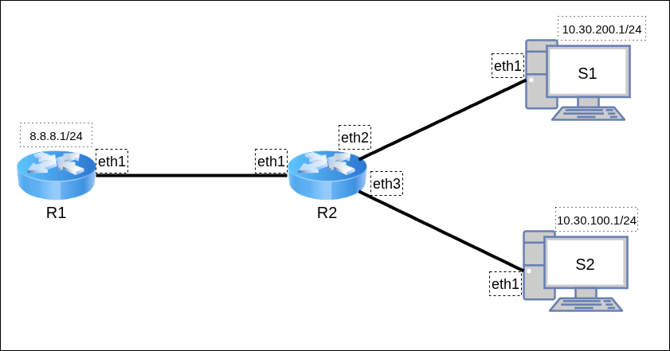

# Лабораторная работа №10 — Фильтрация трафика при помощи списков контроля доступа

 + [Все лабораторные работы по сетевым протоколам в Linux](../Intro.md)
 + [Предыдущая лабораторная работа — Маршрутизация сетей с использованием OSPF](../09_OSPF_Routing/Маршрутизация%20сетей%20с%20использованием%20OSPF.md)
 + [Следующая лабораторная работа — VPN и туннелирование](../11_WG_IPIP/VPN%20и%20туннелирование.md)

---

## Быстрый поиск по лабораторной:
 + [Списки контроля доступа](./Фильтрация%20трафика%20при%20помощи%20списков%20контроля%20доступа.md#Списки-контроля-доступа)
 + [Пример работы со списками контроля доступа](./Фильтрация%20трафика%20при%20помощи%20списков%20контроля%20доступа.md#Пример-работы-со-списками-контроля-доступа)
	 + [Базовая настройка виртуальных машин](./Фильтрация%20трафика%20при%20помощи%20списков%20контроля%20доступа.md#Базовая-настройка-виртуальных-машин)
	 + [Настройка маршрутизации в сети](./Фильтрация%20трафика%20при%20помощи%20списков%20контроля%20доступа.md#Настройка-маршрутизации-в-сети)
	 + [Настройка списков контроля доступа](./Фильтрация%20трафика%20при%20помощи%20списков%20контроля%20доступа.md#Настройка-списков-контроля-доступа)
 + [Самостоятельная работа](./Фильтрация%20трафика%20при%20помощи%20списков%20контроля%20доступа.md#Самостоятельная-работа)
	 + [Варианты заданий](./Фильтрация%20трафика%20при%20помощи%20списков%20контроля%20доступа.md#Варианты-заданий)

**Цель лабораторной** — познакомить изучающего с основами работы списков контроля доступа

**Задачи лабораторной:**

- Изучить логику работы списков контроля доступа;
- Реализовать тестовую топологию с применением списков контроля доступа.

---

## Списки контроля доступа

Access Control List (ACL) — технология обработки сетевого трафика, занимающаяся _управлением маршрутизации_ трафика (как поступающего, так и исходящего или проходящего через устройство).

Списки контроля доступа позволяют как перемаршрутизировать трафик специальным образом на основании данных пакета, так и ограничить прохождение трафика через данное устройство.

---

## Пример работы со списками контроля доступа

Для изучения списков контроля доступа рассмотрим следующую топологию:


Для работы создадим 6 [клонов](../01_FirstStart/Настройка%20системы%20для%20выполнения%20лабораторных.md) согласно топологии сети. Для создания соединений между машинами необходимо в VirtualBox настроить сетевые интерфейсы (описание настройки подключения находится в разделе [настройки сетевых подключений](../02_SystemGreetings/Знакомство%20с%20системой.md#работа-с-сетевыми-интерфейсами)):

 + `cloud`:
	 + Adapter2 — cloud1
	 + Adapter3 — cloud2
	 + Adapter4 — cloud3
+ `R1`:
	 + Adapter2 — cloud1
 + `R2`:
	 + Adapter2 — cloud2
	 + Adapter3 — wgetnet
	 + Adapter4 — sshnet
 + `S1`:
	 + Adapter2 — wgetnet
 + `S2`:
	 + Adapter2 — sshnet

В начале настроим коммутатор cloud, маршрутизатор R2 и абонентов R1, R3, S1 и S2 согласно топологии:

---

### Базовая настройка виртуальных машин

:round_pushpin: 1. Настройте все устройства в сети согласно топологии. Для настройки воспользуйтесь:
 + командами управления интерфейсами
 + командами настройки IP-адресов
 + командами настройки IP-Forwarding

`@cloud`
```console
[root@cloud ~]# ip link add dev br0 type bridge

[root@cloud ~]# ip link set eth1 master br0
[root@cloud ~]# ip link set eth2 master br0
[root@cloud ~]# ip link set eth3 master br0

[root@cloud ~]# for I in `ls /sys/class/net`; do ip link set $I up; done
[root@cloud ~]#
```

`@S1`
```console
[root@S1 ~]# ip link set eth1 up
[root@S1 ~]# ip addr add dev eth1 10.0.4.254/24
[root@S1 ~]#
```

`@S2`
```console
[root@S2 ~]# ip link set eth1 up
[root@S2 ~]# ip addr add dev eth1 10.0.6.254/24
[root@S2 ~]#
```

`@R1`
```console
[root@R1 ~]# ip link set eth1 up
[root@R1 ~]# ip addr add dev eth1 10.0.13.1/24
[root@R1 ~]#
```

`@R2`
```console
[root@R2 ~]# ip link set eth1 up
[root@R2 ~]# ip link set eth2 up
[root@R2 ~]# ip link set eth3 up

[root@R2 ~]# ip addr add dev eth1 10.0.13.2/24
[root@R2 ~]# ip addr add dev eth2 10.0.4.2/24
[root@R2 ~]# ip addr add dev eth3 10.0.6.2/24

[root@R2 ~]# sysctl net.ipv4.conf.all.forwarding=1
[root@R2 ~]#
```

`@R3`
```console
[root@R3 ~]# ip link set eth1 up
[root@R3 ~]# ip addr add dev eth1 10.0.13.3/24
[root@R3 ~]#
```

---

### Настройка маршрутизации в сети

:round_pushpin: 1. Опишите (или скопируйте) конфигурационные файлы настройки OSPF-маршрутизации с помощью BIRD Routing Daemon.

`@S1` : `/etc/bird/bird.conf`
```bird
router id 10.0.4.254;

protocol kernel {
      scan time 20;
      ipv4 { export all; };
}

protocol device {
      scan time 10;
}

protocol ospf SIMPLE {
      ipv4 { export all; };
      area 0.0.0.0 {
             interface "eth1" {
             };
      };
}
```

`@S2` : `/etc/bird/bird.conf`
```bird
router id 10.0.6.254;

protocol kernel {
      scan time 20;
      ipv4 { export all; };
}

protocol device {
      scan time 10;
}

protocol ospf SIMPLE {
      ipv4 { export all; };
      area 0.0.0.0 {
             interface "eth1" {
             };
      };
}
```

`@R1` : `/etc/bird/bird.conf`
```bird
router id 10.0.13.1;

protocol kernel {
      scan time 20;
      ipv4 { export all; };
}

protocol device {
      scan time 10;
}

protocol ospf SIMPLE {
      ipv4 { export all; };
      area 0.0.0.0 {
             interface "eth1" {
             };
      };
}
```

`@R2`: `/etc/bird/bird.conf`
```bird
router id 10.0.13.2;

protocol kernel {
      scan time 20;
      ipv4 { export all; };
}

protocol device {
      scan time 10;
}

protocol ospf SIMPLE {
      ipv4 { export all; };
      area 0.0.0.0 {
             interface "eth1" {
             };
             interface "eth2" {
             };
             interface "eth3" {
             };
      };
}
```

`@R3`: `/etc/bird/bird.conf`
```bird
router id 10.0.13.3;

protocol kernel {
      scan time 20;
      ipv4 { export all; };
}

protocol device {
      scan time 10;
}

protocol ospf SIMPLE {
      ipv4 { export all; };
      area 0.0.0.0 {
             interface "eth1" {
             };
      };
}
```

:round_pushpin: 2. С помощью команды `bird` запустите BIRD на _каждом_ из устройств. С помощью команд управления таблицами маршрутизации убедитесь, что данные о маршрутах успешно добавились в таблицы маршрутизации R-абонентов.

`@S1`
```console
[root@S1 ~]# bird
[root@S1 ~]#
```

`@S2`
```console
[root@S2 ~]# bird
[root@S2 ~]#
```

`@R1`
```console
[root@R1 ~]# bird
[root@R1 ~]# ip route
10.0.4.0/24 via 10.0.13.2 dev eth1 proto bird metric 32
10.0.6.0/24 via 10.0.13.2 dev eth1 proto bird metric 32
10.0.13.0/24 dev eth1 proto kernel scope link src 10.0.13.1
10.0.13.0/24 dev eth1 proto bird scope link metric 32
[root@R1 ~]#
```

`@R2`
```console
[root@R2 ~]# bird
[root@R2 ~]# ip route
10.0.4.0/24 dev eth2 proto kernel scope link src 10.0.4.2
10.0.4.0/24 dev eth2 proto bird scope link metric 32
10.0.6.0/24 dev eth3 proto kernel scope link src 10.0.6.2
10.0.6.0/24 dev eth3 proto bird scope link metric 32
10.0.13.0/24 dev eth1 proto kernel scope link src 10.0.13.2
10.0.13.0/24 dev eth1 proto bird scope link metric 32
[root@R2 ~]#
```

`@R3`
```console
[root@R3 ~]# bird
[root@R1 ~]# ip route
10.0.4.0/24 via 10.0.13.2 dev eth1 proto bird metric 32
10.0.6.0/24 via 10.0.13.2 dev eth1 proto bird metric 32
10.0.13.0/24 dev eth1 proto kernel scope link src 10.0.13.3
10.0.13.0/24 dev eth1 proto bird scope link metric 32
[root@R1 ~]#
```

:round_pushpin: 3. С помощью команд мониторинга сети проверьте доступность S-абонентов с R-абонентов

`@R1`
```
[root@R1 ~]# ping -c3 10.0.4.254
PING 10.0.4.254 (10.0.4.254) 56(84) bytes of data.
64 bytes from 10.0.4.254: icmp_seq=1 ttl=63 time=1.26 ms
64 bytes from 10.0.4.254: icmp_seq=3 ttl=63 time=1.20 ms

--- 10.0.4.254 ping statistics ---
3 packets transmitted, 3 received, 0% packet loss, time 2002ms
rtt min/avg/max/mdev = 1.161/1.207/1.262/0.041 ms

[root@R1 ~]# ping -c3 10.0.6.254
PING 10.0.6.254 (10.0.6.254) 56(84) bytes of data.
64 bytes from 10.0.6.254: icmp_seq=1 ttl=63 time=1.29 ms
64 bytes from 10.0.6.254: icmp_seq=2 ttl=63 time=1.09 ms
64 bytes from 10.0.6.254: icmp_seq=3 ttl=63 time=2.05 ms

--- 10.0.6.254 ping statistics ---
3 packets transmitted, 3 received, 0% packet loss, time 2002ms
rtt min/avg/max/mdev = 1.087/1.475/2.052/0.416 ms
[root@R1 ~]#
```

`@R3`
```
[root@R3 ~]# ping -c3 10.0.4.254
PING 10.0.4.254 (10.0.4.254) 56(84) bytes of data.
64 bytes from 10.0.4.254: icmp_seq=1 ttl=63 time=1.61 ms
64 bytes from 10.0.4.254: icmp_seq=2 ttl=63 time=1.76 ms
64 bytes from 10.0.4.254: icmp_seq=3 ttl=63 time=1.03 ms

--- 10.0.4.254 ping statistics ---
3 packets transmitted, 3 received, 0% packet loss, time 2003ms
rtt min/avg/max/mdev = 1.027/1.467/1.763/0.317 ms

[root@R3 ~]# ping -c3 10.0.6.254
PING 10.0.6.254 (10.0.6.254) 56(84) bytes of data.
64 bytes from 10.0.6.254: icmp_seq=1 ttl=63 time=1.90 ms
64 bytes from 10.0.6.254: icmp_seq=2 ttl=63 time=1.07 ms
64 bytes from 10.0.6.254: icmp_seq=3 ttl=63 time=1.05 ms

--- 10.0.6.254 ping statistics ---
3 packets transmitted, 3 received, 0% packet loss, time 2002ms
rtt min/avg/max/mdev = 1.046/1.340/1.903/0.398 ms
[root@R3 ~]#
```

---

### Настройка списков контроля доступа

:information_source: На данный момент никаких ограничений в сети нет, доступ открыт всем абонентам сети для всех операций в сети.

:information_source: Для наглядности и различия действий будет рассматриваться два вида соединений — HTTP-запрос на загрузку данных и SSH-подключение к абонентам.

:round_pushpin: 1. С помощью команды встроенного модуля Python `python3 -m http.server`  запустите на S-узлах HTTP-серверы

`@S1`
```console
[root@S1 ~]# python3 -m http.server
Serving HTTP on 0.0.0.0 port 8000 (http://0.0.0.0:8000/) ...

```

`@S2`
```console
[root@S2 ~]# python3 -m http.server
Serving HTTP on 0.0.0.0 port 8000 (http://0.0.0.0:8000/) ...
```

:information_source: Для проверки не только IP-связности, но и доступности сервисов будут использоваться команды wget и ssh:
 + С помощью wget будет выполняться HTTP-запрос; скачивание файла означает доступ к устройству, зависание — отсутствие доступа;
 + С помощью ssh осуществляется подключение к устройству; подключение означает доступ к устройству, зависание — отсутствие доступа.

:warning: При первом ssh-подключении может появиться запрос на разрешение подключения. Необходимо **явно** написать `yes` в ответ на вопрос в терминал

:round_pushpin: 2. С помощью команд `wget <dstIP>:<dstPort>` и `ssh <dstIP>` на R1 и R3 проверьте доступность сервисов S-абонентов

`@R1`
```console
[root@R1 ~]# wget 10.0.4.254:8000
Prepended http:// to '10.0.4.254:8000'
--2025-10-06 19:13:42--  http://10.0.4.254:8000/
Connecting to 10.0.4.254:8000... connected.
HTTP request sent, awaiting response... 200 OK
Length: 1142 (1.1K) [text/html]
Saving to: 'index.html.1'

index.html.1              100%[====================================>]   1.12K  --.-KB/s    in 0s

2025-10-06 19:13:42 (54.2 MB/s) - 'index.html.1' saved [1142/1142]

[root@R1 ~]#
```

```console
[root@R1 ~]# wget 10.0.6.254:8000
Prepended http:// to '10.0.6.254:8000'
--2025-10-06 19:13:57--  http://10.0.6.254:8000/
Connecting to 10.0.6.254:8000... connected.
HTTP request sent, awaiting response... 200 OK
Length: 1087 (1.1K) [text/html]
Saving to: 'index.html.2'

index.html.2              100%[====================================>]   1.06K  --.-KB/s    in 0s

2025-10-06 19:13:57 (33.8 MB/s) - 'index.html.2' saved [1087/1087]

[root@R1 ~]#
```

```
[root@R1 ~]# ssh 10.0.4.254
Last login: Mon Oct  6 13:42:04 2025 from 10.0.13.1
[root@S1 ~]#
<^D>logout
Connection to 10.0.4.254 closed.
[root@R1 ~]#
```

```console
[root@R1 ~]# ssh 10.0.6.254
The authenticity of host '10.0.6.254 (10.0.6.254)' can't be established.
ED25519 key fingerprint is SHA256:BxaYoHAW5ddfM6EwmgSAZ2tKXCH0zoppLfEcQ8YiGdg.
This host key is known by the following other names/addresses:
   ~/.ssh/known_hosts:3: 10.0.4.254
Are you sure you want to continue connecting (yes/no/[fingerprint])? yes
Warning: Permanently added '10.0.6.254' (ED25519) to the list of known hosts.
Last login: Mon Oct  6 18:58:46 2025 from 10.0.13.3
[root@S2 ~]#
<^D>logout
Connection to 10.0.6.254 closed.
[root@R1 ~]#
```

`@R3`
```console
[root@R3 ~]# wget 10.0.4.254:8000
Prepended http:// to '10.0.4.254:8000'
--2025-10-06 19:13:45--  http://10.0.4.254:8000/
Connecting to 10.0.4.254:8000... connected.
HTTP request sent, awaiting response... 200 OK
Length: 1142 (1.1K) [text/html]
Saving to: 'index.html'

index.html                100%[====================================>]   1.12K  --.-KB/s    in 0s

2025-10-06 19:13:45 (66.8 MB/s) - 'index.html' saved [1142/1142]

[root@R3 ~]#
```

```console
[root@R3 ~]# wget 10.0.6.254:8000
Prepended http:// to '10.0.6.254:8000'
--2025-10-06 19:13:54--  http://10.0.6.254:8000/
Connecting to 10.0.6.254:8000... connected.
HTTP request sent, awaiting response... 200 OK
Length: 1087 (1.1K) [text/html]
Saving to: 'index.html.1'

index.html.1              100%[====================================>]   1.06K  --.-KB/s    in 0s

2025-10-06 19:13:54 (31.1 MB/s) - 'index.html.1' saved [1087/1087]

[root@R3 ~]#
```

```console
[root@R3 ~]# ssh 10.0.4.254
The authenticity of host '10.0.4.254 (10.0.4.254)' can't be established.
ED25519 key fingerprint is SHA256:BxaYoHAW5ddfM6EwmgSAZ2tKXCH0zoppLfEcQ8YiGdg.
This host key is known by the following other names/addresses:
   ~/.ssh/known_hosts:3: 10.0.6.254
Are you sure you want to continue connecting (yes/no/[fingerprint])? yes
Warning: Permanently added '10.0.4.254' (ED25519) to the list of known hosts.
Last login: Mon Oct  6 19:14:00 2025 from 10.0.13.1
[root@S1 ~]#
<^D>logout
Connection to 10.0.4.254 closed.
[root@R3 ~]#
```

```console
[root@R3 ~]# ssh 10.0.6.254
Last login: Mon Oct  6 19:14:08 2025 from 10.0.13.1
[root@S2 ~]#
<^D>logout
Connection to 10.0.6.254 closed.
[root@R3 ~]#
```

:information_source: Как видно из показаний серверов, оба соединения к каждому из абонентов прошли успешно:

`@S1`
```console
[root@S1 ~]# python3 -m http.server
Serving HTTP on 0.0.0.0 port 8000 (http://0.0.0.0:8000/) ...
10.0.13.1 - - [06/Oct/2025 19:13:35] "GET / HTTP/1.1" 200 -
10.0.13.3 - - [06/Oct/2025 19:13:45] "GET / HTTP/1.1" 200 -
```

`@S2`
```console
[root@S2 ~]# python3 -m http.server
Serving HTTP on 0.0.0.0 port 8000 (http://0.0.0.0:8000/) ...
10.0.13.1 - - [06/Oct/2025 19:13:50] "GET / HTTP/1.1" 200 -
10.0.13.3 - - [06/Oct/2025 19:13:54] "GET / HTTP/1.1" 200 -
```

:information_source: Теперь настроим следующие ограничения доступа:
 + R1 будет иметь доступ к 8000 порту абонента S1 (для wget)
 + R3 будет иметь доступ к 22 порту абонента S2 (для ssh)
 + _Любые другие_ соединения R1 и R3 с S1 и S2 запрещены

:information_source: Настройку списков контроля доступа осуществим с помощью команд [`ip rule`](https://man7.org/linux/man-pages/man8/ip-rule.8.html), позволяющих манипулировать правилами обращения к таблицам маршрутизации. Правила будут задаваться на промежуточном узле R2

:round_pushpin: 3. С помощью команды `ip rule` выведите текущий список контроля доступа

`@R2`
```console
[root@R2 ~]# ip rule
0:      from all lookup local
32766:  from all lookup main
32767:  from all lookup default
[root@R2 ~]#
```

:information_source: Для правил в списке контроля доступа может задаваться приоритет. Правила с меньшим значением `priority` имеют приоритет над полями с большим значением. Принцип выбора срабатывания правил — сверху вниз до первого совпадения параметров.

:round_pushpin: 4. С помощью команд `ip rule add <*ip-rule-parameters>` опишите следующие правила списка контроля доступа:
 + Пакеты от R1 к S1 на порт 8000 обработать согласно стандартной таблице маршрутизации;
 + Остальные пакеты от R1 к S1 сбрасывать без обработки;
 + Пакеты от R1 к S2 сбрасывать без обработки;
 + Пакеты от R3 к S2 на порт 22 обработать согласно стандартной таблице маршрутизации;
 + Остальные пакеты от R3 к S2 сбрасывать без обработки;
 + Пакеты от R3 к S1 сбрасывать без обработки;

:warning: Чтобы правила (1), (4) не поглощались правилами (2), (3), (5), (6), необходимо выдать им более высокий приоритет

`@R2`
```console
[root@R2 ~]# ip rule add from 10.0.13.1 to 10.0.4.254 dport 8000 priority 1 table main
[root@R2 ~]# ip rule add blackhole from 10.0.13.1 to 10.0.4.254 priority 2
[root@R2 ~]# ip rule add blackhole from 10.0.13.1 to 10.0.6.254 priority 2
[root@R2 ~]# ip rule add from 10.0.13.3 to 10.0.6.254 dport 22 priority 1 table main
[root@R2 ~]# ip rule add blackhole from 10.0.13.3 to 10.0.6.254 priority 2
[root@R2 ~]# ip rule add blackhole from 10.0.13.3 to 10.0.4.254 priority 2
[root@R2 ~]#
```

:round_pushpin: 5. С помощью команды `ip rule` выведите текущий список контроля доступа

```console
[root@R2 ~]# ip rule
0:      from all lookup local
1:      from 10.0.13.1 to 10.0.4.254 dport 8000 lookup main
1:      from 10.0.13.3 to 10.0.6.254 dport 22 lookup main
2:      from 10.0.13.1 to 10.0.4.254 blackhole
2:      from 10.0.13.1 to 10.0.6.254 blackhole
2:      from 10.0.13.3 to 10.0.6.254 blackhole
2:      from 10.0.13.3 to 10.0.4.254 blackhole
32766:  from all lookup main
32767:  from all lookup default
[root@R2 ~]#
```

Проверим, что R1 и R3 не потеряли связь с R2, но не могут организовать поток обычного трафика на S1 и S2:

:round_pushpin: 6. С помощью команд мониторинга сети убедитесь в наличии связности R1 и R3 c R2 и отсутствии связности с S-абонентами

`@R1`
```console
[root@R1 ~]# ping -c3 10.0.13.2
PING 10.0.13.2 (10.0.13.2) 56(84) bytes of data.
64 bytes from 10.0.13.2: icmp_seq=1 ttl=64 time=0.539 ms
64 bytes from 10.0.13.2: icmp_seq=2 ttl=64 time=0.596 ms
64 bytes from 10.0.13.2: icmp_seq=3 ttl=64 time=0.435 ms

--- 10.0.13.2 ping statistics ---
3 packets transmitted, 3 received, 0% packet loss, time 2079ms
rtt min/avg/max/mdev = 0.435/0.523/0.596/0.066 ms

[root@R1 ~]# ping -c3 10.0.4.254
PING 10.0.4.254 (10.0.4.254) 56(84) bytes of data.

--- 10.0.4.254 ping statistics ---
3 packets transmitted, 0 received, 100% packet loss, time 2033ms

[root@R1 ~]# ping -c3 10.0.6.254
PING 10.0.6.254 (10.0.6.254) 56(84) bytes of data.

--- 10.0.6.254 ping statistics ---
3 packets transmitted, 0 received, 100% packet loss, time 2046ms

[root@R1 ~]#
```

`@R3`
```console
[root@R3 ~]# ping -c3 10.0.13.2
PING 10.0.13.2 (10.0.13.2) 56(84) bytes of data.
64 bytes from 10.0.13.2: icmp_seq=1 ttl=64 time=0.452 ms
64 bytes from 10.0.13.2: icmp_seq=2 ttl=64 time=0.569 ms
64 bytes from 10.0.13.2: icmp_seq=3 ttl=64 time=0.435 ms

--- 10.0.13.2 ping statistics ---
3 packets transmitted, 3 received, 0% packet loss, time 2081ms
rtt min/avg/max/mdev = 0.435/0.485/0.569/0.059 ms

[root@R3 ~]# ping -c3 10.0.4.254
PING 10.0.4.254 (10.0.4.254) 56(84) bytes of data.

--- 10.0.4.254 ping statistics ---
3 packets transmitted, 0 received, 100% packet loss, time 2051ms

[root@R3 ~]# ping -c3 10.0.6.254
PING 10.0.6.254 (10.0.6.254) 56(84) bytes of data.

--- 10.0.6.254 ping statistics ---
3 packets transmitted, 0 received, 100% packet loss, time 2063ms

[root@R3 ~]#
```

:round_pushpin: 7. С помощью команд `wget <dstIP>:<dstPort>` и `ssh <dstIP>` на R1 и R3 проверьте доступность разрешённых сервисов S-абонентов и запрет остальных.

`@R1`
```console
[root@R1 ~]# wget -t=1 10.0.4.254:8000
Prepended http:// to '10.0.4.254:8000'
--2025-10-06 19:24:48--  http://10.0.4.254:8000/
Connecting to 10.0.4.254:8000... connected.
HTTP request sent, awaiting response... 200 OK
Length: 1142 (1.1K) [text/html]
Saving to: 'index.html'

index.html                100%[====================================>]   1.12K  --.-KB/s    in 0s

2025-10-06 19:24:48 (72.1 MB/s) - 'index.html' saved [1142/1142]

[root@R1 ~]# wget -t=1 10.0.6.254:8000
Prepended http:// to '10.0.6.254:8000'
--2025-10-06 19:24:53--  http://10.0.6.254:8000/
Connecting to 10.0.6.254:8000...^C

[root@R1 ~]# ssh 10.0.4.254
^C

[root@R1 ~]# ssh 10.0.6.254
^C

[root@R1 ~]#
```

`@R2`
```console
[root@R3 ~]# wget -t=1 10.0.4.254:8000
Prepended http:// to '10.0.4.254:8000'
--2025-10-06 19:26:32--  http://10.0.4.254:8000/
Connecting to 10.0.4.254:8000...^C

[root@R3 ~]# wget -t=1 10.0.6.254:8000
Prepended http:// to '10.0.6.254:8000'
--2025-10-06 19:26:38--  http://10.0.6.254:8000/
Connecting to 10.0.6.254:8000...^C

[root@R3 ~]# ssh 10.0.4.254
^C

[root@R3 ~]# ssh 10.0.6.254
Last login: Mon Oct  6 19:14:31 2025 from 10.0.13.3
[root@S2 ~]#
<^D>logout
Connection to 10.0.6.254 closed.
[root@R3 ~]#
```

---

## Самостоятельная работа



Для работы необходимо 4 [клона](../01_FirstStart/Настройка%20системы%20для%20выполнения%20лабораторных.md) согласно топологии сети. Для создания соединений между машинами необходимо в VirtualBox настроить сетевые интерфейсы (описание настройки подключения находится в разделе [настройки сетевых подключений](../02_SystemGreetings/Знакомство%20с%20системой.md#работа-с-сетевыми-интерфейсами)):

 + R1:
	 + Adapter2 — net1
 + R2:
	 + Adapter1 — net1
	 + Adapter2 — net2
	 + Adapter3 — net3
 + S1:
	 + Adapter2 — net2
 + S2:
	 + Adapter2 — net3

---

### Варианты заданий


| Группа | Задание                                                                                                                                                                                                                                                                                                                                                    |
| ------ | ---------------------------------------------------------------------------------------------------------------------------------------------------------------------------------------------------------------------------------------------------------------------------------------------------------------------------------------------------------- |
| 1      | 1) Для маршрутизатора R2 установите на интерфейсы произвольные IP-адреса из соответствующих локальных сетей. С помощью OSPF настройте доступность всех абонентов в сети.  <br>2) Разрешите общение 10.30.200.0/24 с 8.8.8.1. Запретите доступ из остальных сетей к сети 8.8.8.1    <br>3) Сохраните сообщение между сетями 10.30.200.0/24 и 10.30.100.0/24 |
| 2      | 1) Для маршрутизатора R2 установите на интерфейсы произвольные IP-адреса из соответствующих локальных сетей. С помощью OSPF настройте доступность всех абонентов в сети.  <br>2) Разрешите общение 10.30.100.0/24 с 8.8.8.1. Запретите доступ из остальных сетей к сети 8.8.8.1<br>3) Сохраните сообщение между сетями 10.30.200.0/24 и 10.30.100.0/24     |
| 3      | 1) Для маршрутизатора R2 установите на интерфейсы произвольные IP-адреса из соответствующих локальных сетей. С помощью OSPF настройте доступность всех абонентов в сети.  <br>2) Из сетей 10.30.200.0/24 и 10.30.100.0/24 разрешите общение с 8.8.8.1  <br>3) Запретите сообщение между сетями 10.30.200.0/24 и 10.30.100.0/24                             |
| 4      | 1) Для маршрутизатора R2 установите на интерфейсы произвольные IP-адреса из соответствующих локальных сетей. С помощью OSPF настройте доступность всех абонентов в сети.  <br>2) Из сети 10.30.200.0/24 разрешите доступ к 8.8.8.1 только на порт 8000 <br>3) Сохраните сообщение между сетями 10.30.200.0/24 и 10.30.100.0/24                             |
| 5      | 1) Для маршрутизатора R2 установите на интерфейсы произвольные IP-адреса из соответствующих локальных сетей. С помощью OSPF настройте доступность всех абонентов в сети.  <br>2) Из сети 10.30.100.0/24 разрешите доступ к 8.8.8.1 только на порт 8000   <br>3) Запретите сообщение между сетями 10.30.200.0/24 и 10.30.100.0/24                           |
| 6      | 1) Для маршрутизатора R2 установите на интерфейсы произвольные IP-адреса из соответствующих локальных сетей. С помощью OSPF настройте доступность всех абонентов в сети.  <br>2) Из сетей 10.30.200.0/24 и 10.30.100.0/24 разрешите доступ к 8.8.8.1 только на порт 22   <br>3) Сохраните сообщение между сетями 10.30.200.0/24 и 10.30.100.0/24           |
| 7      | 1) Для маршрутизатора R2 установите на интерфейсы произвольные IP-адреса из соответствующих локальных сетей. С помощью OSPF настройте доступность всех абонентов в сети.  <br>2) Из сети 10.30.100.0/24 разрешите доступ к 8.8.8.1 только на порт 22  <br>3) Сохраните сообщение между сетями 10.30.200.0/24 и 10.30.100.0/24                              |
:round_pushpin: Запустить [отчёты](../02_SystemGreetings/Знакомство%20с%20системой.md#Сдача-самостоятельных-работ) на каждой машине и выполнить соответствующие команды:

 + `report 10 r1`
	 + ip a show eth1
	 + ip route
	 + cat /etc/bird/bird.conf
	 + ping -fc3 10.30.200.1
	 + ping -fc3 10.30.100.1
	 + python3 -m http.server
	 + <Завершите работу после выполнения остальных отчётов>
 + `report 10 r2`
	 + ip a show
	 + ip route
	 + cat /etc/bird/bird.conf
	 + ip rule
	 + tcpdump -xx -i eth1
	 + <Завершите работу после выполнения остальных отчётов>
 + `report 10 s1`
	 + ip a show eth1
	 + ip route
	 + cat /etc/bird/bird.conf
	 + ping -fc3 10.30.100.1
	 + ping -fc3 8.8.8.1
	 + wget -t1 -T3 8.8.8.1
	 + ssh -o ConnectTimeout=5 8.8.8.1
 + `report 10 s2`
	 + ip a show eth1
	 + ip route
	 + cat /etc/bird/bird.conf
	 + ping -fc3 10.30.200.1
	 + ping -fc3 8.8.8.1
	 + wget -t1 -T3 8.8.8.1
	 + ssh -o ConnectTimeout=5 8.8.8.1

:round_pushpin: Полученные отчёты `report.10.r1`, `report.10.r2`, `report.10.s1`, `report.10.s2` через последовательный порт перенести из виртуальной машины и прислать их преподавателю с подписью выполненного варианта.
