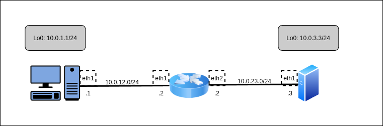

## БАЗОВАЯ НАСТРОЙКА:

```console
[root@client ~]# ip link set eth1 up
[root@client ~]# ip addr add dev eth1 10.0.12.1/24
[root@client ~]# ip link add dev lo0 type veth
[root@client ~]# ip link add dev lo1 type veth
[root@client ~]# ip addr add dev lo0 10.0.1.1/24
[root@client ~]# ip addr add dev lo1 10.0.11.11/24
[root@client ~]# ip link set lo0 up
[root@client ~]# ip link set lo1 up
```

```console
[root@network ~]# ip link set eth1 up
[root@network ~]# ip link set eth2 up
[root@network ~]# ip addr add dev eth1 10.0.12.2/24
[root@network ~]# ip addr add dev eth2 10.0.23.2/24
[root@network ~]# sysctl net.ipv4.conf.all.forwarding=1
```

```console
[root@company ~]# ip link add dev lo0 type veth
[root@company ~]# ip link add dev lo1 type veth
[root@company ~]# ip link set eth1 up
[root@company ~]# ip link set lo0 up
[root@company ~]# ip link set lo1 up
[root@company ~]# ip addr add dev eth1 10.0.23.3/24
[root@company ~]# ip addr add dev lo0 10.0.3.3/24
[root@company ~]# ip addr add dev lo1 10.0.33.33/24
```

```
[root@client ~]# ip xfrm state flush
[root@client ~]# ip xfrm policy flush

[root@client ~]# AUTH_KEY_CLI_COM=$(xxd -p -l 32 -c 32 /dev/random)
[root@client ~]# ENC_KEY_CLI_COM=$(xxd -p -l 32 -c 32 /dev/random)
[root@client ~]# SPI_CLI_COM=$(xxd -p -l 4 /dev/random)
[root@client ~]# REQID_CLI_COM=$(xxd -p -l 4 /dev/random)

[root@client ~]# echo $AUTH_KEY_CLI_COM
764d7c3be162c02c535e4ed77e0c77e43aa9e14d07db203aa340ec4a4666bf50
[root@client ~]# echo $ENC_KEY_CLI_COM
1949f9d942993cf5a50d921c07aba55dda39761e0543e7b090adaa3a3708d6ab
[root@client ~]# echo $SPI_CLI_COM
4d282510
[root@client ~]# echo $REQID_CLI_COM
62ae6c77

[root@client ~]# AUTH_KEY_COM_CLI=1827f5c0fcc99ace1a74520fde32ecbc02c57b3a7f862ec2b6aa512fc297c521
[root@client ~]# ENC_KEY_COM_CLI=9dcb06d52d8a511eaf9dbdd5079e103f6a19ea54a5637a6d3b3b38bc3b34baf2
[root@client ~]# SPI_COM_CLI=55a34b78
[root@client ~]# REQID_COM_CLI=a899f74c
[root@client ~]#
```

```
[root@company ~]# ip xfrm state flush
[root@company ~]# ip xfrm policy flush

[root@company ~]# AUTH_KEY_COM_CLI=$(xxd -p -l 32 -c 32 /dev/random)
[root@company ~]# ENC_KEY_COM_CLI=$(xxd -p -l 32 -c 32 /dev/random)
[root@company ~]# SPI_COM_CLI=$(xxd -p -l 4 /dev/random)
[root@company ~]# REQID_COM_CLI=$(xxd -p -l 4 /dev/random)

[root@company ~]# echo $AUTH_KEY_COM_CLI
1827f5c0fcc99ace1a74520fde32ecbc02c57b3a7f862ec2b6aa512fc297c521
[root@company ~]# echo $ENC_KEY_COM_CLI
9dcb06d52d8a511eaf9dbdd5079e103f6a19ea54a5637a6d3b3b38bc3b34baf2
[root@company ~]# echo $SPI_COM_CLI
55a34b78
[root@company ~]# echo $REQID_COM_CLI
a899f74c

[root@company ~]# AUTH_KEY_CLI_COM=764d7c3be162c02c535e4ed77e0c77e43aa9e14d07db203aa340ec4a4666bf50
[root@company ~]# ENC_KEY_CLI_COM=1949f9d942993cf5a50d921c07aba55dda39761e0543e7b090adaa3a3708d6ab
[root@company ~]# SPI_CLI_COM=4d282510
[root@company ~]# REQID_CLI_COM=62ae6c77
[root@company ~]#
```

## ПРОВЕРЯТЬ ДАЛЕЕ:

```
[root@client ~]# ip xfrm state add src 10.0.1.1 dst 10.0.3.3 proto esp spi "0x${SPI_CLI_COM}" reqid "0x
${REQID_CLI_COM}" mode tunnel auth sha256 "0x${AUTH_KEY_CLI_COM}" enc aes "0x${ENC_KEY_CLI_COM}"

[root@client ~]# ip xfrm state add src 10.0.3.3 dst 10.0.1.1 proto esp spi "0x${SPI_COM_CLI}" reqid "0x
${REQID_COM_CLI}" mode tunnel auth sha256 "0x${AUTH_KEY_COM_CLI}" enc aes "0x${ENC_KEY_COM_CLI}"

[root@client ~]# ip xfrm policy add src 192.168.0.1/24 dst 192.168.0.2/24 dir out tmpl src 10.0.1.1 dst
10.0.3.3 proto esp reqid "0x${REQID_CLI_COM}" mode tunnel

[root@client ~]# ip xfrm policy add src 192.168.0.2/24 dst 192.168.0.1/24 dir fwd tmpl src 10.0.3.3 dst
10.0.1.1 proto esp reqid "0x${REQID_COM_CLI}" mode tunnel

[root@client ~]# ip xfrm policy add src 192.168.0.2/24 dst 192.168.0.1/24 dir in tmpl src 10.0.3.3 dst
10.0.1.1 proto esp reqid "0x${REQID_COM_CLI}" mode tunnel

[root@client ~]# ping -I 192.168.0.1 192.168.0.2
ping: bind: Cannot assign requested address
[root@client ~]# ip route add 192.168.0.0/24 dev eth1 src 192.168.0.1
Error: Invalid prefsrc address.
[root@client ~]#
```

```
[root@company ~]# ip xfrm state add src 10.0.3.3 dst 10.0.1.1 proto esp spi "0x${SPI_COM_CLI}" reqid "0
x${REQID_COM_CLI}" mode tunnel auth sha256 "0x${AUTH_KEY_COM_CLI}" enc aes "0x${ENC_KEY_COM_CLI}"

[root@company ~]# ip xfrm state add src 10.0.1.1 dst 10.0.3.3 proto esp spi "0x${SPI_CLI_COM}" reqid "0
x${REQID_CLI_COM}" mode tunnel auth sha256 "0x${AUTH_KEY_CLI_COM}" enc aes "0x${ENC_KEY_CLI_COM}"

[root@company ~]# ip xfrm policy add src 192.168.0.2/24 dst 192.168.0.1/24 dir out tmpl src 10.0.3.3 ds
t 10.0.1.1 proto esp reqid "0x${REQID_COM_CLI}" mode tunnel

[root@company ~]# ip xfrm policy add src 192.168.0.1/24 dst 192.168.0.2/24 dir fwd tmpl src 10.0.1.1 ds
t 10.0.3.3 proto esp reqid "0x${REQID_COM_CLI}" mode tunnel

[root@company ~]# ip xfrm policy add src 192.168.0.1/24 dst 192.168.0.2/24 dir in tmpl src 10.0.1.1 dst
10.0.3.3 proto esp reqid "0x${REQID_COM_CLI}" mode tunnel

[root@company ~]# ip route add 192.168.0.0/24 dev eth1 src 192.168.0.2
Error: Invalid prefsrc address.
[root@company ~]#
```