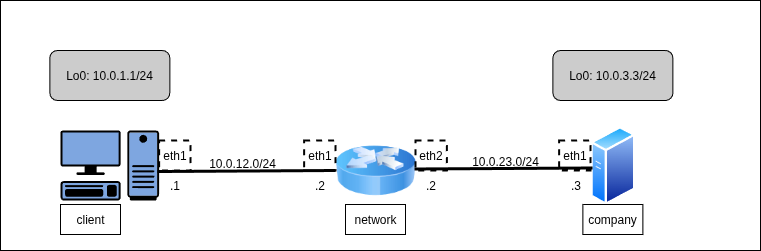
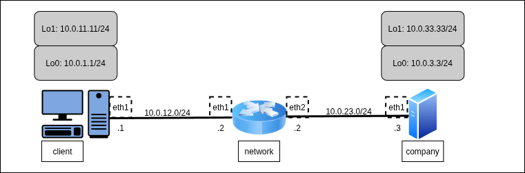

VPN — Virtual Private Network — технология, позволяющая объединять в единую адресную "локальную" сеть устройства, физически не находящихся в ней (например, при подключении рабочего ноутбука из командировки в локальную сеть компании). Кроме, непосредственно, создания туннелей в VPN возможно настраивать шифрование проходящего трафика.



Для работы создадим 3 [клона](../01_FirstStart/Настройка%20системы%20для%20выполнения%20лабораторных.md) согласно топологии сети. Для создания соединений между машинами необходимо в VirtualBox настроить сетевые интерфейсы (описание настройки подключения находится в разделе [настройки сетевых подключений](../02_SystemGreetings/Знакомство%20с%20системой.md#работа-с-сетевыми-интерфейсами)):

 + `client`:
	 + Adapter2 — outnet
 + `network`:
	 + Adapter2 — outnet
	 + Adapter3 — innet
 + `company`:
	 + Adapter2 — innet

Для настройки интерфейсов и маршрутов по умолчанию воспользуемся  комплексом инициализирующих программ [SystemD](https://ru.wikipedia.org/wiki/Systemd), а именно одной из его подсистем — `systemd-networkd`,  отвечающей за автонастройку всех сетевых служб в Linux. Так, например, для задания работы интерфейса eth1, установки на него IP-адреса и описания маршрута по умолчанию необходимо просто создать данный файл:

`@client`: `/etc/systemd/network/50-outnet.network`
```console
[Match]
Name=eth1

[Network]
Address=10.0.12.1/24

[Route]
Gateway=10.0.12.2
Destination=10.0.0.0/8
```

Согласно настройкам `.network`-файла будет поднят интерфейс eth1, ему будет присвоен адрес `10.0.12.1/24`, а в таблицу маршрутизации будет добавлена запись, согласно которой все пакеты, отправляемые на адреса сети `10.0.0.0/8` будут первоначально направляться на адрес `10.0.12.2`.

С помощью `systemd-networkd` можно также создавать и новые интерфейсы, однако это потребует создания отдельного файла, поэтому добавление LoopBack-интерфейса мы сделаем вручную:

`@client`
```console
[root@client ~]# ip link add dev lo0 type veth
[root@client ~]# ip link set lo0 up
[root@client ~]# ip addr add dev lo0 10.0.1.1/24
```

Аналогичным образом настроим интерфейсы на абоненте `@company`:

`@company`: `/etc/systemd/network/50-outnet.network`
```console
[Match]
Name=eth1

[Network]
Address=10.0.23.3/24

[Route]
Gateway=10.0.23.2
Destination=10.0.0.0/8
```

`@company`
```console
[root@company ~]# ip link add dev lo0 type veth
[root@company ~]# ip link set lo0 up
[root@company ~]# ip addr add dev lo0 10.0.3.3/24
[root@company ~]#
```

Абсолютно таким же образом может быть настроен абонент `@network`. Но для закрепления ручной настройки явно зададим ему все параметры:

`@network`
```console
[root@network ~]# ip link set eth1 up
[root@network ~]# ip link set eth2 up
[root@network ~]# ip addr add dev eth1 10.0.12.2/24
[root@network ~]# ip addr add dev eth2 10.0.23.2/24
[root@network ~]# sysctl net.ipv4.conf.all.forwarding=1
[root@network ~]#
[root@network ~]# ip route add 10.0.1.1 via 10.0.12.1
[root@network ~]# ip route add 10.0.3.3 via 10.0.23.3
[root@network ~]#
```

Для запуска `systemd-networkd` необходимо активировать сервис с помощью служебной команды `systemctl enable --now` (`enable` включает возможность активации сервиса при включении устройства. Флаг `--now` включает сервис непосредственно сейчас). После включения все соединения становятся активными, и трафик идёт без проблем:

`@client`
```console
[root@client ~]# systemctl enable --now systemd-networkd
Created symlink '/etc/systemd/system/dbus-org.freedesktop.network1.service' -> '/usr/lib/systemd/system
/systemd-networkd.service'.
Created symlink '/etc/systemd/system/multi-user.target.wants/systemd-networkd.service' -> '/usr/lib/sys
temd/system/systemd-networkd.service'.
Created symlink '/etc/systemd/system/sockets.target.wants/systemd-networkd.socket' -> '/usr/lib/systemd
/system/systemd-networkd.socket'.
Created symlink '/etc/systemd/system/sysinit.target.wants/systemd-network-generator.service' -> '/usr/l
ib/systemd/system/systemd-network-generator.service'.
Created symlink '/etc/systemd/system/network-online.target.wants/systemd-networkd-wait-online.service'
-> '/usr/lib/systemd/system/systemd-networkd-wait-online.service'.
[root@client ~]#
```

`@company`
```console
[root@company ~]# systemctl enable --now systemd-networkd
Created symlink '/etc/systemd/system/dbus-org.freedesktop.network1.service' -> '/usr/lib/systemd/system
/systemd-networkd.service'.
Created symlink '/etc/systemd/system/multi-user.target.wants/systemd-networkd.service' -> '/usr/lib/sys
temd/system/systemd-networkd.service'.
Created symlink '/etc/systemd/system/sockets.target.wants/systemd-networkd.socket' -> '/usr/lib/systemd
/system/systemd-networkd.socket'.
Created symlink '/etc/systemd/system/sysinit.target.wants/systemd-network-generator.service' -> '/usr/l
ib/systemd/system/systemd-network-generator.service'.
Created symlink '/etc/systemd/system/network-online.target.wants/systemd-networkd-wait-online.service'
-> '/usr/lib/systemd/system/systemd-networkd-wait-online.service'.
[root@company ~]#
[root@company ~]# ping -c5 10.0.12.1
PING 10.0.12.1 (10.0.12.1) 56(84) bytes of data.
64 bytes from 10.0.12.1: icmp_seq=1 ttl=63 time=1.80 ms
64 bytes from 10.0.12.1: icmp_seq=2 ttl=63 time=0.684 ms
64 bytes from 10.0.12.1: icmp_seq=3 ttl=63 time=1.03 ms
64 bytes from 10.0.12.1: icmp_seq=4 ttl=63 time=0.990 ms
64 bytes from 10.0.12.1: icmp_seq=5 ttl=63 time=1.06 ms

--- 10.0.12.1 ping statistics ---
5 packets transmitted, 5 received, 0% packet loss, time 4038ms
rtt min/avg/max/mdev = 0.684/1.113/1.800/0.369 ms
[root@company ~]#
```

`@client`
```console
[root@client ~]# ping -c3 -I 10.0.1.1 10.0.3.3
PING 10.0.3.3 (10.0.3.3) from 10.0.1.1 : 56(84) bytes of data.
64 bytes from 10.0.3.3: icmp_seq=1 ttl=63 time=0.842 ms
64 bytes from 10.0.3.3: icmp_seq=2 ttl=63 time=0.861 ms
64 bytes from 10.0.3.3: icmp_seq=3 ttl=63 time=0.814 ms

--- 10.0.3.3 ping statistics ---
3 packets transmitted, 3 received, 0% packet loss, time 2048ms
rtt min/avg/max/mdev = 0.814/0.839/0.861/0.019 ms
[root@client ~]#
```

Теперь добавим ограничение на создание TCP-соединений. Настраивать запрет будем с помощью ещё одного сервиса — межсетевого экрана (firewall-а) [`nftables`](https://wiki.nftables.org/). А проверку TCP-соединения будем производить с помощью SSH-соединения с `@company` на `@client`.

`@company`
```console
[root@company ~]# ssh 10.0.12.1
The authenticity of host '10.0.12.1 (10.0.12.1)' can't be established.
ED25519 key fingerprint is SHA256:BxaYoHAW5ddfM6EwmgSAZ2tKXCH0zoppLfEcQ8YiGdg.
This key is not known by any other names.
Are you sure you want to continue connecting (yes/no/[fingerprint])? yes
Warning: Permanently added '10.0.12.1' (ED25519) to the list of known hosts.
Last login: Sun Oct 19 13:19:43 2025
[root@client ~]#
logout
Connection to 10.0.12.1 closed.
[root@company ~]#
```

Теперь запустим сервис и добавим правило, запрещающее TCP:

`@network`
```console
[root@network ~]# systemctl enable --now nftables.service
Created symlink '/etc/systemd/system/multi-user.target.wants/nftables.service' -> '/usr/lib/systemd/system/nftables.service'.
[root@network ~]# nft add rule inet filter forward ip protocol tcp reject
[root@network ~]#
```

`@company`
```console
[root@company ~]# ssh 10.0.12.1
ssh: connect to host 10.0.12.1 port 22: Connection refused
[root@company ~]#
```

Соединение стало невозможным (при этом заметим, что ping идти не перестал, поскольку ICMP-пакеты не устанавливают TCP-соединение между абонентами).

Ограничение TCP-соединения в лабораторной выбрано не просто так. Как известно, сетевой трафик кроме полезной нагрузки несёт довольно много управляющей информации: данные о состоянии абонентов, каналов, служебные сообщения и т.д. Для корректной передачи этих данных часто используется именно TCP-соединение, гарантирующее надёжность передачи. Во избежание передачи не регламентированных служебных данных некоторые маршруты в сети могут быть закрыты для несанкционированных `TCP`-соединений. При этом передача UDP-пакетов по этим каналам не ограничивается.

Поскольку большинство протоколов туннелирования и VPN-протоколов подразумевают обмен именно UDP-пакетами, таким образом, они решают проблему обхода блокировок такого типа, позволяя передавать данные по маршрутам, не доступным для TCP-соединений.

Для настройки соединения воспользуемся VPN-протоколом WireGuard. В качестве транспортного протокола WireGuard использует UDP. Особенностью протокола является схема асимметричного шифрования. Классическая схема с закрытым и открытым ключом, которые генерируются и передаются администратором сети, позволяет безопасно передавать сообщения. Сами ключи можно дополнительно защищать паролями.

В качестве приватного ключа WireGuard может выступать любая последовательность из 32 байт. Вернее, 31 байта, 32-ой байт используется в качестве контрольной суммы над остальными. Публичный ключ генерируется на основе приватного для создания асимметрично шифрующей пары.

Генерация ключей (особенно приватного ключа) должна быть _абсолютно конфиденциальной_ для всех сторонних наблюдателей и _строго невоспроизводимой_. Для генерации ключей на основе случайных чисел используются специальные команды `wg genkey` для приватного ключа и `wg pubkey` для открытого ключа. ***Никогда*** не генерируйте ключи с помощью псевдослучайных последовательностей или на основе каких-то заведомо известных данных.

***Cтрого в рамках лабораторной работы для образовательных целей*** можно воспользоваться заранее сгенерированными парами ключей:

Для `@client`:
 + Приватный — `ClientPrivateKeyNeverDoThisMethodIRL1234564=`
 + Публичный — `R2Dq51uWpvn/9wo6IweimQrMAcailb6ZMiJmqFepJmU=`

Для `@company`:
 + Приватный — `CompanyPrivateKeyNeverDoThisMethodIRL123454=`
 + Публичный — `fAS3DCTBIIQ3miLTLjuryy0YmZr9HiHTh2sZf9inSi4=`

Однако правильнее (и _рекомендуется_) сгенерировать на каждой машине свою пару ключей и далее пользоваться ими. При этом потребуется копирование из консоли одной ВМ в другую, что может быть невозможно при использовании VirtualBox-консолей управления. При невозможности копирования можно вводить ключи вручную или воспользоваться заранее сгенерированными парами (копирование из основной системы в консоль ВМ поддерживается).

Для генерации ключей можно воспользоваться удобной командой-конвейером, которая выводит приватный и публичный ключи в консоль (_не пользуйтесь_ данной командой _в данном виде_ при реальной настройке. Перенаправляйте выводы команд в файлы с ограниченными правами доступа к ним для безопасности хранения данных):

```
wg genkey | tee /dev/stderr | wg pubkey
```

`@client`
```console
[root@client ~]# wg genkey | tee /dev/stderr | wg pubkey
YHbaodB1g6Uh4rXa/Y17gf4t3pjVt68dABYDq79+tVE=
HjxgpnWK367aURR7x6sy9b8wM3UhDJCbs/5XWGWe6CU=
[root@client ~]#
```

`@company`
```console
[root@company ~]# wg genkey | tee /dev/stderr | wg pubkey
OFcPIl8PXbjoPozp9qBH2ZQPOUsr7Qj1ZlyZXeMnMlI=
V87kz+xm9c1liF0WQpBW33Dep2W8B++xby80SrBJ2Cc=
[root@company ~]#
```

Для создания соединения необходимо создать специальный WireGuard-интерфейс на каждом абоненте. В качестве приватного ключа используется _свой_ приватный ключ. В описании доступных соединений указывается публичный ключ того, _к кому_ инициируется подключение. Поскольку получателем соединения будет выступать `@client`, укажем порт, на котором он будет ожидать соединения.

`@client`: `/etc/systemd/network/70-wg.netdev`
```console
[NetDev]
Name = wg
Kind = wireguard

[WireGuard]
ListenPort = 51820
PrivateKey = YHbaodB1g6Uh4rXa/Y17gf4t3pjVt68dABYDq79+tVE=

[WireGuardPeer]
AllowedIPs = 192.168.0.0/24
PublicKey = V87kz+xm9c1liF0WQpBW33Dep2W8B++xby80SrBJ2Cc=
```

После создания интерфейса опишем его данные в отдельном файле аналогично описанию для eth1:

`@client`: `/etc/systemd/network/70-wg.network`
```console
[Match]
Name = wg

[Network]
Address = 192.168.0.1/24
```

Аналогично настроим интерфейс на `@company`, при этом, поскольку отсюда будет производиться подключение, укажем итоговый адрес подключения — IP-адрес и порт.

`@company`: `/etc/systemd/network/70-wg.netdev`
```console
[NetDev]
Name = wg
Kind = wireguard

[WireGuard]
PrivateKey = OFcPIl8PXbjoPozp9qBH2ZQPOUsr7Qj1ZlyZXeMnMlI=

[WireGuardPeer]
AllowedIPs = 192.168.0.0/24
PublicKey = HjxgpnWK367aURR7x6sy9b8wM3UhDJCbs/5XWGWe6CU=
Endpoint = 10.0.1.1:51820
```

`@company`: `/etc/systemd/network/70-wg.network`
```console
[Match]
Name = wg

[Network]
Address = 192.168.0.2/24
```

Поскольку в файл с описанием интерфейса могут обратиться любые процессы-демоны или утилиты (при его создании ему автоматически были выданы права 0644), хранение там приватного ключа в чистом виде запрещено `systemd`. Для решения проблемы можно создать отдельный файл с приватным ключом и указать его в `netdev`-файл через параметр `PrivateKeyFile` или, как сделаем мы, ограничить права для файла только для группы `systemd-network`:

`@client`
```console
[root@client ~]# chgrp systemd-network /etc/systemd/network/70-wg.netdev
[root@client ~]# chmod o-r /etc/systemd/network/70-wg.netdev
[root@client ~]# systemctl restart systemd-networkd
[root@client ~]#
```

`@company`
```console
[root@company ~]# chgrp systemd-network /etc/systemd/network/70-wg.netdev
[root@company ~]# chmod o-r /etc/systemd/network/70-wg.netdev
[root@company ~]# systemctl restart systemd-networkd
```

Теперь проверим соединения и убедимся, что всё работает корректно:

`@company`
```console
[root@company ~]# ping -c5 192.168.0.1
PING 192.168.0.1 (192.168.0.1) 56(84) bytes of data.
64 bytes from 192.168.0.1: icmp_seq=1 ttl=64 time=2.15 ms
64 bytes from 192.168.0.1: icmp_seq=2 ttl=64 time=0.883 ms
64 bytes from 192.168.0.1: icmp_seq=3 ttl=64 time=0.909 ms
64 bytes from 192.168.0.1: icmp_seq=4 ttl=64 time=1.42 ms
64 bytes from 192.168.0.1: icmp_seq=5 ttl=64 time=2.33 ms

--- 192.168.0.1 ping statistics ---
5 packets transmitted, 5 received, 0% packet loss, time 4061ms
rtt min/avg/max/mdev = 0.883/1.540/2.333/0.608 ms

[root@company ~]# ssh 192.168.0.1
The authenticity of host '192.168.0.1 (192.168.0.1)' can't be established.
ED25519 key fingerprint is SHA256:BxaYoHAW5ddfM6EwmgSAZ2tKXCH0zoppLfEcQ8YiGdg.
This host key is known by the following other names/addresses:
   ~/.ssh/known_hosts:3: 10.0.12.1
Are you sure you want to continue connecting (yes/no/[fingerprint])? yes
Warning: Permanently added '192.168.0.1' (ED25519) to the list of known hosts.
Last login: Sun Oct 19 13:45:18 2025 from 10.0.23.3
[root@client ~]#
logout
Connection to 192.168.0.1 closed.
[root@company ~]#
```


## Туннелирование — IP over IP

`IP over IP`, или [`IP in IP`](https://ru.wikipedia.org/wiki/IP_in_IP) - простейшая схема туннелирования, основанная на инкапсуляции одного `IP`-пакета в другой `IP`-пакет. С точки зрения инкапсуляции пакета данный протокол добавляет ещё один заголовок сетевого уровня к уже существующему. Для обработки таких мета-пакетов необходимо использовать специальный виртуальный интерфейс, который будет обрабатывать специализированный трафик.

Данный вид туннелирования позволяет связать абонентов в одну локальную сеть, когда на самом деле их разделяет глобальная сеть, причём необязательно со статическим фиксированным маршрутом между абонентами. Однако важно заметить, что в данной схеме отсутствует шифрование трафика, туннель выполняет исключительно связывающую функцию.

Продолжим работать с имеющейся топологией, однако добавим новые виртуальные интерфейсы:



`@client`
```console
[root@client ~]# ip link add dev lo1 type veth
[root@client ~]# ip link set lo1 up
[root@client ~]# ip addr add dev lo1 10.0.11.11/24
[root@client ~]#
```

`@company`
```console
[root@company ~]# ip link add dev lo1 type veth
[root@company ~]# ip link set lo1 up
[root@company ~]# ip addr add dev lo1 10.0.33.33/24
[root@company ~]#
```

Для новых адресов настроим пути в сети:

`@network`
```console
[root@network ~]# ip route add 10.0.11.11 via 10.0.12.1
[root@network ~]# ip route add 10.0.33.33 via 10.0.23.3
[root@network ~]#
```

Убедимся, что трафик между интерфейсами проходит, однако, поскольку запрет TCP-соединений всё ещё действует, SSH-соединение невозможно:

`@client`
```console
[root@client ~]# ping -c3 -I 10.0.11.11 10.0.33.33
PING 10.0.33.33 (10.0.33.33) from 10.0.11.11 : 56(84) bytes of data.
64 bytes from 10.0.33.33: icmp_seq=1 ttl=63 time=1.31 ms
64 bytes from 10.0.33.33: icmp_seq=2 ttl=63 time=0.594 ms
64 bytes from 10.0.33.33: icmp_seq=3 ttl=63 time=0.759 ms

--- 10.0.33.33 ping statistics ---
3 packets transmitted, 3 received, 0% packet loss, time 2004ms
rtt min/avg/max/mdev = 0.594/0.886/1.306/0.304 ms
[root@client ~]#
```

`@company`
```console
[root@company ~]# ssh 10.0.11.11
ssh: connect to host 10.0.11.11 port 22: Connection refused
[root@company ~]#
```

Для создания туннеля необходимо просто создать виртуальный интерфейс специального типа `ipip`, связанный с некоторыми уже существующими адресами. После добавить адреса локальной сети туннеля и использовать его для коммуникации.

`@client`
```console
[root@client ~]# ip link add ipip0 type ipip remote 10.0.33.33 local 10.0.11.11
[root@client ~]# ip addr add dev ipip0 172.16.0.1/24
[root@client ~]# ip link set ipip0 up
[root@client ~]#
```

`@company`
```console
[root@company ~]# ip link add ipip0 type ipip remote 10.0.11.11 local 10.0.33.33
[root@company ~]# ip addr add dev ipip0 172.16.0.2/24
[root@company ~]# ip link set ipip0 up
[root@company ~]#
```

`@company`
```console
[root@company ~]# ssh 172.16.0.1
The authenticity of host '172.16.0.1 (172.16.0.1)' can't be established.
ED25519 key fingerprint is SHA256:BxaYoHAW5ddfM6EwmgSAZ2tKXCH0zoppLfEcQ8YiGdg.
This host key is known by the following other names/addresses:
   ~/.ssh/known_hosts:3: 10.0.12.1
   ~/.ssh/known_hosts:6: 192.168.0.1
Are you sure you want to continue connecting (yes/no/[fingerprint])? yes
Warning: Permanently added '172.16.0.1' (ED25519) to the list of known hosts.
Last login: Mon Oct 20 22:30:47 2025
[root@client ~]#
logout
Connection to 172.16.0.1 closed.
[root@company ~]#
```

Никакого шифрования трафика, повторимся, не происходит. Туннель лишь «объединяет» удалённых абонентов в единую «локальную» сеть.

При этом в передаваемых пакетах используются два IP-заголовка — _внешний_, по информации из которого производится передача через публичную сеть, и _внутренний_, который, после снятия внешнего заголовка на конечном маршрутизаторе туннеля, используют для передачи пакета по локальной сети:

`@network`
```console
[root@network ~]# tcpdump -c6 -i eth1
tcpdump: verbose output suppressed, use -v[v]... for full protocol decode
listening on eth1, link-type EN10MB (Ethernet), snapshot length 262144 bytes

```

`@client`
```console
[root@client ~]# ping -c3 -I 172.16.0.1 172.16.0.2
PING 172.16.0.2 (172.16.0.2) from 172.16.0.1 : 56(84) bytes of data.
64 bytes from 172.16.0.2: icmp_seq=1 ttl=64 time=0.747 ms
64 bytes from 172.16.0.2: icmp_seq=2 ttl=64 time=1.06 ms
64 bytes from 172.16.0.2: icmp_seq=3 ttl=64 time=0.796 ms

--- 172.16.0.2 ping statistics ---
3 packets transmitted, 3 received, 0% packet loss, time 2045ms
rtt min/avg/max/mdev = 0.747/0.869/1.064/0.139 ms
[root@client ~]#
```

`@network`
```console
[root@network ~]# tcpdump -c6 -i eth1
tcpdump: verbose output suppressed, use -v[v]... for full protocol decode
listening on eth1, link-type EN10MB (Ethernet), snapshot length 262144 bytes
23:01:53.464000 IP 10.0.11.11 > 10.0.33.33: IP 172.16.0.1 > 172.16.0.2: ICMP echo request, id 4, seq 1, length 64
23:01:53.464411 IP 10.0.33.33 > 10.0.11.11: IP 172.16.0.2 > 172.16.0.1: ICMP echo reply, id 4, seq 1, length 64
23:01:54.465498 IP 10.0.11.11 > 10.0.33.33: IP 172.16.0.1 > 172.16.0.2: ICMP echo request, id 4, seq 2, length 64
23:01:54.465932 IP 10.0.33.33 > 10.0.11.11: IP 172.16.0.2 > 172.16.0.1: ICMP echo reply, id 4, seq 2, length 64
23:01:55.521020 IP 10.0.11.11 > 10.0.33.33: IP 172.16.0.1 > 172.16.0.2: ICMP echo request, id 4, seq 3, length 64
23:01:55.521376 IP 10.0.33.33 > 10.0.11.11: IP 172.16.0.2 > 172.16.0.1: ICMP echo reply, id 4, seq 3, length 64
6 packets captured
6 packets received by filter
0 packets dropped by kernel
[root@network ~]#
```