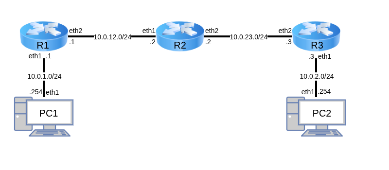
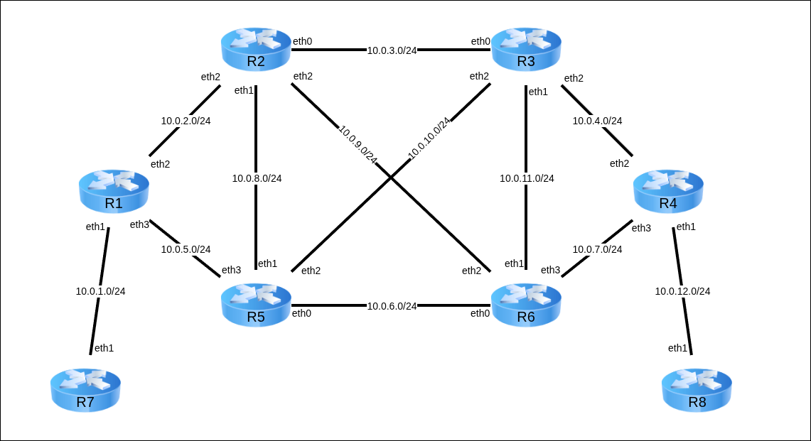

`@PC1`:`/etc/systemd/network/50-intnet.network`
```systemd
[Match]
Name=eth1

[Network]
Address=10.0.1.254/24
```

`@PC2`:`/etc/systemd/network/50-deepnet.network`
```systemd
[Match]
Name=eth1

[Network]
Address=10.0.2.254/24
```

`@R1`:`/etc/systemd/network/10-lo.network`
```systemd
[Match]
Name=lo

[Network]
Address=1.1.1.1/24
```

`@R1`:`/etc/systemd/network/50-intnet.network`
```systemd
[Match]
Name=eth1

[Network]
Address=10.0.1.1/24
IPv4Forwarding=yes
```

`@R1`:`/etc/systemd/network/60-mpls1.network`
```systemd
[Match]
Name=eth2

[Network]
Address=10.0.12.1/24
IPv4Forwarding=yes
```

`@R3`:`/etc/systemd/network/10-lo.network`
```systemd
[Match]
Name=lo

[Network]
Address=3.3.3.3/24
```

`@R3`:`/etc/systemd/network/50-deepnet.network`
```systemd
[Match]
Name=eth1

[Network]
Address=10.0.2.3/24
IPv4Forwarding=yes
```

`@R3`:`/etc/systemd/network/60-mpls2.network`
```systemd
[Match]
Name=eth2

[Network]
Address=10.0.23.3/24
```

`@R2`:`/etc/systemd/network/10-lo.network`
```systemd
[Match]
Name=lo

[Network]
Address=2.2.2.2/24
```

`@R2`:`/etc/systemd/network/50-mpls1.network`
```systemd
[Match]
Name=eth1

[Network]
Address=10.0.12.2/24
IPv4Forwarding=yes
```

`@R2`:`/etc/systemd/network/60-mpls2.network`
```systemd
[Match]
Name=eth2

[Network]
Address=10.0.23.2/24
IPv4Forwarding=yes
```

---

`@PC1`
```console
[root@PC1 ~]# systemctl enable --now systemd-networkd
Created symlink '/etc/systemd/system/dbus-org.freedesktop.network1.service' -> '/usr/lib/systemd/system/systemd-networkd.service'.
Created symlink '/etc/systemd/system/multi-user.target.wants/systemd-networkd.service' -> '/usr/lib/systemd/system/systemd-networkd.service'.
Created symlink '/etc/systemd/system/sockets.target.wants/systemd-networkd.socket' -> '/usr/lib/systemd/system/systemd-networkd.socket'.
Created symlink '/etc/systemd/system/sockets.target.wants/systemd-networkd-varlink.socket' -> '/usr/lib/systemd/system/systemd-networkd-varlink.socket'.
Created symlink '/etc/systemd/system/sysinit.target.wants/systemd-network-generator.service' -> '/usr/lib/systemd/system/systemd-network-generator.service'.
Created symlink '/etc/systemd/system/network-online.target.wants/systemd-networkd-wait-online.service' -> '/usr/lib/systemd/system/systemd-networkd-wait-online.service'.
[root@PC1 ~]#
[root@PC1 ~]# ip a
1: lo: <LOOPBACK,UP,LOWER_UP> mtu 65536 qdisc noqueue state UNKNOWN group default qlen 1000
    link/loopback 00:00:00:00:00:00 brd 00:00:00:00:00:00
    inet 127.0.0.1/8 scope host lo
       valid_lft forever preferred_lft forever
2: eth0: <BROADCAST,MULTICAST> mtu 1500 qdisc noop state DOWN group default qlen 1000
    link/ether 08:00:27:9b:30:4f brd ff:ff:ff:ff:ff:ff
    altname enp0s3
    altname enx0800279b304f
3: eth1: <BROADCAST,MULTICAST,UP,LOWER_UP> mtu 1500 qdisc fq_codel state UP group default qlen 1000
    link/ether 08:00:27:d7:88:2d brd ff:ff:ff:ff:ff:ff
    altname enp0s8
    altname enx080027d7882d
    inet 10.0.1.254/24 brd 10.0.1.255 scope global eth1
       valid_lft forever preferred_lft forever
4: eth2: <BROADCAST,MULTICAST> mtu 1500 qdisc noop state DOWN group default qlen 1000
    link/ether 08:00:27:b3:86:9f brd ff:ff:ff:ff:ff:ff
    altname enp0s9
    altname enx080027b3869f
5: eth3: <BROADCAST,MULTICAST> mtu 1500 qdisc noop state DOWN group default qlen 1000
    link/ether 08:00:27:b3:96:e8 brd ff:ff:ff:ff:ff:ff
    altname enp0s10
    altname enx080027b396e8
[root@PC1 ~]#
```

`@PC2`
```console
[root@PC2 ~]# systemctl enable --now systemd-networkd
Created symlink '/etc/systemd/system/dbus-org.freedesktop.network1.service' -> '/usr/lib/systemd/system/systemd-networkd.service'.
Created symlink '/etc/systemd/system/multi-user.target.wants/systemd-networkd.service' -> '/usr/lib/systemd/system/systemd-networkd.service'.
Created symlink '/etc/systemd/system/sockets.target.wants/systemd-networkd.socket' -> '/usr/lib/systemd/system/systemd-networkd.socket'.
Created symlink '/etc/systemd/system/sockets.target.wants/systemd-networkd-varlink.socket' -> '/usr/lib/systemd/system/systemd-networkd-varlink.socket'.
Created symlink '/etc/systemd/system/sysinit.target.wants/systemd-network-generator.service' -> '/usr/lib/systemd/system/systemd-network-generator.service'.
Created symlink '/etc/systemd/system/network-online.target.wants/systemd-networkd-wait-online.service' -> '/usr/lib/systemd/system/systemd-networkd-wait-online.service'.
[root@PC2 ~]#
[root@PC2 ~]# ip a
1: lo: <LOOPBACK,UP,LOWER_UP> mtu 65536 qdisc noqueue state UNKNOWN group default qlen 1000
    link/loopback 00:00:00:00:00:00 brd 00:00:00:00:00:00
    inet 127.0.0.1/8 scope host lo
       valid_lft forever preferred_lft forever
2: eth0: <BROADCAST,MULTICAST> mtu 1500 qdisc noop state DOWN group default qlen 1000
    link/ether 08:00:27:c2:28:33 brd ff:ff:ff:ff:ff:ff
    altname enp0s3
    altname enx080027c22833
3: eth1: <BROADCAST,MULTICAST,UP,LOWER_UP> mtu 1500 qdisc fq_codel state UP group default qlen 1000
    link/ether 08:00:27:6d:c8:3a brd ff:ff:ff:ff:ff:ff
    altname enp0s8
    altname enx0800276dc83a
    inet 10.0.2.254/24 brd 10.0.2.255 scope global eth1
       valid_lft forever preferred_lft forever
4: eth2: <BROADCAST,MULTICAST> mtu 1500 qdisc noop state DOWN group default qlen 1000
    link/ether 08:00:27:05:8e:33 brd ff:ff:ff:ff:ff:ff
    altname enp0s9
    altname enx080027058e33
5: eth3: <BROADCAST,MULTICAST> mtu 1500 qdisc noop state DOWN group default qlen 1000
    link/ether 08:00:27:da:e4:af brd ff:ff:ff:ff:ff:ff
    altname enp0s10
    altname enx080027dae4af
[root@PC2 ~]#
```

`@R1`
```console
[root@R1 ~]# systemctl enable --now systemd-networkd
Created symlink '/etc/systemd/system/dbus-org.freedesktop.network1.service' -> '/usr/lib/systemd/system/systemd-networkd.service'.
Created symlink '/etc/systemd/system/multi-user.target.wants/systemd-networkd.service' -> '/usr/lib/systemd/system/systemd-networkd.service'.
Created symlink '/etc/systemd/system/sockets.target.wants/systemd-networkd.socket' -> '/usr/lib/systemd/system/systemd-networkd.socket'.
Created symlink '/etc/systemd/system/sockets.target.wants/systemd-networkd-varlink.socket' -> '/usr/lib/systemd/system/systemd-networkd-varlink.socket'.
Created symlink '/etc/systemd/system/sysinit.target.wants/systemd-network-generator.service' -> '/usr/lib/systemd/system/systemd-network-generator.service'.
Created symlink '/etc/systemd/system/network-online.target.wants/systemd-networkd-wait-online.service' -> '/usr/lib/systemd/system/systemd-networkd-wait-online.service'.
[root@R1 ~]#
[root@R1 ~]# ip a
1: lo: <LOOPBACK,UP,LOWER_UP> mtu 65536 qdisc noqueue state UNKNOWN group default qlen 1000
    link/loopback 00:00:00:00:00:00 brd 00:00:00:00:00:00
    inet 127.0.0.1/8 scope host lo
       valid_lft forever preferred_lft forever
    inet 1.1.1.1/24 brd 1.1.1.255 scope global lo
       valid_lft forever preferred_lft forever
2: eth0: <BROADCAST,MULTICAST> mtu 1500 qdisc noop state DOWN group default qlen 1000
    link/ether 08:00:27:f4:7f:04 brd ff:ff:ff:ff:ff:ff
    altname enp0s3
    altname enx080027f47f04
3: eth1: <BROADCAST,MULTICAST,UP,LOWER_UP> mtu 1500 qdisc fq_codel state UP group default qlen 1000
    link/ether 08:00:27:24:90:2b brd ff:ff:ff:ff:ff:ff
    altname enp0s8
    altname enx08002724902b
    inet 10.0.1.1/24 brd 10.0.1.255 scope global eth1
       valid_lft forever preferred_lft forever
4: eth2: <BROADCAST,MULTICAST,UP,LOWER_UP> mtu 1500 qdisc fq_codel state UP group default qlen 1000
    link/ether 08:00:27:68:94:0e brd ff:ff:ff:ff:ff:ff
    altname enp0s9
    altname enx08002768940e
    inet 10.0.12.1/24 brd 10.0.12.255 scope global eth2
       valid_lft forever preferred_lft forever
5: eth3: <BROADCAST,MULTICAST> mtu 1500 qdisc noop state DOWN group default qlen 1000
    link/ether 08:00:27:e6:a6:f4 brd ff:ff:ff:ff:ff:ff
    altname enp0s10
    altname enx080027e6a6f4
[root@R1 ~]#
```

`@R2`
```console
[root@R2 ~]# systemctl enable --now systemd-networkd
Created symlink '/etc/systemd/system/dbus-org.freedesktop.network1.service' -> '/usr/lib/systemd/system/systemd-networkd.service'.
Created symlink '/etc/systemd/system/multi-user.target.wants/systemd-networkd.service' -> '/usr/lib/systemd/system/systemd-networkd.service'.
Created symlink '/etc/systemd/system/sockets.target.wants/systemd-networkd.socket' -> '/usr/lib/systemd/system/systemd-networkd.socket'.
Created symlink '/etc/systemd/system/sockets.target.wants/systemd-networkd-varlink.socket' -> '/usr/lib/systemd/system/systemd-networkd-varlink.socket'.
Created symlink '/etc/systemd/system/sysinit.target.wants/systemd-network-generator.service' -> '/usr/lib/systemd/system/systemd-network-generator.service'.
Created symlink '/etc/systemd/system/network-online.target.wants/systemd-networkd-wait-online.service' -> '/usr/lib/systemd/system/systemd-networkd-wait-online.service'.
[root@R2 ~]#
[root@R2 ~]# ip a
1: lo: <LOOPBACK,UP,LOWER_UP> mtu 65536 qdisc noqueue state UNKNOWN group default qlen 1000
    link/loopback 00:00:00:00:00:00 brd 00:00:00:00:00:00
    inet 127.0.0.1/8 scope host lo
       valid_lft forever preferred_lft forever
    inet 2.2.2.2/24 brd 2.2.2.255 scope global lo
       valid_lft forever preferred_lft forever
2: eth0: <BROADCAST,MULTICAST> mtu 1500 qdisc noop state DOWN group default qlen 1000
    link/ether 08:00:27:92:8f:47 brd ff:ff:ff:ff:ff:ff
    altname enp0s3
    altname enx080027928f47
3: eth1: <BROADCAST,MULTICAST,UP,LOWER_UP> mtu 1500 qdisc fq_codel state UP group default qlen 1000
    link/ether 08:00:27:0c:43:a5 brd ff:ff:ff:ff:ff:ff
    altname enp0s8
    altname enx0800270c43a5
    inet 10.0.12.2/24 brd 10.0.12.255 scope global eth1
       valid_lft forever preferred_lft forever
4: eth2: <BROADCAST,MULTICAST,UP,LOWER_UP> mtu 1500 qdisc fq_codel state UP group default qlen 1000
    link/ether 08:00:27:55:e8:05 brd ff:ff:ff:ff:ff:ff
    altname enp0s9
    altname enx08002755e805
    inet 10.0.23.2/24 brd 10.0.23.255 scope global eth2
       valid_lft forever preferred_lft forever
5: eth3: <BROADCAST,MULTICAST> mtu 1500 qdisc noop state DOWN group default qlen 1000
    link/ether 08:00:27:64:94:00 brd ff:ff:ff:ff:ff:ff
    altname enp0s10
    altname enx080027649400
[root@R2 ~]#
```

`@R3`
```console
[root@R3 ~]# systemctl enable --now systemd-networkd
Created symlink '/etc/systemd/system/dbus-org.freedesktop.network1.service' -> '/usr/lib/systemd/system/systemd-networkd.service'.
Created symlink '/etc/systemd/system/multi-user.target.wants/systemd-networkd.service' -> '/usr/lib/systemd/system/systemd-networkd.service'.
Created symlink '/etc/systemd/system/sockets.target.wants/systemd-networkd.socket' -> '/usr/lib/systemd/system/systemd-networkd.socket'.
Created symlink '/etc/systemd/system/sockets.target.wants/systemd-networkd-varlink.socket' -> '/usr/lib/systemd/system/systemd-networkd-varlink.socket'.
Created symlink '/etc/systemd/system/sysinit.target.wants/systemd-network-generator.service' -> '/usr/lib/systemd/system/systemd-network-generator.service'.
Created symlink '/etc/systemd/system/network-online.target.wants/systemd-networkd-wait-online.service' -> '/usr/lib/systemd/system/systemd-networkd-wait-online.service'.
[root@R3 ~]#
[root@R3 ~]# ip a
1: lo: <LOOPBACK,UP,LOWER_UP> mtu 65536 qdisc noqueue state UNKNOWN group default qlen 1000
    link/loopback 00:00:00:00:00:00 brd 00:00:00:00:00:00
    inet 127.0.0.1/8 scope host lo
       valid_lft forever preferred_lft forever
    inet 3.3.3.3/24 brd 3.3.3.255 scope global lo
       valid_lft forever preferred_lft forever
2: eth0: <BROADCAST,MULTICAST> mtu 1500 qdisc noop state DOWN group default qlen 1000
    link/ether 08:00:27:90:a7:4f brd ff:ff:ff:ff:ff:ff
    altname enp0s3
    altname enx08002790a74f
3: eth1: <BROADCAST,MULTICAST,UP,LOWER_UP> mtu 1500 qdisc fq_codel state UP group default qlen 1000
    link/ether 08:00:27:68:bd:29 brd ff:ff:ff:ff:ff:ff
    altname enp0s8
    altname enx08002768bd29
    inet 10.0.2.3/24 brd 10.0.2.255 scope global eth1
       valid_lft forever preferred_lft forever
4: eth2: <BROADCAST,MULTICAST,UP,LOWER_UP> mtu 1500 qdisc fq_codel state UP group default qlen 1000
    link/ether 08:00:27:1a:ec:be brd ff:ff:ff:ff:ff:ff
    altname enp0s9
    altname enx0800271aecbe
    inet 10.0.23.3/24 brd 10.0.23.255 scope global eth2
       valid_lft forever preferred_lft forever
5: eth3: <BROADCAST,MULTICAST> mtu 1500 qdisc noop state DOWN group default qlen 1000
    link/ether 08:00:27:35:15:0b brd ff:ff:ff:ff:ff:ff
    altname enp0s10
    altname enx08002735150b
[root@R3 ~]#
```

---

`@PC1`
```console
[root@PC1 ~]# sed -i -E "s/ospfd=no/ospfd=yes/g" /etc/frr/daemons
[root@PC1 ~]# cat /etc/frr/daemons | grep yes
ospfd=yes
vtysh_enable=yes
# FRR_NO_ROOT="yes"
[root@PC1 ~]#
```

`@PC2`
```console
[root@PC2 ~]# sed -i -E "s/ospfd=no/ospfd=yes/g" /etc/frr/daemons
[root@PC2 ~]# cat /etc/frr/daemons | grep yes
ospfd=yes
vtysh_enable=yes
# FRR_NO_ROOT="yes"
[root@PC2 ~]#
```

`@R1`
```console
[root@R1 ~]# sed -i -E "s/ospfd=no/ospfd=yes/g" /etc/frr/daemons
[root@R1 ~]# sed -i -E "s/ldpd=no/ldpd=yes/g" /etc/frr/daemons
[root@R1 ~]# cat /etc/frr/daemons | grep yes
ospfd=yes
ldpd=yes
vtysh_enable=yes
# FRR_NO_ROOT="yes"
[root@R1 ~]#
```

`@R2`
```console
[root@R2 ~]# sed -i -E "s/ospfd=no/ospfd=yes/g" /etc/frr/daemons
[root@R2 ~]# sed -i -E "s/ldpd=no/ldpd=yes/g" /etc/frr/daemons
[root@R2 ~]# cat /etc/frr/daemons | grep yes
ospfd=yes
ldpd=yes
vtysh_enable=yes
# FRR_NO_ROOT="yes"
[root@R2 ~]#
```

`@R3`
```console
[root@R3 ~]# sed -i -E "s/ospfd=no/ospfd=yes/g" /etc/frr/daemons
[root@R3 ~]# sed -i -E "s/ldpd=no/ldpd=yes/g" /etc/frr/daemons
[root@R3 ~]# cat /etc/frr/daemons | grep yes
ospfd=yes
ldpd=yes
vtysh_enable=yes
# FRR_NO_ROOT="yes"
[root@R3 ~]#
```

---

`@PC1`
```frr
hostname PC1
log file /var/log/frr/frr.log

router ospf
    ospf router 10.0.1.254
        network 0.0.0.0/0 area 0
    !
exit
```

`@PC2`
```frr
hostname PC2
log file /var/log/frr/frr.log

router ospf
    ospf router 10.0.2.254
        network 0.0.0.0/0 area 0
    !
exit
```

`@R1`
```frr
hostname R1
log file /var/log/frr/frr.log

router ospf
    ospf router 1.1.1.1
        network 0.0.0.0/0 area 0
    !
exit

mpls ldp
    router-id 1.1.1.1
    !
    address-family ipv4
        discovery transport-address 1.1.1.1
        !
        interface eth2
        exit
        !
    exit-address-family
    !
exit
```

`@R2`
```frr
hostname R2
log file /var/log/frr/frr.log

router ospf
    ospf router 2.2.2.2
        network 0.0.0.0/0 area 0
    !
exit

mpls ldp
    router-id 2.2.2.2
    !
    address-family ipv4
        discovery transport-address 2.2.2.2
        !
        interface eth1
        exit
        !
        interface eth2
        exit
        !
    exit-address-family
    !
exit
```

`@R3`
```frr
hostname R3
log file /var/log/frr/frr.log

router ospf
    ospf router 3.3.3.3
        network 0.0.0.0/0 area 0
    !
exit

mpls ldp
    router-id 3.3.3.3
    !
    address-family ipv4
        discovery transport-address 3.3.3.3
        !
        interface eth2
        exit
        !
    exit-address-family
    !
exit
```

---

`@R1`
```console
[root@R1 ~]# modprobe mpls_router
[root@R1 ~]# modprobe mpls_iptunnel
[root@R1 ~]# sysctl -w net.mpls.conf.eth2.input=1
[root@R1 ~]# sysctl -w net.mpls.platform_labels=10000
[root@R1 ~]#
```

`@R2`
```console
[root@R2 ~]# modprobe mpls_router
[root@R2 ~]# modprobe mpls_iptunnel
[root@R2 ~]# sysctl -w net.mpls.conf.eth1.input=1
[root@R2 ~]# sysctl -w net.mpls.conf.eth2.input=1
[root@R2 ~]# sysctl -w net.mpls.platform_labels=10000
[root@R2 ~]#
```

`@R3`
```console
[root@R3 ~]# modprobe mpls_router
[root@R3 ~]# modprobe mpls_iptunnel
[root@R3 ~]# sysctl -w net.mpls.conf.eth2.input=1
[root@R3 ~]# sysctl -w net.mpls.platform_labels=10000
[root@R3 ~]#
```

---

`@PC1`
```console
[root@PC1 ~]# systemctl enable --now frr
[root@PC1 ~]#
```

`@PC2`
```console
[root@PC2 ~]# systemctl enable --now frr
[root@PC2 ~]#
```

`@R1`
```console
[root@R1 ~]# systemctl enable --now frr
[root@R1 ~]#
```

`@R2`
```console
[root@R2 ~]# systemctl enable --now frr
[root@R2 ~]#
```

`@R3`
```console
[root@R3 ~]# systemctl enable --now frr
[root@R3 ~]#
```

---

`@R2`
```console
[root@R2 ~]# vtysh

Hello, this is FRRouting (version 10.3.1).
Copyright 1996-2005 Kunihiro Ishiguro, et al.

R2# show mpls ldp neighbor
AF   ID              State       Remote Address    Uptime
ipv4 1.1.1.1         OPERATIONAL 1.1.1.1         00:10:27
ipv4 3.3.3.3         OPERATIONAL 3.3.3.3         00:10:19

R2# show mpls table
 Inbound Label  Type  Nexthop    Outbound Label
 ------------------------------------------------
 18             LDP   10.0.12.1  implicit-null
 19             LDP   10.0.23.3  implicit-null

R2# show mpls ldp binding
AF   Destination          Nexthop         Local Label Remote Label  In Use
ipv4 1.1.1.0/24           1.1.1.1         -           imp-null          no
ipv4 1.1.1.1/32           3.3.3.3         16          16                no
ipv4 2.2.2.0/24           0.0.0.0         imp-null    -                 no
ipv4 2.2.2.2/32           1.1.1.1         -           16                no
ipv4 2.2.2.2/32           3.3.3.3         -           17                no
ipv4 3.3.3.0/24           3.3.3.3         -           imp-null          no
ipv4 3.3.3.3/32           1.1.1.1         18          18                no
ipv4 10.0.1.0/24          1.1.1.1         17          imp-null         yes
ipv4 10.0.1.0/24          3.3.3.3         17          18                no
ipv4 10.0.2.0/24          1.1.1.1         19          19                no
ipv4 10.0.2.0/24          3.3.3.3         19          imp-null         yes
ipv4 10.0.12.0/24         1.1.1.1         imp-null    imp-null          no
ipv4 10.0.12.0/24         3.3.3.3         imp-null    19                no
ipv4 10.0.23.0/24         1.1.1.1         imp-null    17                no
ipv4 10.0.23.0/24         3.3.3.3         imp-null    imp-null          no

```

---

`@R1`
```console
[root@R1 ~]# tcpdump -i eth2 | grep MPLS
tcpdump: verbose output suppressed, use -v[v]... for full protocol decode
listening on eth2, link-type EN10MB (Ethernet), snapshot length 262144 bytes

```

`@R2`
```console
[root@R2 ~]# tcpdump -i eth1 | grep MPLS
tcpdump: verbose output suppressed, use -v[v]... for full protocol decode
listening on eth1, link-type EN10MB (Ethernet), snapshot length 262144 bytes
```

`@R3`
```console
[root@R3 ~]# tcpdump -i eth2 | grep MPLS
tcpdump: verbose output suppressed, use -v[v]... for full protocol decode
listening on eth2, link-type EN10MB (Ethernet), snapshot length 262144 bytes

```

`@PC2`
```console
[root@PC2 ~]# tcpdump -i eth1 | grep 10.0.1.254
tcpdump: verbose output suppressed, use -v[v]... for full protocol decode
listening on eth1, link-type EN10MB (Ethernet), snapshot length 262144 bytes

```


`@PC1`
```console
[root@PC1 ~]# ping -c5 10.0.2.254
PING 10.0.2.254 (10.0.2.254) 56(84) bytes of data.
64 bytes from 10.0.2.254: icmp_seq=1 ttl=61 time=4.96 ms
64 bytes from 10.0.2.254: icmp_seq=2 ttl=61 time=4.28 ms
64 bytes from 10.0.2.254: icmp_seq=3 ttl=61 time=5.35 ms
64 bytes from 10.0.2.254: icmp_seq=4 ttl=61 time=4.85 ms
64 bytes from 10.0.2.254: icmp_seq=5 ttl=61 time=3.61 ms

--- 10.0.2.254 ping statistics ---
5 packets transmitted, 5 received, 0% packet loss, time 4006ms
rtt min/avg/max/mdev = 3.612/4.610/5.351/0.604 ms
[root@PC1 ~]#
```


`@R1`
```console
[root@R1 ~]# tcpdump -i eth2 | grep MPLS
tcpdump: verbose output suppressed, use -v[v]... for full protocol decode
listening on eth2, link-type EN10MB (Ethernet), snapshot length 262144 bytes
14:27:58.090702 MPLS (label 19, tc 0, [S], ttl 63) IP 10.0.1.254 > 10.0.2.254: ICMP echo request, id 5, seq 1, length 64
14:27:59.092017 MPLS (label 19, tc 0, [S], ttl 63) IP 10.0.1.254 > 10.0.2.254: ICMP echo request, id 5, seq 2, length 64
14:28:00.093030 MPLS (label 19, tc 0, [S], ttl 63) IP 10.0.1.254 > 10.0.2.254: ICMP echo request, id 5, seq 3, length 64
14:28:01.093749 MPLS (label 19, tc 0, [S], ttl 63) IP 10.0.1.254 > 10.0.2.254: ICMP echo request, id 5, seq 4, length 64
14:28:02.095492 MPLS (label 19, tc 0, [S], ttl 63) IP 10.0.1.254 > 10.0.2.254: ICMP echo request, id 5, seq 5, length 64

```

`@R2`
```console
[root@R2 ~]# tcpdump -i eth1 | grep MPLS
tcpdump: verbose output suppressed, use -v[v]... for full protocol decode
listening on eth1, link-type EN10MB (Ethernet), snapshot length 262144 bytes
14:27:58.483624 MPLS (label 19, tc 0, [S], ttl 63) IP 10.0.1.254 > 10.0.2.254: ICMP echo request, id 5, seq 1, length 64
14:27:59.485141 MPLS (label 19, tc 0, [S], ttl 63) IP 10.0.1.254 > 10.0.2.254: ICMP echo request, id 5, seq 2, length 64
14:28:00.486119 MPLS (label 19, tc 0, [S], ttl 63) IP 10.0.1.254 > 10.0.2.254: ICMP echo request, id 5, seq 3, length 64
14:28:01.486337 MPLS (label 19, tc 0, [S], ttl 63) IP 10.0.1.254 > 10.0.2.254: ICMP echo request, id 5, seq 4, length 64
14:28:02.488092 MPLS (label 19, tc 0, [S], ttl 63) IP 10.0.1.254 > 10.0.2.254: ICMP echo request, id 5, seq 5, length 64
```

`@R3`
```console
[root@R3 ~]# tcpdump -i eth2 | grep MPLS
tcpdump: verbose output suppressed, use -v[v]... for full protocol decode
listening on eth2, link-type EN10MB (Ethernet), snapshot length 262144 bytes
14:27:58.551744 MPLS (label 18, tc 0, [S], ttl 63) IP 10.0.2.254 > 10.0.1.254: ICMP echo reply, id 5, seq 1, length 64
14:27:59.553293 MPLS (label 18, tc 0, [S], ttl 63) IP 10.0.2.254 > 10.0.1.254: ICMP echo reply, id 5, seq 2, length 64
14:28:00.554768 MPLS (label 18, tc 0, [S], ttl 63) IP 10.0.2.254 > 10.0.1.254: ICMP echo reply, id 5, seq 3, length 64
14:28:01.554281 MPLS (label 18, tc 0, [S], ttl 63) IP 10.0.2.254 > 10.0.1.254: ICMP echo reply, id 5, seq 4, length 64
14:28:02.556684 MPLS (label 18, tc 0, [S], ttl 63) IP 10.0.2.254 > 10.0.1.254: ICMP echo reply, id 5, seq 5, length 64
```

`@PC2`
```console
[root@PC2 ~]# tcpdump -i eth1 | grep 10.0.1.254
tcpdump: verbose output suppressed, use -v[v]... for full protocol decode
listening on eth1, link-type EN10MB (Ethernet), snapshot length 262144 bytes
14:36:17.159048 IP 10.0.1.254 > PC2: ICMP echo request, id 6, seq 1, length 64
14:36:17.159119 IP PC2 > 10.0.1.254: ICMP echo reply, id 6, seq 1, length 64
14:36:18.161310 IP 10.0.1.254 > PC2: ICMP echo request, id 6, seq 2, length 64
14:36:18.161368 IP PC2 > 10.0.1.254: ICMP echo reply, id 6, seq 2, length 64
14:36:19.162197 IP 10.0.1.254 > PC2: ICMP echo request, id 6, seq 3, length 64
14:36:19.162272 IP PC2 > 10.0.1.254: ICMP echo reply, id 6, seq 3, length 64
14:36:20.164111 IP 10.0.1.254 > PC2: ICMP echo request, id 6, seq 4, length 64
14:36:20.164173 IP PC2 > 10.0.1.254: ICMP echo reply, id 6, seq 4, length 64
14:36:21.166386 IP 10.0.1.254 > PC2: ICMP echo request, id 6, seq 5, length 64
14:36:21.166442 IP PC2 > 10.0.1.254: ICMP echo reply, id 6, seq 5, length 64

```


## Самостоятельная работа

